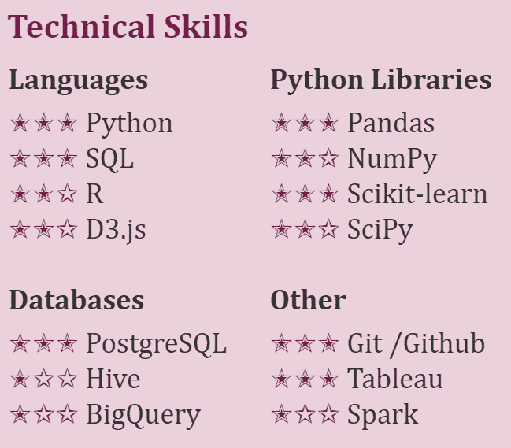
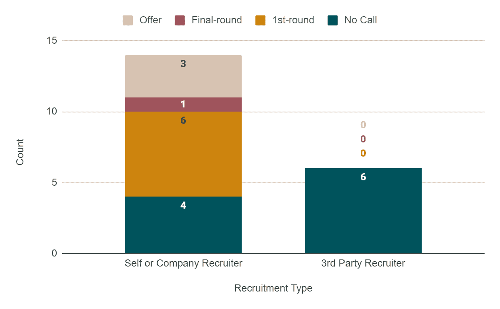

# 海湾地区数据科学面试幸存女孩指南

> 原文：<https://towardsdatascience.com/a-girls-guide-to-surviving-bay-area-data-science-interviews-40b66ba4d7e8?source=collection_archive---------6----------------------->

## 旧金山湾区中级数据科学职位面试六个月后的关键收获。

在我的第一个数据科学职位工作了大约 1.5 年后，我决定开始申请新的职位，因为我目前的职位缺乏职业发展，缺乏引人入胜的项目，并且数据科学的应用不是这家小型创业公司的优先事项。因此，我踏上了穿越湾区技术面试文化的旅程，以找出我的数据科学职业生涯的下一步应该是什么。

在转到数据科学之前，我是建筑行业的一名土木工程师(点击了解我向数据科学的转变)。我很幸运，通过我的网络获得了我的第一份数据科学工作，没有花太多时间面试。这意味着我之前的大部分面试经历都是在建筑行业。不用说，在找出一个可行的流程之前，导航技术面试需要一些反复试验。

以下是我学到的六条重要经验，我将在下面详细解释:

1.  旧金山湾区有一种科技面试文化，围绕这种文化建立了一个完整的行业。学习如何玩这个游戏。
2.  数据科学是一个广阔的领域。找到你的定位，花时间专注于这些职位。
3.  每天编码。
4.  每天练习一道面试题。
5.  熟记[这本百页机器学习书](http://themlbook.com/)中所有的粗体术语。
6.  大型科技公司的招聘人员可能会有所帮助。第三方招聘人员可能是浪费时间。

# 1.旧金山湾区有一种科技面试文化，围绕这种文化建立了一个完整的行业。学习如何玩这个游戏。

因为数据科学职位竞争如此激烈，所以通过面试过程几乎有一个秘密的“代码”。我花了一些时间来真正理解这个概念，尽管我参加了一些旨在让女性受雇于科技行业的会议，试图解释这一点。

典型的面试过程是这样的:

1.  提交你的简历和求职信。
2.  找公司的人给你推荐。
3.  招聘人员会主动打电话给你。
4.  打电话给招聘人员，讨论你过去的经历，并回答几个一般性的技术问题。
5.  进行第一轮技术面试，通常涉及以下一项或多项内容:(I)在共享您屏幕的平台上进行现场编码。(ii)讨论您之前完成的课后考试。㈢浏览案例研究。㈣统计和建模问题。
6.  进行面对面的最后一轮技术面试，同时评估与团队的文化契合度。

以下是我发现的一些优化这一过程的秘密:

## 确保你的简历看起来“现代”

简历格式会让建筑行业的招聘人员畏缩不前，但在科技领域却是公平竞争的对象。加点颜色。添加一些符号。让它脱颖而出！在我的简历上添加小星星来传达我在某些技能上的经验水平，似乎对招聘经理很有吸引力。然而，一位朋友指出，与男性对自己的评价相比，我对自己的评价可能过于苛刻了。

我简历中的一个例子，展示了我对某些技术技能的熟练程度。

顺便说一句，我对批判性地评估或评价自己(甚至是谈判薪水)的建议是，想想你生活中的一个人，他/她总是问你想要什么。可能是同事、朋友或导师。对我来说，我会想起我是如何看着我的前任年复一年地争取大幅加薪，直到他的薪水明显高于我，尽管我们在同一个行业。我试着思考他会如何评价自己，或者在我的情况下他会提出什么要求。我敢肯定，在你人生的某个时刻，你见过有人自信而无情地谈判。试着去模仿，即使你没有感觉到。如果所有这些都失败了，我会想到，如果我不谈判，我会对世界各地的女性造成伤害，并陷入性别成见。是的，我需要那种紧迫感来推动自己去谈判。已经有很多关于谈判薪水的文章了，所以我不会在这里深究。我建议从阅读科技行业女性谈判薪资的(初级)指南开始。

## *如有疑问，提交求职信*

我听到了赞成和反对提交求职信的观点。如果有提交的选项，那就提交吧。花点时间写一封好的求职信，具体说明你为什么想在*那家*公司工作。如果求职信在科技行业有作用的话，那就是解释你为什么对这家公司的这个职位感兴趣。它只需要是几个段落。不要提交一份冗长的、泛泛而谈的求职信，重复你简历上所列的内容。

## *推荐是金奖券*

如果你想确保招聘人员或招聘经理看到你的简历，你需要公司里有人推荐你。或者你最好在简历搜索引擎优化方面非常出色。

## *你以前的经验和投资组合是必要的，但不相关*

你应该能够*讨论*你之前的数据科学经验和你投资组合中的项目，但最终它们是不相关的。虽然他们会帮你打开大门，但你必须能够通过技术面试，以表明你有资格获得这个职位。

## *在面试中问一些澄清性的问题*

很多次，我被招聘人员纠正，因为我做了一个假设，而我本应该澄清这个问题。这也适用于带回家的作业。要求澄清也无妨，即使是多次。我肯定有一次课后考试不及格，因为在我要求澄清一次后，我不好意思要求第二次澄清。

## *明智地选择你的时间和金钱的去处*

技术面试已经成为一个行业；不要被骗花钱去面试。人们会主动联系你，将你的个人资料添加到他们的招聘网站上，为技术面试帮助付费，为简历写作付费，为练习面试问题付费，等等。在我看来，这是关于纪律和试错，你不需要支付这些服务的大部分。

## *谈判从第一次通话开始*

招聘人员第一次打电话时会问薪资期望值的问题，对此我有些纠结。我通常会给出一个范围或中值，这个数字会吓跑一些招聘人员，而其他招聘人员会暗示这个数字太低。一个职位的工资范围在不同的公司之间差别很大。记住你期望的工资范围的下限是有帮助的，而且，如果你认为你对这个职位来说可能是大材小用，试着在第一次打电话时问招聘人员这个职位的工资范围。大多数资源都说要完全避免回答薪水期望值的问题，但是招聘人员非常坚持要知道他们是否在你期望的范围内。

## *不要把拒绝放在心上*

意识到在湾区获得一份工作机会是靠运气和获得面试经验。如果你没有得到一份工作，并不是因为你对那家公司不够熟练或者不够聪明。试着保持乐观，记下你可以如何改进，并将注意力转移到下一份申请上。如果你很难保持积极的态度，或者感觉技术面试让你精疲力尽，也许是时候休息几周了。

来源:[https://media.giphy.com/media/3oz8xHL8780wscO8hi/giphy.gif](https://media.giphy.com/media/3oz8xHL8780wscO8hi/giphy.gif)

# 2.数据科学是一个广阔的领域。找到你的定位，花时间专注于这些职位。

在我面试的时候，我去了旧金山的一个聚会，问了一些人他们如何决定申请哪些工作，因为有太多的工作机会。他们都说‘适用于一切’。我认为这种逻辑是有缺陷的，因为为一个职位定制一份简历和求职信，并找到一个关系给你引荐是*非常*耗时的。更不用说可能需要 2-4 周的技术面试过程，还可能包括带回家的作业。我想把大部分时间花在学习技术面试上，只有有限的时间用来申请职位。

我认为有必要缩小你感兴趣的数据科学工作的具体类型(研究与应用、建模与统计、通才与专家)以及你想加入的公司类型(私营与上市、初创与老牌、B2C 与 B2B)。为了优化我的时间，我制定了以下流程来决定申请哪些工作。

*   第一步是确保我符合这个职位的最低要求。有些人认为，即使你还没有足够的经验，也应该申请，但我认为最低资格通常是公司的绊脚石。“最好拥有”是有回旋余地的地方。公司正在寻找方法来缩小大量候选人的范围，而最低资格是一个简单的方法。
*   因为我已经有了几年的经验，所以我也需要确保自己不会大材小用。我经历了几次面试过程，在意识到公司无法击败我目前的工资，并在寻找更入门级的人之前，我已经完成了技术面试。
*   第三步是评估我的技能是否符合工作描述。我可以修改我的简历，让招聘人员想和我谈谈吗？为了确保我的技能符合我感兴趣的职位，我花了一些时间学习新技能或 Python 库，以填补我经验中的任何空白。例如，我对统计决策感兴趣，所以我参加了在线 Coursera 推理统计学课程，并使用 Kaggle 产品分析数据集为我的投资组合构建了一个项目。最终，我在风险分析和产品分析领域找到了一个合适的位置，至少能让我和招聘人员通一次电话。
*   下一步是确保我对这个职位感到兴奋(很明显)。一般来说，在写求职信的时候，我就能判断出自己对这个职位的兴奋程度。如果我很难在求职信中解释我对这个职位的热情，那么我会停止申请。
*   最后一步是检查我的关系网中是否有人可以推荐我，尤其是当我申请一家大公司的时候。这不一定是一个交易破坏者，但它确保了我的应用程序被移动到堆的顶部。

使用这个过程，我会接到招聘人员的电话，至少有大约 2/3 的时间可以参加第一轮技术面试。我喜欢这种可能性。

# 3.每天编码。

现场编码采访绝对是我的克星。不是因为我不知道如何编码，而是因为我对自己的编码能力缺乏信心。如果知道有人在看我打字并判断我的思维过程，我会感到恐慌。我会催促自己，因为我担心自己走得太慢。恐慌和匆忙的结合导致我将简单的问题复杂化，并阻止我有效地调试我的代码。我有一个理论，这可能比男人更经常地影响女人。

为了获得自信，我确保自己每天都在编码，并在 [Kaggle](https://www.kaggle.com/) 上把自己的代码和别人的代码进行比较。我本应该尝试下面的一些资源来更好地进行现场编码面试，但我最终在探索这些选项之前得到了一个提议:

*   参加一个全女性的编码研讨会(像[女孩开发它](https://www.girldevelopit.com/chapters/san-francisco))。
*   试试 [Pramp](https://www.pramp.com/) ，一个练习与同行进行现场编码面试的软件平台。
*   参加黑客马拉松，尝试与软件开发人员配对。
*   试试 [HackerRank](https://www.hackerrank.com/) ，一个有练习代码面试题的软件平台。

# 4.每天练习一道面试题。

一旦你解决了足够多的实践技术面试问题，你开始看到一个模式，并对自己的能力有了信心。我发现有几个服务可以一周几次给你发邮件询问一个问题，然后单独发一封邮件告诉你解决方案(收取订阅费)。

*   [面试查询](https://www.interviewquery.com/)
*   [面试提问](https://www.interviewqs.com/)

然而，对练习题的在线解答要持怀疑态度。我在技术面试时收到的脸书阅读材料包括以下警告:“虽然我们承认候选人可能会利用外部网站/资源发布面试问题和答案，但我们鼓励谨慎，因为我们发现许多建议的解决方案是不正确的。”

# 5.背下百页机器学习书里所有的粗体术语。

我买了[这本一百页的机器学习书](http://themlbook.com/)，打算把它作为我工作的资源。这本书实际上对通过技术面试问题非常有帮助。我建议记住书中的关键术语，并确保你理解并能解释关键概念。

更具体地说，有人反复问我以下问题:

*   计算精度的公式是什么？精度？回忆？
*   解释偏倚和方差权衡。
*   解释逻辑回归。
*   什么是正规化？
*   分类和回归有什么区别？

轻松地说，我也被问及这些问题:

*   你的精神动物是什么？
*   别人问过你的最好的面试问题是什么？
*   你能接受的最低工资是多少？

来源:https://makeameme.org/meme/My-face-when-p0u24n

# 6.大型科技公司的招聘人员可能会有所帮助。第三方招聘人员可能是浪费时间。

一旦你有了大约一年的数据科学经验，你将经历与第三方招聘人员打交道的四个阶段。起初(第一阶段)，关注是奉承。你会想“我成功了！公司正在联系*我*面试。”然后(第二阶段)，它变得令人沮丧。你会想“这个招聘人员看过我的 LinkedIn 个人资料吗？我显然不适合这个职位。”第三阶段是不知所措。你要回复招聘人员才能让你的 LinkedIn 求职状态保持在“积极应聘”，但是不相关的就那么多。第四阶段是冷漠。你主动忽略所有第三方招聘人员。

下面的堆积条形图显示了我申请的 20 个职位的进展情况。我自己申请或通过公司招聘人员申请的职位导致了六个面试过程，其中我进入了第一轮面试，一个面试过程中我进入了最后一轮面试，三个面试过程中我收到了录用通知。我通过与第三方招聘人员通电话申请了六个职位，第三方招聘人员在将简历交给招聘经理之前会对候选人进行筛选，最终导致实际公司的面试为零。即使它们通常只持续 15 分钟，我也不得不围绕这些电话来计划我的一天。它们占用了我本可以用来做更有影响力的事情的时间。有时，我觉得招聘人员被要求寻找一定数量的“多样化”候选人，我被加入进来以满足这一要求，即使我的技能不一定与职位描述相符。但那可能只是我的幻觉。不管怎样，如果你想和第三方招聘人员合作，先询问职位描述，在安排电话之前评估你是否适合这个职位。

一个堆积柱形图显示了我申请的 20 个职位的面试进展情况。左栏显示我自己或通过公司招聘人员找到的工作，右栏显示我通过第三方招聘人员找到的工作。

另一方面，我认为脸书面试的招聘人员对我的面试过程帮助很大。脸书似乎为我提供了公平的竞争环境，他给我时间在把简历发给招聘经理之前更新我的简历，详细解释技术面试将如何进行，并在技术面试之前给我提供阅读材料和练习题的链接。在其他公司，我只是在瞎猜应该在简历中突出哪些技能，以及我将面临的问题类型。

# 摘要

总而言之，面试过程紧张、耗时，有时还有点丢脸。充分利用你的时间，找到那些通常能让你进入第一轮技术面试的职位类型。征服技术面试，熟能生巧。技术面试失败只是练习技术面试的一部分，不要对自己太苛刻。只要有一点点运气和严格的纪律，你就会得到那份工作。

来源:https://media.giphy.com/media/kLLDVeWnNwRXO/giphy.gif