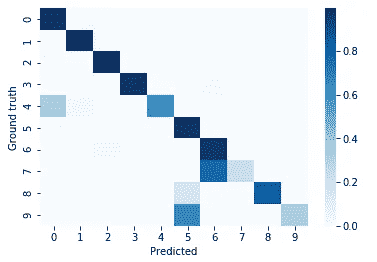

# 一个好的机器学习分类器对扑克牌数据集的精度度量

> 原文：<https://towardsdatascience.com/a-good-machine-learning-classifiers-accuracy-metric-for-the-poker-hand-dataset-44cc3456b66d?source=collection_archive---------30----------------------->


马库斯·温克勒在 [Unsplash](https://unsplash.com?utm_source=medium&utm_medium=referral) 上的照片

## 一个非常适合高度不平衡数据集的指标

# 什么是数据集？

[扑克手数据集](https://archive.ics.uci.edu/ml/datasets/Poker+Hand)【Cattral 等人，2007 年】是公开可用的，并且在 [UCI 机器学习知识库](http://archive.ics.uci.edu/ml)【Dua 等人，2019 年】中有非常好的记录。[Cattral 等人，2007 年]将其描述为:

> 对于分类算法来说，这是一个具有挑战性的数据集

这是一个 11 维的数据集，有 25K 个样本用于训练，超过 100 万个样本用于测试。每个数据集实例都是一手 5 张牌的扑克，每张牌使用两个特征(花色和级别)和一手扑克标签。

# 为什么很难？

它有两个特性使得分类算法特别具有挑战性:它全是**分类特征**和它**极度不平衡**。[分类特征](https://www.datacamp.com/community/tutorials/categorical-data)很难，因为典型的距离(又称相似性)度量不能自然地应用于此类特征。例如，该数据集有两个特征:等级和套件，计算“黑桃”和“红桃”之间的欧几里德距离根本没有意义。[不平衡的](https://medium.com/analytics-vidhya/what-is-balance-and-imbalance-dataset-89e8d7f46bc5)数据集很难，因为机器学习算法假设了良好的平衡，[机器学习大师](https://medium.com/u/f374d0159316?source=post_page-----44cc3456b66d--------------------------------)[的](https://machinelearningmastery.com/what-is-imbalanced-classification/)Jason Brownlee将这个问题描述为:

> 不平衡的分类对预测建模提出了挑战，因为用于分类的大多数机器学习算法是围绕每个类别的相等数量的样本的假设而设计的

# 那么，为什么我会得到好的结果呢？

那么，如果这个数据集被认为是困难的，为什么一个简单的神经网络可以在没有任何特殊调整或数据预处理的情况下达到 90%以上的准确性？

在[这篇文章](https://medium.com/@virgoady7/poker-hand-prediction-7a801e254acd) , [Aditya Bhardwaj](https://medium.com/u/43bd75e69f79?source=post_page-----44cc3456b66d--------------------------------) 显示他的神经网络达到了 90.04 的准确率。下面，我展示了一个简单的[多层感知器神经网络](https://scikit-learn.org/stable/modules/generated/sklearn.neural_network.MLPClassifier.html) k 实现了超过 99%的准确率。发生这种情况的一个原因是由于**职业不平衡问题**。[Ling 等人，2011 年]解释说:

> 当类别分布高度不平衡时，数据被认为遭受了类别不平衡问题。在这种情况下，许多分类学习算法对非频繁类的预测精度较低。

扑克手数据集碰巧非常不平衡，在训练集和测试集中，前两个类代表了 90%的样本。一个学习如何正确分类这两个类别，但完全错误分类其余类别的分类器，仍将达到 90%的预测准确率。**这不是一个好的分类器！**。分类器仍然获得高分的原因很简单，因为**类别不平衡考虑到了**，即**优势类别的正确预测被赋予了与样本数量成比例的权重。**“非频繁类的低预测准确性”被来自那些有大量样本可供学习的类的较好预测所掩盖。

# 我们能做些什么呢？

一个不考虑阶级不平衡的度量标准，例如，对所有阶级给予同等的权重，而不考虑他们的主导地位，可以提供更“真实”或准确的结果。 **Scikit-learn** 的[分类报告](https://scikit-learn.org/stable/modules/generated/sklearn.metrics.classification_report.html)有一个这样的指标。 **F1 得分**结合了精确度和召回率两方面的结果，分类报告包括一个**F1**宏观平均度量**，**即**未加权的每个标签的 F1 得分平均值！**。正如 Scikit-learn 关于 F-metrics 的[文档中提到的:](https://scikit-learn.org/stable/modules/model_evaluation.html#precision-recall-f-measure-metrics)

> 在非频繁类仍然重要的问题中，宏平均可能是突出其性能的一种方法

这是一个很好的度量示例，可用于衡量分类器在这种高度不平衡的数据集上的性能。

在机器学习文献中已经提出了许多其他方法和度量来处理这里提到的一些问题。例如，Boriah 等人在他们的论文“**分类数据的相似性度量:比较评估”**中讨论了用于处理分类特征的一些现有方法。讨论这个不是这篇文章的范围，因此我会简单地给你留下一个论文的链接[这里](https://www.researchgate.net/publication/220907006_Similarity_Measures_for_Categorical_Data_A_Comparative_Evaluation)。

# 请出一些结果？

我继续运行一个多层感知器神经网络，这是我得到的结果。这个网络使用 **3 个隐层，每个隐层 100 个神经元，alpha=0.0001，学习率=0.01。**下面是 [**混淆矩阵**](https://en.wikipedia.org/wiki/Confusion_matrix) 。可以观察到，神经网络总体上做得很好，正确地分类了前 6 个类别中的大多数，对于类别 7 和 9(四个同花和同花)有一些特别差的结果。



混淆矩阵

**该分类器报告的准确率为 99%** 。尽管第 7 类和第 9 类的表现非常糟糕，但它们只贡献了 100 万个测试样本中的 233 个。几个非主导类的坏结果完全被其他类掩盖了。这显然给人一种成功的错觉！神经网络错误分类了 66%和 77%的皇家同花顺和四张一类的手牌，但它得到了正确但误导性的 99%的准确性结果。

下面显示的**分类报告**包括前面提到的**所有类别的宏观平均 F1 分数**。这种未加权的平均值更好地概括了分类器的表现。可以看出，大多数班级实际上做得很好，但也有几个班级做得特别差。**但更重要的是，可以观察到报告的宏观平均值为 78%。**对于观察到的结果，这是一个更合适的分数！2/10 的班级表现很差，而其他班级表现得更好，这反映在指标中，当指标被仔细选择时。

```
 precision    recall  f1-score   support 0       1.00      0.99      0.99    501209
           1       0.99      0.99      0.99    422498
           2       0.96      1.00      0.98     47622
           3       0.99      0.99      0.99     21121
           4       0.85      0.64      0.73      3885
           5       0.97      0.99      0.98      1996
           6       0.77      0.98      0.86      1424
           7       0.70      0.23      0.35       230
           8       1.00      0.83      0.91        12
           9       0.04      0.33      0.07         3 accuracy                           0.99   1000000
   **macro avg       0.83      0.80      0.78   1000000**
weighted avg       0.99      0.99      0.99   1000000
```

# 参考

[1]卡特拉尔和奥帕彻(2007 年)。扑克手数据集[[https://archive.ics.uci.edu/ml/datasets/Poker+Hand](https://archive.ics.uci.edu/ml/datasets/Poker+Hand)]
卡尔顿大学计算机科学系。
智能系统研究小组

[2]Dua d .和 Graff c .(2019 年)。http://archive.ics.uci.edu/ml 的 UCI 机器学习知识库。加州欧文:加州大学信息与计算机科学学院。

[3]凌春霞，盛诉生(2011)阶层失衡问题。在:萨姆特 c，韦伯 G.I .(编辑)机器学习百科全书。马萨诸塞州波士顿斯普林格。https://doi.org/10.1007/978-0-387-30164-8_110