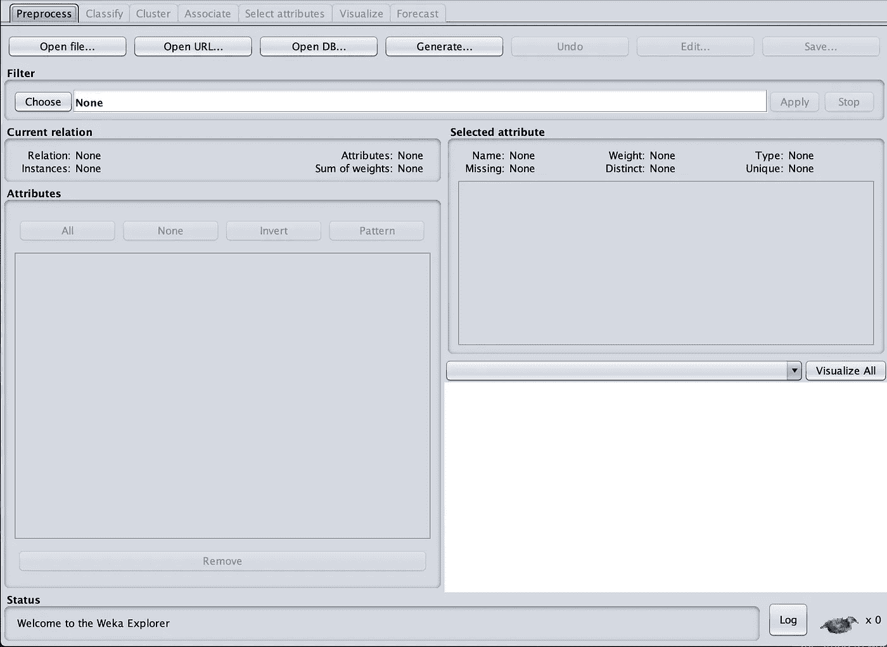
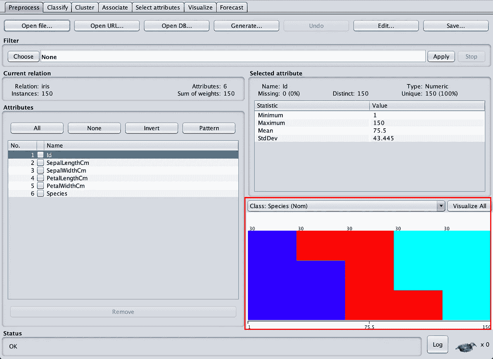
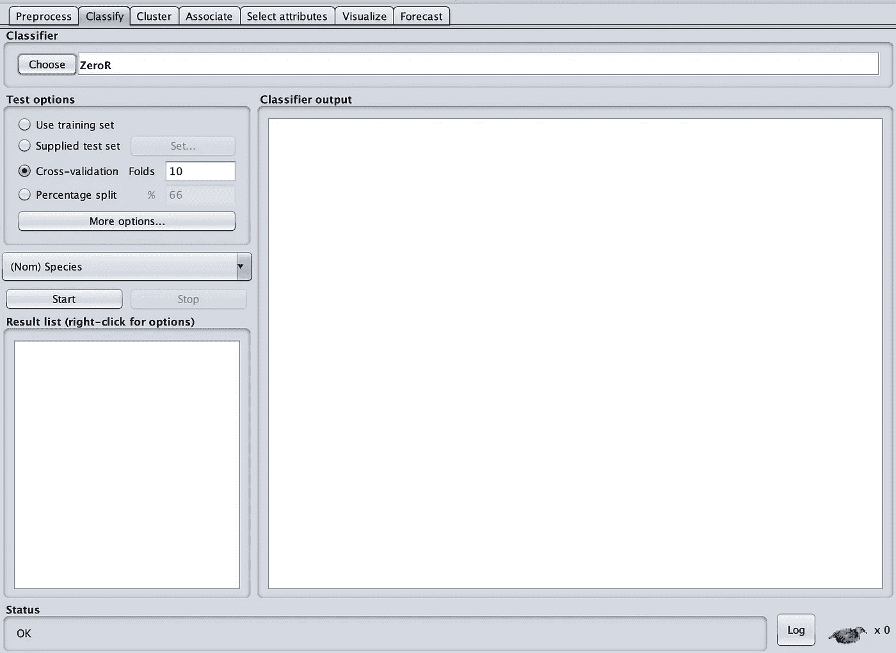
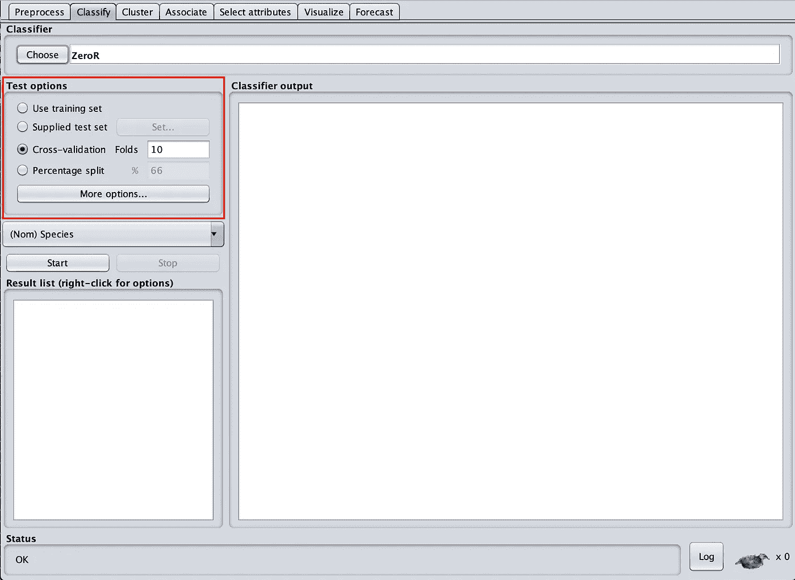
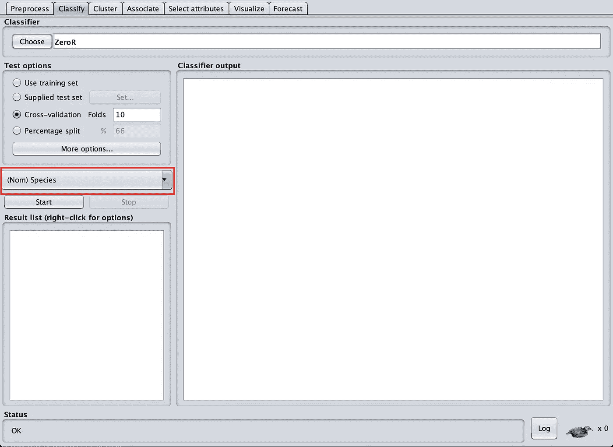
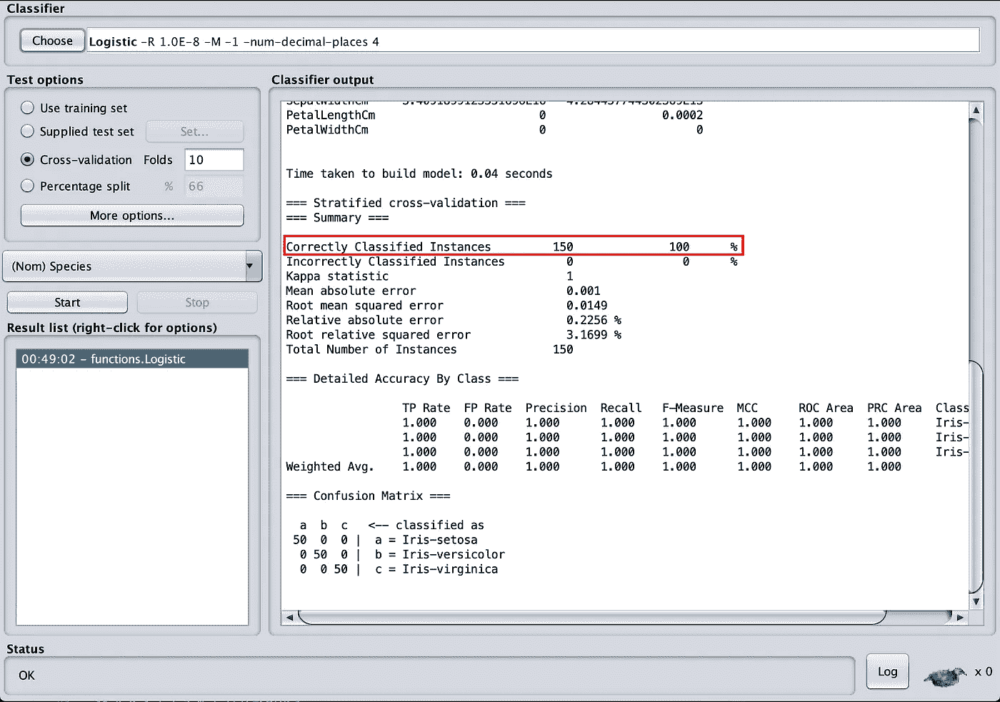
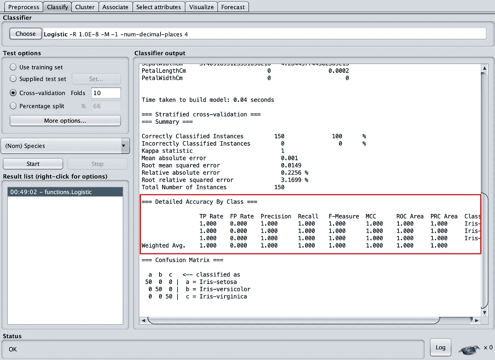
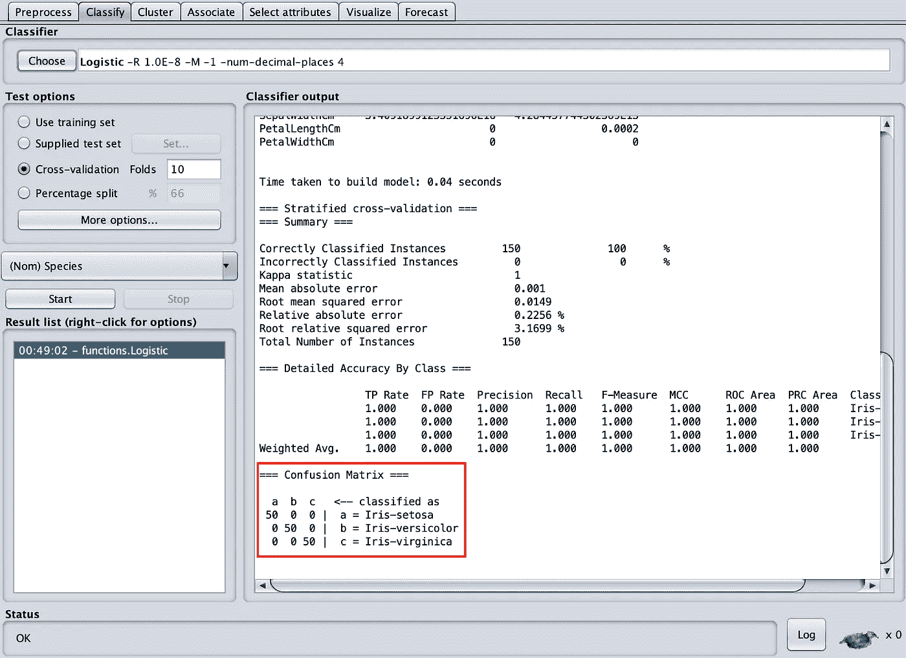
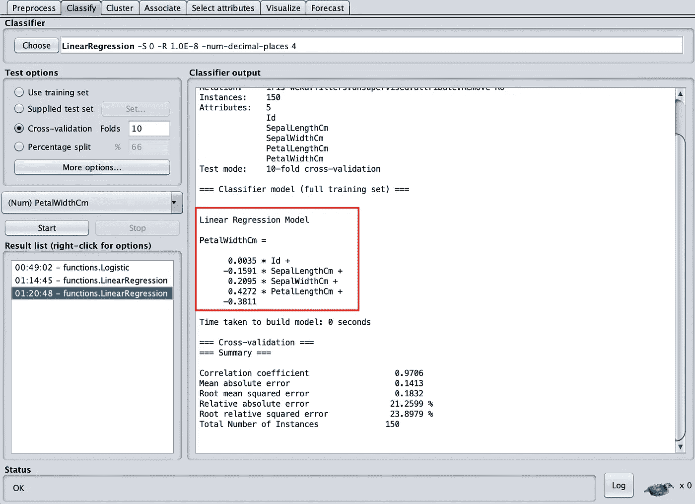

# 初学者开始机器学习的好方法

> 原文：<https://towardsdatascience.com/a-great-way-for-beginners-to-get-started-with-machine-learning-833cce028620?source=collection_archive---------38----------------------->

## 如何使用 Weka 实现您的第一个机器学习算法


资料来源:Weka GUI

# 介绍

无论你是机器学习的新手，还是尝试过用 Python 或其他语言建立模型但失败了，Weka 都可能是你的完美起点。

Weka 是建立在 Java 之上的数据可视化和算法工具的集合。不过不要担心！由于 Weka 的图形用户界面(GUI ),您不必了解任何 Java 就可以使用它。使用这个 GUI，您可以在数据上运行流行的机器学习模型，而无需编写任何代码！

然而，在使用 Weka 之前，您需要学习一些机器学习算法的基础知识。

# 基础知识

## 数据

在开始运行机器学习算法之前，您需要一个数据集。寻找数据集的好地方是 [Kaggle](https://www.kaggle.com/) ，这是一个为数据科学家提供挑战、数据集等内容的网站。只需在您感兴趣的领域搜索数据集并下载即可！在本指南中，我将使用鸢尾花数据集，如果你愿意跟随，可以在[这里](https://www.kaggle.com/uciml/iris)找到。我建议寻找 CSV 格式的数据集，以便最容易实现。CSV 代表逗号分隔值，是一个简单的文本文档，其中每行是一个表格的一行，各列之间用逗号分隔。下载 CSV 文件后，在文本编辑器中打开它，查看其格式。

## 回归

回归是您将在本指南中学习的一种方法。回归问题侧重于预测一个连续的数。例如，脸书喜欢一个帖子的数量，或者房子的销售价格。查看一下从 Kaggle 获得的数据集，通过寻找连续值来尝试识别任何回归问题，并确定它们是否有预测价值。

## 分类

分类是您将在本指南中学习的另一种方法。分类问题预测记录的类别。比如这花是玫瑰吗？或者说，这饮料是汽水吗？查看您的数据集，通过查找类别来尝试识别任何分类问题，并确定它们是否有预测价值。

## 数据类型

数据可以有多种类型。在本指南中，我将向您介绍对 Weka 有价值的数据类型。重要的数据类型有数字、字符串和类。数字数据类型由数字组成。例如，您为回归确定的任何连续值都是数字。字符串数据是文本数据。单词、句子和段落都是字符串数据类型。类别数据是具有预定义类别或列表的数据。例如，IMDB 星级或狗的种类。这三种数据类型将构成数据的主要部分。

# 履行

现在你对机器学习中使用的一些基本术语有了更好的了解，让我们开始构建你的第一个模型吧！

第一步是在这里下载 Weka GUI [。安装程序后，你应该会看到下面的窗口。](https://www.cs.waikato.ac.nz/ml/weka/)


资料来源:Weka GUI

Weka GUI 有五个主要区域:资源管理器、实验者、知识流、工作台和简单的 CLI。开始时，你可以忽略除了浏览器标签以外的所有标签，直到你有了更多的 Weka 经验。点击浏览器按钮进入下面的屏幕。



资料来源:Weka GUI

资源管理器选项卡有 7 个选项卡:预处理、分类、聚类、关联、选择属性、可视化和预测。对于本指南，我们将坚持使用预处理和分类选项卡。预处理选项卡如上所示。这是您将加载数据的地方。但是，我们需要将 csv 数据集转换成 ARFF 文件。要做到这一点，你需要一个文本编辑器和崇高的文本。Sublime 是一个免费的代码编辑器，可以从[这里](https://www.sublimetext.com/3)下载。

下载 Sublime 后，在文本编辑器中打开您的 csv 文件并复制内容。然后，将它们粘贴到一个新的 Sublime 文件中。保存该文件，并用。arff 在最后。

ARFF 文件有三个部分:关系、属性和数据。我们需要将这些部分添加到文件中。在第一行添加关系组件并命名数据集。

```
@RELATION iris
```

跳过一行，然后添加属性组件。您的属性将是数据集的列。每个属性都需要一个名称和数据类型。当输入一个类数据类型时，列出每个类别，用逗号分隔在花括号内。

```
@ATTRIBUTE Id NUMERIC
@ATTRIBUTE SepalLengthCm NUMERIC
@ATTRIBUTE SepalWidthCm NUMERIC
@ATTRIBUTE PetalLengthCm NUMERIC
@ATTRIBUTE PetalWidthCm NUMERIC
@ATTRIBUTE Species {Iris-setosa, Iris-versicolor, Iris-virginica}
```

跳过另一行，然后在您复制的 CSV 数据上方添加数据组件。如果您的数据有标题行，请确保删除标题行。

```
@DATA
1,5.1,3.5,1.4,0.2,Iris-setosa
2,4.9,3.0,1.4,0.2,Iris-setosa
3,4.7,3.2,1.3,0.2,Iris-setosa
4,4.6,3.1,1.5,0.2,Iris-setosa
5,5.0,3.6,1.4,0.2,Iris-setosa
6,5.4,3.9,1.7,0.4,Iris-setosa
7,4.6,3.4,1.4,0.3,Iris-setosa
8,5.0,3.4,1.5,0.2,Iris-setosa
....
```

最后，再次保存这个文件，您就可以将它加载到 Weka 中了！

在 Weka 的预处理选项卡上，单击打开文件并导航到新的 ARFF 文件。


资料来源:Weka GUI

如果您在预处理选项卡的右下角看到一个分布图，您将知道数据已经正确导入。



资料来源:Weka GUI

加载数据后，单击分类选项卡。这是我们将运行回归和分类模型的地方(尽管名称为 classify，回归模型也在这里运行)。您应该会看到下面的屏幕。



资料来源:Weka GUI

在测试选项部分，我们有 4 个选项:使用训练集、提供的测试集、交叉验证和百分比分割。为了衡量预测所选列的模型的准确性，我们需要向它提供以前没有见过的新数据。一种方法是将数据集分成两部分，称为测试和训练。但是，我推荐使用 10 倍交叉验证。这将把数据集分成测试和训练(10%的数据用于测试)10 次。这通常是最佳实践。



资料来源:Weka GUI

我们还需要选择我们想要预测的列。对于 iris 数据集，我将使用花卉种类，但是，您应该使用您在浏览数据集时确定的列。



资料来源:Weka GUI

然后，我们需要选择我们将使用的机器学习算法。因为鸢尾物种是一个分类问题，所以我将使用分类算法。其中一种基本的分类算法是逻辑回归(不要被逻辑回归中的“回归”所迷惑——它是一种分类算法)。逻辑回归将输出一个介于 0 和 1 之间的数字来对记录进行分类。在本指南中，我将跳过数学，但是理解这些算法是如何工作的非常重要。你可以在这里了解更多关于逻辑回归[的知识。要选择逻辑回归算法，单击分类器下的选择，然后单击分类器>功能下的逻辑。](/logistic-regression-detailed-overview-46c4da4303bc)


资料来源:Weka GUI

现在，我们要做的就是点击开始！模型运行后，您应该会得到类似如下所示的输出。


资料来源:Weka GUI

如果你在做回归问题，过程是一样的。但是，不要在分类器>函数下选择逻辑，而要选择线性回归。像逻辑回归一样，我将跳过线性回归的数学，但是，你可以在这里[找到更多信息。](/linear-regression-detailed-view-ea73175f6e86)

现在你可能会说，“太好了！我让模型运行了…但现在怎么办？”运行您的模型后，您需要学习如何读取输出并评估模型的成功。

# 模型评估

对于分类和回归问题，Weka 的输出会有所不同。然而，理解如何阅读和解释 Weka 的输出对于理解您的模型预测得有多好很重要。我们将检查分类和回归问题的输出。

## 分类

在 Weka 的分类输出中有三个重要部分用于评估模型的成功。这些是摘要、分类准确度和混淆矩阵。

在摘要部分，注意正确分类的实例。这是模型正确分类的记录数量，可以用百分比表示。在 iris 数据集的情况下，我们对 100%的记录进行了正确分类。这在真实世界的数据集里是极其罕见的，所以不要期望你的准确度会这么高。良好的准确性因数据集和应用领域而异，但是，如果您的准确性低于随机概率，则肯定需要进行一些改进。



资料来源:Weka GUI

在按类划分的精度部分，请注意 f-measure 和 ROC 面积。f-measure 是一个介于 0 和 1 之间的指标，它同时考虑了精确度和召回率。评估 f 度量值时，f 度量值越接近 1，模型表现越好。ROC 面积是受试者工作特征曲线下的面积。该输出将介于 0 和 1 之间，并且将表示模型能够区分类别的程度。评估 ROC 面积时，数字越接近 1 越好。您还可以看到，Weka 为每个类别提供了 f-measure 和 ROC 面积以及加权平均值。我建议关注加权平均值来评估整个模型，但是，如果您有多个类，这可以帮助识别模型在分类时遇到特定问题的类。



资料来源:Weka GUI

混淆矩阵也是一个重要的评估特征。它是一个矩阵，显示了 a 类记录是什么以及模型将其分类为什么类。顶行表示它被分类为什么，侧栏表示记录实际上是什么类别。对角线显示正确分类的记录。混淆矩阵可以帮助您识别模型难以分类的记录。



资料来源:Weka GUI

## 回归

Weka 的回归模型有一个评估部分——总结。但是，如果您运行线性回归，您还会有一个称为线性回归模型的部分。现在我说我会跳过线性回归的数学，但是先等等。线性回归将创建最能代表数据的线性函数(考虑最佳拟合线)。线性回归模型部分显示了模型得出的函数。例如，对于虹膜数据集，预测花瓣宽度的线性回归函数为:

PetalWidthCm = 0.0035 * Id-0.1591 * sepallenghtcm+0.2095 * SepalWidthCm+0.4272 * petallenghtcm-0.3811



资料来源:Weka GUI

总结部分将提供评估模型成功与否的指标。相关系数会告诉你变量之间有多少线性关联。相关系数越接近 1 越好。此外，平均绝对误差将告诉您平均误差的绝对值(预测过高或过低)。绝对值用于捕捉负误差。平均绝对误差越低越好，但是，什么是“低”将取决于数据，需要一些直觉。


# 讨论

虽然本指南绝不是关于机器学习、Weka 或所用方法的包罗万象的指南，但它应该让你开始使用实际数据进行实际预测。Weka 是一个开始探索机器学习的好地方，因为你不用写任何代码就可以实现通用算法。

你也可以用 Weka 来增长你的技能，以使用不同的和更先进的方法。可以用于分类的其他算法有 C4.5 决策树(在 Weka 中称为 J48)、随机森林和朴素贝叶斯。如果您有信心，Weka 还有一个名为 SMOreg 的支持向量机(SVM)实现——仔细选择您的内核！