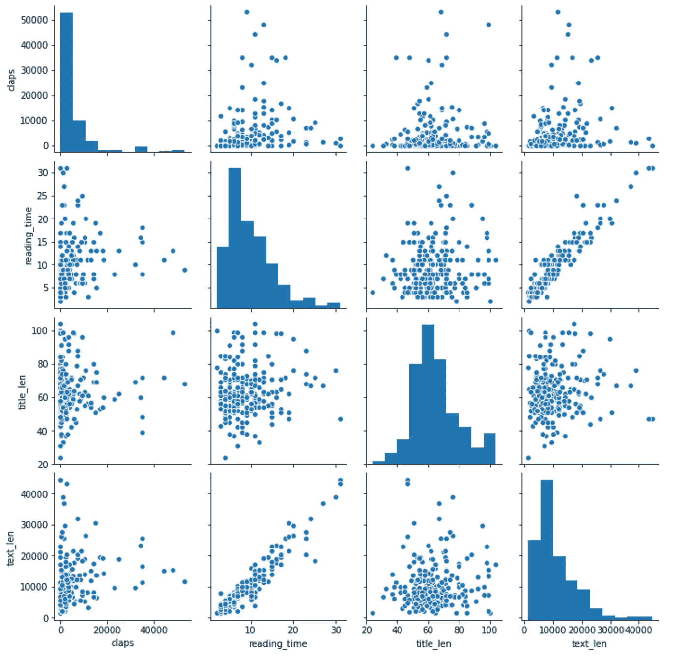
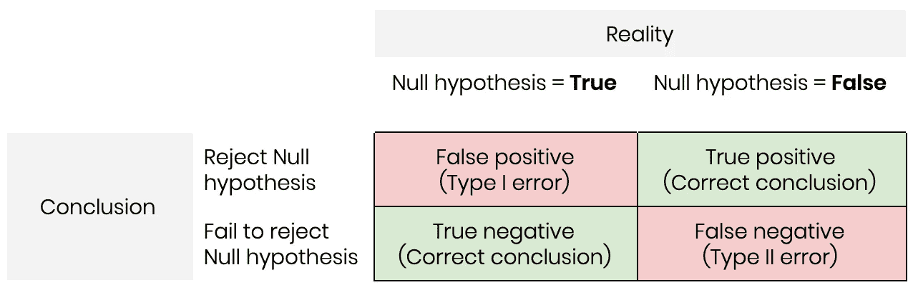
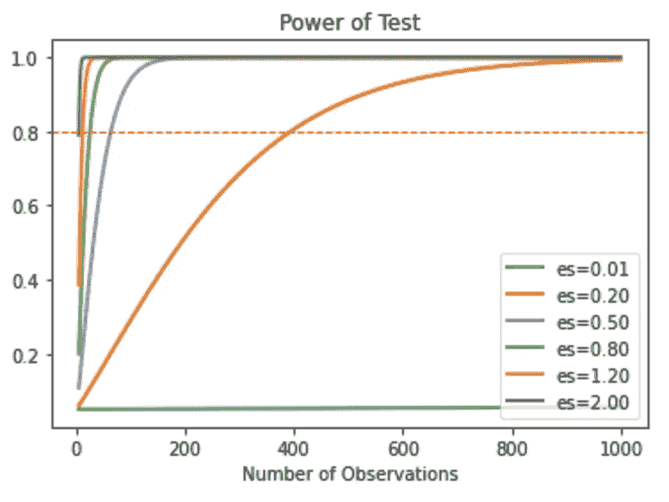
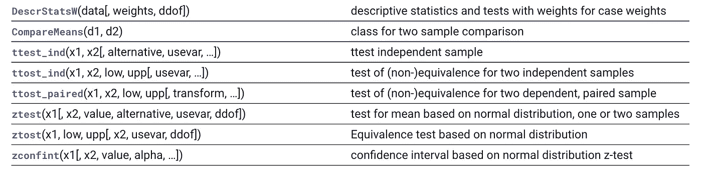

# 使用 python 设计 A/B 测试的成长型营销人员指南

> 原文：<https://towardsdatascience.com/a-growth-marketer-guide-to-designing-a-b-tests-using-python-5c0729d8eacc?source=collection_archive---------32----------------------->

## 提高实验效果的 3 个基本步骤


图片来自 [Unsplash](https://unsplash.com/)

在我在 Waze 工作的 7 年里，我开发了各种各样的产品和功能，从 Waze 应用程序(在全球拥有超过 1.3 亿用户)到 Waze 首次推出时的拼车。

我在营销的多个领域工作，亲眼目睹了它对用户参与度的影响。它激励我更深入地挖掘业绩和增长的世界。在这个过程中，我学会了如何挖掘数据以发现有意义的见解，相应地设计实验，以及分析和解释实验结果。

我现在是绩效营销团队的一员，我们的任务是通过利用 Waze 拥有和运营的渠道和工具，提高整个产品漏斗中的用户参与度。我们直接与用户沟通，最终促使他们采取最有效的行动来完成他们的用户之旅。

为了了解我们活动的效果，我们进行了实验，主要以“假设检验”的形式，即 A/B 检验。在进行了数百次实验后，我确定了一系列最佳实践，以及将它们付诸实践的具体步骤，以便进行有效的 A/B 测试，你可以在下面的帖子中找到。

*注意:这篇文章中分享的观点是我自己的，并不反映 Waze 或 Google 的任何标准或具体协议。*

# 第一步:探索现有的关系，定义你的关键绩效指标(KPI)

首先，您进行的任何 A/B 测试都应该与公司的 KPI 保持一致，以确保您的工作集中在最重要的业务优先级上。开始吧-

## 进行探索性数据分析，以发现数据中的现有关系

识别 KPI 需要结合领域知识和 EDA，即探索性数据分析。您需要深入了解业务领域，以便评估什么是最重要的驱动因素。然后，您可以使用 EDA 来发现影响他们的关系，因为 EDA 还允许您确定产品漏斗中具有最大增长机会的相关领域。

如果您是第一次浏览数据，您会希望遵循以下基本步骤:

*   **检查您的数据:**对于每个数据集，您首先要了解数据的组织方式及其包含的内容。
*   **清理&组织您的数据:**删除不需要的列、地址空值，并根据需要添加额外的列。
*   **使用 Group by &聚合函数** **运行汇总统计数据**以探索组之间任何有趣的差异。
*   **进行可视化数据探索(VDE)** 以发现各组之间可能的关系。



用于揭示数据不同部分之间潜在关系的 [pairplot](https://seaborn.pydata.org/generated/seaborn.pairplot.html) 示例(图片由作者提供)

我给[做了一个笔记本](https://colab.research.google.com/drive/1SgwAH7OVlaqLfyj6-IXPBlFrr00beYTZ?usp=sharing)，里面有一些基本功能可以帮助你入门。您需要根据数据集的性质更改/删除一些函数，但总的来说，我发现这种结构有助于保持一切有序和清晰。

## 确定与业务优先级/目标相关的可行指标

您选择的指标应该与产品粘性(参与度)相关联，并且是长期保留的有力指标。总的来说，KPI 应该是可衡量和可操作的。也就是说，您应该能够采取某些措施来提高数字以支持业务目标。此外，您需要关于这个指标的足够的现有数据，或者能够容易地收集关于它的数据。最终，您会希望避免长时间的迭代。例如:关注每日或每周活跃用户，而不是每月活跃用户，因为 MAU 会要求你等待一整个月才能分析数据并采取行动。

## 关注更少的指标以产生更大的影响。

当涉及到 KPI 时，您通常希望遵循“少即是多”的方法，这样公司就可以专注于更少的指标，以产生更大的全面影响。

在设计 A/B 测试时，你也应该遵循这种方法。您尝试优化的指标越多，您的实验就会越复杂，这可能需要运行更长时间，需要更多的设计&开发资源&最终需要更多的资金。

一旦您发现了数据中的关系，您就需要更深入地进行分析，以准确构建您的 KPI，然后在设计您的实验和定义您的成功指标时使用这些 KPI。

# 第二步:定义你实验的范围和目标

一旦您对数据中的关系有了更好的理解，并确定了相关的 KPI，您就可以开始定义您的实验范围了。任何实验设计(坦率地说，任何项目)都应该从回答这 4 个问题开始:

## 1.这个实验重要吗？

从很多方面来说，这是最重要的问题，因为你不想在一个结果不会影响业务、产品或营销决策的实验上浪费时间、金钱和资源。在开始实验工作之前，确保与组织中的相关利益相关者保持一致。

## 2.你能在这个实验中测量相关的 KPI 吗？如果可以，如何测量？

永远不要说“让我们启动这个实验，看看会发生什么”(你会惊讶我以前听到过多少次)。你最不希望的事情就是意识到你实际上不能测量你想要影响的指标。确定您想要影响的指标(或 KPI ),然后确保它们是可测量的，并且实际上可以应用到实验中。

## 3.如果这种影响存在，你能检测到吗？

为了评估你试图衡量的变化是否有意义，你需要有足够大的样本量。多大？这将取决于多种因素，包括置信度、功效和效果大小。我们将在设计实验的第三步更详细地探讨这些问题，但总的来说，重要的是要记住，要检测产品漏斗深处的影响，需要更大的样本量。如果一个变化在漏斗顶部，如点击，打开一条消息等，你可能不需要那么大的样本量。类似地，你需要更大的样本量来检测小的效应大小。

在可能的情况下，从为您的产品所做的类似工作中确定转换基准，以粗略估计进行实验所需的用户数量。

## 4.如果成功，这个实验会‘动针’吗？

从商业的角度来看，你也应该考虑实验的影响，如果成功的话，是否有意义。换句话说，即使你的实验导致了统计上的显著提升，如果它只影响了一小部分用户，它也不值得运行。

如果你对以上任何一个问题的回答是“否”,那就不要浪费你的时间来设计这个实验了。否则，请继续阅读——是时候开始你的实验设计了！

# 步骤 3:定义、设计和启动你的实验

在确认了实验的需求并确定了你的成功标准之后，你就可以继续设计实验了。我建议使用一个包括实验所有部分的笔记本:定义、计划和报告。任何阅读你的笔记本的人都应该很容易理解实验的基本原理、目标和范围，以及实验是如何进行的，以及你从实验中学到了什么。笔记本包括 3 个部分:定义，设计和启动。

## 定义

提供了实验的背景。它概述了需求、如何做出决策以及使用的术语。这里，您将使用步骤 1 中进行的分析，以及步骤 2 中定义的基本原理，为实验提供背景和框架。

具体来说，在这一部分，您需要回答以下问题:

1.  这个实验是关于什么的？
2.  这个实验的商业理由是什么？
3.  这个实验的结果将如何影响商业决策？特别是在与本实验相关的部门——营销、产品等
4.  如何定义本实验中使用的指标和术语？

确保实验报告的所有利益相关者和读者引用实验中使用的所有术语的相同定义是很重要的。这将影响实验的每个部分，如果你没有定义实验的关键部分，可能会导致完全不同的结论。例如，如果你正在进行一个旨在复活休眠用户的实验，你对休眠用户的定义或者什么构成了复活必须在实验计划中完全定义。其他人可能对你的目标受众以及整个实验的结果和成功有不同的看法。

## 设计

这是实验计划的核心。它包括感兴趣人群的定义、机会大小、抽样方案、假设定义和所需的最小样本量。确保包括以下内容:

**兴趣人群**
详细定义你的目标人群定义。

**机会大小**
应根据您感兴趣的人群和为实验定义的 KPI 来定义。正如第一步中提到的，你需要集中精力测试那些有可能“移动指针”的东西。

**抽样方案** 你计划对你感兴趣的人群进行抽样的方式。我还建议包括任何潜在的采样偏差，以确保你的利益相关者意识到它们以及它们对实验结果的潜在影响。

**无效&替代假设** 这是实验定义的核心。简明扼要地描述你的零选择假设是什么。你的零假设应该是你的默认行为或现有状态。你的替代假设是你正在测试的新理论或变化。你在实验中的目标是看看是否有足够的证据拒绝无效并接受改变(替代假设)。

统计误差是假设检验的关键部分。具体来说，我们看两种类型的错误:假阳性(第一类错误)和假阴性(第二类错误)。说明这两种错误之间差异的一个常见例子是，将第一类错误视为判一个无辜者有罪的概率，而第二类错误是指判一个有罪者无罪的概率。



就你的实验而言，你会想要减少错误地拒绝零假设的机会，从而增加找到一个效果的概率(如果存在的话)。以上面的例子为例，你可以认为零假设是无辜的，而另一个假设是有罪的。如果一个无辜的人确实是无辜的(Null 为真)，你会希望减少这个人被定罪的机会(拒绝 Null)。

**显著性水平&功效统计** 通过显著性水平(a)定义你对犯 I 类错误的适应程度，通常设置为 0.05 或 5% (95%置信水平)。通过使用功率统计来克服类型 II 误差。实验的功效统计是实验检测实验组之间差异的能力，如果这种差异存在的话。使用 80%的功率是很常见的。

**效果大小**



作者图片

重要的是要了解影响的大小，或者在给定的人群中会有什么样的结果。因此你需要一个有效尺寸。你希望在测试中看到的变化越大，效果越大，最小样本量就越小。我们希望看到的变化越小，影响大小就越小，我们需要的最小样本量就越大。换句话说，如果你想检测大的差异，你可以在测试中用较少的用户来做，但是如果你想找到更精细的小差异，你需要在测试中包含更多的用户。

**最小样本量** 一旦定义了显著性水平、功效和效果量，您就可以运行功效分析来确定您需要的最小用户数，以便检测您正在测试的变化是否有意义。

通常使用 p 值来解释检验，p 值是假设零假设为真时观察到结果的概率。在解释显著性检验的 p 值时，必须指定显著性水平。如果 p 值小于显著性水平，则显著性检验的结果被认为是“统计显著的”。这意味着零假设(即没有差异)被拒绝。

*   ***p<= alpha:****拒绝 H0，不同分配*
*   ***p>alpha:****未能拒绝 H0，同分配*

使用 Python 的 [statsmodels 库](https://www.statsmodels.org/stable/index.html)你可以很容易地计算 min。需要的样本大小，知道期望的显著性水平、效应大小和功效(笔记本可用[此处](https://colab.research.google.com/drive/1AFhsuGj-rtpu6ZBPBssIm9ARMojNir9T?usp=sharing)):

```
# Import library #from statsmodels.stats.power import TTestIndPower# parameters for power analysis (change as needed)effect = 0.05
alpha = 0.05
power = 0.8# perform power analysis ## change to TTestPower() in case of a paired sample t-testanalysis = TTestIndPower()  
result = analysis.solve_power(effect, power=power, nobs1=None, ratio=1.0, alpha=alpha)print('Sample Size: %.2f' % result)
```

**启动&监视器**
你现在已经准备好启动你的实验了！不要忘记对实验的每一部分进行质量保证，以确保它如你所期望的那样运行，并且数据正常流动。此外，确保继续全程监控实验。最重要的是，在发布后的最初几个小时内密切监控它，以尽快发现任何潜在的问题。

# 步骤 3:分析和报告结果

运行 A/B 测试后，您需要分析并清楚地报告实验结果。不要羞于报告负面影响或没有影响。通常，在找到最有影响力的假设之前，你需要测试多个假设。但是，以可操作的方式清楚地传达结果可以帮助您和所有相关利益相关者协调一致，并继续推动您的 KPI 的影响。

分析实验结果的第一步是从验证开始，以确保测试正确运行。具体来说，您需要确认:

*   **实验组的大小是相同的**，即如果测试被分配给每组 50%-50%。如果您决定以不同的方式划分实验组，您需要确保每个组的大小与分配给它的百分比相对应。
*   **实验组是随机分配的:**一定要检查你的实验组中的亚群，以确保没有潜在的偏见影响你的实验结果。例如，您可以按性别或国家对您的实验组进行分组，以确保两组具有相对相似的规模。

一旦您确认了您的实验的有效性，您需要基于为测试定义的度量和 KPI 来分析每个组的表现。虽然一组可能看起来比另一组表现更好，但您必须观察结果是否具有**统计显著性**，以便能够确定结果是随机的还是可重复的结果(实际影响)。

如何知道结果是否具有统计学意义？如果你的变量之间的关系不仅仅是偶然的可能性！显著性以 P 值衡量，即概率值，它将反映您的结果是否像您在统计假设检验中观察到的结果一样极端的概率。P 值假设您的零假设一开始就是正确的。

请记住，P 值取决于测试组的样本大小。P 值表示为 0%到 100%，但通常表示为小数。例如，5%的 P 值是 0.05。**低 P 值是好的**；他们表明这个结果不是偶然发生的。您可以将高 P 值视为反对空值的弱证据，而将低 P 值视为反对空值的强证据:

*   ***高 P 值:*** *您的数据很可能为真 null(保留 Null)*
*   ***低 P 值:*** *您的数据不太可能为真 null(拒绝 Null)*

我听过很多次人们试图通过说“结果几乎具有统计学意义”来软化他们的报告。让我们明确一点:

> 没有“几乎显著”这种说法。您的测试结果可能有统计学意义，也可能没有。

除了确定您的测试结果是否具有统计显著性，您还需要定义效果的大小，或者您的无效假设和替代假设之间的差异大小。为了确定这一点，您需要进行一个测试统计。不同的假设检验根据零假设中假设的概率模型使用不同的检验统计量。一些常用的测试包括:

*   **Z 检验(Z 统计)**:测量原始分数低于或高于总体平均值的标准偏差。z 分数也称为标准分数。
*   **T 检验(T 统计)**:T 检验告诉你两组之间的差异有多显著；换句话说，它让你知道这些差异(以平均值/平均值衡量)是否可能是偶然发生的。
*   **ANOVA (F 统计)**:与 T 检验类似，ANOVA 可以告诉你组间的差异有多显著。t 检验比较两组，而方差分析检验可以比较两组以上。
*   **卡方检验(卡方统计)**:帮助您找到包含零假设和替代假设的变量之间的关系类型。

进行分析时，您需要选择最适合您的实验的 T 统计量，并计算两个 T & P 值来评估您的实验性能。Statsmodels 库包括一些很棒的函数，可以帮助您进行上面提到的一些 t 测试。



来自 [statsmodel 网站](https://www.statsmodels.org/devel/stats.html)的截图

使用本笔记本[中的代码](https://colab.research.google.com/drive/1nYH9vGwQ9x0Vxx-0_ORMUKbDqT9nMNkK?usp=sharing)计算基本 A/B 测试的 T-测试，该测试由两个互斥组组成，将为您提供 P & T 值。

# 总而言之..

虽然“A/B 测试”经常被用作增长努力的时髦词，但花时间适当地计划它们以最大化它们的影响是非常重要的。最终，如果您投入时间来正确设计、启动和衡量您的实验，您将为您的组织带来巨大的影响。更重要的是，你将在自己的职业生涯中推动真正的范式转变。