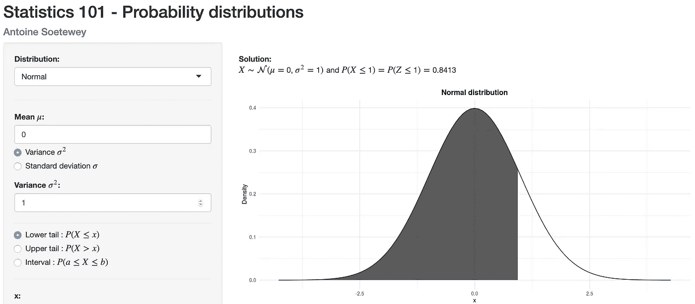
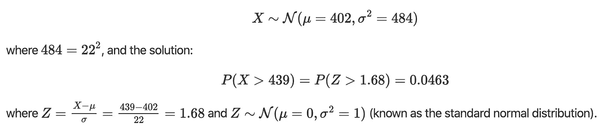

# 如何阅读统计表的指南

> 原文：<https://towardsdatascience.com/a-guide-on-how-to-read-statistical-tables-8fcfdb9e1a56?source=collection_archive---------31----------------------->

## 一个计算主要概率分布概率的闪亮应用程序

闪亮的应用程序来计算主要概率分布的概率

作为我教学助理活动的一部分，我很快意识到学生们通常很难在统计表中找到概率。下面一个闪亮的应用程序帮助你阅读主要的统计表:

*   [统计-101](https://antoinesoetewey.shinyapps.io/statistics-101/)

这个闪亮的应用程序帮助你计算主要概率分布的概率。

以下是完整的代码，如果你想加强它(见一个例子，如何使用这个应用程序后，嵌入式代码):

*请注意，如果应用程序已经达到每月使用限额，链接可能会失效。如果是这种情况，请稍后再试。*

# 这个 app 怎么用？

1.  通过此[链接](https://antoinesoetewey.shinyapps.io/statistics-101/)打开应用程序
2.  选择发行版
3.  设置分布的参数(参数当然取决于所选择的分布)
4.  选择是要查找较低的尾部、较高的尾部还是一个区间
5.  选择 x 的值

在右侧面板(或下方，取决于屏幕大小)上，您将看到:

*   你刚刚输入的数据的摘要
*   数值解(即概率)
*   解决方案的可视化
*   概率密度函数以及平均值、标准差和方差

# 例子

这里有一个最常见分布的例子:**正态分布**。

想象一下下面的问题:一家企业每周维护和修理的成本已经观察了很长一段时间，结果是按照一个平均为 402€、标准差为 22€的正态分布来分布的。已经为下周设定了 439€的预算，费用超出预算的可能性有多大？

要解决这个问题，请按照应用程序中的以下步骤操作:

1.  选择正态分布，因为据说成本遵循正态分布
2.  设均值μ等于 402，因为据说平均成本是 402€
3.  在该语句中，给出了标准偏差(而不是方差),因此选择“标准偏差σ”并将其设置为 22
4.  有人问我们成本超过预算的可能性有多大。因此，我们寻找概率**高于**某个 X，所以选择上尾 P(X > x)
5.  我们现在被要求找出成本超过 439€的概率，所以设 x 等于 439

解决方案面板对数据进行了总结:

因此，下周成本超出 439€预算的概率为 0.0463，或 4.63%。

它还显示了正态分布(μ=402 和σ^2=484 ),阴影区域对应于我们正在寻找的概率。然后，它给出了关于密度函数，均值，标准差和方差的一些细节。

感谢阅读。我希望你会发现这个应用程序对计算主要分布的概率很有用。

和往常一样，如果您有与本文主题相关的问题或建议，请将其添加为评论，以便其他读者可以从讨论中受益。

**相关文章:**

*   [一款闪亮的手工推断统计应用](https://www.statsandr.com/blog/a-shiny-app-for-inferential-statistics-by-hand/)
*   [一款闪亮的手工线性回归应用](https://www.statsandr.com/blog/a-shiny-app-for-simple-linear-regression-by-hand-and-in-r/)
*   [最佳资产配置实用指南](https://www.statsandr.com/blog/practical-guide-on-optimal-asset-allocation/)
*   [用闪亮的 app 画字云](https://www.statsandr.com/blog/draw-a-word-cloud-with-a-shiny-app/)
*   [如何在 blogdown 中嵌入闪亮的 app](https://www.statsandr.com/blog/how-to-embed-a-shiny-app-in-blogdown/)

*原载于 2020 年 1 月 6 日 https://statsandr.com***。**