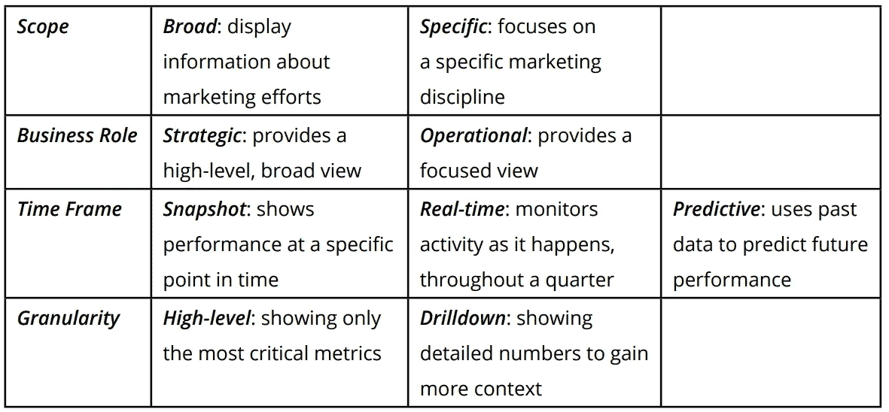

# 营销分析指南

> 原文：<https://towardsdatascience.com/a-guide-on-marketing-analytics-d3936f0373f2?source=collection_archive---------38----------------------->

艾萨克·史密斯在 [Unsplash](https://unsplash.com?utm_source=medium&utm_medium=referral) 上拍摄的照片

随着购买者的旅程变得更加复杂，营销被视为成本中心，营销团队必须依靠分析来衡量他们努力的影响。传统上，营销工作往往被视为难以量化对收入的影响，但借助更好的分析工具，可以更容易地将营销与收入联系起来。

虽然分析的好处显而易见，但营销团队仍然没有采用工具，只有 31%的团队在决策中真正使用了分析工具。考虑到营销自动化、网络分析、CRM 和社交媒体之间的大量数据，采用的问题可以归结为缺乏从多个来源收集数据、确定指标和收集见解的知识。为了提供帮助，本指南将提供一些关于数据源、指标和分析仪表板最佳实践的见解，这些对于成功的营销分析非常重要。

# 仓库存储孤立的数据

数据通常存放在不同的 SaaS 工具和业务应用程序中，不幸的是，这意味着您的营销团队不能直接访问他们自己的数据。使用 SaaS 工具中的仪表板，如营销自动化仪表板，通常意味着您无法组合多个相关的数据源，也无法获得对讲述潜在故事很重要的更深层次的见解。

像[雪花](https://www.snowflake.com/)这样的现代数据仓库工具允许营销团队将分散在不同数据源中的孤立数据连接起来，使其可视化，并做出更明智的决策。从您的营销自动化、web 分析、CRM、电子表格和电子邮件营销工具中提取数据，您可以创建更强大的仪表板来跟踪营销绩效，例如:

*   符合营销条件的销售线索数量
*   支出与客户购买成本、生命周期价值和回报时间
*   社交媒体覆盖面和参与度

虽然数据仓库将每一个营销数据源结合在一起，但明智地聚合数据而不是将所有数据放在一起使其工作是很重要的。由于每个业务应用程序和 SaaS 工具的工作方式不同，它们的数据定义可能会有所不同，因此我们应该批判性地考虑什么应该组合，什么不应该组合。

# 营销仪表板最佳实践

随着仪表板成为商业标准，仪表板的组织和设计变得至关重要。营销仪表板应该分开，以便每个仪表板都与一个营销目标相关联。仪表板上的每个图表都应该建立在一个线性故事的基础上，解释营销目标的结果。通过使用这种方法，您将构建更有针对性的仪表板，因为每个图表都建立在前一个图表的基础上，所以可以很容易地找到信息。

在设计仪表板时，考虑每个仪表板的受众非常重要。要了解您的受众以及他们期望从仪表板中获得什么价值，请考虑提出以下问题:

*   我的听众的信息需求是什么？
*   我的听众需要做出什么具体决定？
*   他们已经知道了什么？
*   此外，这个仪表板将如何增加价值？

此外，当决定每个图表显示什么时，了解您的受众是否理解图表的上下文是很重要的。例如，他们熟悉每个图表的指标/KPI 吗？他们了解数据的来源吗？他们了解跟踪这些指标的含义吗？

您选择的指标和 KPI 将为您的仪表板提供最佳布局。这里有一个你可以遵循的框架:

[Chartio](https://chartio.com/)

# 营销仪表板的类型

将每个仪表板集中到一个特定的区域，可以更容易地获取信息，并提供营销绩效的精细和高级视图。以下是你如何划分你的营销仪表板。

## 营销归因仪表板

归因仪表板非常适合量化整个客户旅程中许多接触点的 ROI。从 CRM 和预算/支出数据中，可以在媒体、渠道和活动级别跟踪以下指标:

*   领导
*   营销合格的销售线索
*   合格销售线索
*   客户赢了
*   每个销售线索的成本
*   每次采购成本
*   年度合同价值和终身价值
*   偿还期

## 营销漏斗仪表板

营销漏斗仪表板显示了从漏斗顶部到转化目标的整个过程。对于这个仪表板，您可以结合 CRM、营销自动化、网络分析和数字营销数据。

由于营销包含一系列学科，几乎每个营销计划都有自己的漏斗:

*   转化漏斗:跟踪客户通过漏斗向转化结果(如销售)的进展。
*   客户获取漏斗:跟踪数字营销活动的成果。
*   内容营销漏斗:监控购买者的旅程，其中首次接触是一部分内容。

## 管道仪表板

管道仪表板侧重于连接来自营销和销售的数据，以显示营销如何推动公司收入。管道仪表板跟踪潜在客户在管道漏斗中的进展:

*   合格销售线索
*   销售机会
*   成交的交易
*   年度合同价值

## 内容营销仪表板

内容营销包括博客、门控内容、视频、信息图表等等。内容营销仪表板提供了关于内容如何推动转化的见解。这些指标可以来自内容管理系统、社交渠道和网络分析的综合数据。

可以为非门控内容显示以下指标:

*   页面视图
*   页面上的平均时间
*   新访客
*   跳出率
*   社会共享

此外，以下指标可能与门控内容相关:

*   登录页面视图
*   内容第一接触归因
*   营销合格的销售线索
*   销售机会受到影响
*   赢得的销售机会

## 社交媒体仪表板

随着社交媒体的持续重要性，衡量社交媒体活动的投资回报率变得越来越重要。社交媒体仪表板包含来自社交媒体渠道的聚合指标，如:

*   页面赞数和浏览量
*   社交渠道上的分享
*   点击率
*   跳出率
*   赞助帖子和广告

## Web 分析仪表板

网络分析仪表板收集网站流量数据、移动分析数据、营销自动化和网站优化数据，以跟踪以下指标:

*   独特的网站访问者
*   回访者
*   跳出率
*   流量来源(直接、有机、付费、推荐)
*   按流量来源的转换

## 搜索引擎营销和优化仪表板

搜索引擎营销仪表板让您可以看到搜索引擎上的付费广告，以及如何优化您的广告。这些数据来自网络分析和在线广告工具等来源，可用于跟踪以下指标:

*   客户获取成本
*   点击率
*   每次转换的成本
*   每次点击成本
*   活动总成本
*   排名活动绩效
*   归因于付费搜索的线索
*   付费搜索的成功案例
*   来自搜索的流量
*   你转换目标的转换率
*   高转化率关键词

# 就这样

使用仪表板执行营销分析对于跟踪指标非常重要，这种方式可以让您更好地了解您的营销费用，并更深入地了解什么在起作用，以便您可以改进您的营销活动和内容。

为你的团队构建营销仪表板并不一定很难，也不一定要花很多钱。您只需了解市场上有哪些专业工具，并且这些工具将满足您收集、准备和分析数据的业务需求。

请通过 [Waterfront Analytics](http://www.waterfrontanalytics.com) 联系我们，我们可以帮助您选择和设置一些关键工具，开始分析您的数据并推动您的营销工作。