# 指南:文本分析、文本分析和文本挖掘

> 原文：<https://towardsdatascience.com/a-guide-text-analysis-text-analytics-text-mining-f62df7b78747?source=collection_archive---------12----------------------->

## 它是什么、应用和用例、工具以及它如何改进业务决策的指南

传统上，企业利用他们在实体店的存在来了解他们的客户——如何吸引、吸引和取悦他们。

然而，随着我们将我们的关系转移到网上，以数字渠道作为主要的互动点(特别是通过 COVID19 带来的全球 WFH 和社交距离措施)，这种理解客户的能力在这种距离状态下受到了损害。

也不是说我们和他们的互动减少了。其实恰恰相反。

企业与客户的互动比以往任何时候都多。大多数企业都感受到了全渠道和无处不在的压力。这种关系的数字化本质也意味着每一次点击、每一笔付款、每一条信息都可以被追踪和衡量。

那么，有什么问题呢？

正是因为信息太多，我们很难真正了解我们的客户。信息过载。分析麻痹。我们错过了关键的洞察力，因为实在是太多了。

这就是文本分析的用武之地。

文本分析帮助企业以可扩展、一致和公正的方式分析大量基于文本的数据。在不需要过多资源的情况下，它分析数据并提取有价值的信息，让公司自由地根据这些见解采取行动。

鉴于 80%的业务信息大多是非结构化文本数据，这种形式的智能自动化对于现代企业在竞争中保持领先地位的同时继续吸引、吸引和满足客户变得至关重要。

在本指南中，您将看到文本分析的概述，它在商业中的应用，以及一些帮助您入门的工具。请随意进入您感兴趣的部分:

**1。** [**定义:什么是文本分析？**](https://www.purespeechtechnology.com/text-analysis-text-analytics-text-mining/#title-whatistextanalysis)

*   [文本分析、文本挖掘、文本分析有什么区别？](https://www.purespeechtechnology.com/text-analysis-text-analytics-text-mining/#TextAnalysisTextMiningTextAnalyticsDifference)
*   [文本分析和自然语言处理有什么区别？](http://What is the difference between text analysis and natural language processing?)

**2。** [**文本分析有哪些应用和用例？**](https://www.purespeechtechnology.com/text-analysis-text-analytics-text-mining/#title-applicationsUseCasesTextAnalysis)

*   [客服团队文本分析](https://www.purespeechtechnology.com/text-analysis-text-analytics-text-mining/#title-TextAnalysisCustomerServiceTeams)
*   [营销团队的文本分析](https://www.purespeechtechnology.com/text-analysis-text-analytics-text-mining/#title-TextAnalysisMarketingTeam)
*   [聊天机器人团队的文本挖掘](https://www.purespeechtechnology.com/text-analysis-text-analytics-text-mining/#title-TextAnalysisChatbotTeam)

**3。** [**有哪些文字分析的软件或工具？**](https://www.purespeechtechnology.com/text-analysis-text-analytics-text-mining/#title-TextAnalysisSoftwareTools)

*   [面向初学者的文本分析](https://www.purespeechtechnology.com/text-analysis-text-analytics-text-mining/#title-BeginnerTextAnalyticsTool)
*   [“最佳实践”文本分析工具](https://www.purespeechtechnology.com/text-analysis-text-analytics-text-mining/#title-IntermediateTextAnalyticsTools)
*   [深度文本分析工具](https://www.purespeechtechnology.com/text-analysis-text-analytics-text-mining/#title-AdvancedTextAnalyticsTools)

# 定义:什么是文本分析？

文本分析是分析非结构化和半结构化文本数据以获得有价值的见解、趋势和模式的过程。

它通常用于需要处理大量基于文本的数据以获得洞察力的情况，但如果不这样做，人工分析将会耗费大量资源和时间。

*   使用文本分析的一些情况包括:
*   查看过去 3 年的支持票证，了解一段时间内客户关注的趋势
*   分析 1，000 份关于新产品发布反馈的客户调查
*   寻找最有影响力的话题来构建您的聊天机器人或知识库

在所有这些情况下，文本分析方法将胜过人类。不仅仅是更少的时间和资源，最终的见解也更符合更少的人为错误或偏见干扰的过程。

因此，所有行业的许多组织都在使用文本分析方法来获得对其文本数据集的定量和定性理解。然后将这些信息与数据可视化工具结合使用，以更好地将信息转化为可操作的见解，从而做出明智的决策。

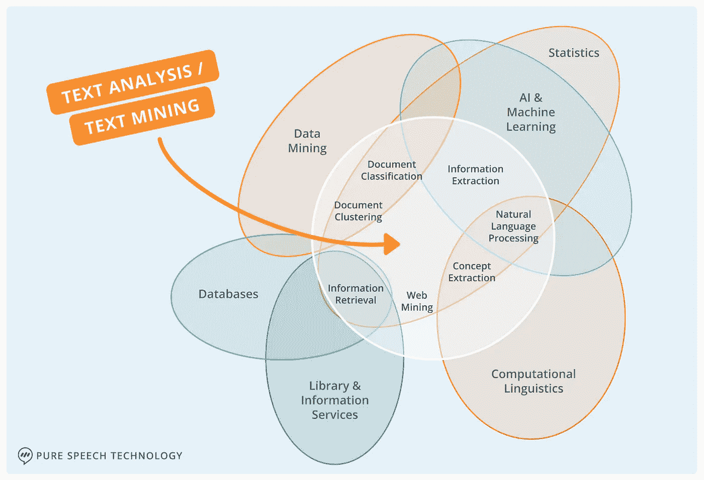

*维恩图显示了文本分析(或文本挖掘)与六个相关领域的交集:统计学、人工智能和机器学习、计算语言学、图书馆和信息服务、数据库和数据挖掘。来源:G.Miner 等人的* [*非结构化文本数据应用的实用文本挖掘和统计分析*](https://www.amazon.com/gp/product/012386979X/ref=as_li_qf_sp_asin_il_tl?ie=UTF8&tag=eldresinc-20&linkCode=as2&camp=1789&creative=9325&creativeASIN=012386979X) *图片由作者提供。*

# 文本分析、文本挖掘和文本分析有什么区别？

文本分析、文本挖掘和文本分析是同一个概念，通常可以互换使用。

# 文本分析和自然语言处理(NLP)有什么区别？

自然语言处理实际上是更广泛的文本分析领域的一个子集，这就是为什么这两者之间的差异往往难以理解。

先说文本分析和自然语言处理的定义。

文本分析是关于检查大量的文本，以产生新的和相关的见解。

自然语言处理(NLP)，或者更具体地说，自然语言理解(NLU)，帮助机器“阅读”、“理解”和复制人类语音。

在文本分析的过程中，使用各种分析方法来获取洞察，自然语言处理就是其中之一。NLP 实际上是文本分析、计算语言学、AI 和机器学习之间的交叉领域。

文本分析和 NLP 的关键区别在于每个领域的目标。

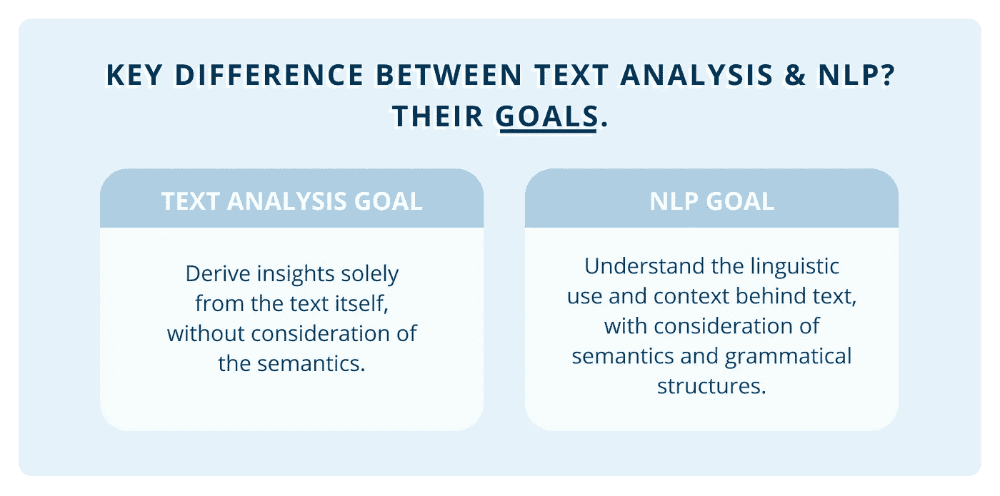

图片作者为[纯语音技术](https://www.purespeechtechnology.com/)

文本分析旨在仅从文本或单词本身获得质量洞察。不考虑文本中的语义。它回答的问题包括单词的频率、句子的长度以及单词的存在与否。

另一方面，自然语言处理旨在理解文本背后的语言使用和语境。这里分析语法结构和语义。它可以回答诸如句子背后的意图、人们的语言习惯等问题，甚至可以将你的电子邮件分类到主要、社交、推广或更新标签中。

这两者经常一起使用，以提供对人类交流的数字和上下文的理解。

那么，这些在商业中是如何使用的呢？下一节将涵盖文本分析的用例及应用。

# 文本分析有哪些应用和用例？

文本分析的应用非常广泛，可以应用于任何基于文本的数据存在的地方。

无论是客户反馈、电话记录还是冗长的反馈调查，文本分析都能帮助团队相对轻松地从文本数据中获得定量和定性的意义。

由于 80%的业务信息是非结构化的，主要是文本格式的，文本分析在业务的所有功能中都很有用。

让我们来看看其中的一些应用:

*   [客服团队文本分析](https://www.purespeechtechnology.com/text-analysis-text-analytics-text-mining/#title-TextAnalysisCustomerServiceTeams)
*   [营销团队的文本分析](https://www.purespeechtechnology.com/text-analysis-text-analytics-text-mining/#title-TextAnalysisMarketingTeam)
*   聊天机器人团队的文本挖掘

# 客户服务团队的文本分析

对于大量的客户通信，文本分析方法对于客户支持团队来说是非常有用的，这是显而易见的。

客户服务团队通常是最紧张的，在任何公司中都有一些最高的离职率，并且在任何给定的一天里都面临着处理大量客户互动的大量压力。

通过采用文本分析，服务团队可以自动化他们的许多日常任务，如研究、更新、路由，并减少在重复问题上花费的时间。相反，他们将在 NLP、机器学习和人工智能的支持下，增强自己超越 NPS、满意度和 CSAT KPI 的能力。

那么，文本分析在客户服务中到底是如何工作的呢？

*使用下面的目录跳到您感兴趣的用例，请继续阅读*🙂

**用例目录:客户服务团队的文本分析**

*   [客户对话分析](https://www.purespeechtechnology.com/text-analysis-text-analytics-text-mining/#title-customerConversationAnalyticsInsightsTextAnalysis)
*   [早期问题检测](https://www.purespeechtechnology.com/text-analysis-text-analytics-text-mining/#title-earlyDetectionHighValueCustomersProblemsCustomerService)
*   [自动发送票据](https://www.purespeechtechnology.com/text-analysis-text-analytics-text-mining/#title-ticketRoutingPrioritisationTaggingCustomerServiceTextAnalysis)
*   [自动确定票据优先级](https://www.purespeechtechnology.com/text-analysis-text-analytics-text-mining/#title-ticketRoutingPrioritisationTaggingCustomerServiceTextAnalysis)
*   [自动检票](https://www.purespeechtechnology.com/text-analysis-text-analytics-text-mining/#title-ticketRoutingPrioritisationTaggingCustomerServiceTextAnalysis)
*   [客户报告之声](https://www.purespeechtechnology.com/text-analysis-text-analytics-text-mining/#title-voiceOfCustomerReportingCustomerServiceTextAnalysis)
*   [简化知识库创建&报告](https://www.purespeechtechnology.com/text-analysis-text-analytics-text-mining/#title-simplifyKnowledgeBaseCreationCustomerServiceTextAnalysis)

## 客户对话分析和洞察

图片作者为[纯语音技术](https://www.purespeechtechnology.com/)

作为企业和客户之间沟通的主要媒介，客户对话，无论是来自电子邮件、支持票、社交媒体还是聊天，都为了解客户需求和促进业务增长提供了丰富的信息。

*   在这些对话中，蕴含着对以下问题的宝贵见解:
*   与他人相比，表现出色的客户服务代表使用了哪些技巧和短语来超越他们的 KPI？
*   过去 5 年中，每月最大的客户趋势是什么？
*   客户互动中最大限度留住客户的关键时刻在哪里？

所有与客户沟通的企业都可以获得这些知识。然而，没有多少人使用它，更不用说能够提取它。

这就是文本分析的魔力所在。

借助文本分析工具和技术，可以大规模消化和分析客户通信数据，从而为客户服务团队找到数据驱动的洞察力，以超越他们的 KPI。

想知道顶级代理商是如何留住高价值客户的吗？文本分析不是通过高价值客户和高 CSAT 分数进行过滤，然后查看他们成千上万的对话日志，而是为你做艰苦的工作。

[信息提取技巧](https://www.purespeechtechnology.com/?page_id=2424&preview_id=2424&preview_nonce=95c4ae5837&preview=true#)确定表现出色的代表在这些对话中有效使用的产品、服务、关键词和短语。[微观分类技术](https://www.purespeechtechnology.com/?page_id=2424&preview_id=2424&preview_nonce=95c4ae5837&preview=true#)揭示细节，让您找到使用这些短语或关键词产生客户满意结果的顺序或模式。

在没有大量资源或时间的情况下，客户服务团队可以找到成功的短语、关键词、语言、语调以及这些的组合来产生出色的结果。

## 早期发现高价值客户和客户问题

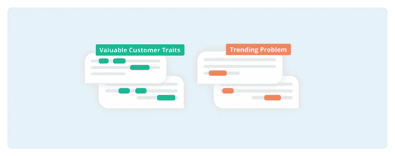

图片作者为[纯语音技术](https://www.purespeechtechnology.com/)

对于任何想要做好的企业来说，发现潜在客户或像你最好的客户一样的客户的能力是非常重要的。同样有用的是快速消除任何可能升级的潜在问题的能力。

你知道什么更好吗？早期发现的能力。

作为客户和公司之间的中介，客户服务团队最适合预先筛选有价值的客户和客户问题。

*   在对话中，您可以轻松获得见解并回答如下问题:
*   高价值线索和客户的沟通模式有哪些？
*   为了防止品牌受损，我们需要迅速关注哪些客户突破话题？
*   客户使用哪些渠道来解决不同的问题，我们如何转移资源来更好地管理他们的偏好？

在潜在的客户问题成为大问题之前检测它们是客户支持中文本分析的常见用例。简单的聚类和主题建模技术可以帮助团队实时解决这些问题。

但是，它如何识别有价值的客户呢？

传统上，确定理想客户是通过客户终身价值、购买频率、宣传等指标。但是这些并不是他们唯一共有的特征。

通过结合文本分析技术，你可以发现他们购买前的路径、联系偏好，甚至是他们沟通中单词和短语组合的相似序列。

这些都可以在客户服务工具和通信中找到。

使用微分类，细微的含义被附加到文本的小部分，让客户服务团队附加灵活而详细的数据解释，以获得广泛的分析结果。然后，聚类和主题建模技术使用这些全面的类别来发现趋势和关系，以揭示数据支持的见解，从而揭示有价值的客户识别模式。

剩下的是帮助锁定和优先考虑高价值客户以实现团队 KPI 的模式和识别特征。

这一过程会耗费大量资源，但有了文本分析，深入现有数据寻找关键绩效指标的洞察力不仅更快，而且更加准确和可扩展。

## 自动化票证路由、优先级划分和标记

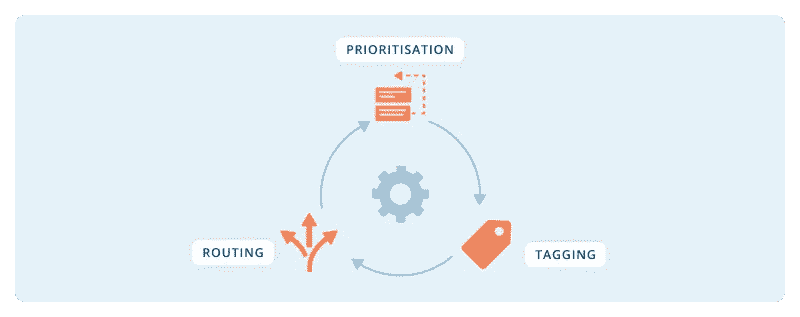

图片作者为[纯语音技术](https://www.purespeechtechnology.com/)

众所周知，交接对客户来说是令人沮丧的，但大多数人都忽略了它对客户服务团队来说同样令人烦恼。

效率低下或完全不正确的机票发送和优先顺序会导致客户不满，并对员工大打出手。强调尽可能多的快速浏览也不会促进有助于对话分析的高质量的互动后工作(总结时间)。

在这一点上，没有人是赢家。

*   输入，文本分析。以下是它在支持团队中帮助票证自动化的 3 种方式:
*   根据客户、问题和票证内容的紧急程度，自动将票证发送给适当的代表
*   根据自动检测到的紧急程度和情绪确定票证的优先级
    通过自动对话标记减少交互后的工作和对话分析

自动化票据路由和优先级的好处是显而易见的，但是自动化标记有必要吗？

绝对的。

自动标记有助于减少客户互动后耗时的包装时间。[全球平均包装时间为 6 分钟](https://www.ifc.org/wps/wcm/connect/3638f471-6270-484c-b99c-2c066b3f7b2c/Tool+4.+Measuring+Call+Center+Performance.pdf?MOD=AJPERES&CVID=mTVX17m#:~:text=The%20call%20wrap%20up%20time,metric%20is%20very%20industry%20specific.)。这相当于员工在每次谈话后花了 6 分钟的宝贵时间来完成数据输入和充当人工路由器。

更重要的是，标记是在对话分析中提取价值的关键基础。没有高质量和准确的标记，分析结果毫无意义。你会相信不准确和不完善的数据集能给你带来创收和令客户满意的见解吗？没想到会这样！

那么，它是如何工作的呢？

1.  **提取**。这种技术可以帮助您找到主题、关键字、实体，甚至紧急程度。分配标签。
2.  **分类**。这一步让您可以控制添加额外的公司或行业特定标签，以定制您想要查看的详细程度和价值。分配标签。
3.  **NLP 训练**标记数据，应用于过去和未来的对话。
4.  **监控标签**并根据需要添加新标签。

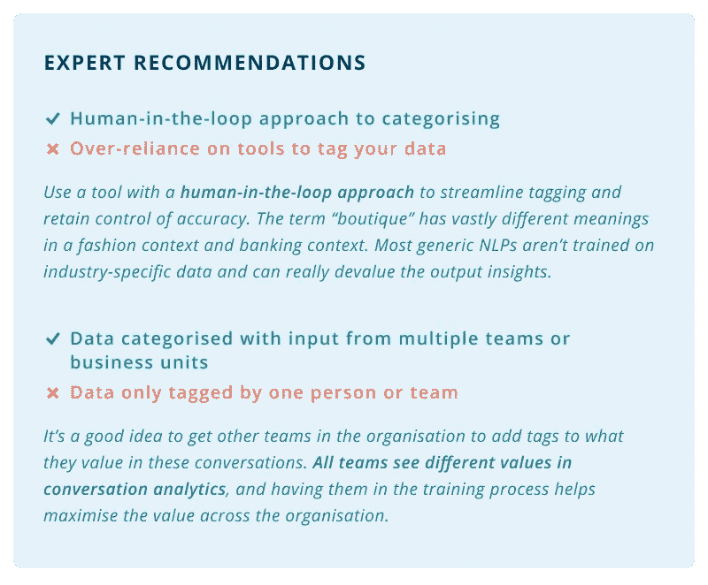

图片作者为[纯语音技术](https://www.purespeechtechnology.com/)

## 客户报告之声

图片作者为[纯语音技术](https://www.purespeechtechnology.com/)

自然，作为公司客户前线的团队，支持团队完全有能力代表公司的客户支持者。

但是，客户服务流程和员工的日常管理已经够具挑战性了。并不总是有足够的时间或资源致力于在对话中发现影响底线的见解。

这就是文本分析伸出援手的地方。

在对话中发现的一些客户意见包括:

*   潜在高价值客户表现出哪些沟通序列或模式？
*   下个季度客户最关心的 5 个问题是什么？
*   哪些问题或主题占用了团队的大量资源，但可以用自动化方法轻松回答？(如知识库或聊天机器人)

像 [Intent Manager](https://www.purespeechtechnology.com/intent-manager/) 这样的文本分析工具很大程度上为你运行分析。经过一些人为的培训，定制你希望你的团队或公司看到的价值后，它会自动挖掘洞察力。

代表你，它将不知疲倦地工作，提取有用的模式，序列和关系，你的客户。

**想报告顾客渴望看到什么并将为下一季度支付什么？**文本分析技术，如提取、分类和主题建模，可以结合使用，以找到热门主题，衡量他们的挫折感，并估计解决问题的价值。

**想通过引入自动化聊天机器人来处理第 1 级查询，从而提高服务团队的效率吗？**文本分析方法可以为您提供数据支持的信息，包括这些查询被提出的次数、被提出的频率以及解决这些查询需要多少次互动。更好的是，它为您提供了开始训练聊天机器人的主题数据，确切地说，使用什么样的训练数据，以及提供自动响应所需的所有信息。

那是为你准备的大部分工作。

这些见解可以导出到数据可视化平台，使报告更具美感，在会议中更容易理解。

文本分析简化了客户报告之声。它有助于创造可靠的、有数据支持的、直接来自客户的见解，当然也不会损害你作为公司客户代言人的地位😉。

# 简化知识库的创建和维护

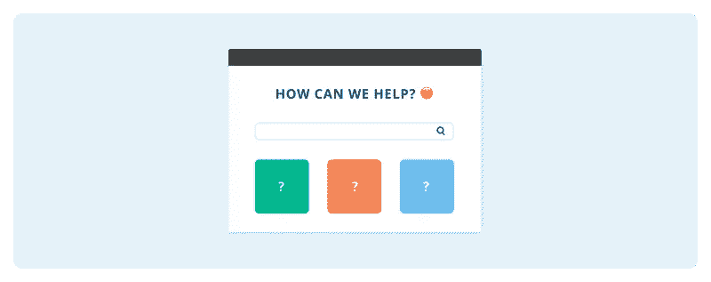

图片作者为[纯语音技术](https://www.purespeechtechnology.com/)

随着客户和员工将偏好转向自助服务，知识库变得越来越重要，支持团队也在尝试自动化不太复杂的任务，以腾出代理时间。

无论是内部的还是面向外部的，3 个关键因素决定了知识库的成功:

*   **相关性** —用户需要能够找到不需要代理干预的最常见、最紧迫的问题
*   **清晰** —用户需要理解定义、说明和解释来解决他们的问题
*   可搜索性 —用户需要能够轻松、轻松、快速地找到信息

虽然知识库的概念和好处很容易理解，但实际的创建和维护可能是一项艰巨的任务。

您知道客户询问的不需要代理帮助的三个主要话题吗？什么事？*伟大的*！

你知道这些话题中最常被问到的前 5 个问题吗？什么事？*太棒了*！

您知道顶级支持代表如何回应，以使客户理解并满意吗？*通常，这里有很多思考的面孔*🤔。

拥有这三个问题的答案对于创建一个对客户和公司都有益的知识库至关重要。

拥有相关的核心主题有助于用户找到答案。包括最常见的问题有助于减少代理在回答琐碎问题上花费的宝贵时间。用容易理解的语言和结构回答问题是知识库有用性的基础。

显然，这比大多数团队签约的工作量要多得多。

好消息是，整个过程可以通过文本分析加速！

*   通过对历史客户信息进行文本分析，您可以发现:
*   自助知识库中可以解决的核心客户主题
*   每个主题中最常见的问题
*   知识库中的答案应该如何措辞和组织，以便于理解

好奇文本挖掘如何帮助创建更好的知识库？作为一个例子，让我们看看它是如何对清晰度做出贡献的。

使用[信息提取](https://www.purespeechtechnology.com/?page_id=2424&preview_id=2424&preview_nonce=95c4ae5837&preview=true#)和[聚类技术](https://www.purespeechtechnology.com/?page_id=2424&preview_id=2424&preview_nonce=95c4ae5837&preview=true#)，我们能够找到客户用来描述他们的问题的方言。这允许团队使用他们理解和搜索的语言，帮助他们在知识库中找到答案。

此外，主题建模和微分类技术可以结合起来，以找到客户在询问特定主题时可能会有的相关查询，帮助创建导航链接和资源，以全面解决问题。

毕竟，如果用户只通过自助服务解决了一半的问题，他们仍然需要与人交谈来解决剩余的问题，这违背了自助服务渠道的目的。

# 营销团队的文本分析

在吸引、吸引和取悦客户的业务中，营销团队通过尽可能多地了解他们的线索和客户而受益匪浅。

营销需要知道他们正在经历什么样的痛苦，他们在哪里闲逛，为什么他们对你的产品或服务有某种感觉，等等。马上，一些问题浮现在脑海里:

*   你如何进入他们的思想和鞋子？和；
*   如何在不超载的情况下捕获这么多有价值的数据？

使用文本分析有助于缓解这两个问题引起的问题。

为了了解顾客的想法和感受，公司通常通过调查、采访和反馈的形式来了解他们。这些方法都很棒，但是通常被忽视的，实际上是以最公正和不受影响的形式呈现的反馈，是客户沟通。

客户沟通可以有各种形式——社交媒体评论、私人消息、支持票、电话记录、电子邮件和实时聊天——这只是基于文本的最大数据源中的几个例子。

给定足够的数据和一些 NLP 训练，文本分析帮助营销团队处理大量的通信，并将它们转化为对客户满意度和创收有用的见解。

至于文本挖掘如何帮助信息过载，它的优势在于它的机器学习和 AI 增强。持续不懈地，营销团队可以大规模地处理大量的通信，减少信息过载对有价值的洞察力提取的影响。

听起来很方便，对吧？

让我们更深入地研究一些有形的文本分析营销用例。

**用例目录:营销团队的文本分析**

*   [寻找新的品牌认知度和目标战略](https://www.purespeechtechnology.com/text-analysis-text-analytics-text-mining/#title-MarketingTargetingStrategyTextAnalysis)
*   [早期客户趋势检测](https://www.purespeechtechnology.com/text-analysis-text-analytics-text-mining/#title-EarlyCustomerTrendDetectionTextAnalysisMarketing)
*   [抓住潜在客户机会](https://www.purespeechtechnology.com/text-analysis-text-analytics-text-mining/#title-LeadCustomerMarketingOpportunitiesTextAnalysis)
*   [获取定量和定性营销结果的整体报告](https://www.purespeechtechnology.com/text-analysis-text-analytics-text-mining/#title-MarketingReportQuantitativeQualitativeTextAnalysis)

## 寻找新的品牌意识和目标战略

图片作者为[纯语音技术](https://www.purespeechtechnology.com/)

利用随时可用的历史客户互动，文本分析技术可用于提取有价值的见解，以新的方式锁定客户并提高意识。

客户互动的发生是因为客户希望分享一个观点，无论是投诉、称赞、意见还是请求。这里重要的一点是，他们已经想尽办法去接触公司，以表明自己的观点。

这使得它们对营销人员来说很有价值，可以洞察他们客户的世界——他们担心什么，体验什么，感觉什么，计划用你的产品或服务实现什么。

遗憾的是，没有多少公司认为这是一种绝妙的营销手段。

部分问题源于交互量的巨大。从 10 多个渠道的数百万条历史信息中找出联系和模式是非常困难的。此外，它的定性性质也没有帮助，因为大多数公司更喜欢量化他们的报告和成就指标。

这就是文本挖掘变得非常方便的地方。它在定量和定性两个层面上进行报告，并且很容易扩展到处理数百万次交互。

文本分析用于客户沟通，以获得营销见解，可以回答以下问题:

*   客户问题和我们传达的信息之间是否有误解，我们如何使用他们的话？
*   有多少线索通过特定渠道、媒体或影响者接触到我们的品牌？他们对品牌的加权看法是否证明了对渠道、媒体或影响者的投资或进一步投资是合理的？
*   在客户的整个生命周期中，客户满意度在互动中的演变是怎样的？我需要瞄准哪一点才能赢回他们？

## 早期客户趋势检测

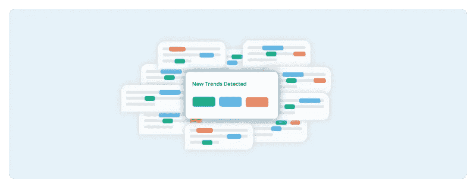

图片作者为[纯语音技术](https://www.purespeechtechnology.com/)

对营销团队来说，掌握客户趋势一直很重要。如今保持领先的问题是要跟上大量的新事物。

下一个新频道是什么？谁是最新的影响者？新的线索从何而来？

幸运的是，在您的交流中，现有客户和潜在客户已经可以回答其中的一些问题。

找出他们是通过什么渠道了解你的品牌的，哪些影响者转变了他们对你的产品的信任，以及他们以前在哪里听说过你的服务，这有助于你找到其他像他们一样的人。

这并不是建议对你所有的潜在客户和客户进行大规模采访，而是要挖掘你过去的所有互动，其中大部分信息可能已经存在。

*   通过使用文本分析，营销团队可以回答如下问题:
*   我的客户和潜在客户有兴趣尝试哪些渠道？我的品牌出现在那里有意义吗？
*   我的客户信任哪些有影响力的人，我如何定位品牌才能与之保持一致？
*   我的客户对什么话题感兴趣或关注？他们希望如何解决这个问题？

挖掘过去和正在进行的互动有助于营销团队监控客户聊天，并领先于新出现的话题。这种在客户洞察方面的领先优势使营销能够专注于制定客户支持和数据驱动的营销决策，而不会被信息和分析所淹没。

## 抓住潜在客户机会

图片作者为[纯语音技术](https://www.purespeechtechnology.com/)

优秀的营销团队能够发现一些线索转化为客户的例子。优秀的营销团队会在这些阶段找到线索，从而优化转化率。世界级的营销团队？他们发现标志着潜在客户向客户转化的模式和行为，这样他们就可以一路培养下去。

你是如何从优秀的*走向世界级的*？

最切实的方法之一(显然是有数据支持的😉)是文本分析。也就是说，分析客户文本数据，如对话、社交媒体互动和支持票，以确定处于考虑阶段的人们共享的沟通模式。

这可能是他们使用的沟通渠道的模式，他们问的问题的类型，甚至是他们在互动中选择单词的顺序。

文本分析有助于在您的客户的沟通风格中找到这些独特的细微差别和模式，以更好地识别处于甜蜜转换点的未来线索。

*   文本分析可以帮助营销人员回答的其他一些问题包括:
*   符合营销资格的销售线索会问什么样的问题和回答才能真正将其归类为符合销售资格？
*   是否存在一种识别潜在高价值客户的沟通模式？
*   在互动中，我使用哪一组品质来评估销售线索的潜在客户终身价值？

文本分析消除了人类在消化所有这些对话以提取潜在价值标识符的过程中产生的偏见、错误和不可避免的令人兴奋的无聊感。剩下的是营销团队可以执行的可操作的见解，充分利用潜在客户机会。

# 定量和定性的营销报告

图片作者为[纯语音技术](https://www.purespeechtechnology.com/)

客户体验的营销报告通常以量化数字为中心，例如:打开率、参与度、流失率和保留率。众所周知，这些指标通常无法捕捉客户体验及其满意或不满意的全貌。

这一差距是由于缺乏对定性见解的报告而造成的。这些见解来自非结构化数据源的内容，如客户对话、反馈和电话记录。大多数公司只获取这些数据来源的数字:票证数量、问题解决时间、电子邮件打开率、参与比例等。

更重要的是，尤其是在衡量顾客对品牌的意见和满意度时，这些互动的内容。当客户表达他们对某个品牌的快乐时，真正有意义的是他们在通过文字表达自己的观点，而不是简单地在帖子上一个“赞”。

试图获取这些定性来源的问题在于，人们认为无法对其进行衡量。营销报告由数字主导，如果用其他方式表达，会降低对营销团队工作的信任。

那么，你如何抓住营销团队在客户体验方面的全部出色工作，同时确保你用数字传达它的重要性？

答案？文本分析。

借助文本分析，可以捕捉到以前仅在定性洞察领域出现的一些要点:

*   是否有我们以前没有考虑过的“顾客表达的使用产品 X 的动机”的集群？
*   谈论产品 X 时使用的情感语言与之前在过去的互动中表达负面情绪的客户之间有关系吗
*   客户在谈论产品 X 时，表达情感的话语有哪些？

文本分析从非结构化的客户数据中获取定量和定性的见解。在获取定性数据时，需要采用定量方法来寻找能够揭示数据内容的模式和序列。

为了说明这一点，假设我们想报告本季度尝试的新的客户启发的目标定位策略。在对社交媒体评论进行文本分析后，发现许多客户使用以下顺序:*“人”+我们需要这个是为了/我们需要得到这个是为了+“目的”*。在评论中，这可能看起来像: *@monica 我们需要在这上面认识一些新的供应商*。

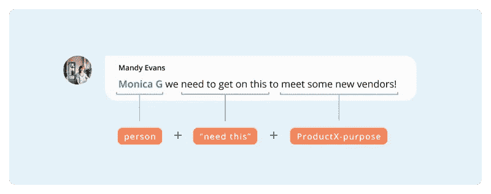

图片作者为[纯语音技术](https://www.purespeechtechnology.com/)

像 [Intent Manager](https://www.purespeechtechnology.com/intent-manager/) 这样的文本分析工具在数以千计的社交媒体评论和多个渠道中检测这一序列，将主要动机归为一类，作为了解潜在客户为何对您的产品感兴趣的关键因素。然后，这可以用于创建新的目标活动，或提出客户数据支持的新战略提案。

在不需要人工干预或过多资源的情况下，文本分析一旦得到训练，就可以让营销团队更全面地捕捉他们的劳动成果进行报告，并做出更好的数据驱动、客户支持的营销决策

# 聊天机器人团队的文本分析

聊天机器人团队面临许多独特的挑战。

在许多商业系统中[过时的流程和协议](https://www.purespeechtechnology.com/conversational-ai/pros-and-cons-of-implementing-a-voice-assistant/)的背景下，在[对话式人工智能](https://www.purespeechtechnology.com/conversational-ai/a-beginners-guide-to-conversational-ai/)中追求创新的同时，他们必须[最大化商业价值](https://www.purespeechtechnology.com/conversational-ai/3-lessons-conversational-ai-bots/)，鼓励采用并解决客户数据的混乱，同时仍然驾驭技术的复杂性。

毫无疑问，对于一项迅速成为现代商业必需品的技术来说，这是最艰难的工作之一。

幸运的是，文本分析有助于应对这些挑战。其扩展模式和洞察力提取的能力有助于聊天机器人团队在整个组织中加强其工作的价值，并解决聊天机器人特有的问题，如意图冲突。这些技术对于使用企业聊天机器人的团队特别有用，因为企业聊天机器人中的数据有 100，000 或数百万。

让我们通过一些用例来了解文本分析如何帮助聊天机器人团队。

**用例目录:客户服务团队的文本分析**

*   [规模聊天机器人跨组织价值](https://www.purespeechtechnology.com/text-analysis-text-analytics-text-mining/#title-crossOrganisationalChatbotTextAnalytics)
*   [发现影响深远的自动化机会](https://www.purespeechtechnology.com/text-analysis-text-analytics-text-mining/#title-chatbotAutomationopportunitiesTextAnalysis)
*   [解决令人沮丧的意向冲突](https://www.purespeechtechnology.com/text-analysis-text-analytics-text-mining/#title-IntentClashesChatbotsTextAnalysis)

## 衡量聊天机器人的跨组织价值

图片作者为[纯语音技术](https://www.purespeechtechnology.com/)

聊天机器人通常一开始是为专门用途而构建的，当需要为其他团队或用例改变用途时，团队会发现很难证明相同的价值或获得相同的采用。因此，许多团队努力为整个组织的关键商业价值做出贡献，而不仅仅是一个固定的用途或一小组目标。

文本分析通过[微分类](https://www.purespeechtechnology.com/?page_id=2424&preview_id=2424&preview_nonce=95c4ae5837&preview=true#)或“标记”方法，帮助组织中的其他团队了解聊天机器人的价值，能够根据其特定业务部门的需求对数据进行个性化解释。

为了说明这个例子，让我们假设一个客户在聊天机器人交互中响应，“*我永远无法在 Slack 消息*中找到我需要的文件”。根据您所在的团队，您将分配不同的下一个最佳行动“标签”。

*   客户服务团队可能会标记:“*在知识库*中添加更全面的操作方法搜索”。
*   开发团队然后可以标记:“*为下一次更新*优先改进可搜索性”。
*   营销团队可能会标记:“*将此作为改进搜索功能更新的客户启发信息*”。

图片作者为[纯语音技术](https://www.purespeechtechnology.com/)

通过让团队能够根据他们的特定需求和目标定制价值(以及“下一个最佳行动”)，聊天机器人的感知价值和采用率自然会增加。更好的是，文本分析不需要聊天机器人团队的广泛协调，而是授权其他团队从一个民主化客户数据之声的渠道创造价值。

此外，随着团队将他们的解释添加到数据中，可以绘制更复杂的交叉分析和模式。结合起来，他们提供了更多的机会来寻找进一步的自动化机会，创收的想法和客户满意的战略。

## 识别高影响力的自动化机会

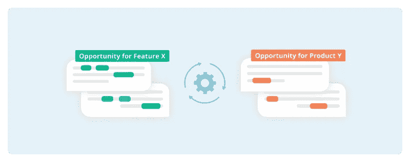

图片作者为[纯语音技术](https://www.purespeechtechnology.com/)

作为聊天机器人团队，你总是在寻找用智能自动化技术优化业务流程的方法。问题是，它们值得投资、时间和资源吗？

为什么不征求一些客户的意见呢？他们告诉你他们将如何花费更多，如何感到满意，如何推荐他人。你所要做的就是倾听。

借助文本分析，您的团队可以积极听取大量客户意见，包括支持票、反馈、社交媒体评论和电子邮件，而无需进行监控。

分析客户互动有助于发现以下自动化机会:

*   客户经常提到或要求
*   当被客户提及时，会联想到负面情绪
*   基于您选择的标准或过滤器的优先级

无论您希望了解哪些自动化机会将产生最大影响，还是了解对特定产品功能的关注，文本分析都有助于整理客户输入，为您的团队提供数据驱动、客户支持的见解，以便采取行动。

结果也可以根据您团队的目标进行定制。通过 NLP 的人在回路训练，你的团队可以定制主题聚类以适应焦点或目的的变化。

## 解决令人沮丧的意图冲突

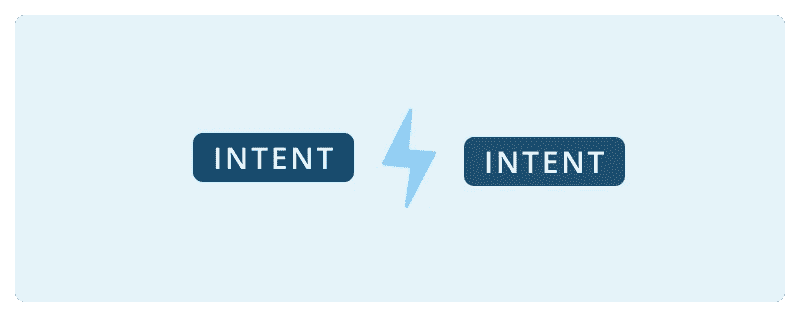

图片作者为[纯语音技术](https://www.purespeechtechnology.com/)

意图冲突(也称为双重意图或意图冲突)是令人讨厌的聊天机器人问题，源于聊天机器人旅程开始时不正确的 NLP 训练。通常，这源于 T4 没有有效地管理聊天机器人收到的大量问题。

它们很难检测，更难确定如何修复以及在哪里修复，这使得修复成为一个成本高昂且耗费大量资源的问题。

有了像 [Intent Manager](https://www.purespeechtechnology.com/intent-manager/) 这样的文本分析工具，聊天机器人团队可以:

*   快速识别冲突意图
*   查明导致问题的训练短语
*   在潜在的意图冲突发生之前对其进行监控

无需投入大量资源来回溯训练，然后手动重新分类短语，文本分析技术可以帮助聊天机器人团队快速发现意图冲突，并提供快速解决冲突的解决方案。

# 有哪些文字分析的软件或工具？

在我们深入研究这些工具之前，这里有 3 个问题是你在为你的企业选择文本挖掘工具时应该问自己的。

**1。我希望看到什么样的商业价值？**

不言而喻，对于一个文本分析软件来说，最重要的标准应该是它获取商业价值的能力。洞察力不应该只停留在最“常见”或“趋势”的方面，而应该以潜在的业务目标作为过滤器进行分析。一个好的工具需要让用户定制过滤器。

**2。我需要考虑我的文本数据的哪些特征？**

为您的特定用例找到最佳软件或工具在很大程度上取决于:

*   文本类型
*   文本量
*   您希望在结果中看到的详细程度
*   有多少已经被人类分类或“标记”

根据这些因素，最适合您的用例的文本分析技术的类型会有所不同，每种技术的微小变化都会极大地影响您应该使用的技术。

**3。它在多大程度上符合我的技术环境？虽然总是建议为工作寻找最好的工具，但当你有非常具体的技术组合时，这有时是不可避免的。在这种情况下，您需要考虑文本分析工具的集成情况。理想情况下，找到一个与技术无关的工具，并与您的堆栈配合良好。**

这些是你应该问自己的第一个问题。这里有一个链接，链接到选择 NLP 工具的考虑事项的更全面的列表。

[**相关:会话分析的 3 个阶段，简化。**](https://www.purespeechtechnology.com/conversational-ai/customer-conversation-analysis-simplified-3-tools-to-do-it-all/)

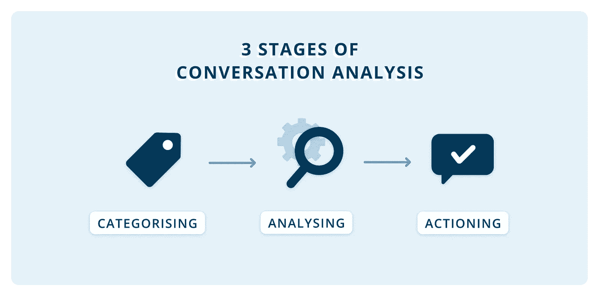

图片作者为[纯语音技术](https://www.purespeechtechnology.com/)

说完了，我们再来看一些文本分析工具，按[初级](https://www.purespeechtechnology.com/text-analysis-text-analytics-text-mining/#title-BeginnerTextAnalyticsTool)、[中级](https://www.purespeechtechnology.com/text-analysis-text-analytics-text-mining/#title-IntermediateTextAnalyticsTools)和[高级](https://www.purespeechtechnology.com/text-analysis-text-analytics-text-mining/#title-AdvancedTextAnalyticsTools)三个级别的文本分析进行拆分。

## **初学者三重奏**

*   您的 CRM
*   擅长
*   社交倾听工具

你会惊讶地发现，有多少大公司仍在混合使用他们当前的工具和 Microsoft Excel 来分析沟通。毫无疑问，这是一种开始分析的快速方法，但从长期或中期来看，它是不可扩展的。

如果你正处于这个阶段，建议你快速了解你想从文本分析中得到什么，以及你需要什么分析工具。然后，尽快升级到该工具。好处无穷。从[文本分析流程的所有阶段节省了数百个小时](https://www.purespeechtechnology.com/conversational-ai/customer-conversation-analysis-simplified-3-tools-to-do-it-all/)，以及更快的业务响应以降低成本或创造收入。

## **“最佳实践”工具**

*   [Google NLP 产品— AutoML 和自然语言 API](https://cloud.google.com/natural-language)
*   [亚马逊领悟](https://aws.amazon.com/comprehend/)
*   [沃森自然语言理解](https://www.ibm.com/cloud/watson-natural-language-understanding)
*   [Azure 文本分析 API](https://azure.microsoft.com/en-in/services/cognitive-services/text-analytics/#overview)

许多大型组织在他们的对话分析中使用这些工具，这是正确的。它们很简单，由通用的 NLP 驱动，适用于所有部门、行业和团队。

然而，其中许多产品的一个大缺点是，它们大多能很好地与它们的产品套件配合使用，并且需要昂贵的定制、资源和培训来与企业环境中的其他技术相结合。然后，东西会很快变贵。

在分析深度方面，他们能够很好地挑选出话语中的元素，但往往过于笼统，无法获得更深层次的商业价值。

不要相信我的话，你可以在谷歌和 Azure 的登陆页面上试试它们的演示。插入一段对话，自己看看结果。他们能在多大程度上提取相关和具体的信息来推动您的组织采取富有成效的行动？

## **“深潜”工具**

*   [纯语音技术意图管理器](https://www.purespeechtechnology.com/intent-manager/)
*   [查特米尔](https://chattermill.com/)
*   [沃里克分析公司的预测](https://warwickanalytics.com/predicx/)

这些工具为您的客户沟通提供了更多的内容和意义。他们试图理解对话、所有的模式和细微差别，以便提供有价值的、可操作的和有意义的见解。

纯语音技术专家喜欢这些工具的另一个原因是因为它们很灵活。他们不依赖于某一套特定的产品。企业已经拥有如此复杂的技术环境。没必要再加一个和别人玩不好的工具。

# 外卖食品

在我们这个时代，企业和客户之间的交流量不可避免地在增加。能够管理大量信息并获得业务驱动的价值正成为一家成功或失败公司的明显标志。

因此，文本分析工具正迅速成为任何有前途的企业的必备工具。

它提供了一种工具，将直接来自客户的见解民主化到业务的所有部分。无论是营销、客户支持、产品还是创新团队，不可否认的是，直接的客户洞察可以对团队的方向和底线盈利能力产生影响。

如果你对对话式 AI 的文本分析有疑问，[给我们发消息](https://www.purespeechtechnology.com/contact/)！教育是 Pure Speech Technology 的重要支柱，我们很乐意回答您的文本分析问题。