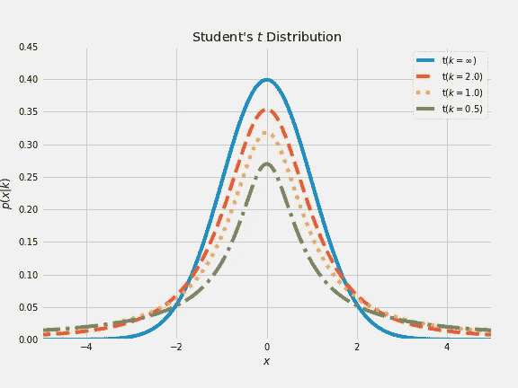

# A/B 测试指南——如何制定、设计和解释

> 原文：<https://towardsdatascience.com/a-guide-to-a-b-testing-how-to-formulate-design-and-interpret-f820cc62e21a?source=collection_archive---------8----------------------->

## 用 Python 实现


[来源](https://www.pexels.com/photo/concrete-road-between-trees-1563356/)

网络世界给了我们一个很好的机会来进行实验和科学地评估不同的想法。由于这些实验是数据驱动的，没有为直觉或直觉提供空间，我们可以在变化及其对用户行为的影响之间建立因果关系。利用这些实验，许多组织可以通过避免所谓的[河马效应](https://www.forbes.com/sites/bernardmarr/2017/10/26/data-driven-decision-making-beware-of-the-hippo-effect/)来了解他们客户的喜好和偏好😅

A/B 测试是测试新产品或新功能的常用方法，尤其是在用户界面、营销和电子商务方面。A/B 测试的主要原理是将用户分成两组；向**控制组**展示现有产品或功能，向**实验组展示新产品或功能。**最后，评估两组用户的不同反应，决定哪个版本更好。尽管 A/B 测试是在线业务的常见做法，但从建立实验到正确解释结果，很多事情很容易出错。

在本文中，您将发现如何设计一个健壮的 A/B 测试，为您提供可重复的结果，A/B 测试中需要额外注意的主要陷阱是什么，以及如何解释结果。

您可以在我的 GitHub 上查看 [Jupyter 笔记本](https://github.com/Idilismiguzel/data_analysis/blob/main/ab_testing/AB_testing.ipynb)以获得完整的分析。


[来源](https://unsplash.com/photos/fGXh4-axxHA)

在深入探讨 A/B 测试之前，我们先来回答以下问题。

## **1。可以考什么？**

可见和不可见的变化都可以用 A/B 测试来测试。**可见变化**的例子可以是用户界面的新增内容、设计和布局的变化或标题信息。一个非常受欢迎的例子是[谷歌的](https://www.nytimes.com/2009/03/01/business/01marissa.html) 41(是，不是 2)种不同蓝色阴影实验，他们随机向每 2.5%的用户展示一种蓝色阴影，以了解哪种颜色阴影赢得更多点击。**不可见变化**的例子可以是页面加载时间或测试不同的推荐算法。一个流行的例子是[亚马逊的](http://radar.oreilly.com/2008/08/radar-theme-web-ops.html) A/B 测试显示，页面加载时间每增加 100 毫秒，销售额就会下降 1%。

## **2。什么不能考？**

新体验不适合实施 A/B 测试。因为一个新的体验可以表现出 [**厌恶变化**](https://en.wiktionary.org/wiki/change_aversion) 的行为，用户不喜欢变化，更喜欢坚持旧版本，或者它可以表现出 [**新奇效果**](https://en.wikipedia.org/wiki/Novelty_effect) 用户感到非常兴奋，想要测试出一切。在这两种情况下，定义比较的基线和决定测试的持续时间是困难的。

## **3。我们如何选择指标？**

度量选择需要同时考虑灵敏度和稳健性。**敏感性**意味着指标应该能够捕捉到变化，而**稳健性**意味着指标不应该因为不相关的影响而改变太多。例如，大多数情况下，如果指标是一个“平均值”，那么它对异常值很敏感，但不够稳健。如果指标是“中值”，那么它是稳健的，但对小组变化不敏感。

为了在度量选择中考虑灵敏度和鲁棒性，我们可以在创建控制和实验样本时应用过滤和分割。过滤和细分可以基于用户人口统计(即年龄、性别)、平台语言、互联网浏览器、设备类型(即 iOS 或 Android)、群组等。

## 4.管道是什么？

*   阐明假设
*   设计实验
*   收集数据
*   推论/结论

A/B 测试的过程始于一个假设。基线假设，或者换句话说，**零假设**，假设处理是相等的，并且由于偶然性，对照组和实验组之间的任何差异是*。**替代假设**假设零假设是错误的，控制组和实验组的结果比随机产生的结果更加不同。A/B 检验旨在以这样一种方式检验假设，即两组之间观察到的差异应该是由于随机的机会或由于两组之间的真实差异。提出假设后，我们收集数据并得出结论。**结果的推断**反映了应用从实验样本中得出的结论的意图，这些结论适用于整个群体。*

## 让我们看一个例子...

假设您正在运行一个 UI 实验，想要了解初始布局和新布局的转换率之间的差异。(假设您想了解将“购买”按钮的颜色从红色改为蓝色的影响🔴🔵)

在这个实验中，零假设假设转换率相等，如果有差异，这只是由于*的机会因素*。相比之下，另一个假设假设转换率之间存在统计学上的显著差异。

> 零假设-> Ho : CR_red = CR_blue
> 
> 另类假设-> H1 : CR_red ≠ CR_blue

在制定假设并进行实验后，我们在[列联表](https://en.wikipedia.org/wiki/Contingency_table)中收集了以下数据。


《出埃及记》测试结果:控制组(CG)看到初始布局，实验组(EG)看到新的布局

```
The conversion rate of CG is: 150/150+23567 = 0.632%The conversion rate of EG is: 165/165+23230 = 0.692%From these conversion rates, we can calculate the relative uplift between conversion rates: (0.692%-0.632%)/0.632% = 9.50%
```

从上面截取的代码中可以看出，改变布局将转换率提高了 0.06 个百分点。但这是偶然的还是彩色 change❔的成功

我们可以通过以下两种方式来分析结果:

## **1。应用统计假设检验**

使用统计显著性检验，我们可以衡量收集的数据是否显示了比可能产生的结果更极端的结果。如果结果超出了机会变异，那么它在统计上是显著的*。*在本例中，我们有偶然性数据格式的分类变量，它们遵循[伯努利分布](https://en.wikipedia.org/wiki/Bernoulli_distribution)。伯努利分布有一个概率为 1，一个概率为 0。在我们的示例中，转化率=1，无转化率=0。考虑到我们使用转换率作为度量，这是一个遵循伯努利分布的分类变量，我们将使用 [**卡方检验**](https://en.wikipedia.org/wiki/Chi-squared_test) 来解释结果。

卡方检验假设分类变量的观察频率与预期频率匹配。它计算具有卡方分布的检验统计量(Chi ),如果预期频率和观察频率相同，则解释为拒绝或未能拒绝零假设。在本文中，我们将使用`scipy.stats`包来实现统计功能。


卡方分布的[概率密度函数](https://en.wikipedia.org/wiki/Chi-square_distribution)随**自由度(df)** 变化，自由度(df)取决于列联表的大小，在本例中计算为`df=(#rows-1)*(#columns-1)`df = 1。

使用 Python 解释测试结果我们需要知道的关键术语是 [**p 值**](https://en.wikipedia.org/wiki/P-value) 和 [**alpha**](https://en.wikipedia.org/wiki/Statistical_significance) **。** P 值是在假设零假设正确的情况下，获得至少与实际观察到的结果一样极端的检验结果的概率。p 值是测试的结果之一。Alpha 也称为统计显著性水平，是犯**I 型错误**的概率(拒绝实际为真的零假设)。犯第二类错误(当零假设实际上为假时，未能拒绝零假设)的概率被称为 beta，但这超出了本文的范围。一般来说，α取 0.05，表示当没有实际差异时，得出组间存在差异的风险为 5%。

就 p 值和选定的显著性水平(α)而言，测试可解释如下:

*   **如果 p 值<=α**:显著结果，拒绝零假设
*   **如果 p 值>α**:不是显著结果，不要拒绝零假设

我们还可以通过使用测试统计和临界值来解释测试结果:

*   **如果检验统计量> =临界值**:显著结果，拒绝零假设
*   **如果检验统计量<临界值**:没有显著结果，不要拒绝零假设

```
### chi2 test on contingency table
print(table)
alpha = 0.05
stat, p, dof, expected = stats.chi2_contingency(table)### interpret p-value
print('significance=%.3f, p=%.3f' % (alpha, p))
if p <= alpha:
    print('Reject null hypothesis)')
else:
    print('Do not reject null hypothesis')

### interpret test-statistic
prob = 1 - alpha
critical = stats.chi2.ppf(prob, dof)
print('probability=%.3f, critical=%.3f, stat=%.3f' % (prob, critical, stat))
if abs(stat) >= critical:
    print('Reject null hypothesis)')
else:
    print('Do not reject null hypothesis')
```

> [[150 23717]
> 【165 23395]]
> 显著性=0.050，p=0.365
> 不拒绝零假设
> 概率=0.950，临界=3.841，统计=0.822
> 不拒绝零假设

从结果中可以看出，我们没有拒绝零假设，换句话说，转换率之间的正相对差异并不显著。

## **2。执行排列测试**

排列测试是我最喜欢的技术之一，因为它不要求数据是数字或二进制的，样本大小可以相似或不同。此外，不需要关于正态分布数据的假设。

置换意味着改变一组值的顺序，置换测试所做的是组合两组的结果，并通过从组合的组中随机抽取组(等于实验组的样本大小)并分析它们彼此之间的差异来测试零假设。用户决定多少次，测试就重复做多少次(比如说 1000 次)。最后，用户应该将实验组和对照组之间观察到的差异与置换差异集进行比较。如果观察到的差异位于置换差异的集合内，我们不拒绝零假设。但是，如果观察到的差异位于最大排列分布之外，我们拒绝零假设，并得出结论，因为 A/B 测试结果在统计上是显著的，而不是由于偶然。

```
### Function to perform permutation test
def perm_func(x, nA, nB):
   n = nA + nB
   id_B = set(random.sample(range(n), nB))
   id_A = set(range(n)) — id_B
   return x.loc[idx_B].mean() — x.loc[id_A].mean()### Observed difference from experiment
obs_pct_diff = 100 * (150 / 23717–165 / 23395)### Aggregated conversion set
conversion = [0] * 46797
conversion.extend([1] * 315)
conversion = pd.Series(conversion)### Permutation test
perm_diffs = [100 * perm_fun(conversion, 23717, 23395)
    for i in range(1000)]### Probability
print(np.mean([diff > obs_pct_diff for diff in perm_diffs]))
```

> 0.823

这个结果告诉我们，大约 82%的情况下，我们会随机得出实验结果。

此外，我们可以绘制排列测试差异的直方图，并突出显示观察到的差异所在。

```
fig, ax = plt.subplots(figsize=(5, 5))
ax.hist(perm_diffs, rwidth=0.9)
ax.axvline(x=obs_pct_diff, lw=2)
ax.text(-0.18, 200, ‘Observed\ndifference’, bbox={‘facecolor’:’white’})
ax.set_xlabel(‘Conversion rate (in percentage)’)
ax.set_ylabel(‘Frequency’)
plt.show()
```


带有观察到的差异线的置换差异直方图

如图所示，观察到的差异位于大多数置换差异内，支持卡方检验的“不拒绝零假设”结果。

## 让我们看另一个例子..

假设我们使用平均会话时间作为度量来分析 A/B 测试的结果。我们的目标是了解页面的新设计是否会引起用户更多的关注，并增加他们在页面上的停留时间。
代表不同用户 id 的前几行如下所示:


数据样本

```
### Average difference between control and test samples
mean_cont = np.mean(data[data["Page"] == "Old design"]["Time"])
mean_exp = np.mean(data[data["Page"] == "New design"]["Time"])
mean_diff = mean_exp - mean_cont
print(f"Average difference between experiment and control samples is: {mean_diff}")### Boxplots
sns.boxplot(x=data["Page"], y=data["Time"], width=0.4)
```

> 实验样品和对照样品之间的平均差异为:22.85


同样，我们将从以下两个方面分析结果:

## 1.应用统计假设检验

在本例中，我们将使用[t-检验(或学生的 t-检验)](https://en.wikipedia.org/wiki/Student%27s_t-test)，因为我们有数字数据。t-检验是最常用的统计检验之一，在这种检验中，检验统计量在零假设下遵循学生的 *t* 分布。在样本量较小且总体标准偏差未知的情况下，估计正态分布总体的均值时使用 t 分布。



t 分布像正态分布一样呈对称的钟形，但尾部更厚更长，这意味着它更容易产生远离平均值的值。如图所示，样本量越大，t 分布就越正常。

在此分析中，我们将使用`scipy.stats.mstats.ttest_ind`来计算两个独立样本平均值的 t 检验。这是对两个独立样本具有(预期的)相同平均值的零假设的双边检验。作为参数，我们必须设置`equal_var=False`来执行 Welch 的 t-检验，该检验不假设控制样本和实验样本之间的总体方差相等。

```
### t-Test on the data
test_res = stats.ttest_ind(data[data.Page ==  "Old design"]["Time"], 
                      data[data.Page == "New design"]["Time"],
                      equal_var=False)
print(f'p-value for single sided test: {test_res.pvalue / 2:.4f}')
if test_res.pvalue <= alpha:
    print('Reject null hypothesis)')
else:
    print('Do not reject null hypothesis')
```

> 单侧检验的 p 值:0.1020
> 不要拒绝零假设

从结果中可以看出，我们没有拒绝零假设，这意味着实验样本和对照样本之间的正平均差异不显著。

**2。执行排列测试**

正如我们在前面的例子中所做的，我们可以通过迭代 1000 次来执行排列测试。

```
nA = data[data.Page == 'Old design'].shape[0]
nB = data[data.Page == 'New design'].shape[0]perm_diffs = [perm_fun(data.Time, nA, nB) for _ in range(1000)]larger=[i for i in perm_diffs if i > mean_exp-mean_cont]
print(len(larger)/len(perm_diffs))
```

> 0.102

这个结果告诉我们，大约有 10%的时间，我们会随机地得到实验结果。

```
fig, ax = plt.subplots(figsize=(8, 6))
ax.hist(perm_diffs, rwidth=0.9)
ax.axvline(x = mean_exp — mean_cont, color=’black’, lw=2)
ax.text(25, 190, ‘Observed\ndifference’, bbox={‘facecolor’:’white’})
plt.show()
```


带有观察到的差异线的置换差异直方图

如图所示，观察到的差异位于大多数置换差异内，支持 t 检验的“不拒绝零假设”结果。

## 奖金

1.  为了设计一个稳健的实验，强烈建议确定**不变检查**的指标。这些度量标准不应该在控制组和实验组之间改变，并且可以用于健全性检查。
2.  在 A/B 检验中，重要的是确定代表总体的实验组和对照组的样本量。在这样做的时候，我们需要注意两点:**随机性**和**代表性**。样本的随机性是达到无偏结果的必要条件，代表性是捕捉所有不同用户行为的必要条件。
3.  [在线工具](https://www.evanmiller.org/ab-testing/sample-size.html)可用于计算实验所需的**最小样本量**。
4.  在运行实验之前，最好确定**期望升程值**。有时，即使测试结果在统计上有意义，也可能没有实际意义。如果变革不能带来预期的提升，组织可能不喜欢执行变革。
5.  如果您正在处理一个样本数据集，但您希望了解人口行为，您可以在分析中包含**重采样方法**。你可以阅读我的文章[推论分析的重采样方法](/resampling-methods-for-inference-analysis-e75fecfefcb2)(附后)了解更多⚡

[](/resampling-methods-for-inference-analysis-e75fecfefcb2) [## 推理分析的重采样方法

### 当你有一个样本，但你想了解人口

towardsdatascience.com](/resampling-methods-for-inference-analysis-e75fecfefcb2) 

我希望你喜欢阅读这篇文章，并发现它很有用！

*如果你喜欢这篇文章，你可以**[***在这里阅读我的其他文章***](https://medium.com/@idilismiguzel)**和* [***关注我上媒***](http://medium.com/@idilismiguzel/follow)*如果您有任何问题或建议，请告诉我。✨***

***喜欢这篇文章吗？ [**成为会员求更！**](https://idilismiguzel.medium.com/membership)***