# 在 MongoDB 上免费构建报告分析的指南

> 原文：<https://towardsdatascience.com/a-guide-to-build-reporting-analytics-on-mongodb-for-free-52213265e45c?source=collection_archive---------14----------------------->

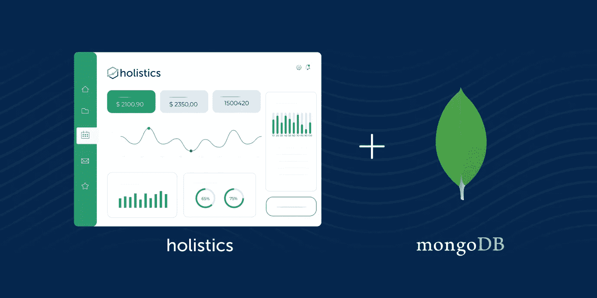

*更新:对复杂的分析前景感到困惑？查看我们的书:* [*《分析学设置指南》*](https://www.holistics.io/books/setup-analytics/?utm_source=medium&utm_campaign=sql-based-dm) *。*

像 MongoDB 这样的 NoSQL 数据库为应用程序提供了灵活、可伸缩和快速的数据存储。然而，缺乏分析功能和连接操作使得 NoSQL 数据库中的数据难以分析。

在本教程中，我将带您通过 5 个简单的步骤，不仅构建一个实时仪表板，还使用 Holistics 在 MongoDB 上构建一个可扩展的数据分析堆栈:

1.  将 SQL 数据库设置为数据仓库
2.  建模数据、导入数据、转换数据
3.  构建和浏览数据集以创建有意义的可视化效果
4.  使用过滤器构建交互式仪表板
5.  将仪表板计划为松弛状态

本指南中使用的数据是注册 Mongo Atlas 帐户时可用的 [*sample_mflix* 数据库](https://docs.atlas.mongodb.com/sample-data/sample-mflix/)。该数据库包含关于**电影**、**场次**、**影院**、**用户、**和**评论**的数据。

# 什么是整体论？

[Holistics](https://holistics.io) 是一个 BI 平台，可帮助您设置和运行完整的数据分析堆栈:从整合多个数据源、对数据建模到生成有意义的见解。它现在提供了一个免费层，所以你现在就可以[注册](https://holistics.io)并按照这个指南开始构建你的仪表盘。

# 1.准备数据仓库

数据仓库是一个中央数据库，用于存储来自不同来源(BigQuery、MySQL、MongoDB、Google Analytics、Google Sheets……)的数据，并针对分析目的进行了优化。

由于 MongoDB 的界面对分析师(他们主要接受 SQL 培训)不友好，而且**它没有连接**，您需要将数据从 MongoDB 拉到 SQL 数据库(PostgreSQL、BigQuery、MySQL..)来利用它的分析功能。

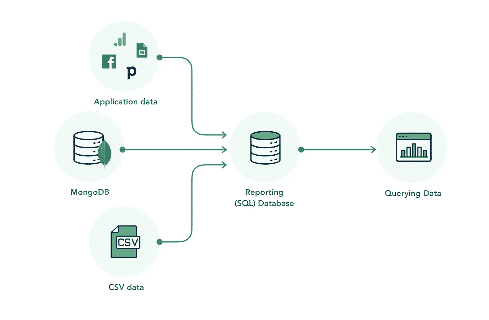

如果您还没有数据仓库，请查看这些指南

*   [**为数据仓库设置 Google 大查询**](https://www.youtube.com/watch?v=vvFVcaBJdiQ)
*   [**使用 ElephantSQL**](https://youtu.be/jAtZh8RB1lU) 在 10 秒内建立一个免费的 PostgreSQL 数据库

准备好数据仓库后，您可以将它连接到 Holistics，这里我连接到我的 PostgreSQL 数据库，并将其命名为`demodw`

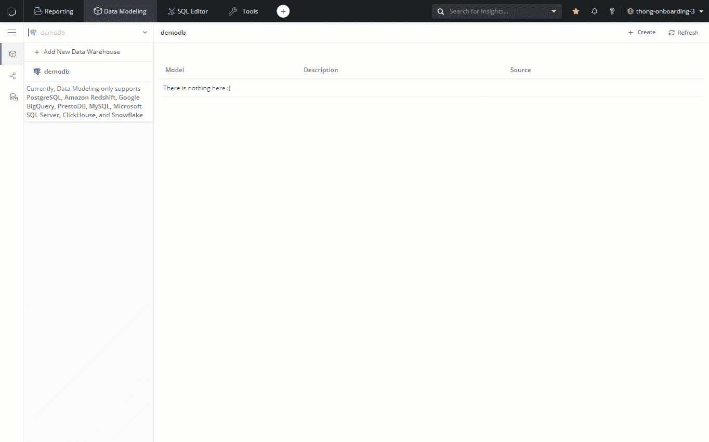

*连接到您的 SQL 数据库*

# 2.为您的数据建模

简而言之，数据建模是将业务逻辑映射到物理数据的过程，这样您就可以理解它。在整体主义中，数据建模过程旨在:

*   合并来自多个数据源的数据。
*   转换数据以生成易于查询和解释的用户友好的数据单元。
*   用元数据为系统生成的原始数据赋予业务意义
*   支持数据自助服务和协作

这一步的最终结果是一个逻辑层(一个**“数据建模层”**)，它允许进一步的数据操作。

## 2.1 导入 MongoDB

在这一步中，我将把 MongoDB 数据导入到我上面连接的数据仓库 **demodw** 的表中，并设置一个时间表来刷新这个导入。

在**数据建模视图**中，从**数据导入**创建**数据模型**，选择 MongoDB。在这一步，系统还会提示您选择一个默认模式来写入导入的数据。

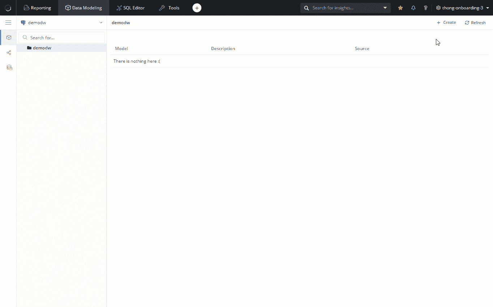

导入 MongoDB

接下来，**添加我的 MongoDB 连接:**


添加 MongoDB 连接

选择您想要导入的 **MongoDB 表。这里我选择了所有的表格(**评论**、**电影**、**场次**、**影院**、**用户**)**

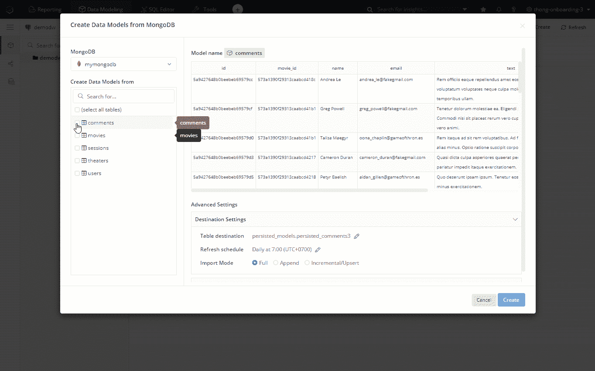

选择要导入的 MongoDB 表

导入成功后，您可以打开每个数据模型来查看其结构或预览数据仓库中的实际数据。

## 2.2 提取 MongoDB 字段

如果您的列包含数组或嵌套文档，您需要使用 SQL 将它们提取到单独的列中。

例如，电影的记录有键`imdb`,结构如下。我将把`rating`值提取到`imdb_rating`字段，以备后用。

```
"**imdb**": { 
    "**rating**": { "$numberDouble": "7.3" }, 
    "**votes**": { "$numberInt": "5043" }, 
    "**id**": { "$numberInt": "12" } 
}
```

打开 Movies Model，选择 **Add / Calculated Column** ，给它一个名字，用这个查询提取 imdb_rating `{{ #THIS.imdb }}::jsonb ->> 'rating'`。它将在包含`rating`值的 Movies 模型中创建一个名为 **IMDB Rating** 的新字段。

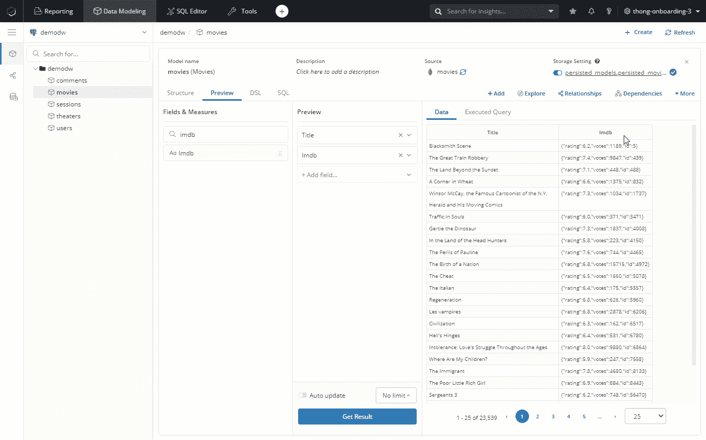

向数据模型添加自定义维度

## 2.3 添加一项措施

度量是从 SQL 的**聚合函数和操作**创建的，例如`COUNT()`、`SUM()`、`AVG()`、`SUM(field_a) + SUM(field_b)`...通过结合度量和维度，您可以确保您的最终用户能够产生正确的计算结果并产生洞察力，而无需自己编写公式。

这里我用 SQL 公式`count({{ #THIS.id }})`创建了一个简单的`count_movies`度量。语法遵循您的数据库的 SQL 风格，因此您可以创建更复杂的度量，如“评分 8 及以上的电影计数”:`count(case when {{#THIS.imdb_rating}} >= 8.0 then {{#THIS.id}} else null end)`

拖动其他维度，可以通过`released_year`、`genres`、`countries`来断开`count_movies`...

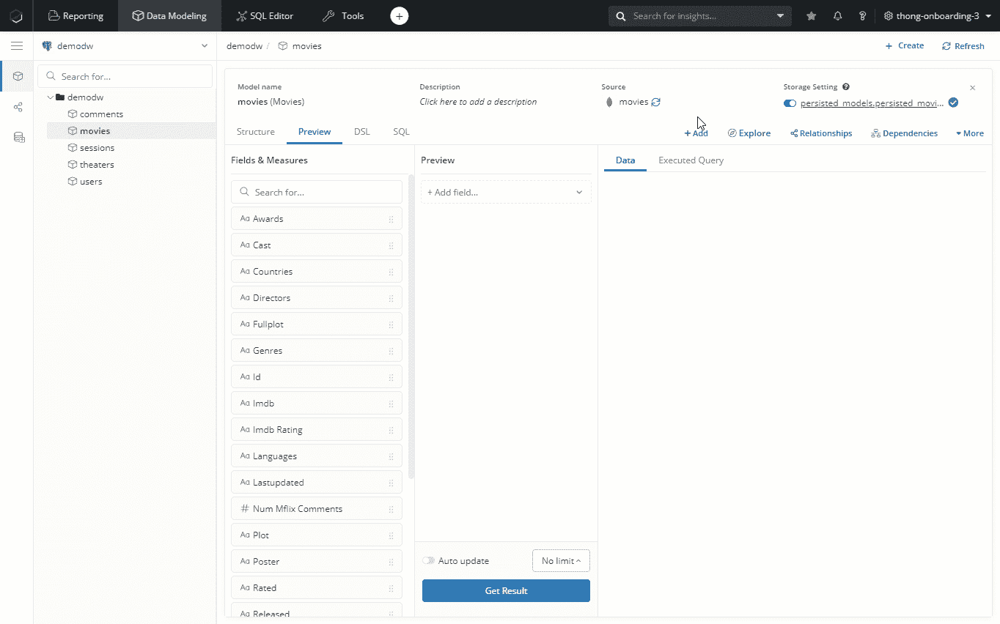

添加度量值

## 2.4 添加数据模型之间的关系

关系有助于您浏览不同表中的数据，而无需显式编写联接 SQL。

例如，一部电影可以有多个评论，所以我将在`comments.movie_id`和`movies.id`上用*多对一关系(n-1)* 将`comments`数据模型链接到`movies`数据模型。

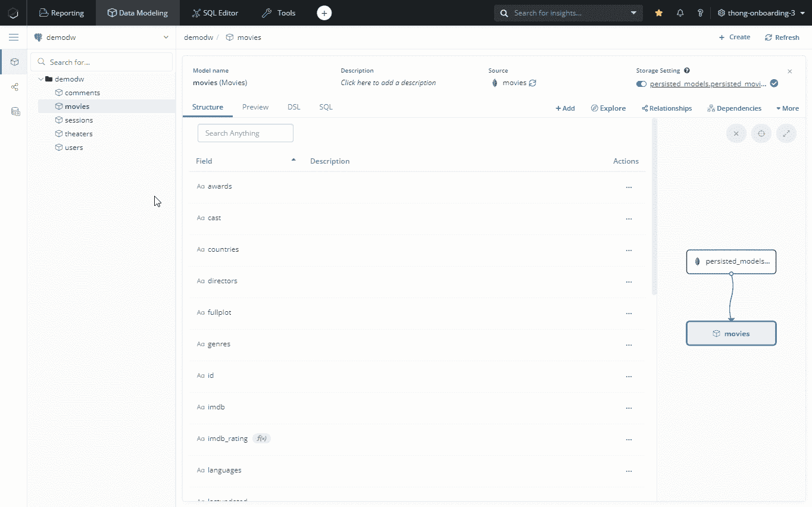

添加数据模型之间的关系

您也可以单击“关系”选项卡来查看关系图。

# 2.5.转换您的数据并从其他数据源导入

上面的步骤只涉及一个 MongoDB 数据源，并涉及一个简单的转换(从嵌套字段中提取值)。然而，您也可以在您的分析中集成来自其他来源的数据(如 CSV 文件、Google Sheets、脸书广告……)，并编写更复杂的 SQL 转换。为了让本指南简单明了，我将把这些操作留给另一篇文章。

如果你想知道你还能做什么，你可以参考这些文件:

*   [如何从外部数据源创建数据模型](https://www.holistics.io/blog/how-to-create-data-models-from-external-data-sources-in-holistics/)
*   [数据导入](https://docs.holistics.io/docs/import-data)
*   [数据转换](https://docs.holistics.io/docs/transform-data)

# 3.构建和浏览数据集

数据集是共享相同兴趣并彼此有关系的数据模型的集合。

您可以通过混合不同数据模型的维度和度量来探索数据集。Holistics 的引擎将基于这些组合来生成针对您的数据仓库运行的 SQL。

## 3.1 创建数据集

在这里，我通过组合`comments`和`movies`数据模型来创建数据集。这两个模型中的所有字段和度量值都将在数据集中可用，并且由于我前面设置的关系，它们可以被组合在一起。

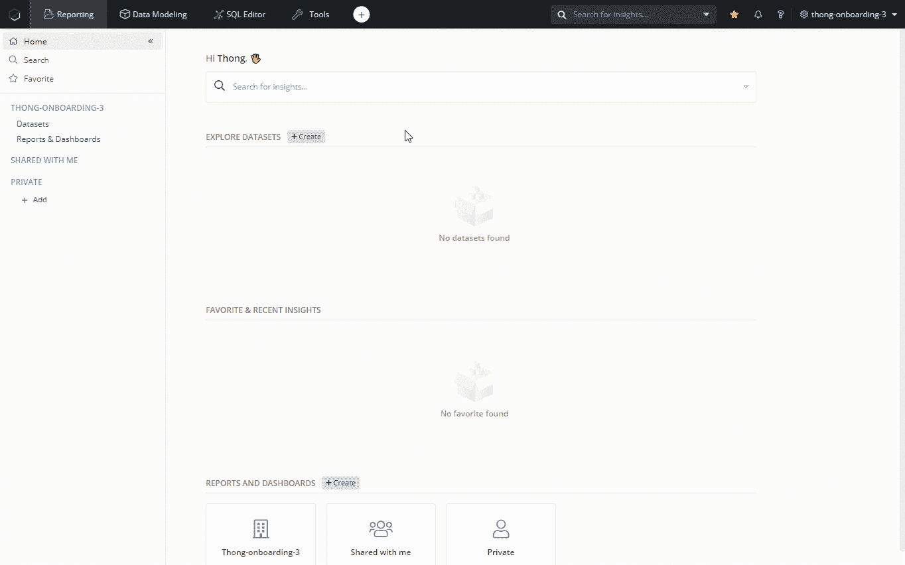

数据集创建

## 3.2 探索数据集

创建数据集后，您可以开始在熟悉的拖放界面中组合维度和度量，并选择适当的可视化。

在这个例子中，我将通过组合`movies.title`、`movies.imdb_rating`、`count(comments.id)`来创建一个“列出电影及其 IMDB 评分和评论数”的表格

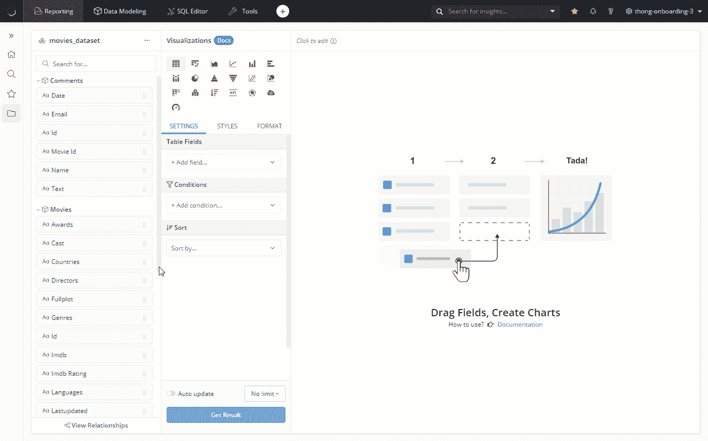

按评论数、IMDB 评分的电影

只需点击几下鼠标，就能看到按年发行的全部电影的图表:

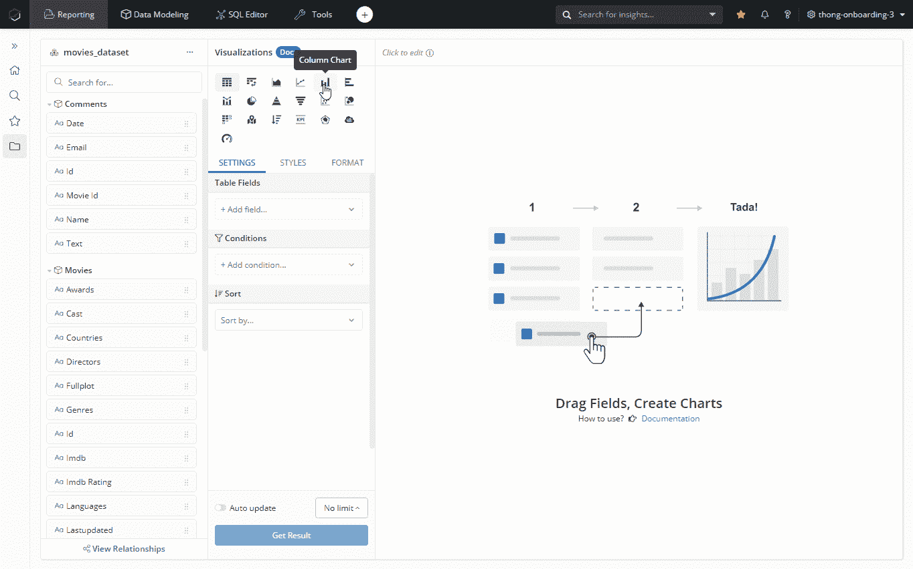

历年电影

# 4.使用过滤器构建交互式仪表板

最后，您可以创建一个仪表板，将您的所有探索收集为图表和表格，您可以随时查看或与您的团队共享。

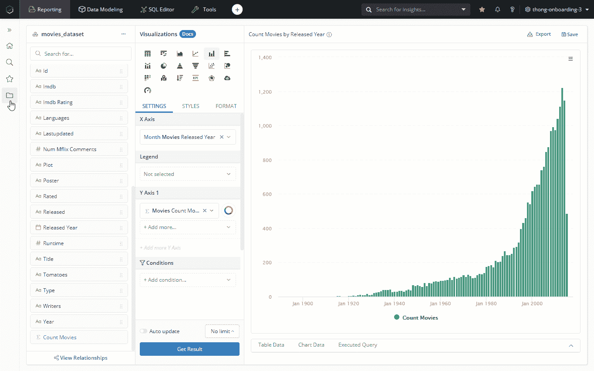

创建仪表板

## 添加一些过滤器

如果没有任何过滤器，仪表板有什么用？

只需点击**添加过滤器**图标，并从五种类型的过滤器(字段、日期、文本、数字、真/假)中进行选择，以过滤您的数据。欲了解更多信息，请访问我们关于 [Holistics 的过滤器](https://docs.holistics.io/docs/filters)的文档。

例如，我从字段`movies_dataset.movies.released_year`创建一个过滤器，并将其映射到两个小部件的`movies.released_year`字段。

当查看者更改`released_year`时，过滤条件将应用于两个映射的小部件并更改它们的值。

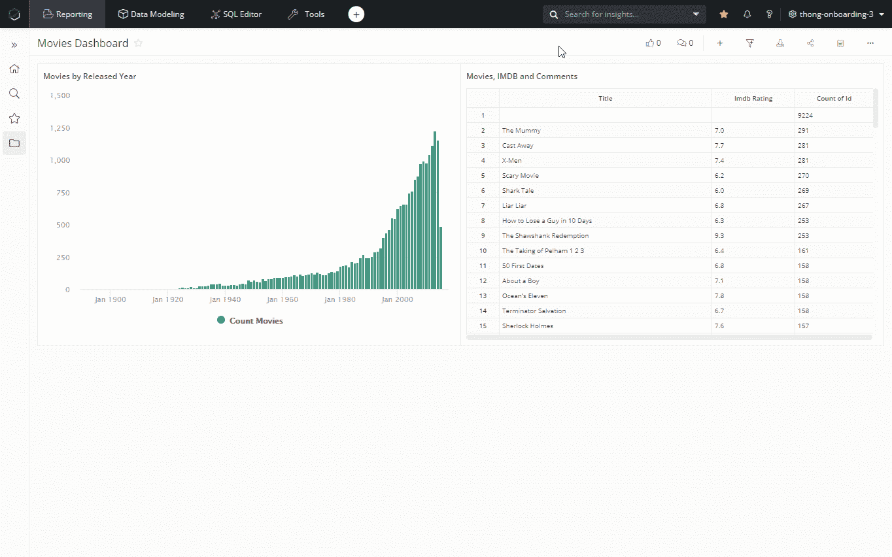

添加过滤器

# 5.将您的仪表板交付给 Slack

最后，每天将您的新仪表板安排到您的邮箱或 Slack，这样每个人都可以随时了解最新的数据变化，并在内部讨论中方便地使用数据。

点击仪表板上的**计划**图标，选择**新的松弛计划。**您可以在此选择发布仪表板的渠道，安排发布时间和覆盖默认过滤值。

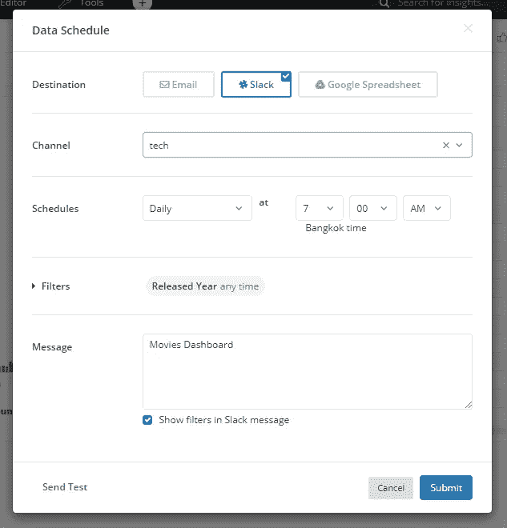

设置时差计划

Tada，每天早上 7:00，你的 Slack 频道都会收到一个新的仪表盘，如下图所示

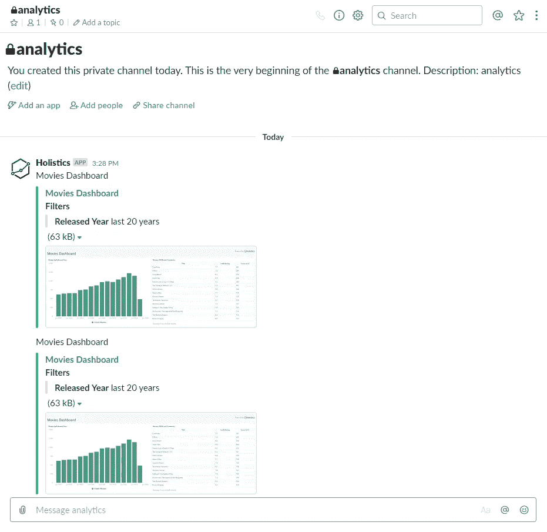

宽松计划

# 结论

我希望这份指南能够成为一份有趣的实践指南，帮助你学习如何从零开始构建自己的 MongoDB 分析基础。

当然，我们只是触及了表面。还有更有趣的事情要做，比如合并来自其他来源的数据，使用 SQL 转换数据，优化查询性能…这些我将在其他帖子中讨论。

现在，让我们来看看如何在您的具体使用案例中应用本指南！如果您面临任何问题，请不要犹豫发表评论或[联系我](https://www.linkedin.com/in/thongda/)！

*原载于 2020 年 3 月 19 日*[*https://www . holistics . io*](https://www.holistics.io/blog/build-reporting-analytics-mongodb-using-holistics-for-free/)*。*

感谢 [Ha Pham](https://medium.com/u/a2412fd547c3?source=post_page-----52213265e45c--------------------------------) 和 TDS 团队对帖子的审核。