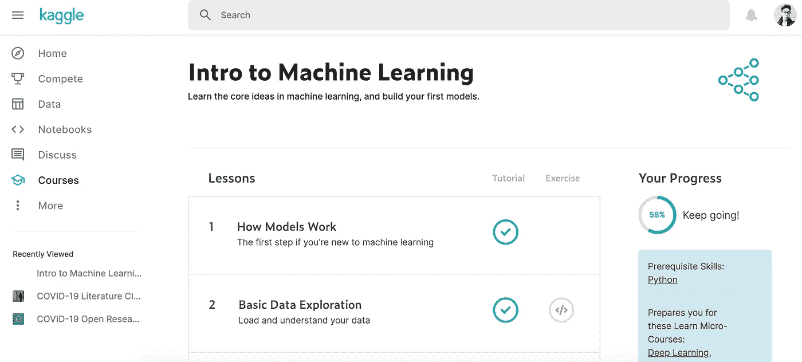
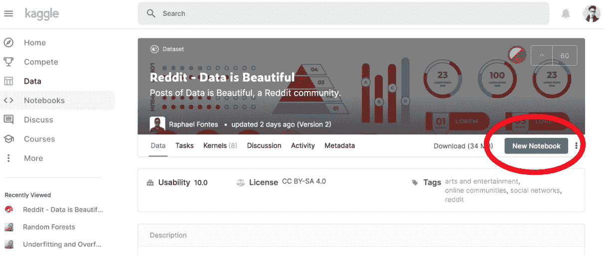

# 构建您的第一个机器学习模型并开始您的数据科学职业生涯的指南

> 原文：<https://towardsdatascience.com/a-guide-to-build-your-first-machine-learning-model-and-start-your-data-science-career-ef487f455c9?source=collection_archive---------38----------------------->

## 通过本教程开始您的数据科学生涯！

# 目录

1.  [简介](#4e42)
2.  [目标](#e5fc)
3.  [第一步:完成 Kaggle 的机器学习课程](#765e)
4.  [第二步:在 Kaggle 上找到一个数据集，重新创建你的随机森林模型](#f7cc)
5.  [我的第一个机器学习模型](#cf6e)
6.  [接下来的步骤](#dad8)

# 介绍

进入数据科学和机器学习很难…如果没有指导，就更难了。三年前，我在几门课程、书籍和资源之间跳来跳去，希望发展我对机器学习的理解。

我最初尝试了 Udacity 的机器学习课程，但发现对初学者来说太复杂了。然后我尝试了 Coursera 的机器学习课程，这是一门很棒的课程，可以学习每个模型背后的理论，但它不是用 Python 教授的。最后，我尝试了 Udemy 的机器学习 A-Z 课程，但发现我只是简单地复制他们的代码，并没有完全理解我在做什么。

直到后来，我才发现一个简单的资源加速了我的职业生涯。在本文中，我将帮助你通过简单的两步**创建你自己的机器学习模型**。

# 目标

通过阅读这篇文章，我希望能帮助你做到以下几点:

1.  为您提供资源，帮助您理解和开发您的第一个机器学习模型。
2.  给你大量的数据集来实验和建立模型。
3.  帮助您开始数据科学之旅！

*如果你在这个过程中的任何地方卡住了，请前往关于* [*我的第一个机器学习模型*](#cf6e) *的部分，看看我做了什么，或者随时在*[*Linkedin*](https://www.linkedin.com/in/terenceshin/)*上联系我！*

# 第一步:完成 Kaggle 关于机器学习的课程

Kaggle 的机器学习课程截图

就我个人而言，我发现 [Kaggle 的机器学习入门课程](https://www.kaggle.com/learn/intro-to-machine-learning)是入门的最佳资源，原因是它非常基础——它实际上为你提供了构建第一个机器学习模型的最低要求。你可能会认为这是一件坏事，但作为一个初学者，有几个原因可以说明这是件好事:

*   当你面对更少的信息时，就更容易理解所有事物是如何联系在一起的。迈出许多小步就能赢得大步。
*   自信地建立你的第一个机器学习模型会给你动力去更深入地学习。类似于第一点，除了大胆的大目标之外，设定许多可以实现的小目标。

在学习本课程时，**请记住以下几点**:

*   专注于理解代码片段。稍后您将重用这些代码，因此如果您了解每段代码背后的基本原理，这将对您最有利。不要担心记住代码——把它作为一种资源来引用并没有错。
*   不要强调它只涵盖了决策树和随机森林模型。稍后你会发现，你只需要修改几行代码就可以改变你的机器学习模型，所以不要担心。

一旦完成这个，你就可以进入第二步，制作你自己的机器学习模型:

# 第二步:在 Kaggle 上找到一个数据集，重新创建你的随机森林模型

Kaggle 提供的不仅仅是在线课程，它有数以千计的数据集，你可以用来探索和创建模型。下面是完成你自己的第一个模型所需的步骤。

首先，去 Kaggle 的数据集列表[这里](https://www.kaggle.com/datasets)，选择一个你感兴趣的。想想你想预测什么变量。你想预测寿命吗？房地产价格？出租车使用情况？世界是你的。

然后点击“新建笔记本”。在这里，您将复制从 Kaggle 的入门课程中学到的代码。

一旦你有了新的笔记本，剩下的就简单了。简单地复制你在 Kaggle 的机器学习入门课程中学习的代码。那么你只需要改变几件事:

*   更改**的 csv 文件。read_csv()** 正在读取您选择的数据集。
*   将预测变量 **y** 更改为您希望在所选数据集中预测的变量。
*   更改用于预测 y 变量的特征(**x 变量**)。

就是这样！你已经用自己选择的数据集创建了自己的机器学习模型。现在看起来可能不多，但是再过几个月，当你开始数据科学之旅时，你会回过头来看看你已经取得了多大的进步。

# 我的第一个机器学习模型

对于我的第一个算法，我想创造一些我认为会与我以后的生活相关的东西。我决定使用 Kaggle 的“二手车数据集”，它有超过 60 万辆二手车列表。我创建的算法旨在根据一些特征来预测二手车的价格，包括制造年份*，*制造商*，*里程表*(公里数)，等等。*

*在这里你可以看到我是如何编写我的第一个模型[的，你可以看到它并不多，但是七周之后，我能够通过更多的步骤来显著地改进它(在这里](https://www.kaggle.com/terenceshin/used-car-price-prediction-attempt-1)看到我改进的模型[)。](/a-machine-learning-project-predicting-used-car-prices-efbc4d2a4998)*

# *后续步骤*

*你可以学习很多东西来改进你的模型——如果你不知道下一步该怎么做，可以从下面的文章开始:*

*   *[6 分钟内解释所有机器学习模型](/all-machine-learning-models-explained-in-6-minutes-9fe30ff6776a):这将帮助您了解数据科学领域中最常用的一些机器学习模型。*
*   *[完整的熊猫数据科学术语表](http://A Complete Pandas Glossary for Data Science):如果你想提高你的编程能力，可以参考这个。发展强大的基本面将会在以后的道路上帮助你十倍。*
*   *[探索性数据分析的详尽逐步指南](/an-extensive-guide-to-exploratory-data-analysis-ddd99a03199e):探索数据对于你使用的每个数据集都是必不可少的。通读这篇文章，了解什么是 EDA 以及如何进行 EDA。*
*   *[如何用 Python 代码评价你的机器学习模型！](/how-to-evaluate-your-machine-learning-models-with-python-code-5f8d2d8d945b):创建你的机器学习模型是一回事。创造一个**好的**机器学习模型是另一个例子。这篇文章教你如何评估你是否建立了一个好的机器学习模型。*

# *感谢阅读！*

*如果你喜欢我的工作，想支持我…*

1.  *支持我的最好方式就是在**媒体**上[这里](https://medium.com/@terenceshin)关注我。*
2.  *在 **Twitter** [这里](https://twitter.com/terence_shin)成为第一批关注我的人之一。我会在这里发布很多更新和有趣的东西！*
3.  *此外，成为第一批订阅我的新 **YouTube 频道** [这里](https://www.youtube.com/channel/UCmy1ox7bo7zsLlDo8pOEEhA?view_as=subscriber)！*
4.  *在 **LinkedIn** [这里](https://www.linkedin.com/in/terenceshin/)关注我。*
5.  *在我的**邮箱列表** [这里](https://forms.gle/UGdTom9G6aFGHzPD9)注册。*
6.  *查看我的网站，[**terenceshin.com**](https://terenceshin.com/)。*