# 使用 Dialogflow 和 FireBase 构建 WhatsApp 聊天机器人指南

> 原文：<https://towardsdatascience.com/a-guide-to-building-whatsapp-chatbots-using-dialogflow-and-firebase-4ff5e904ac3?source=collection_archive---------9----------------------->

## 一步一步的教程，为你的企业创建智能聊天机器人，并让他们与你的后端互动


由[丹尼尔·科尔派](https://unsplash.com/@danielkorpai?utm_source=unsplash&utm_medium=referral&utm_content=creditCopyText)在 [Unsplash](https://unsplash.com/s/photos/chat?utm_source=unsplash&utm_medium=referral&utm_content=creditCopyText) 上拍摄

聊天机器人是对话代理，能够与互联网用户进行对话的程序。在本教程中，我将带领你使用 [Twilio](https://www.twilio.com/) 平台实现 WhatsApp 聊天机器人。

除了静态聊天机器人，我们还将受益于谷歌 [Dialogflow](https://dialogflow.cloud.google.com/) 的强大功能，创造出能够理解人类语言的智能机器人。

# 1.WhatsApp 聊天机器人

WhatsApp 是世界上许多地方最受欢迎的 OTT 应用。有了 WhatsApp 聊天机器人，你可以在客户使用的平台上为他们提供支持，并立即回答他们的问题。

使用 *Twilio、Flask* 和 *Heroku* ，以及许多其他高级平台，如 *DialogFlow* ，我们可以构建令人惊叹的聊天机器人，正如我们将在本教程中所做的那样。

## 特维利奥

Twilio 是一家云通信平台即服务(CPaaS)公司，它允许软件开发人员以编程方式拨打和接听电话、发送和接收文本消息，以及使用其 web 服务 API 执行其他通信功能。

有了 WhatsApp 的 Twilio API，你可以发送通知，进行双向对话，或者构建聊天机器人。

免费，无需等待你的 Twilio 号码被 WhatsApp 批准，Twilio Sandbox for WhatsApp 使你能够立即创建你的聊天机器人，就像我们在这个项目中将要看到的那样。

1.创建一个 [Twilio 账户](https://www.twilio.com/try-twilio)

2.创建一个[新项目](https://www.twilio.com/console/projects/create)

3.在项目控制台上，打开可编程 SMS 仪表板

4.选择 WhatsApp 测试版

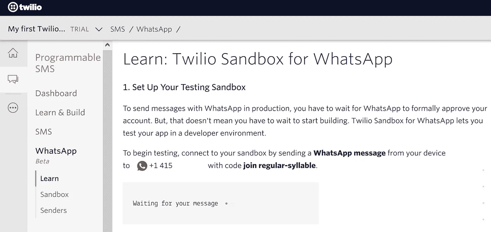

*作者图片*

当你激活你的沙箱时，你会看到与之相关的电话号码(这里是+1 415 …)以及它的名字(这里是普通音节)

## 使用 Flask 创建应用程序

1.创建新的 Python 虚拟环境:

*   在新文件夹中打开终端并执行:`python -m venv myvenv`

2.激活您的虚拟环境:

*   视窗:`myvenv\Scripts\activate`
*   Linux : `source myvenv/bin/activate`

3.安装这两个 Python 包:

*   [Twilio](https://www.twilio.com/) : `pip install twilio`
*   [烧瓶](https://flask.palletsprojects.com/) : `pip install flask`

> Flask 是一个用 Python 编写的微型 web 框架。这意味着 **flask** 为你提供了工具、库和技术，让你可以构建一个网络应用。

4.创建烧瓶应用程序:

在你的文件夹中，创建一个名为 *app.py* 的文件，然后*复制&粘贴*下面的代码:

```
from flask import Flask, request
from twilio.twiml.messaging_response import MessagingResponseapp = Flask(__name__)@app.route("/")
def hello():
    return "Hello, World!"@app.route("/sms", methods=['POST'])
def sms_reply():
    """Respond to incoming calls with a simple text message."""
    # Fetch the message
    msg = request.form.get('Body') # Create reply
    resp = MessagingResponse()
    resp.message("You said: {}".format(msg)) return str(resp)if __name__ == "__main__":
    app.run(debug=True)
```

这是一个基本的 flask web 应用程序，它使我们能够在/ route 中获取`Hello, world!`，如果我们将消息发布到 ***/sms*** route，就可以得到我们的消息，正如我们在以下步骤中看到的

5.运行 app : `python app.py`

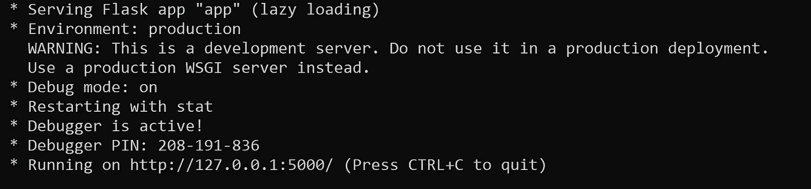

*作者图片*

您的应用程序现在正在运行。

你可以在浏览器中输入`http://127.0.0.1:5000/`来检查。(你会得到`Hello, world!`)

然而，远程机器不可能访问你的应用，因此需要 ***Ngrok***

## 使用 Ngrok 获取应用程序的公共地址

Ngrok 将使我们能够为本地运行的应用程序提供一个公共的 URL。

1.下载 [Ngrok](https://ngrok.com/download) 并解压

2.通过执行:`./ngrok http 5000`从命令行运行它

3.现在，您可以使用提供的 URL(类似于`[https://******.ngrok.io](/******.ngrok.io))` [)](/******.ngrok.io)) )从远程机器访问本地运行的应用程序

4.返回 Twilio sandbox 并将其粘贴为接收邮件的 URL:

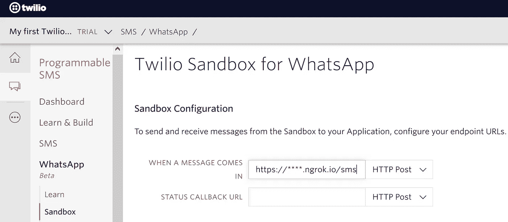

*作者图片*

5.你现在可以在手机中打开 WhatsApp，添加你在之前步骤中从 Twilio 获得的号码(+1 415 …)，并通过他们告诉你的代码开始对话(在这里加入常规音节)

6.你现在可以发送任何你想要的 WhatsApp 信息，机器人会通过发送回相同的信息来回复。这是一种鹦鹉机器人😃

然而，我们仍然有一个主要的问题，你的机器应该一直运行，以允许应用程序响应用户的请求。

# 2.使用 Heroku 摆脱你的机器

多亏了 Heroku，我们将能够在云中部署我们的应用程序，以及它有效运行所需的所有需求。因此，我们的机器将受益于关机的奢侈。为此，我们需要:

1.在我们的虚拟环境中，安装 gunicorn: `pip install gunicorn`

2.在您的文件夹中创建这些文件:

*   ***Procfile*** :然后将该内容保存在其中`web gunicorn app:app`
*   ***runtime.txt*** :然后把这个内容保存在里面`python-3.7.2`
*   ***requirements . txt***:你可以简单的输入`pip freeze > requirements.txt`来填充你的 app 需要的所有第三方库。
*   ***。gitignore*** :然后把这个内容保存在里面

```
myvenv/
*.pyc
```

3.下载并安装[Git](https://git-scm.com/downloads)；然后在您的虚拟环境中:

*   在您的项目文件夹中初始化一个新的 git 存储库:`git init`
*   将所有未跟踪的文件添加到 git 库:`git add .`
*   将更改提交到 git 存储库:`git commit -m "first commit"`

4.如果你还没有一个新的 Heroku 帐号，请创建一个。然后下载 Heroku [命令行界面(CLI)](https://devcenter.heroku.com/articles/heroku-cli#download-and-install) ，直接从终端轻松创建和管理您的 Heroku 应用程序。

5.使用`heroku login`从您的虚拟环境连接到您的 Heroku 帐户，然后您将被转到浏览器中基于 web 的界面以完成身份验证阶段。

6.创建一个新的 Heroku 应用程序`heroku create <app-name>`

7.通过将您的本地 git 存储库推送到远程 Heroku 应用程序的 git 存储库来部署您的应用程序:`git push heroku master`

最后，当部署完成时，您将在终端中看到您可以访问应用程序的地址。-类似于`https://<app-name>.herokuapp.com/sms` -复制它，回到你的沙箱，用新的*Heroku*URL 替换 *Ngrok* URL。

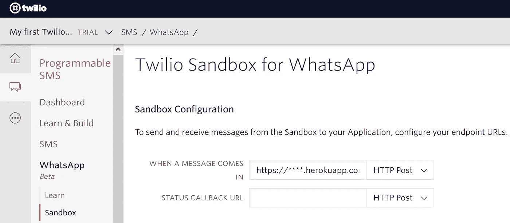

*作者图片*

恭喜你，你的鹦鹉 WhatsApp 机器人现在全天候运行，它不再需要你的机器的帮助了😃你可以关掉它。

# 3.更新您的代码

比方说，你明天想出另一个主意，而不是你做的这个鹦鹉机器人，你需要做的就是修改你的代码(在文件 *app.py* 中)。如果项目很复杂，您还可以添加更多文件)然后:

```
# connect to your virtual environment
<virtual_environment_name>\Scripts\activate #Windows
source <virtual_environment_name>/bin/activate #Linux# connect to your heroku account
heroku login# prepare all the modified files and push them to Heroku
git add .
git commit -m "first change"
git push heroku master
```

⚠️:如果你在你的虚拟环境中安装了新的软件包，你必须通过更新文件 ***requirements.txt*** 来告诉 Heroku:只需在`git add .`前输入`pip freeze > requirements.txt`就可以了。

# 4.用你自己的号码

如果你想创建一个真正的商业 WhatsApp 机器人，我之前介绍的方法有两个缺点:

(1)为了使用这个机器人，你的客户必须用一个奇怪的信息开始对话😑(此处加入正则音节)；

(2)机器人想出的是 Twilio 的 logo，而不是你的。

这是因为我们使用了 Twilio 沙盒，而提供给我们的号码不是我们的。然而，Twilio 为你提供了拥有一个号码的可能性，从而解决了上述问题。为此，您需要遵循以下步骤:

第一步:买一个 [Twilio 号](https://www.twilio.com/console/phone-numbers/search)

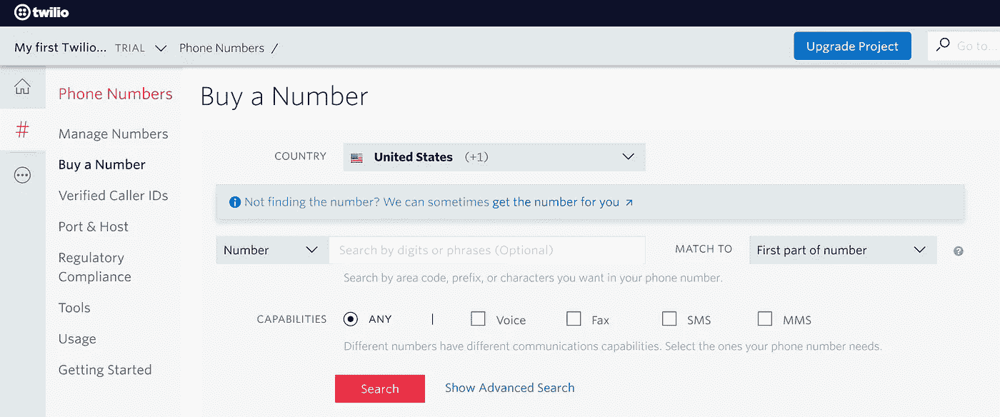

*作者图片*

第二步:通过填写 [Twilio 的“请求访问”表格](https://www.twilio.com/whatsapp/request-access)来请求访问，以便在 WhatsApp 上启用您的 Twilio 号码(确保您事先有您的脸书业务经理 ID)

当您的请求获得批准后，Twilio 将通过电子邮件通知您提交您的*发件人资料*和 *WhatsApp 消息模板*的后续步骤，然后另一封电子邮件将向您展示如何*批准 Twilio 代表您发送消息*以及如何*验证您的脸书业务经理账户*。

所以，在发出请求后，确保你经常检查你的电子邮件，为接下来的步骤做准备。整个过程需要 2 到 3 周。

[关于流程的更多信息](https://www.twilio.com/docs/whatsapp/tutorial/connect-number-business-profile)

# 5.使用 DialogFlow 的高级聊天机器人

到目前为止，我们创造了一个聊天机器人，它有能力管理简单的对话和重复一个人说的话😅这不是很酷吗🙄。实际上，我们在前面的章节中关注的是让这个机器人在流行的聊天平台 WhatsApp 上工作。

事实上，我们没有使用我们的任何数据来训练或个性化机器人。在这一部分，我们将训练和微调我们的聊天机器人，并让它与后端交互。让我们以一个购物/送货店的案例研究为例。

## 设置 DialogFlow 代理

Dialogflow *代理*是一个虚拟代理，它处理与最终用户的对话。它是一个自然语言理解模块，可以理解人类语言的细微差别。DialogFlow 的代理使用[意图](https://cloud.google.com/dialogflow/docs/intents-overview)对每次对话的最终用户意图进行分类，使用[实体](https://cloud.google.com/dialogflow/docs/entities-overview)从最终用户的表达中识别和提取特定数据(我们将使用它们将数据发送到后端)。

所以首先要做的是..**登录** [**对话流程控制台**](https://dialogflow.cloud.google.com/) **并创建一个新的代理**..在左侧菜单中，您可以**启用*闲聊***。基本上，你的机器人现在能够自动处理“嗨，你好，你好吗，再见……”之类的事情。试试看！(右侧有一个“*立即尝试*”部分)

当最终用户写或说一些话时，Dialogflow 会将最终用户的表达与您的代理中的最佳意图进行匹配。为了做到这一点，您的代理必须接受一些培训短语(最终用户可能会说的示例短语)的培训。当最终用户表达式类似于这些短语之一时，Dialogflow 匹配意图。你不必定义每个可能的例子，因为 Dialogflow 的内置机器学习会在你的列表上扩展其他类似的短语。

*   在左侧菜单中，选择 Intent 并创建一个新的。
*   在“训练短语”部分，添加一些将触发这一意图的表达。当你添加它们时，你会看到一些实体被自动突出显示(如位置或日期时间等)；如果需要，还可以添加自定义实体。
*   在 action and parameters 部分，您可以将一些实体标记为 *required* ，这样当意图被触发时，代理将总是请求它们。请注意，如果您将某个参数标记为必需，您必须在*提示*栏中添加代理将询问最终用户的问题。

此外，您必须有可能添加一个默认答案下的反应部分或让后端生成自定义答案。

## 数据库

我们将使用谷歌的 Firebase 实时数据库，这是一个云托管的 NoSQL 数据库，允许您使用 JSON 格式在您和您的用户之间实时存储和同步数据。

1-转到 [Firebase 网站](https://console.firebase.google.com/)并添加一个新项目。

2-在左侧菜单中，选择数据库，然后在测试模式下选择实时数据库。

为了能够访问您的数据库，添加和删除数据，您必须拥有数据库凭证。

3-点击*项目概述*旁边的齿轮图标，然后选择*项目设置*。在 *Firebase SDK 片段*中，选择 *config* 并将凭证复制到您计算机中的一个单独文件中。

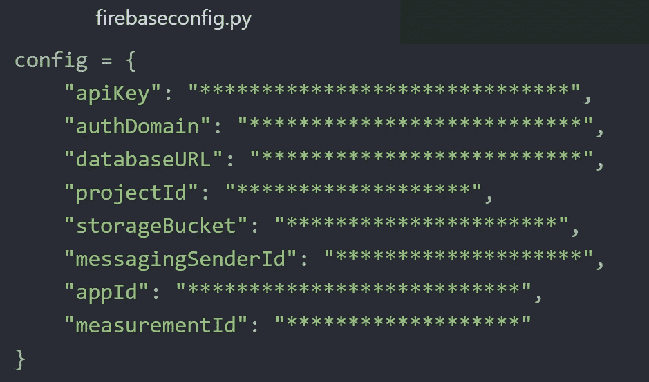

*作者图片*

4-在您的计算机/虚拟环境中，创建一个 *app.py* 文件并导入这些凭证，以及其他有用的库。

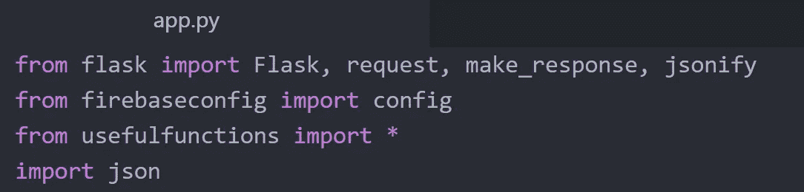

*作者图片*

5-将您的产品及其特征添加到实时数据库:

5.1.在单独的文件中，将身份验证配置为 Firebase:

```
import pyrebase            #install pyrebase first using pip install
from firebaseconfig import config # firebase credentialsfirebase = pyrebase.initialize_app(config)
db = firebase.database()
```

5.2.以 JSON 格式准备您的产品，并使用以下命令将它们添加到 DB 中:

```
prod1 = {
"ID":"0",
"order":"0",
"number": 10,
"color": "black",
"size":"S",
"address":"-",
"date":"-"
}# add a product
db.child("products").push({"shirt":prod1})# update a product
db.child("products").update({"shirt":prod2}) #define prod2 before# remove the whole chain of products
db.child("products").remove()
```

您可以(实时)检查您的数据库的 web 界面，以查看您正在进行的更新。

## 检查我们的库存中是否有产品

在 *usefulfunction.py* 文件中，我们定义了我们将在实现中使用的函数，其中有 *is_available()* 函数，它检查给定的产品是否存在于实时数据库中

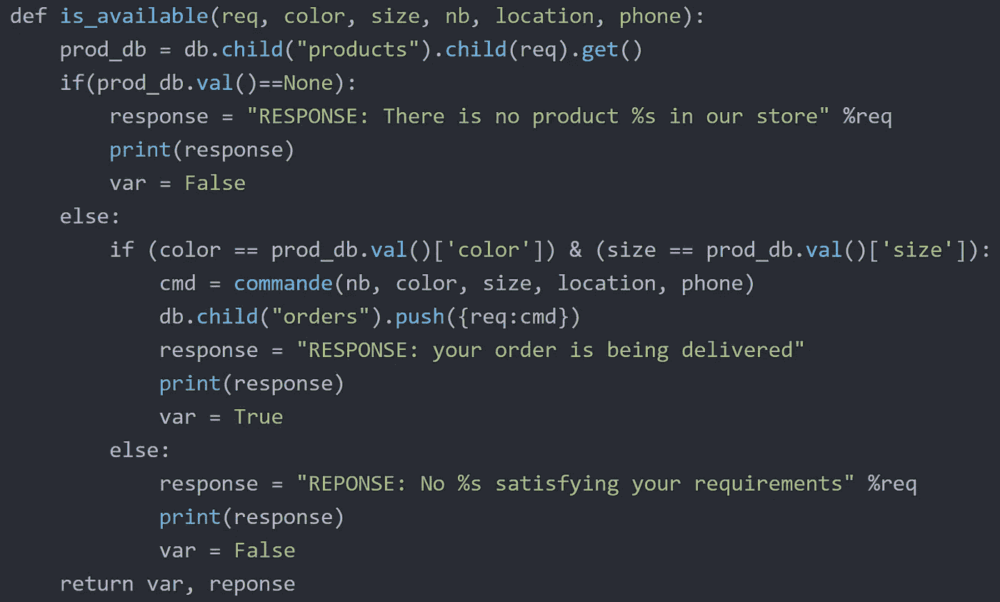

*作者图片*

## 处理来自对话流的数据

用户订单的特征来自于一个 JSON 格式的 Dialogflow。下面的函数提取这些特征，并检查是否有满足这些要求的产品。

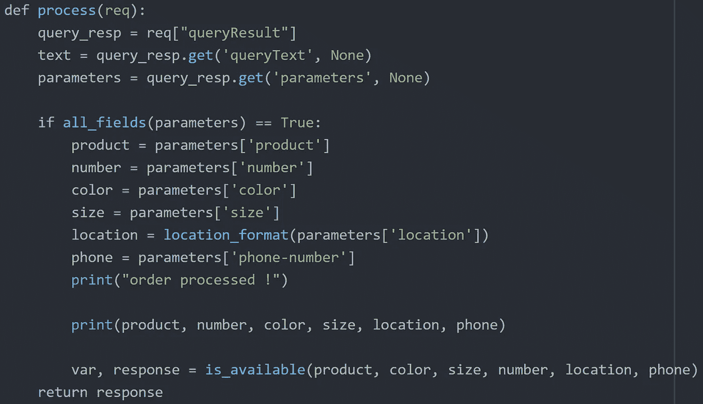

*作者图片*

您可能会注意到存在两个未定义的函数: *all_fields()* 函数只是检查最终用户是否填写了所有必需的字段，而 *location_format()* 函数将位置变量的格式调整为可读格式。

## 把它们放在一起

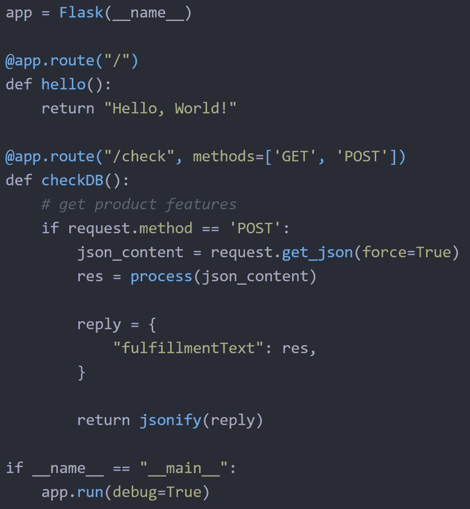

在您的文件 *app.py* 中，我们设置了 Flask API。

/ main 根显示的只是一个 *hello world* ..专业人士有标准；)

*/check* 路径是我们接收 POST 请求、从 Dialogflow 中提取数据、处理数据、在实时数据库中检查产品的可用性并总是使用 JSON 格式回复用户的地方。

现在，您可以在本地运行 *app.py* 并使用 *Ngrok* 来获取一个公共地址，或者像我们之前所做的那样将您的应用程序推送到 Heroku。

## 完成

在 Dialogflow 中，默认情况下，您的代理用静态响应来响应匹配的意图。为了使用动态答案，您必须启用*履行*选项。

返回到您的 Dialogflow 控制台，在左侧菜单中单击 *fulfillment* ，启用 *webhook* ，将 URL 更改为托管您的应用程序的 URL，并保存更改。

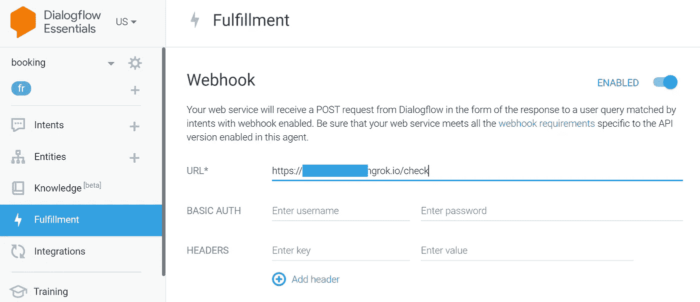

*作者图片*

当一个启用了实现功能的意向匹配时，Dialogflow 会向您的 *webhook* 服务(后端应用程序)发送一个请求，其中包含关于匹配意向的信息。

现在转到您之前创建的意向(在意向部分下)，在该页面的底部您会看到一个*履行*部分，启用 *webhook 调用意向*和*填充空位。*

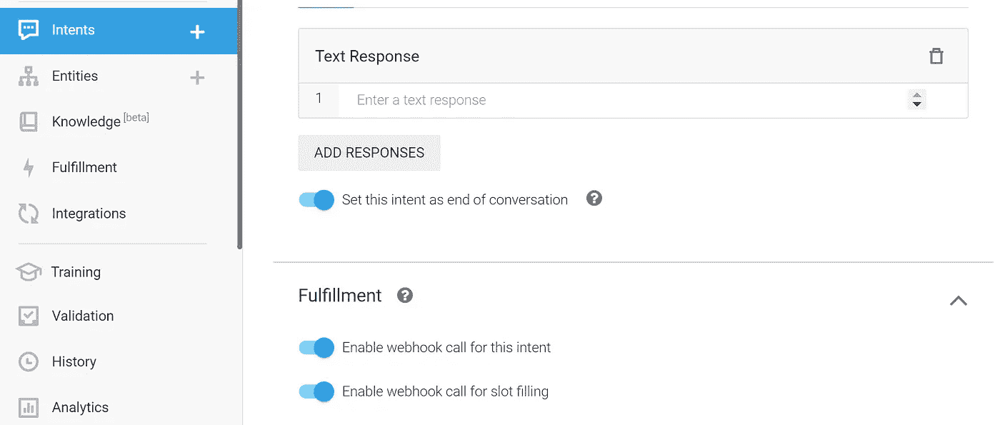

*作者图片*

恭喜..您的聊天机器人现在运行正常，请查看*立即尝试*部分。

# 结论

当最终用户开始与**聊天机器人**对话时，后者会尝试将传入的表情与其**意图之一**进行匹配。当它设法这样做时，它将尝试填充所有**必需的实体**，并且它将所有这些实体(在我们的例子中是产品的特征)发送到我们在**实现**部分中提到的链接。

在我们的 **Flask** web 应用程序收到这些特征后，它会验证数据库中是否有所请求的产品，如果有，它会在 **Firebase RT DB** 中添加命令。然后，向最终用户发送适当的响应。

你可以按照上面提到的步骤在 WhatsApp 上使用这个聊天机器人，就像你可以使用 DialogFlow 的**集成**选项将其与 Facebook Messenger、Slack、你自己的网站和许多其他平台集成一样。