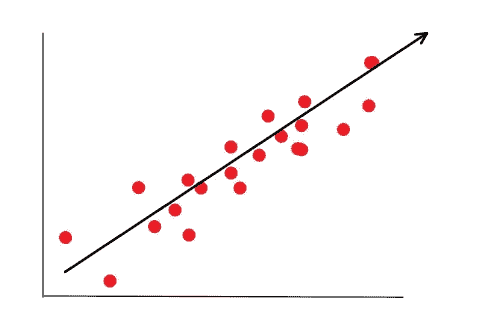
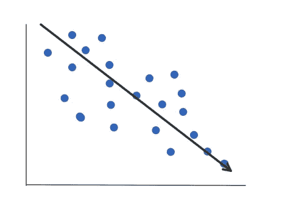
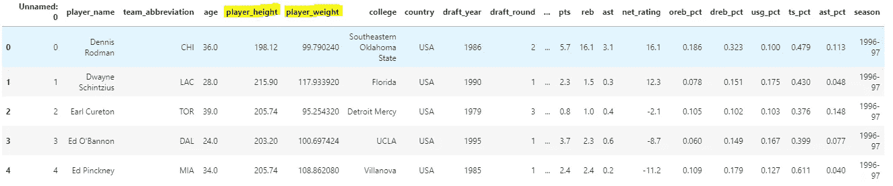
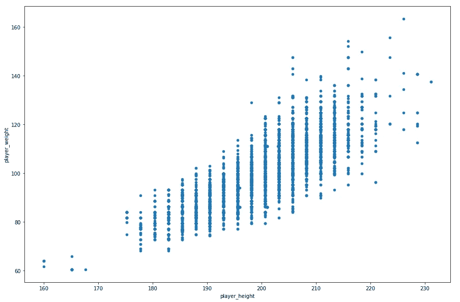
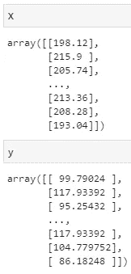
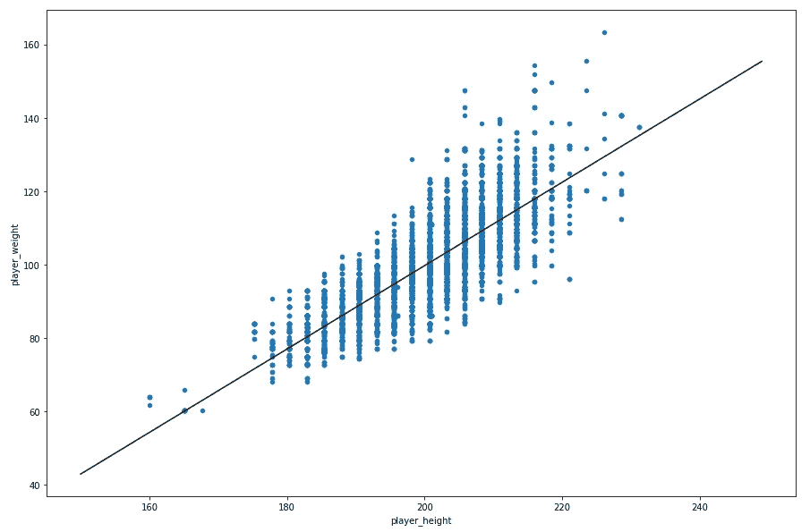

# 仅用 8 行代码构建第一个回归模型的指南

> 原文：<https://towardsdatascience.com/a-guide-to-building-your-first-regression-model-in-just-8-lines-of-code-2d1a2a755811?source=collection_archive---------34----------------------->

## Scikit-Learn 如何提供一种快速简单的方法，让您涉足线性回归和建模领域。


在 [Unsplash](https://unsplash.com?utm_source=medium&utm_medium=referral) 上 [NeONBRAND](https://unsplash.com/@neonbrand?utm_source=medium&utm_medium=referral) 拍摄的照片

数学建模和机器学习经常让人觉得是难以探索和学习的话题，尤其是对那些不熟悉计算机科学和数学领域的人来说。我惊讶地听到我的非 STEM 朋友说，他们在自己的项目中尝试使用基本的建模技术时感到不知所措，并且他们可能会被该领域的语义所困扰。这是一个遗憾，因为线性建模在很多情况下非常有帮助，而且有了互联网上的所有开源代码，实现自己的模型从未如此简单。因此，这里是我理解和实现 Python 中基本线性回归模型的简明指南。

**内容:**

*   [什么是线性回归？](#248d)
*   [如何为线性回归准备数据？](#e02f)
*   [执行线性回归。](#606a)
*   [解释结果:](#2fb7)
*   [最终想法和进一步阅读](#f1a8)

## 什么是线性回归？


布雷特·乔丹在 [Unsplash](https://unsplash.com?utm_source=medium&utm_medium=referral) 上拍摄的照片

线性回归是一种数学建模形式，通常用于评估因变量(如体重)和自变量(如身高)之间的关系。我们的大脑自然会这样做，只是方式不太精确。如果我让你在一个 6 英尺 2 英寸的人和一个 5 英尺 2 英寸 T23 的人之间决定谁更重，你可能会选择 6 英尺 2 英寸 T25 的人。当然，身高 5 英尺 2 英寸的人可能会更重，但我敢打赌，在你与人交往的经历中，你已经在人的身高和体重之间建立了某种关系。线性回归只是建立这种关系并从中提取意义的一种精确的数学方法。

那么它是如何工作的呢？

线性回归的工作原理是创建一条最佳拟合线。最佳拟合线是最能捕捉 x 轴和 y 轴之间关系的线。例如，该关系可以是，随着“X”增加，“Y”也增加:



随着 X 的增加，y 也增加。

或者，这种关系可以是随着“X”增加，“Y”减少。



随着 X 的增加，Y 减少。图片作者。

在上面的例子中，确定趋势的大致方向是相当容易的，然而，根据数据的不同，它可能会变得复杂得多。此外，线条的精确细节很难手工计算。在许多情况下，拥有直线的精确方程会非常有帮助，使我们能够理解两个变量之间的关系，并根据一个变量的值来推测另一个变量的值。

## 如何为线性回归准备数据:

为了有效地进行线性回归，你至少需要两样东西:一个你认为可能是因变量的变量，比如一个 NBA 球员的体重(公斤)，一个你认为可能影响因变量的变量，比如一个 NBA 球员的身高(厘米)。



熊猫数据框架，包含与 NBA 球员相关的各种数据点，包括身高和体重。图片作者。

如果这两个变量都是连续的，线性回归效果最好。我所说的连续是指两个值之间有连续性。有人可能体重 151 磅或 152 磅或 151.5 磅或 151.72 磅，等等。这不同于离散或分类变量，如电影星级或教室中给出的等级。还有其他技术来处理这些类型的数据，但是我们现在将重点放在线性回归上。

身高和体重是连续变量的两个完美例子，主要用于建立两者之间的线性关系。如果您正在使用 Python，请确保您的两个连续变量都处于[浮点形式](https://www.thoughtco.com/definition-of-float-958293#:~:text=Float%20is%20a%20shortened%20term,types%20include%20int%20and%20double.)，这将有助于后面的步骤。

如果你有兴趣用一个已经清理过的数据集来试试这个，你可以跟着我正在使用的 NBA 数据集[，它在这里。](https://www.kaggle.com/justinas/nba-players-data)

为了加载数据，我推荐 python 的[熊猫包](https://pandas.pydata.org/):

```
import pandas as pd #Load the Pandas packagedf = pd.read_csv("archive/all_seasons.csv") #Read the NBA file
df.head() #Display the NBA file's data
```

输出应该如上表所示。

## 执行线性回归:

现在我们已经加载了数据，让我们来看看 NBA 球员的体重和身高之间的关系:

```
df.plot.scatter("player_height","player_weight", figsize=(15,10))
```



NBA 球员身高(x 轴)与体重(y 轴)的散点图。图片作者。

除了少数异常值，我们已经可以看到球员的身高和体重之间存在直接的相关性。正如我们上面解释的，线性回归就像从图的左边到图的右边画一条最符合数据关系的线。对于我们的 NBA 示例，我们可以猜测最佳拟合线将从 60kg 标记附近的某个地方开始，并朝向图的右上角。问题是，我们人类远没有精确到足以画出完美捕捉数据趋势的线。相反，让我们使用一个工具。

Scikit-Learn，或 [SKLearn，是一个带有各种机器学习工具的 python 包](https://scikit-learn.org/stable/)，包括一个以简单有效的方式构建线性回归模型的工具。为了使用 SKLearn，我们需要从熊猫数据框架中分离出两个变量:

```
from sklearn import linear_model#By calling to_numpy() we convert the series into a numpy array#We then reshape the numpy array into a format parsable for sklearn
X = df["player_height"].to_numpy().reshape(-1, 1)
y = df["player_weight"].to_numpy().reshape(-1, 1)
```



我们的数据现在是 NumPy 数组格式。图片作者。

如您所见,“X”数组包含所有的身高,“y”数组包含所有的体重。现在我们可以拟合模型了。在这种情况下，拟合模型意味着我们将数据呈现给函数，并允许 SKLearn 找到最能捕捉“X”和“y”之间关系的线。

```
#First we call the linear regression function from SKLearn linear_model
#Then using this object we fit the data to a linear model.lm = linear_model.LinearRegression()
model = lm.fit(X,y)
```

现在模型已经拟合好了，让我们看看它得出了什么结论。

## 解读结果:


[国立癌症研究所](https://unsplash.com/@nci?utm_source=medium&utm_medium=referral)在 [Unsplash](https://unsplash.com?utm_source=medium&utm_medium=referral) 上拍摄的照片

随着我们的模型拟合，是时候让我们看看它从我们提供的数据中建立了什么。首先，让我们看看它为数据评估的参数:

```
print(model.coef_) #prints the slope of the line[1]: [[1.13557995]]print(model.intercept_) #prints the intercept of the line[2]: [-127.40114263]
```

对于那些熟悉数学的人来说，你可能记得直线斜率的等式， *y = mx + b* 。在这种情况下，“b”是截距，可以认为是直线与 y 轴相交的地方，“m”是直线的斜率。因此，对于我们拟合的线性回归模型，方程大致为 *y = 1.13x -127.4。这意味着,“x”每增加一个数字,“y”就增加 1.13，或者更确切地说，球员每高*厘米*，他的体重就增加 1.13 公斤。从视觉上看，如果我们在玩家身高和体重的散点图上绘制这条线，我们会得到:*

```
import numpy as np #numpy can be used for creating a lsit of numbersX = np.arange(150,250) # create a list of example values#plot
df.plot.scatter("player_height","player_weight", figsize=(15,10)).plot(X, model.predict(X.reshape(-1,1)),color='k')
```



NBA 球员身高(x 轴)与体重(y 轴)的散点图，这次包括由我们的线性回归模型创建的最佳拟合线。图片作者。

在这种情况下，黑线是我们根据数据拟合的线。基于这条线，我们可以推测一个身高 180 cm 的球员体重大约在 70 kg 左右。但是，使用 SKLearn 和我们创建的模型，我们可以对此进行估计:

```
model.predict(np.array(180).reshape(**-**1,1))
[3]: array([[77.00324856]])
```

因此，一个身高 180 厘米的运动员应该大约重 77 公斤。

现在模型已经训练好了，你可以在任何值上尝试。这是我在 NBA 的体重:

```
model.predict(np.array(188).reshape(**-**1,1))[4]: array([[86.08788817]])
```

## 最后的想法

虽然这只是一个微不足道的例子，但是线性回归对于许多任务和项目来说是非常有用的，因此应该尽可能地为每个人所用。我的这个项目的完整代码可以在下面找到，我鼓励你自己尝试一下。此外，如果你想了解更多，我在下面提供了一些额外的阅读材料。

```
import pandas as pd 
from sklearn import linear_modeldf = pd.read_csv("archive/all_seasons.csv")

X = df["player_height"].to_numpy().reshape(-1, 1)
y = df["player_weight"].to_numpy().reshape(-1, 1)lm = linear_model.LinearRegression()
model = lm.fit(X,y)
model.predict(np.array(188).reshape(**-**1,1))
```

***哇！只有 8 行代码。***

## 进一步阅读

*   耶鲁的课程页面更深入一点:【http://www.stat.yale.edu/Courses/1997-98/101/linreg.htm 
*   一个很棒的解释的 Youtube 视频:
    [https://www.youtube.com/watch?v=zPG4NjIkCjc&ab _ channel = statistics fun](https://www.youtube.com/watch?v=zPG4NjIkCjc&ab_channel=statisticsfun)

*特别感谢*[*Justinas Cirtautas*](https://www.kaggle.com/justinas)*提供数据集。*

*所有使用的图片要么是我自己创作的，要么是经作者明确许可使用的。每个图片下都有作者资料的链接。*