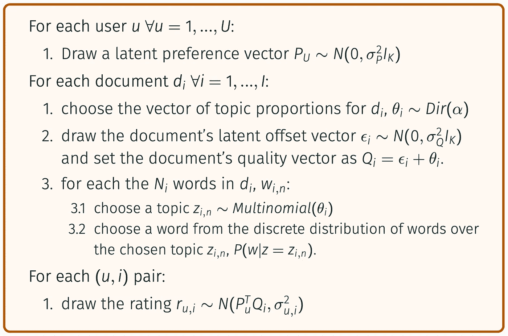

# 协作主题建模推荐系统指南

> 原文：<https://towardsdatascience.com/a-guide-to-collaborative-topic-modeling-recommender-systems-49fd576cc871?source=collection_archive---------13----------------------->

## 具有矩阵外预测能力的推荐系统的理论与实现。


马库斯·斯皮斯克在 [Unsplash](https://unsplash.com?utm_source=medium&utm_medium=referral) 上的照片

推荐系统是一大类机器学习模型，其目的是预测用户 *u* 会给一个项目 *i* 的未观察到的评级。

在本指南中，我们将讨论由 [Wang 和 Blei(2011)](http://www.cs.columbia.edu/~blei/papers/WangBlei2011.pdf)【3】介绍的**协作主题建模/回归(CTM/CTR)** ，这是一个基于文本的项目推荐系统，具有增强的准确性和矩阵外预测能力。我们还将为那些不关心模型背后的数学细节的人提供 Python3 实现。

CTM 建立在两个众所周知的模型上，即概率矩阵分解(PMF) [1]和潜在狄利克雷分配(LDA) [2]，因此需要对上述模型有初步的了解。对于那些不熟悉它们的人来说，网上有很多非常好的指南，其中包括:

*   [潜在的狄利克雷分配](/light-on-math-machine-learning-intuitive-guide-to-latent-dirichlet-allocation-437c81220158)，作者 Thushan Gangedara
*   [概率矩阵分解](/probabilistic-matrix-factorization-b7852244a321)，作者 Benjamin Draves

# 为什么要合作主题建模

概率矩阵分解(PMF)是一种非常简单而强大的方法，当我们唯一可用的数据是一个 *(U X I)* 稀疏评级矩阵时，它允许我们推断项目和用户潜在的特征。

不幸的是，这种方法的简单性也导致了它的消亡，因为 PMF 无法对新的、完全未评级的项目进行归纳:因为没有对项目 *j* 进行评级，所以该模型无法导出其潜在的质量向量。用技术术语来说，我们说 PMF 无法进行矩阵外预测。
在未评级的项目因为没有评级而没有得到推荐，并且因为没有得到推荐而一直没有评级的情况下，这个问题特别麻烦。这种情况的一个例子是科学出版物领域，在这一领域，不太知名的作者的新论文尽管质量很好，却无法到达潜在感兴趣的读者手中。

# 直觉

CTM 背后的核心思想是我们可以将文档 *i、Qᵢ* 的潜在质量向量表示为:


其中 *θᵢ* 是从传统 LDA 估计中获得的项目 *i* 的主题比例的*(k×1)*向量， *εᵢ* 是调整主题比例的*(k×1)***偏移向量**。偏移向量的基本原理是，它通过结合来自观察到的评级的信息来调整主题比例。
举个例子:假设你有两篇科学论文，而且都是 50%关于“机器学习”，50%关于“生物学”。现在，根据观察到的评级，可能第一篇论文对机器学习研究人员更有吸引力，而第二篇论文对生物学研究人员更有吸引力。使用偏移向量εᵢ，我们能够校准主题比例，以反映不同主题对不同个人的吸引力。

# 模型

就像它赖以建立的 PMF 和 LDA 一样，CTM 也有自己的生成过程:



概率矩阵分解的生成过程。注意，步骤 1.1、3.1 与 PMF 相同，步骤 2.1、2.3 与 LDA 相同。唯一建模不同的是步骤 2.2。

其中 *σ _P* 和 *σ _Q* 表示我们对 P 和 Q 中的向量元素的分布先验地施加*的方差。类似地， *σ* 表示我们对评级分布先验地施加的方差。对于那些不熟悉贝叶斯统计的人来说，这些值可以简单地视为我们模型的正则化超参数。*

通过使用平板符号表示生成过程，我们可以清楚地看到，CTM 只不过是 LDA 模型在 PMF 模型之上的堆叠版本，其中主题比例向量θᵢ被用作 *Qᵢ* 的生成分布的平均值。


# 学习参数

在推荐系统设置中，我们感兴趣的是获得对所有潜在变量的估计，这些变量有助于确定评级 rᵤᵢ.因此，我们会对 *θᵢ* 、 *Qᵢ* 、*、*和 *Pᵤ.感兴趣* 由于完全后验概率 *P(θ，Q，P)* 在分析上是难以处理的，我们借助于最大似然估计，其中我们数据的似然定义为:


像在大多数 MLE 场景中一样，使用对数似然法很方便:


单独导出四个分量中的每一个是很方便的。

**第一部分:**


**第二部分:**


**第三十部:**


为方便起见，假设α=1，上述分布变为:


**第四部分:**


我们的对数可能性将是:


本文最初采用的策略是使用坐标上升，在优化*【P，Q】*和 *θ之间迭代交替。*但正如同一作者指出的，使用通过标准 LDA 估计获得的对 *θ* 的估计，然后仅对 *[P，Q]* 进行优化，给出了可比较的结果，并在训练期间节省了大量时间。因此，我们将假设我们已经从 vanilla LDA 获得了我们的 *θ* 估计，并且我们将通过**梯度上升**来优化 *[P，Q】*。很容易得出我们的对数似然相对于*【P，Q】*的梯度:


上面的公式是本节的主要结果，我们将在下面的 Python3 中实现它。

# 代码实现

在本节中，我们将为 Steam 游戏创建一个推荐系统。我们将使用两个数据集:

*   [Steam 200k](https://www.kaggle.com/tamber/steam-video-games/version/1) ，包含关于超过 200k 用户-游戏交互的每个游戏游戏时间的信息；
*   [Steam games 完整数据集](https://www.kaggle.com/trolukovich/steam-games-complete-dataset)，包含超过 40k 款不同 Steam 游戏的各种信息，包括标题和描述

**注**:此处报告的代码并不详尽，应作为参考。您可以在此访问包含所有代码[的完整功能笔记本。](https://github.com/RussoMarioDamiano/Collaborative-Topic-Modeling)

## 预处理

首先，我们从打开 Steam games 完整数据集开始，只保留每个游戏的名称和描述。我们也放弃那些没有文字描述的游戏。

```
games = pd.read_csv("steam_games.csv")# keep only the columns of interest
games = games.loc[:, ["name", "game_description"]]# Drop NaN game descriptions and names
games = games[~games.game_description.isna()]
games = games[~games.name.isna()]# Drop the introductory " About This Game " text
games.game_description = games.game_description.apply(lambda x: x.replace(" About This Game ", ""))# drop single-space descriptions
games = games[games.game_description != " "]games.head(5)
```


然后，我们打开 Steam 200k 数据集。我们将尝试预测的评分变量是**以小时计的总播放时间**，它将被调整到 0 到 1 之间。

```
ratings = pd.read_csv("steam-200k.csv", header = None)# drop last empty column
ratings.drop(4, axis = 1, inplace=True)# rename columns
ratings.columns = ["UserID", "Title", "Action", "Value"]# keep only "play" variables
ratings = ratings[ratings.Action != "purchase"]
# and drop the "Action" column, as now it is all "play"s
ratings.drop("Action", axis = 1, inplace = True)# to ease computations, constrain PlayTime to be between 0 and 1
pt = ratings.Value
pt_scaled = (pt - pt.min()) / (pt.max() - pt.min())
ratings.Value = pt_scaledratings.head(3)
```


在这一点上，我们需要找到既有稀疏的观察评分向量又有描述的游戏。我们小写所有标题，并删除特殊字符[！,.-"?:]以增加标题之间的兼容性。为了避免不匹配，我们也放弃了所有非唯一标题的游戏。我们以 1982 年的标题结束，我们有评级和描述。

我们现在转向通过组合我们预处理的两个数据集来创建 *(U X I)* 评级矩阵。

```
R = pd.pivot_table(data=ratings, values = ["Value"], index=["UserID"], columns=["Title"])# remove the level on top of game names called "Value"
R.columns = R.columns.droplevel()# remove leftover columns name from pivot operation
R.columns.name = ""# lastly, fill in the NaNs with 0's
R.fillna(0, inplace=True)R.head(3)
```


从这个矩阵中，我们给出了数据集中第 1105 款游戏**“极品飞车卧底”**的收视率向量。我们将用它来测试我们矩阵外预测能力的有效性。

到 1981 年，我们最终的收视率矩阵将为 10058 个用户，只有 0.23%的收视率被观察到。

## 基于 LDA 的主题建模

在训练我们的 CTM 模型之前，我们需要通过训练 LDA 模型来提取每个游戏描述中的主题及其比例。我们要做的第一件事是对游戏描述进行词汇化，以减少词汇中的差异并提高 LDA 估计。

```
nlp = spacy.load("en")# lemmatize game descriptions
games["lemmas"] = [[[token.lemma_ if token.lemma_ != "-PRON-" else token.text.lower() for token in sentence if token.pos_ in {"NOUN", "VERB", "ADJ", "ADV", "X"}] for sentence in nlp(speech).sents] for speech in games.game_description]
```

然后，我们训练我们的 LDA 模型，找出所有游戏描述中的 *K* =15 个主题，并确定每个主题在每个描述中出现的百分比。

```
## Train LDA model ##
ldacorpus = [dictionary.doc2bow(text) for text in instances]
tfidfmodel = TfidfModel(ldacorpus)
model_corpus = tfidfmodel[ldacorpus]num_topics = 15
num_passes = 30
chunk_size = len(model_corpus) * num_passes/200model = LdaMulticore(num_topics=num_topics,
                    corpus=model_corpus,
                    id2word=dictionary,
                    workers=multiprocessing.cpu_count()-1,
                    chunksize=chunk_size,
                    passes=num_passes,
                    alpha=0.1)
## ## ## obtain the matrix of topic proportions per document ##
all_topics = model.get_document_topics(model_corpus, per_word_topics=True, minimum_probability=0.0)corpus_topics = []for doc_topics, word_topics, phi_values in all_topics:
    corpus_topics.append([topic[1] for topic in doc_topics])

corpus_topics = np.array(corpus_topics)theta = corpus_topics.copy().T
## #### remove the heldout game from the theta matrix ##
thet = pd.DataFrame(theta)
heldout_topics = thet.iloc[:, heldout_idx]
thet.drop(heldout_idx, axis = 1, inplace=True)
theta = thet.values
## ##
```

其中 *theta* 是 *(K X I)* 矩阵，它告诉我们 *K* =15 个主题中的每一个出现在每一个 *I* 游戏中的比例。

一旦我们有了评级矩阵和每项主题比例矩阵，我们就可以建立我们的 CTM 模型。

## **培训我们的 CTM 模型**

我们首先将我们的评级矩阵分成 X_train 和 X_val。

```
# train - test splitdef train_test_split(ratings, percs = [0.8, 0.2]):

    validation = np.zeros(ratings.shape)
    train = ratings.copy()

    for user in np.arange(ratings.shape[0]):
        val_ratings = np.random.choice(ratings[user,:].nonzero()[0],
                                        size = round(len(ratings[user,:].nonzero()[0]) * percs[1]),
                                        replace=False
                                        )
        train[user, val_ratings] = 0
        validation[user, val_ratings] = ratings[user, val_ratings]

    return train, validationX_train, X_val = train_test_split(R.values)
```

我们还为我们的预测评级定义了一个 MSE 函数。

```
from sklearn.metrics import mean_squared_errordef mse(prediction, ground_truth):
    prediction = prediction[ground_truth.nonzero()].flatten()
    ground_truth = ground_truth[ground_truth.nonzero()].flatten()
    return mean_squared_error(prediction, ground_truth)
```

最后，我们建立我们的 CTM 模型:

```
from tqdm import trange
import sysclass CTR():
    """
    Collaborative Topic Regression Model as developed by Wang and Blei (2012).
    Leverages topic proportions obtained from LDA model to improve predictions
    and allow for out-of-matrix predictions.

    Parameters:
        - sigma2: expected variance of ratings 
                  (variance of the ratings Normal prior)
        - sigma2_P: expected variance of the elements of the
                    preference vector
        - sigma2_Q: expected variance of the elements of the
                    quality vector
    """
    def __init__(self, epochs=200, learning_rate=0.001, sigma2=10, sigma2_P=10, sigma2_Q=10):
        self.epochs = epochs
        self.learning_rate = learning_rate
        self.sigma2 = sigma2
        self.sigma2_P = sigma2_P
        self.sigma2_Q = sigma2_Q

    def fit(self, theta, X_train, X_val):
        """
        Fit a CTR model.

        Parameters:
            - theta: (K X I) matrix of topic proportions obtained via LDA.
            - X_train: (U X I) ratings matrix to train the model on.
            - X_test: (U X I) ratings matrix to validate the model on.
        """

        K = theta.shape[0]
        U, I = X_train.shape

        #initialize P and Q matrices.
        # P is initialized randomly
        self.P = np.random.randint(0, 10) * np.random.rand(K, U)
        # Q is initialized to be equal to theta
        self.Q = theta.copy()

        self.train_error = []
        self.val_error = []

        # obtain the pairs of (u, i) indices for which we observe a rating
        users, items = X_train.nonzero()

        # begin training
        for iteration in trange(self.epochs, file=sys.stdout, desc='CTR'):
            for u, i in zip(users, items):
                error = X_train[u, i] - np.dot(self.P[:, u].T, self.Q[:, i])# we are MAXIMIZING the likelihood via gradient ascent
                self.P[:, u] += self.learning_rate * (-self.P[:, u]/self.sigma2_P + (self.P[:, u] * error)/self.sigma2)
                self.Q[:, i] += self.learning_rate * (-(self.Q[:, i] - theta[:, i])/self.sigma2_Q + (self.Q[:, i] * error)/self.sigma2)self.train_error.append(mse(np.dot(self.P.T, self.Q), X_train))
            self.val_error.append(mse(np.dot(self.P.T, self.Q), X_val))

    def predict_ratings(self):
        """
        Returns the matrix of predicted ratings.
        """
        return np.dot(self.P.T, self.Q)

    def predict_out_of_matrix(self, topics):
        """
        Returns the (U X 1) vector of predicted ratings 
        for an unrated item, using the item's topic proportions.

        Parameters:
            - topics: (K X 1) array of topic proportions
                      for the unrated item.
        """
        return np.dot(self.P.T, topics)
```

并训练模型:

```
ctr = ctr = CTR(sigma2_P=5, sigma2_Q=5, sigma2=1)
ctr.fit(theta, X_train, X_val)
```

在训练结束时，我们的`ctr`对象将已经学习了潜在矩阵 P 和 Q，并将能够通过它们的点积来预测评分矩阵中缺失的值。

下面是 100 个时期的整个训练的 MSE 性能，在最后一个训练时期记录的验证集上有 0.126 MSE。


对单个保持观察的性能具有 0.35 的 MSE。当然，这没有矩阵内预测记录的高，但如果我们考虑到我们推荐的是矩阵外的项目，这是相当令人印象深刻的。

我们对我们的结果感到满意，但是在这种情况下，协作主题回归与传统的概率矩阵分解相比表现如何呢？显然很好。标准因式分解方法达到了 0.32 MSE，而 CTM 达到了 0.126。


## 附加功能

CTM 特有的潜在主题结构增加了进一步的可解释性，以做出推论。首先，CTM 相对于传统 PMF 的额外好处是，我们能够标记学习到的潜在维度，看到每个主题在每个项目中有多突出。注意:这些不是从 LDA 学习的主题比例，而是通过 CTM 模型学习的主题相关性！


我们还可以通过简单的 *P* 矩阵的水平求和来研究用户偏好在 *K* 潜在维度上的分布:


可以对项目而不是用户进行同样的操作，以查看类型如何在我们的项目中分布:


# 结论

在本文中，我们提出了协同主题建模，如王和 Blei (2011)所述，这是一种改进的基于文本项目的矩阵分解推荐系统。该模型的性能通常优于传统的矩阵分解方法，并具有额外的优势，如**矩阵外预测**和潜在维度可解释性。

一般来说，校准 CTM 模型的最大挑战是找到超参数的最佳组合，使我们的数据表现最佳。事实上，我们需要调整:

*   *alpha* ，来自 LDA 模型。
*   *话题数量 K*
*   *学习率*
*   *sigma2，sigma2_P* ， *sigma2_Q，*分别关于 R，P，Q 的先验分布的超参数。

第二，由于模型的随机性质，在 LDA 阶段和 CTM 训练阶段，在单独的训练中模型的性能可能有很多可变性。

尽管不能保证比 PMF 有所改进，但 CTM 确实是一种在处理基于文本的文档推荐任务时应该考虑的方法，因为它通常具有更高的性能和矩阵外预测能力。

# 参考

[1] Mnih、Andriy 和 Russ R. Salakhutdinov。"概率矩阵分解."*神经信息处理系统的进展*。2008.

[2]布莱、戴维·m、安德鲁·Ng 和迈克尔·乔丹。"潜在的狄利克雷分配."*机器学习研究杂志* 3。一月(2003):993–1022。

[3]王、钟和戴维·布雷。"用于推荐科学文章的协作主题建模."第 17 届 ACM SIGKDD 知识发现和数据挖掘国际会议论文集*。2011.*