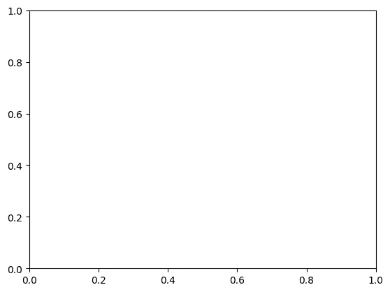
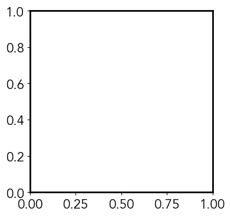
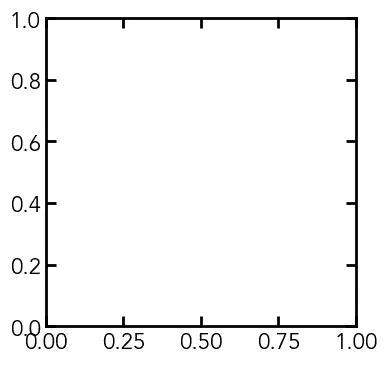
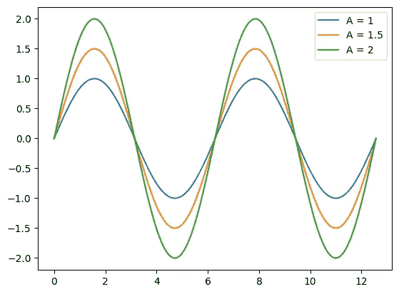
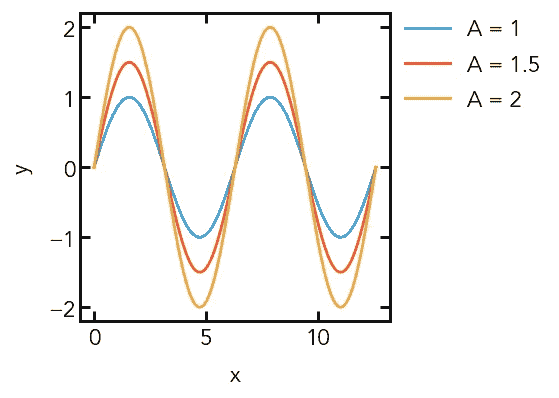

# 创建和使用自己的 Matplotlib 样式的指南

> 原文：<https://towardsdatascience.com/a-guide-to-creating-and-using-your-own-matplotlib-style-30de6c60bac0?source=collection_archive---------32----------------------->

## Python 科学绘图

## 创建样式模板以方便重复使用 matplotlib 设置


杰斯·贝利在 [Unsplash](https://unsplash.com/s/photos/colors?utm_source=unsplash&utm_medium=referral&utm_content=creditCopyText) 上拍摄的照片

虽然使用`matplotlib`制作的默认图形看起来有些单调，但我真的很喜欢它的可定制性，它允许你调整图形中的每一个微小元素。

如果您发现自己每次创建一个新图形时都不断地更改`matplotlib`中的一些基本设置，那么生成一个样式文件可能会很有成效。通过导入这种样式，您可以确保一致性，同时仍然能够在单个脚本中根据需要覆盖设置。例如，如果您正在为出版物生成图形，并且希望它们看起来都一样，而不必每次都复制/粘贴设置，那么这将非常有用。

你可以在`matplotlib` [Github 库](https://github.com/matplotlib/matplotlib/blob/master/matplotlibrc.template)找到一个样式文件的模板。正如你所看到的，有几乎无穷无尽的设置，你可以自定义你的愿望！我们将以此为指导创建我们自己的样式文件。

在我们开始之前，我们应该使用默认的`matplotlib`参数创建一个空图作为比较的基础:

```
# Import packages
import matplotlib.pyplot as plt# Create figure
fig = plt.figure()# Add subplot to figure
ax = fig.add_subplot(111)# Show empty plot
plt.show()
```



使用默认参数的空 matplotlib 图

# **创建和使用一个** `**.mplstyle**` **文件**

首先，我们必须创建一个名为`your_style.mplstyle`的文件，然后我们可以用您选择的文本编辑器编辑它。我将基于我的第一篇文章的科学主题，所以我们将创建一个名为`scientific.mplstyle`的风格。要运行这种风格，我们必须将它放在我们的`matplotlib`配置目录中。一种简单的检查方法是运行下面的代码:

```
import matplotlib as mpl
mpl.get_configdir()
```

我的配置目录，可能与大多数目录相似，位于我的主目录的一个子文件夹中:`~/.matplotlib/`

我们将`.mplstyle`文件放在一个名为`stylelib`的子目录中。如果这个文件夹对你来说还不存在，可以创建它并把你的`scientific.mplstyle`文件放到这个文件夹里。现在，当您想要使用您的样式时，在您的 Python 脚本中使用以下行:

```
plt.style.use('scientific')
```

# **图属性**

首先，我们可以设置图形大小，通常为 6.4 x 4.8 英寸。我们将使用 4 x 4 英寸的图形作为默认图形。现在，每次我们调用`plt.figure()`，我们的图形将具有 4 x 4 的尺寸:

```
# Figure Properties
figure.figsize: 4, 4
```

现在我们可以设置我们的字体和默认字体大小。我将使用字体“Avenir”和 16 号字体。

```
# Font Properties
font.family: Avenir
font.size: 16
```

# **轴属性**

现在我们已经更改了全局图形属性，让我们编辑轴/子图形对象的属性。首先，我们想改变轴的粗细，我们使用`axes.linewidth`来实现:

```
# Axes properties
axes.linewidth: 2
```

接下来，我经常发现刻度标签和轴标签之间的默认填充(空白)太小。我们可以插入自己的自定义填充值，如下所示:

```
axes.labelpad: 10
```

最后，我们将更改绘图时使用的默认颜色，这可以通过编辑颜色循环程序来完成。我们通过创建一个`cycler()`对象并将其传递给属性`axes.prop_cycle`来实现这一点。我很喜欢[五点三十八](https://fivethirtyeight.com/)的剧情中使用的颜色，所以会用这个作为我们的色环。我将使用十六进制代码插入颜色:

```
axes.prop_cycle: cycler(color=['008fd5', 
                               'fc4f30', 
                               'e5ae38',
                               '6d904f',
                               '8b8b8b',
                               '810f7c'])
```

让我们检查一下到目前为止的进展吧！我们使用以下代码:

```
# Import packages
import matplotlib.pyplot as plt# Use our custom style
plt.style.use('scientific')# Create figure
fig = plt.figure()# Add subplot to figure
ax = fig.add_subplot(111)# Show empty plot
plt.show()
```



已经好看多了！我们注意到刻度线与我们所做的一些轴更改不匹配，因此这将是我们的下一步。

# **Tick 属性**

我们从默认图中注意到，刻度线指向外面，在顶部或右侧轴上没有刻度。对于我们的科学主题，我们希望刻度都指向内部，并且我们希望刻度位于所有轴上，这可以通过以下方式实现:

```
# Tick properties
# x-axis
xtick.top: True
xtick.direction: in# y-axis
ytick.right: True
ytick.direction: in
```

现在，我们想改变两个属性`size`和`width`。`width`的值对应于线宽，所以我们将它设置为等于我们给`axes.linewidth` (2)的值。`size`的值是分笔成交点的长度——我们将主要分笔成交点的大小设置为 7，次要分笔成交点的大小设置为 5:

```
# x-axis
xtick.major.size: 7
xtick.major.width: 2xtick.minor.size: 5
xtick.minor.width: 2# y-axis
ytick.major.size: 7
ytick.major.width: 2ytick.minor.size: 5
ytick.minor.width: 2
```

我们现在有了下图——记号现在已经被修复了！



# **线条属性**

如果我们想编辑调用`plt.plot()`时使用的任何默认参数，我们可以通过编辑`lines`的属性来实现。这可以扩展到其他绘图功能——例如，您可以编辑`scatter`的属性，以影响创建散点图时的默认参数。在我们的例子中，我只打算将线条的默认宽度从默认值 1.5 更改为 2:

```
# Lines properties
lines.linewidth: 2
```

# **图例属性**

`matplotlib`中的默认图例是半透明的，并且有一个称为`FancyBox`的带弯曲角的框架。要了解这一点，我们可以使用所有默认参数运行以下代码:

```
# Import packages
import matplotlib.pyplot as plt
import numpy as np# Create figure
fig = plt.figure()# Add subplot to figure
ax = fig.add_subplot(111)# Create some data
x = np.linspace(0, 4*np.pi, 200)
y1 = np.sin(x)
y2 = 1.5*np.sin(x)
y3 = 2*np.sin(x)# Plot data
ax.plot(x, y1, label='A = 1')
ax.plot(x, y2, label='A = 1.5')
ax.plot(x, y3, label='A = 2')# Add legend
ax.legend()# Show plot
plt.show()
```



默认 matplotlib 图例-半透明赋予边框灰色

让我们使图例完全不透明，并完全移除框架:

```
# Legend properties
legend.framealpha: 1
legend.frameon: False
```

# **最终结果**

现在，让我们看看以前的情节如何与我们的新`matplotlib`风格！我们使用以下代码:

```
# Import packages
import matplotlib.pyplot as plt
import numpy as np# Use our custom style
plt.style.use('scientific')# Create figure
fig = plt.figure()# Add subplot to figure
ax = fig.add_subplot(111)# Create some data
x = np.linspace(0, 4*np.pi, 200)
y1 = np.sin(x)
y2 = 1.5*np.sin(x)
y3 = 2*np.sin(x)# Plot data
ax.plot(x, y1, label='A = 1')
ax.plot(x, y2, label='A = 1.5')
ax.plot(x, y3, label='A = 2')# Set axis labels
ax.set_xlabel('x')
ax.set_ylabel('y')# Add legend - loc is a tuple specifying the bottom left corner
ax.legend(loc=(1.02, 0.65))# Save plot
plt.show()
```

三…二…一…



我们还可以做一些小的调整，比如调整 x 和 y 刻度的比例，但是通过让我们的样式设置为我们做大部分工作，我们的生活变得简单多了！

# **结束语**

对于如何调整属性来定义`matplotlib`图的样式，有无限的可能性。本文的`scientific.mplstyle`文件将在这个 [Github 资源库](https://github.com/venkatesannaveen/python-science-tutorial)中提供。

感谢您的阅读！我感谢任何反馈，你可以在 [Twitter](https://twitter.com/naveenv_92) 上找到我，并在 [LinkedIn](https://www.linkedin.com/in/naveenvenkatesan/) 上与我联系，以获得更多更新和文章。