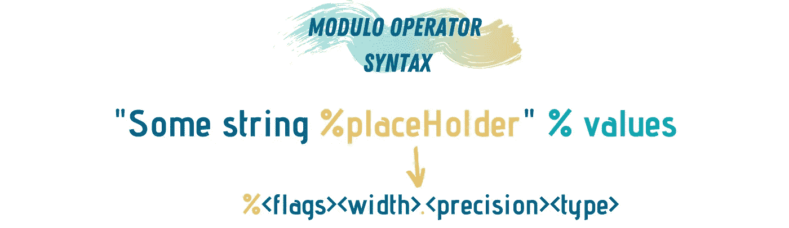
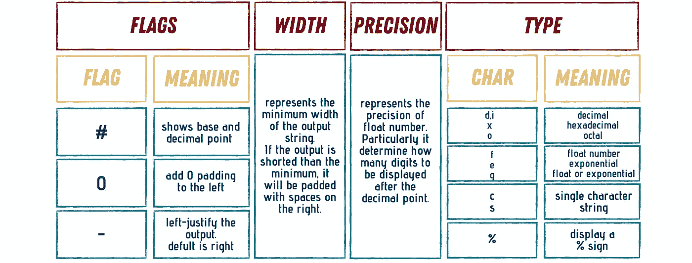
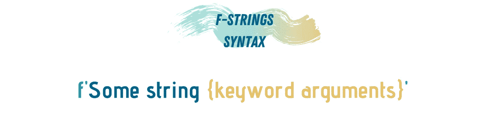
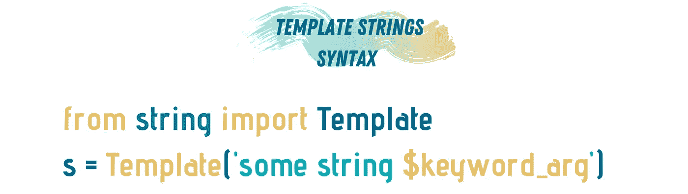

# Python 中所有字符串格式的指南

> 原文：<https://towardsdatascience.com/a-guide-to-everything-string-formatting-in-python-e724f101eac5?source=collection_archive---------18----------------------->

## 你需要知道的关于 Python 中格式化字符串的五个方法


由[萨法尔萨法罗夫](https://unsplash.com/@codestorm?utm_source=medium&utm_medium=referral)在 [Unsplash](https://unsplash.com?utm_source=medium&utm_medium=referral) 上拍摄的照片

字符串是编程中最基本和最常用的数据类型之一。它允许计算机与世界进行交互和通信，例如打印指令或读取用户的输入。操纵和合成字符串的能力赋予程序员处理和操纵文本的能力，例如，从网站表单中提取用户输入，从处理的文本中提取数据，并使用这些数据执行情感分析等活动。情感分析是自然语言处理的一个子领域，它允许计算机根据一段文本对情绪进行分类——消极、积极或中性。

> “所有的情绪是正确的；因为感情除了它自己之外，没有别的意义，只要一个人意识到它，它总是真实的。”—大卫·休谟

Python 是仅次于 r 的用于分析和操作数据的主要编程语言之一。Python 用于数据分析，以帮助访问数据库并与之通信。它在使用不同的 web 抓取技术导入和导出数据时也很有用。一旦获得这些数据，Python 就被用来清理和准备数据集，然后将它们输入到机器学习算法中。

使用 Python 格式化字符串有五种方式:使用*模*操作符格式化字符串，使用 Python 内置的 *format* 函数格式化，使用 Python 3.7 *f-strings* 格式化，手动*格式化*，最后使用*模板*字符串。我们将介绍这些方法中的每一种，以及何时使用它们。

让我们开门见山吧…

# 使用模运算符



图片由作者提供(使用 [Canva](https://www.canva.com/) 制作)

如果您以前使用 C 或 C++编写过代码，您会觉得非常熟悉。在 Python 中，我们可以使用模运算符(%)来执行简单的位置格式化。我在这里称之为*占位符*，它代表了格式化和转换字符串的控制规范。%告诉解释器下面的字符是转换字符串的规则。转换规则包括关于结果格式化字符串的期望宽度、结果的类型和精度的信息——在浮点的情况下。



图片由作者提供(使用 [Canva](https://www.canva.com/) 制作)

这种类型的字符串格式有时被称为“旧样式”格式。*占位符*可以直接引用值，也可以使用关键字参数指定。

```
formatted_str = 'Yesterday I bought %d %s for only %.2f$!' % (10, 2'bananas',2.6743)
```

如果我们试图打印这个字符串，我们将得到`Yesterday I bought 10 bananas for only 2.67$!`。

正如你在这里看到的，我有三个*占位符*用于三个值，第一个*整数*，第*字符串* —香蕉，以及香蕉的价格，这是一个*浮点数*。当提到浮点数时，我认为精度为 2 是我所需要的；这就是为什么小数点后只显示 67 的原因。

在前面的例子中，我们直接用值替换了*占位符*。还有另一种方法可以实现这种映射，那就是使用关键字参数或者传递一个字典。

```
name = 'John'
balance = 235765
formatted_str = 'Hello %(name)s, your current balance is %(balance)6.0f dollars.' % {"name":name, "balance":balance}
```

使用这种方法，我们需要使用`{}`而不是`()`。正因为如此，我们也可以直接使用字典来填充*占位符*。

```
dictionary = {'quantity': 10, 'name': 'bananas', 'price': 2.6743}
formatted_str = 'I got %(quantity)d %(name)s for $%(price).2f$' % dictionary
```

本节的完整代码:

# 使用格式方法


图片由作者提供(使用 [Canva](https://www.canva.com/) 制作)

在 Python 3 中，该语言引入了一种新的方法来规范%操作符语法。这是使用内置的格式方法完成的，也称为“新样式”格式。使用 format 方法与使用%运算符有许多共同点。让我们考虑重写以前的一些例子:

```
name = 'John'
balance = 235765
formatted_str = 'Hello %(name)s, your current balance is %(balance)6.0f dollars.' % {"name":name, "balance":balance}
```

会变成:

```
name = 'John'
balance = 235765
formatted_str = 'Hello {name:s}, your current balance is {balance:6.0f} dollars.'.format("name":name, "balance":balance)
```

我们可以将%运算符语法和 format 方法之间的差异总结如下:

1.  通过%操作符，我们在字符串中使用了`()`，而对于格式方法，我们使用了`{}`。
2.  为了定义%运算符中的转换类型，我们将其设置在%之后，而在 format 函数中，我们将转换设置在`:`之后的`{}`中。

但是，如果我们想将字典传递给格式字符串，我们需要稍微修改一下重新造林。我们需要传递一个指向字典的指针，而不是传递字典的名称，例如:

```
dictionary = {'quantity': 10, 'name': 'bananas', 'price': 2.6743}
formatted_str = 'I got {quantity:d} {name:s} for {price:.2f}$'.format(**dictionary)
```

此外，我们可以使用与 format 方法中使用的%运算符相同的转换规则。在 Python 3 和 3.6 版本中，format 方法比%运算符方法更受欢迎。format 方法提供了一种格式化字符串的强大方法；它没有使简单的情况变得复杂——比如上面的例子——但是，同时为我们如何格式化字符串提供了新的层次。

本节的完整代码:

# 使用 f 弦



图片由作者提供(使用 [Canva](https://www.canva.com/) 制作)

在我看来，这是格式化字符串最有趣、最优雅的方法。f-string 在 Python 3.8 中作为一种更直接的字符串格式化方法出现。在我们进入 f-strings 之前，让我们快速了解一下 Python 3.8 及更高版本中的三种类型的字符串。

1.  **正常/标准字符串:**包含在“”或“”之间，例如`“Hello, world!”`。这些是最常用的字符串类型。
2.  **原始字符串**:由 r”引导，例如`r’hello\nworld’`。在这种类型的字符串中，不对字符串进行任何处理。也就是说，转义字符在这些字符串中不起作用。相反，它们将不经过任何处理就被打印出来。这种类型的字符串主要用在正则表达式中。
3.  **f 弦:**由 f 引”，例如`f’hello John!’`。F-strings 用作格式化字符串的替代方法。

[](/programmers-guide-to-master-regular-expression-f892c814f878) [## 程序员指南掌握正则表达式

### 了解语言类比

towardsdatascience.com](/programmers-guide-to-master-regular-expression-f892c814f878) 

string 提供了一种简单的方法，通过直接将表达式嵌入到字符串中来格式化字符串。让我们再看一遍之前的例子。

```
name = 'John'
balance = 235765
formatted_str = 'Hello {name:s}, your current balance is {balance:6.0f} dollars.'.format("name":name, "balance":balance)
```

如果我们想使用 f 字符串重写这种格式，它将看起来像:

```
name = 'John'
balance = 235765
formatted_str = f'Hello {name}, your current balance is {balance} dollars.'
```

f-string 简化字符串格式的一种方法是，我们可以直接传递 iterables——字典、列表等。—字符串，如下所示:

```
dictionary = {'quantity': 10, 'name': 'bananas', 'price': 2.6743}
formatted_str = f'I got dictionary[quantity] dictionary[name] for dictionary[price]$'#f-string with lists
myList = [1,2,3,4]
formatted_str = f'The last item of the list is myList[-1]'
```

您还可以直接在 f 字符串中执行简单的算术或逻辑运算。

```
#Arithmetic
myList = [1,2,3,4]
formatted_str = f'The sum of the last and first items of the list is myList[0] + myList[-1]'
#Logic
formatted_str = f'myList[0] == myList[-1]'
```

string 为我们在想要格式化的字符串中使用的选项提供了更多的自由，例如列表索引、调用列表或字典方法，或者通用的 iterables 函数——例如，`len`、`sum`、`min`和`max`。我们还可以在 f 字符串中使用条件语句:

```
age = 21
formatted_str = f'You {"can't" if age < 21 else "can"} drink!'
```

本节的完整代码:

# 手动格式化

手动格式化是指使用标准的[字符串方法](https://docs.python.org/2.5/lib/string-methods.html)来格式化字符串。大多数情况下，我们使用`rjust`、 `ljust`和`center`来调整字符串。`rjust`方法通过在左边填充空格来右对齐给定宽度的字符串。`ljust`在右边添加填充，`center` 方法在字符串两边添加填充。这些方法不修改原始字符串；而是返回一个新的修改过的字符串。还有另一种字符串方法可以用来格式化字符串，那就是`zfill` 方法。此方法用一个左边带零的数值填充字符串。

# 使用模板字符串



图片由作者提供(使用 [Canva](https://www.canva.com/) 制作)

[模板字符串](https://docs.python.org/3.4/library/string.html#template-strings)是%操作符的替代物，但是模板字符串使用$符号代替%。这两种方法都提供了我们所说的替换格式。Python 中没有内置模板字符串，因此要使用它们，我们需要首先导入`string`模块。模板字符串有三个规则:

1.  `$$`是转义字符。
2.  直接跟在`$`符号后面的是模板的*占位符*。默认情况下，这些*占位符*被限制为任何不区分大小写的字母数字字符串。$符号后的第一个非占位符字符终止了这个*占位符*规格，例如，一个空白字符。

这些规则和更多的规则已经在 string 模块中定义了，所以一旦导入，您就可以继续使用它们，而不需要定义它们。

模板字符串有两个主要方法:`substitute`方法和`safe_substitute`方法。这两种方法采用相同的参数，即替代映射。此外，两种方法都返回一个新的格式化字符串，您可以将模板对象视为未来字符串格式化的蓝图。例如:

```
**from** string **import** Template
formatted_str = Template('Hello $who, your current balance is $how dollars.')
formatted_str.substitute(who='John', how=235765)
```

要了解 substitute 和 safe_substitute 方法之间的区别，让我们尝试使用一个字典作为我们的替换映射。

```
**from** string **import** Template
mapping = dict(who='John', how=235765)
formatted_str = Template('Hello $who, your current balance is $how dollars.')
Returned_str = formatted_str.substitute(mapping)
```

假设我们的字典没有映射所需的所有键，使用`substitute`方法将给出一个 **keyError** 。这里是`safe_substitute`提供帮助的地方，如果这个方法没有找到正确的键，它将返回一个带有*占位符*的字符串来表示错误的键。例如，这段代码:

```
**from** string **import** Template
mapping = dict(who='John')
formatted_str = Template('Hello $who, your current balance is $how dollars.')
Returned_str = formatted_str.safe_substitute(mapping)
```

我将返回`Hello John, your current balance is $how dollars.`，如果我使用了`substitute`方法，我会得到一个错误。

本节的完整代码:

## 结论

在本文中，我们介绍了在 Python 中格式化字符串的五种不同方法:

1.  模运算符。
2.  格式功能。
3.  f 弦。
4.  手动格式化。
5.  模板字符串。

每种方法都有其使用优点和缺点。Dan Badar 提出了一个通用的经验法则，如果你格式化的字符串是用户获得的，那么模板字符串是一个不错的选择。否则，如果您使用 Python 3.7 或其他地方的 format 函数，请使用 f 字符串。