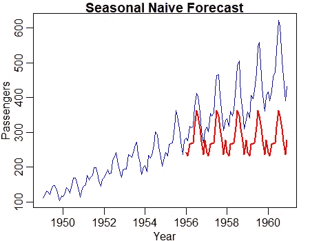
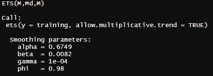
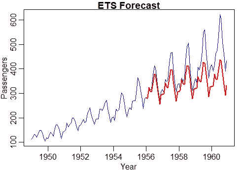
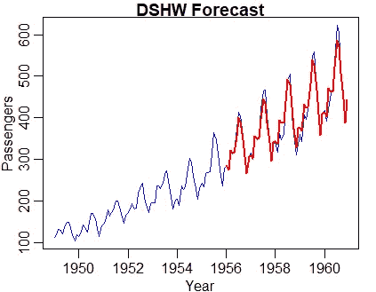
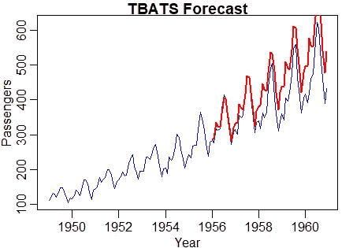
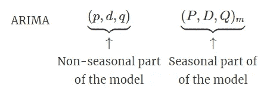
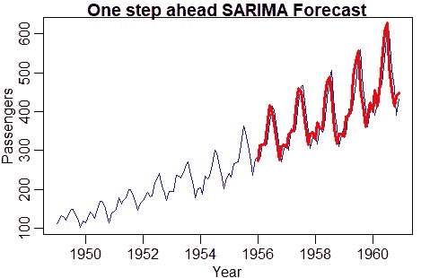

# R 中的时间序列预测

> 原文：<https://towardsdatascience.com/a-guide-to-forecasting-in-r-6b0c9638c261?source=collection_archive---------3----------------------->

## 指数平滑、TBATS、ARIMA、萨里玛等


来源:https://unsplash.com/photos/pGcqw1ARGyg

Python 很棒，但是说到预测，我个人认为 R 还是占了上风。**预测**包是 R 或 Python 上最完整的预测包，值得了解一下。

下面是我们将在本文中看到的内容:

1.  幼稚的方法
2.  指数平滑(状态空间模型和 DSHW)
3.  蝙蝠和蝙蝠
4.  SARIMA 萨里玛模型
5.  如何设置提前一步预测

对于每种方法，我们将在验证集上建立一个模型，用它预测验证集的持续时间，并将预测与真实观测值进行比较，以获得平均绝对百分比误差(MAPE)。

所使用的数据将来自 r。

```
library(forecast)
library(MLmetrics)data=AirPassengers**#Create samples** training=window(data, start = c(1949,1), end = c(1955,12))
validation=window(data, start = c(1956,1))
```

# 1.幼稚的方法

**任何预测方法都应该通过与一种简单的方法进行比较来进行评估**。这有助于确保在性能方面为拥有更复杂的模型所付出的努力是值得的。

所有方法中最简单的叫做简单朴素。极其简单:对明天的预测就是我们今天所观察到的。

另一种方法，季节性天真，稍微复杂一点:对明天的预测是我们前一周/月/年(取决于我们使用的是什么样的时间范围)观察到的。

以下是如何做一个季节性的简单预测:

```
naive = snaive(training, h=length(validation))
MAPE(naive$mean, validation) * 100
```

这给了我们 27.04%的 MAPE。那是要打破的分数。顺便说一下，去掉“snaive”中的 s，你就有了简单天真的代码。以下是如何绘制预测图:

```
plot(data, col="blue", xlab="Year", ylab="Passengers", main="Seasonal Naive Forecast", type='l')
lines(naive$mean, col="red", lwd=2)
```



我们看到，在过去一年的数据中发生的事情被重复作为对整个验证集的预测。

# 2.指数平滑法

做指数平滑有很多方法。这个想法总是让观察的权重递减。越是最近的观察，它在我们的预测中就越重要。

也可以添加参数。例如，您可以添加一个趋势参数(霍尔特方法)或添加一个季节性参数(霍尔特-温特斯)。

## 2.1 状态空间模型

使用预测包，**平滑方法可置于状态空间模型的结构中。**通过使用这种结构，我们可以找到最优的指数平滑模型，使用 ets 函数。

```
ets_model = ets(training, allow.multiplicative.trend = TRUE)
summary(ets_model)
```



我们看到 ETS (M，Md，M)。这意味着我们有一个带有倍增误差、倍增趋势和倍增季节性的 ets 模型。基本上，乘法意味着参数随着时间被“放大”。例如，随着时间的推移，这种趋势变得越来越大(我们的情况就是如此)。

以下是如何使用估计最佳平滑模型进行预测:

```
ets_forecast = forecast(ets_model, h=length(validation))
MAPE(ets_forecast$mean, validation) *100
```



我们看到，需求的上升趋势正被一点点捕捉到(远非完美，比天真要好)。它给出了 12.6%的 MAPE。

## 2.2 双季节冬令

ets 功能不错，但是只允许一个季节性。有时，我们拥有的数据可以由多个季节组成(例如，每月和每年)。

双季节霍尔特-温特斯(DSHW)允许两个季节:较小的季节经常重复，较大的季节不经常重复。然而，为了使该方法有效，季节性需要嵌套，这意味着一个必须是另一个的整数倍(2 和 4，24 和 168，等等。).

这里的代码有点不同，因为我们需要指定两个季节的长度(**，这并不总是我们所知道的**)，并且预测是在使用 dshw 函数创建模型时直接计算的。

```
dshw_model = dshw(training, period1=4, period2 = 12, h=length(validation))MAPE(dshw_model$mean, validation)*100
```



用这种方法我们得到了 3.7%的 MAPE！

# 3.蝙蝠和蝙蝠

DSHW 不错，但是有些流程有比较复杂的季节性，我们之前的函数无法处理。事实上，你可以同时拥有每周和每年的季节性。你甚至可以有两个以上！

蝙蝠和 TBATS 允许多个季节。 **TBATS 是 BATS 的一种改型(实际上是一种改进)，允许多个非整数季节性周期**。

以下是如何构建 TBATS 模型并使用它进行预测:

```
tbats_model = tbats(training)
tbats_forecast = forecast(tbats_model, h=length(validation))MAPE(tbats_forecast$mean, validation) * 100
```



我们用这种方法得到了 12.9%的 MAPE。

# 4.SARIMA 萨里玛模型

ARIMA 模型包含三样东西:

*   **AR(p)** :模型的自回归部分。意味着我们使用时间序列中 p 个过去的观察值作为预测值。
*   **差分(d):** 用于通过在适当的滞后 d 取连续观测值之间的差值，将时间序列转换为平稳序列。
*   **MA(q)** :使用 q 个过去的预测误差作为预测值。

这就是 ARIMA 的情况，但是如果你知道你拥有的数据是季节性的，那么你需要更多。这就是萨里玛发挥作用的地方。

SARIMA 为该款增加了季节性元素。



来源:[https://otexts.com/fpp2/seasonal-arima.html](https://otexts.com/fpp2/seasonal-arima.html)

p 代表季节性 AR 阶，D 代表季节性差分阶，Q 代表季节性 MA 阶，m 代表每年的观察次数。

**auto . ARIMA 函数可用于返回最佳估计模型**。代码如下:

```
arima_optimal = auto.arima(training)
```

该函数返回以下模型:ARIMA(0，1，1)(1，1，0)[12]。

要预测一个 SARIMA 模型(这就是我们这里的模型，因为我们有一个季节性部分)，我们可以使用 astsa 包中的 sarima.for 函数。

```
library(astsa)
sarima_forecast = sarima.for(training, n.ahead=length(validation),
                              p=0,d=1,q=1,P=1,D=1,Q=0,S=12)MAPE(sarima_forecast$pred, validation) * 100
```


我们用这个萨里玛模型得到了 6.5%的 MAPE。

如你所知，理论上我们可以通过在 ARIMA/萨里玛模型中加入外生变量(解释变量)来使事情变得更加复杂，这将使它成为萨里玛模型。

对于这个数据，DSHW 给出了最好的结果。但是请记住，没有一个模型总是做得最好。

# 5.设置一步预测

在前面的例子中，我预测了未来 5 年。但是，如果您想每天进行预测，为什么要使用 5 年前的预测值，而您可以使用真实的观察值来预测明天呢？

建立提前一步预测的想法是，评估如果您在 5 年内使用最新的观测值进行提前一天的预测，模型会做得有多好。

简单地说:**我们不是对未来的 60 个月进行一次预测，而是利用最新的观察结果对下个月进行 60 次预测。**

编写这样的代码非常简单。我们所需要的是迭代地将最新的观察结果添加到训练数据集中，从那里进行预测并重复。下面是使用我们之前找到的 SARIMA 模型来实现它的代码。

```
one_step_ahead_sarima = matrix(ncol = 2, nrow = 60)for (i in 1:60){

  training_observed = window(data, start = c(1949,1), end = c(1955,(12+i)), frequency = 12)

  forecasted.sarima = sarima.for(training_observed,n.ahead=1,p=0,d=1,q=1,P=1,D=1,Q=0,S=12)

  demandforecast = forecasted.sarima$pred
  observed = validation[[i]]

  one_step_ahead_sarima[i,1]= observed
  one_step_ahead_sarima[i,2]= demandforecast}MAPE(one_step_ahead_sarima[,1], one_step_ahead_sarima[,2]) * 100
```

如您所见，对于每一次迭代，训练集增长一个观测值，计算 n.ahead=1 的新预测，结果存储在 *one_step_ahead_sarima* 矩阵中。

下面是如何得到这个情节:

```
plot(data, col="blue", xlab="Year", ylab="Passengers", main="SARIMA Forecast", type='l')
lines(ts(one_step_ahead_sarima[,2], start = c(1956,1), frequency = 12), col="red", lwd=3)
```



我们得到了 4.1%的 MAPE，这比我们使用相同的 SARIMA 模型预测未来 5 年的情况提高了 2%以上。

考虑到预测范围越短，预测应该越好，这并不奇怪。这就是为什么如果可能的话，你应该总是建立一个提前一步的预测！

我希望这有所帮助。非常感谢你的阅读！

成为会员:【https://francoisstamant.medium.com/membership】T4