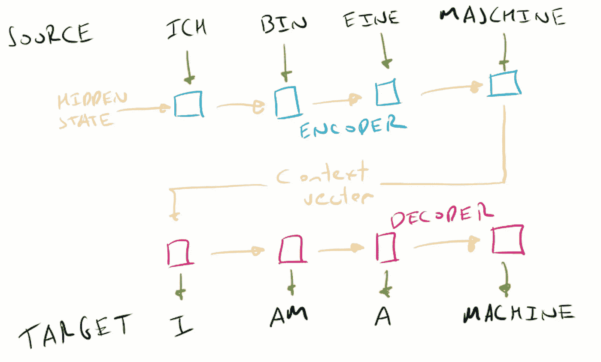

# 深度学习层指南

> 原文：<https://towardsdatascience.com/a-guide-to-four-deep-learning-layers-225c93646e61?source=collection_archive---------34----------------------->

## 完全连接，卷积，LSTM 和注意力都说明和解释。


作者照片-尼泊尔。

**这篇帖子是关于四个重要的神经网络层架构**——机器学习工程师用来构建深度学习模型的构建模块:

1.  全连接层，
2.  2D 卷积层，
3.  LSTM 层，
4.  注意力层。

对于每一层，我们将了解:

*   **每层如何工作**，
*   每一层背后的**直觉**，
*   每层的**感应偏置**，
*   每层的**重要超参数**是什么，
*   **何时使用**每层、
*   **tensor flow 2.0 中各层如何编码**。

所有代码示例都是使用 Keras Functional API 使用`tensorflow==2.2.0`构建的。

# 背景——什么是感性偏差？

我在这篇文章中经常使用的一个术语是**归纳偏差**——一个在晚宴上听起来很聪明并给你的朋友留下深刻印象的有用术语。

**归纳偏差是将假设硬编码到学习算法的结构中**。这些假设使得该方法更专用，灵活性更差，但通常更有用。通过对数据结构的假设进行硬编码，我们可以在实践中学习用其他方法学不到的功能。

机器学习中的归纳偏差的例子包括最大限度(类别应由尽可能大的边界分开，在支持向量机中使用)和最近邻(在特征空间中靠近在一起的样本在同一类别中，在 k-最近邻算法中使用)。

**这是机器学习中常见的一课——一点点偏差是可以的**(如果你用偏差来交换的话)。这也适用于强化学习，在强化学习中，通过蒙特卡罗返回的无偏逼近比自举时间差分方法表现更差。

# 1.全连接层

也被称为密集或前馈层，**全连接层是最通用的深度学习层**。

这一层施加了我们层中最少的结构量。几乎在所有神经网络中都可以找到它——通常用于控制输出层的大小&形状。

# 全连接层是如何工作的？

全连接层的核心是人工神经元——这是 1943 年麦卡洛克&皮特的阈值逻辑单元的远祖。

人造神经元的灵感来自于我们大脑中的生物神经元，然而，人造神经元只是生物神经元复杂性的粗略近似。

人工神经元由三个连续的步骤组成:

## 1.输入的加权线性组合

不同层中节点之间的连接强度由权重控制，这些权重的形状取决于每一侧的节点层数。每个节点都有一个称为偏置的附加参数，可以用来独立于节点的输入来改变节点的输出。

学习权重和偏差——通常在现代机器学习中，反向传播用于找到这些权重的好值——好值是那些导致网络对看不见的数据有好的预测准确性的值。

## 2.所有加权输入的总和

在应用了权重和偏差之后，所有输入到神经元的输入被加在一起成为一个单一的数字。

## 3.激活功能

然后通过激活函数传递。最重要的激活功能有:

*   **线性** —输出不变，
*   **ReLu** — $0$如果输入为负，否则输入不变
*   **Sigmoid** 将输入压缩到$(0，1)$
*   **Tanh** 将输入压缩到$(-1，1)$

激活函数的输出被输入到下一层中的所有神经元(也称为节点或单元)。

**这就是全连接层的名称来源——每个节点都完全连接到其**之后的&之前的层中的节点。


*具有 ReLu 激活功能的单个神经元——图片由作者提供。*

对于第一层，节点从送入网络的数据中获取输入(每个数据点都连接到每个节点)。对于最后一层，输出是网络的预测。


*全连接层—图片作者。*

# 全连接层的直觉和归纳偏差是什么？

全连接层中所有连接背后的直觉是对信息如何在网络中流动没有任何限制。是没有直觉的直觉。

全连接层不强加任何结构，也不对网络将执行的数据或任务做出任何假设。**由完全连接的层构建的神经网络可以被认为是一块空白的画布**。直觉告诉我们，不要强加任何结构，让网络解决所有问题。

**正是这种结构的缺乏赋予了完全连接层(具有足够的深度&宽度)的神经网络逼近任何函数的能力**——这被称为通用逼近定理。

一开始，逼近任何函数的能力听起来都很吸引人。如果一个完全连接的层可以学习任何东西，我们为什么需要任何其他架构？

能够在理论上学习并不意味着我们可以在实践中学习。实际上，使用我们可用的数据和学习算法(如反向传播)来找到正确的权重可能是不切实际和不可实现的。

这些实际挑战的解决方案是使用不太专业的层——这些层对预期要执行的数据和任务有所假设。**这种专业化就是归纳偏差**。

# 什么时候应该使用全连接层？

全连接层是最通用的深度学习架构——除了深度之外，它对连接性没有任何限制。**当您的数据没有可以利用**的结构时使用它——如果您的数据是平面数组(常见于表格数据问题)。

当从平坦的环境观察中学习时，全连接层在强化学习中是常见的。例如，在 2015 年的信任区域策略优化(TRPO)论文中使用了具有单个全连接层的网络:


*一个全连接层被用来为强化学习算法 TRPO 提供动力—* [*舒尔曼等人 2015*](https://arxiv.org/abs/1502.05477)

大多数神经网络在某处会有完全连接的层。在执行分类的卷积神经网络中，通常将它们作为倒数第二层和最后一层进行完全连接。

完全连接的输出层中的单元数量将等于类的数量，使用 softmax 激活函数创建类的分布。

# 什么超参数对全连接层很重要？

您通常会在全连接图层中设置的两个超参数是:

1.  单位数量，
2.  激活功能。

全连接层由多个节点(也称为单元)定义，每个节点都具有激活功能。虽然在不同的节点上可以有一个具有不同激活功能的层，但是大多数情况下，层中的每个节点都具有相同的激活功能。

对于隐藏层，激活函数最常见的选择是校正线性单元(ReLu)。对于输出层，正确的激活函数取决于网络预测的内容:

*   回归，目标可以是正的或负的->线性(无激活)
*   回归，目标只能是正的-> ReLu
*   分类-> Softmax
*   控制动作，限制在-1 和 1 -> Tanh 之间

# 通过 Keras Functional API 使用完全连接的层

下面是一个如何使用 Keras functional API 的全连接层的示例。

我们使用形状像图像的输入数据来显示完全连接层的灵活性。这要求我们在网络中使用一个`Flatten`层。

```
import numpy as np
import tensorflow as tf
from tensorflow.keras import Input, Model
from tensorflow.keras.layers import Dense, Flatten#  the least random of all random seeds
np.random.seed(42)
tf.random.set_seed(42)#  dataset of 4 samples, 32x32 with 3 channels
x = np.random.rand(4, 32, 32, 3)inp = Input(shape=x.shape[1:])
hidden = Dense(8, activation='relu')(inp)
flat = Flatten()(hidden)
out = Dense(2)(flat)
mdl = Model(inputs=inp, outputs=out)mdl(x)
"""
<tf.Tensor: shape=(4, 2), dtype=float32, numpy=
array([[ 0.23494382, -0.40392348],
       [ 0.10658629, -0.31808627],
       [ 0.42371386, -0.46299127],
       [ 0.34416917, -0.11493915]], dtype=float32)>
"""
```

# 2.2D 卷积层

**如果你必须选择一个架构作为深度学习中最重要的，很难忽略卷积**(我在那里做了什么？).

2012 年 ImageNet 竞赛的获胜者 AlexNet 被许多人视为现代深度学习的开端。Alexnet 是一个深度卷积神经网络，在 GPU 上训练。

卷积的另一个里程碑式的应用是 1998 年的 Le-Net-5，这是一个由 Yann LeCun 开发的 7 层卷积神经网络，用于对手写数字进行分类。

**卷积神经网络是现代深度学习的主力**——它可以用于文本、音频、视频和图像。卷积神经网络可以用来对图像内容进行分类，识别人脸并为图像创建字幕。它们也很容易在 GPU 上并行化，这使得它们可以快速训练。

# 卷积层的直觉和归纳偏差是什么？

2D 卷积层的灵感来自我们自己的视觉皮层。

在人工神经网络中使用卷积的历史可以追溯到几十年前的 neocognitron，这是由 Kunihiko Fukushima 在 1980 年推出的一种架构，其灵感来自于 Hubel & Wiesel 的工作，Hubel & Wiesel 在 20 世纪 50 年代表明，哺乳动物视觉皮层中的单个神经元是由视觉的小区域激活的。

卷积本身就是一种数学运算，常用于信号处理。**卷积的一个很好的心理模型是在信号上滑动滤波器的过程，在每一点检查滤波器与信号的匹配程度**。

这个检查过程就是模式识别，是卷积背后的直觉——在更大的空间中的任何地方寻找小的空间模式。这正是我们视觉皮层的工作方式。

**这是卷积层的感应偏差——用于识别局部空间模式**。

# 2D 卷积层是如何工作的？

2D 卷积层由两个组件之间的交互来定义:

1.  具有形状(高度、宽度、颜色通道)的 3D 图像，
2.  一个 2D 滤波器，有形状(高，宽)。

上面我们定义了卷积的直觉是在更大的空间中寻找模式。**在 2D 卷积层中，我们寻找的模式是过滤器，更大的空间是图像**。

# 过滤

**卷积层由其滤波器定义**。这些过滤器是经过学习的——它们相当于一个完全连接的层的权重。卷积神经网络的第一层中的过滤器检测简单的特征，例如线或边。在网络的更深处，过滤器可以检测更复杂的功能，帮助网络执行其任务。

为了进一步理解这些滤镜是如何工作的，让我们用一个小图像和两个滤镜来工作。卷积神经网络的基本操作是使用这些滤波器来检测图像中的模式，方法是执行逐元素乘法并将结果相加:


*对一个小图像应用不同的滤镜——按作者分类的图像。*

**在整个图像上重复使用相同的过滤器允许在图像的任何部分检测到特征——这种特性被称为平移不变性**。该属性非常适合于分类-无论猫出现在图像中的什么位置，您都希望检测到它。

对于较大的图像(通常是`32x32`或更大)，执行相同的基本操作，过滤器通过整个图像。该操作的输出充当网络已经学习的过滤器的特征检测，产生 2D 特征图。


*通过对图像进行卷积生成过滤图的过滤器——作者的图像。*

由每个过滤器产生的特征图被连接，产生 3D 体积(第三维的长度是过滤器的数量)。

然后，下一层使用一组新的学习滤波器对这个新的体积执行卷积。


*多个过滤器的特征映射被连接以产生体积，该体积被传递到下一层——由作者生成的图像。*

# 使用 Keras 函数 API 构建的 2D 卷积神经网络

以下是如何将 2D 卷积图层与 Keras functional API 结合使用的示例:

*   密集层之前的`Flatten`层，用来展平我们 2D 卷积层产生的体积，
*   `8`的`Dense`层大小——这控制了我们的网络可以预测多少类。

```
import numpy as np
import tensorflow as tf
from tensorflow.keras import Input, Model
from tensorflow.keras.layers import Dense, Flatten, Conv2Dnp.random.seed(42)
tf.random.set_seed(42)#  dataset of 4 images, 32x32 with 3 color channels
x = np.random.rand(4, 32, 32, 3)inp = Input(shape=x.shape[1:])
conv = Conv2D(filters=8, kernel_size=(3, 3), activation='relu')(inp)
flat = Flatten()(conv)
feature_map = Dense(8, activation='relu')(flat)
out = Dense(2, activation='softmax')(flat)
mdl = Model(inputs=inp, outputs=out)mdl(x)
"""
<tf.Tensor: shape=(4, 2), dtype=float32, numpy=
array([[-0.39803684, -0.08939186],
       [-0.48165476, -0.28876644],
       [-0.32680377, -0.24380796],
       [-0.45394567, -0.28233868]], dtype=float32)>
"""
```

# 对于卷积层，哪些超参数是重要的？

卷积层中的重要超参数有:

*   过滤器的数量，
*   过滤器尺寸，
*   激活功能，
*   大步流星，
*   填充，
*   扩张速度。

过滤器的数量决定了每层可以学习多少个模式。过滤器的数量随着网络的深度而增加是很常见的。滤镜大小一般设置为`(3, 3)`，用一个 ReLu 作为激活函数。

步幅可用于跳过卷积中的步骤，从而生成更小的特征地图。填充可用于使图像边缘的像素看起来像是在图像的中间。膨胀允许过滤器在图像的更大区域上操作，同时仍然产生相同大小的特征图。

# 什么时候应该使用卷积层？

当数据具有空间结构时，卷积起作用，例如，图像具有高度和宽度的空间结构。您也可以使用傅里叶变换等技术从 1D 信号中获得这种结构，然后在频域中执行卷积。

**如果你在处理图像，卷积是王道**。虽然有工作将基于注意力的模型应用于计算机视觉，但由于它与我们自己的视觉皮层相似，卷积很可能在未来许多年都是相关的。

那么，除了空间结构，数据还能有其他什么结构呢？许多类型的数据都有顺序结构，这推动了我们下一个两层架构的发展。

我们的第三层是 LSTM，或长短期记忆层。LSTM 是递归的— **它按顺序处理数据**。

递归允许网络体验数据的时间结构，例如句子中的单词或一天中的时间。

正常的神经网络接收单个输入张量$x$并生成单个输出张量$y$。递归结构在两个方面不同于非递归神经网络:

1.  输入$x$和输出$y$数据都被作为一系列时间步长进行**处理，**
2.  网络具有**记忆**信息并将其传递到下一时间步的能力。

递归架构的内存被称为**隐藏状态** $h$。网络选择在隐藏状态下转发什么由网络学习。


*一个递归神经网络——图片作者。*

# 输入时间步长维度

使用递归架构需要熟悉时间步长的概念——知道如何正确地形成数据是使用递归的一半。

假设我们有输入数据‘x’，这是一个整数序列`[0, 0] -> [2, 20] -> [4, 40]`。如果我们使用全连接层，我们可以将此数据以平面阵列的形式呈现给网络:

虽然序列对我们来说是显而易见的，但对完全连接的层来说却不明显。

**一个完全连接的层所看到的只是一个数字列表——网络需要学习其顺序结构**。

我们可以通过添加一个时间步长维度来重构我们的数据“x ”,以明确地模拟这种顺序结构。

**我们数据中的值不会改变，只有形状会改变**:

**我们的数据‘x’现在由三个维度构成** — `(batch, timesteps, features)`。递归神经网络将一次一个时间步长地处理特征，体验数据的顺序结构。

既然我们已经了解了如何构建用于递归神经网络的数据，我们就可以从更高的层面来了解 LSTM 层是如何工作的。

# LSTM 图层是如何工作的？

LSTM 于 1997 年首次推出，并形成了基于现代序列的深度学习模型的主干，擅长于机器翻译等具有挑战性的任务。多年来，机器翻译的最新技术是 seq2seq 模型，它由 LSTM 提供支持。

LSTM 是一种特殊的 a 型递归神经网络。**LSTM 解决了普通递归神经网络难以应对的挑战——长期思考的能力**。

在递归神经网络中，传递到下一个时间步骤的所有信息必须适合单个通道，即隐藏状态“h”。

**LSTM 通过使用两种隐藏状态**来解决长期记忆问题，这两种隐藏状态被称为隐藏状态“h”和单元状态“c”。拥有两个通道可以让 LSTM 人同时进行长期和短期记忆。

在内部，LSTM 使用三个关口来控制信息流:

1.  忘记 gate 来确定删除什么信息，
2.  输入门来决定要记住什么，
3.  输出门来决定预测什么。

使用 LSTMs 的一个重要架构是 seq2seq。通过编码器 LSTM 馈送源句子，以生成固定长度的上下文向量。第二解码器 LSTM 获取该上下文向量并生成目标句子。



*seq 2 seq 型号—图片作者。*

为了更深入地了解 LSTM 的内部，看看 colah 博客中对 LSTM 网络的精彩理解。

# LSTM 的直觉和归纳偏差是什么？

对于 LSTM 层来说，一个很好的初始模型是将其视为一个数据库。**输出、输入和删除门允许 LSTM 像数据库**一样工作——匹配 REST API 的`GET`、`POST`、&、`DELETE`，或者 CRUD 应用的`read-update-delete`操作。

遗忘门就像一个`DELETE`，允许 LSTM 删除无用的信息。输入门的作用就像一个`POST`，LSTM 可以选择要记忆的信息。输出门的作用类似于一个`GET`，其中 LSTM 选择向用户的信息请求返回什么。

递归神经网络具有将数据作为序列处理和存储记忆的归纳偏向。LSTM 在这种偏向的基础上又增加了一个长期和一个短期记忆通道。

# 通过 Keras 函数式 API 使用 LSTM 图层

以下是如何将 LSTM 图层与 Keras 功能 API 结合使用的示例:

```
import numpy as np
import tensorflow as tf
from tensorflow.keras import Input, Model
from tensorflow.keras.layers import Dense, LSTM, Flattennp.random.seed(42)
tf.random.set_seed(42)#  dataset of 4 samples, 3 timesteps, 32 features
x = np.random.rand(4, 3, 32)inp = Input(shape=x.shape[1:])
lstm = LSTM(8)(inp)
out = Dense(2)(lstm)
mdl = Model(inputs=inp, outputs=out)
mdl(x)"""
<tf.Tensor: shape=(4, 2), dtype=float32, numpy=
array([[-0.06428523,  0.3131591 ],
       [-0.04120642,  0.3528567 ],
       [-0.04273851,  0.37192333],
       [ 0.03797218,  0.33612275]], dtype=float32)>
"""
```

您会注意到，四个样本中的每一个都只有一个输出——其他两个时间步长在哪里？为了得到这些，我们需要使用`return_sequences=True`:

```
tf.random.set_seed(42)
inp = Input(shape=x.shape[1:])
lstm = LSTM(8, return_sequences=True)(inp)
out = Dense(2)(lstm)
mdl = Model(inputs=inp, outputs=out)
mdl(x)"""
<tf.Tensor: shape=(4, 3, 2), dtype=float32, numpy=
array([[[-0.08234972,  0.12292314],
        [-0.05217044,  0.19100665],
        [-0.06428523,  0.3131591 ]],[[ 0.0381453 ,  0.26402596],
        [ 0.04725918,  0.34620702],
        [-0.04120642,  0.3528567 ]],[[-0.21114576,  0.08922277],
        [-0.02972354,  0.24037611],
        [-0.04273851,  0.37192333]],[[-0.06888272, -0.01702049],
        [ 0.0117887 ,  0.10608622],
        [ 0.03797218,  0.33612275]]], dtype=float32)>
"""
```

想要访问 LSTM 的隐藏状态也很常见——这可以使用参数`return_state=True`来完成。

我们现在得到了三个张量——网络的输出，LSTM 隐藏态和 LSTM 晶胞态。隐藏状态的形状等于 LSTM 中的单位数:

```
tf.random.set_seed(42)
inp = Input(shape=x.shape[1:])
lstm, hstate, cstate = LSTM(8, return_sequences=False, return_state=True)(inp)
out = Dense(2)(lstm)
mdl = Model(inputs=inp, outputs=[out, hstate, cstate])
out, hstate, cstate = mdl(x)print(hstate.shape)
# (4, 8)print(cstate.shape)
# (4, 8)
```

如果您想在每个时间步访问隐藏状态，那么您可以将这两个结合起来，同时使用`return_sequences=True`和`return_state=True`。

# 哪些超参数对 LSTM 图层很重要？

对于 LSTM 图层，主要的超参数是单位数。单元的数量将决定层的容量和隐藏状态的大小。

虽然不是超参数，但在处理 LSTMs 时包含梯度裁剪会很有用，以处理可能随时间反向传播而发生的爆炸梯度。使用较低的学习速率来帮助管理梯度也是常见的。

# 什么时候我应该使用 LSTM 层？

处理序列数据时，LSTM(或其近亲 GRU)是一种常见的选择。LSTM 的一个主要缺点是他们训练缓慢。

这是因为处理序列不容易并行化，因为**误差信号必须通过时间**反向传播。

LSTM 的另一个有用特征是学习隐藏状态。这可以被其他模型用作未来的压缩表示——例如在 2017 年世界模型论文中。

**注意力是我们四层中最年轻的一层**——目前深度学习阶段开发的唯一一层架构。

**自 2015 年推出以来，注意力已经彻底改变了自然语言处理**。

首先与基于 LSTM 的 seq2seq 模型结合使用，还关注为变压器提供动力——这是一种神经网络架构，形成了 Open AI 的 GPT 系列语言模型的主干。

**注意力很重要，因为它是一种有效的无递归序列模型**——避免了随时间反向传播的需要，使并行化更容易，训练更快。

# 注意层的直觉和归纳偏差是什么？

注意力是一个简单而强大的想法——当处理一个序列时，我们应该选择从序列的哪一部分获取信息。直觉很简单——序列的某些部分比其他部分更重要。

以机器翻译为例，将德语句子`Ich bin eine Maschine`翻译成英语`I am a machine`。

在预测译文中的最后一个单词`machine`时，我们所有的注意力都应该放在源句的最后一个单词`Maschine`上。翻译这个单词时，查看源序列中较早的单词是没有意义的。

如果我们举一个更复杂的例子，把德语`Ich habe ein bisschen Deutsch gelernt`翻译成英语`I have learnt a little German`。在预测我们英语句子的第三个标记(`learnt`)时，要注意德语句子的最后一个标记(`gelernt`)。


将德语翻译成英语时要注意——作者图片。

那么我们的注意层给了我们什么样的归纳偏差呢？**注意力的一个归纳偏差是基于相似性的对齐** —注意力层根据事物的相似程度选择看哪里。

**注意力的另一个诱导偏差是限制&优先化信息流**。正如我们将在下面看到的，softmax 的使用迫使注意力层对信息流进行权衡——一个地方的权重越大，另一个地方的权重就越小。

在完全连接的层中没有这样的限制，其中增加一个权重不会影响另一个。完全连接的层可以允许信息在后续层中的所有节点之间流动，并且理论上可以学习与关注层相似的模式。然而，我们现在知道，理论上不注意意味着它将在实践中发生。

# 注意力层是如何工作的？

注意层接收**三个输入**:

1.  **查询** =我们要找的东西，
2.  **key** =我们比较查询的对象，
3.  价值=我们所重视的东西。

注意力层可以被认为是按顺序排列的**三个机制**:

1.  **查询和关键字的对齐**(或相似度)
2.  **softmax** 将排列转换成概率分布
3.  **根据对准选择按键**


*关注层的三个步骤——对齐、softmax &键选择——作者图片。*

不同的注意层(如加性注意或点积注意)在对齐步骤中使用不同的机制。softmax & key 选择步骤对于所有关注层都是通用的。

# 查询、键和值

同样，理解时间步长是理解递归神经网络的关键步骤，理解查询、键和值的含义是注意力的基础。

一个很好的类比是 Python 字典。让我们从一个简单的例子开始，我们:

*   **查询`dog`的**
*   **分别与`dog`或`cat`的键**和`1`或`2`相匹配
*   并且**基于对`dog`的查找来选择`2`的值**

在上面的例子中，我们为我们的查询`'dog'`找到了一个精确的匹配。然而，在神经网络中，**我们不是在与字符串打交道——我们是在与张量打交道**。我们的查询、键和值都是张量:

现在，我们的查询没有精确匹配— **我们可以计算查询和关键字之间的相似度**(即对齐)，并返回最接近的值，而不是使用精确匹配:

小的技术细节——通常键被设置为与值相等。这仅仅意味着我们正在进行相似性比较的数量也是我们将关注的数量。

# 注意机制

到目前为止，我们知道关注层包括三个步骤:

1.  **基于相似性的比对**，
2.  **softmax** 创建注意力权重，
3.  **根据关注度选择值**。

第二和第三步是所有注意力层共有的— **差异都发生在第一步——相似性的比对是如何完成的**。

我们将简要介绍两种流行的机制——加法注意力和点积注意力。要更详细地了解这些机制，请查看优秀的[关注？立正！](https://lilianweng.github.io/lil-log/2018/06/24/attention-attention.html)王莉莲。

# 附加注意力

注意力的第一次使用(称为 Bahdanau 或附加注意力)解决了 seq2seq 模型的一个限制，即使用固定长度的上下文向量。

正如 LSTM 部分所解释的，seq2seq 模型中的基本过程是将源句子编码成固定长度的上下文向量。问题是来自编码器的所有信息都必须通过固定长度的上下文向量。来自整个源序列的信息通过编码器和解码器之间的上下文向量被压缩。

在 Bahdanau et。al 2015，附加注意力用于学习所有编码器隐藏状态和解码器隐藏状态之间的对准。随着序列被处理，这种对齐的输出在解码器中被用于预测下一个令牌。

# 点积注意力

第二种类型的注意力是点积注意力——变压器中使用的对齐机制。点积注意力层不使用加法，而是使用矩阵乘法来度量查询和关键字之间的相似性。

点积的作用类似于键和值之间的相似性——下面是一个小程序，它绘制了随机数据的点积和余弦相似性:


*余弦相似度和随机向量点积之间的关系——作者创建。*

# 用 Keras 功能 API 实现单个注意力头

点产品的关注是重要的，因为它形成了变压器的一部分。正如你在下图中看到的，变压器使用了多个缩放的点积注意力。


*变形金刚中使用的多头注意力层—* [瓦斯瓦尼等人 2017](https://arxiv.org/abs/1706.03762)

下面的代码演示了没有缩放的单个头的机制——有关 Tensorflow 2 中多头注意力层&转换器的完整实现，请参见[语言理解转换器模型](https://www.tensorflow.org/tutorials/text/transformer)。

```
import numpy as np
import tensorflow as tf
from tensorflow.keras import Input, Model
from tensorflow.keras.layers import Denseqry = np.random.rand(4, 16, 32).reshape(4, -1, 32).astype('float32')
key = np.random.rand(4, 32).reshape(4, 1, 32).astype('float32')
values = np.random.rand(4, 32).reshape(4, 1, 32).astype('float32')q_in = Input(shape=(None, 32))
k_in = Input(shape=(1, 32))
v_in = Input(shape=(1, 32))capacity = 4
q = Dense(4, activation='linear')(q_in)
k = Dense(4, activation='linear')(k_in)
v = Dense(4, activation='linear')(v_in)score = tf.matmul(q, k, transpose_b=True)
attention = tf.nn.softmax(score, axis=-1)
output = tf.matmul(attention, v)mdl = Model(inputs=[q_in, k_in, v_in], outputs=[score, attention, output])
sc, attn, out = mdl([qry, key, values])
print(f'query shape {qry.shape}')
print(f'score shape {sc.shape}')
print(f'attention shape {attn.shape}')
print(f'output shape {out.shape}')
"""
query shape (4, 16, 32)
score shape (4, 16, 1)
attention shape (4, 16, 1)
output shape (4, 16, 4)
"""
```

这种架构也适用于不同长度的查询(现在是长度`8`而不是`16`):

```
qry = np.random.rand(4, 8, 32).reshape(4, -1, 32).astype('float32')
sc, attn, out = mdl([qry, key, values])
print(f'query shape {qry.shape}')
print(f'score shape {sc.shape}')
print(f'attention shape {attn.shape}')
print(f'output shape {out.shape}')
"""
query shape (4, 8, 32)
score shape (4, 8, 1)
attention shape (4, 8, 1)
output shape (4, 8, 4)
"""
```

# 注意层中哪些超参数是重要的？

使用如上所示的注意力头时，需要考虑的超参数有:

*   用于转换查询、值和键的线性图层的大小
*   注意机制的类型(如加法或点积)
*   如何在 softmax 之前缩放对齐(通常使用层长度的平方根)

# 什么时候应该使用关注层？

任何顺序问题都应该考虑注意层。与递归神经网络不同，它们可以很容易地并行化，从而加快训练速度。快速训练意味着更便宜的训练，或者相同计算量的更多训练。

转换器是一个没有递归的序列模型(它不使用 LSTM)，允许它被有效地训练(避免随时间反向传播)。

关注层的另一个好处是能够使用对齐分数来提高可解释性。

**我希望你喜欢这篇文章，并发现它很有用。**下面是总结文章的简短表格:


**感谢阅读！**如果你喜欢这篇文章，请随时在 [Medium](https://medium.com/@adgefficiency) 上关注我，或者在 [LinkedIn](https://www.linkedin.com/in/adgefficiency/) 上与我联系。

请务必查看我的其他帖子:

[](/seven-steps-to-generate-data-science-project-ideas-8fb69400634d) [## 产生数据科学项目想法的七个步骤

### 通过这七个步骤找到数据科学组合项目创意

towardsdatascience.com](/seven-steps-to-generate-data-science-project-ideas-8fb69400634d) [](https://betterprogramming.pub/should-you-be-using-pathlib-6f3a0fddec7e) [## 应该用 Python pathlib 还是 os？

### 两个 Python 路径库之间的决斗

better 编程. pub](https://betterprogramming.pub/should-you-be-using-pathlib-6f3a0fddec7e) [](https://betterprogramming.pub/3-uncommon-bash-tricks-that-you-should-know-c0fc988065c7) [## 你应该知道的 3 个不常见的 Bash 技巧

### 使用这些未充分利用的 Bash 模式，在终端上输入更少的内容

better 编程. pub](https://betterprogramming.pub/3-uncommon-bash-tricks-that-you-should-know-c0fc988065c7) 

*最初发表于*[*【https://adgefficiency.com】*](https://adgefficiency.com/guide-deep-learning/)*。*