# 数据科学家 Git 指南

> 原文：<https://towardsdatascience.com/a-guide-to-git-for-data-scientists-fd68bc1c729?source=collection_archive---------28----------------------->

## [入门](https://towardsdatascience.com/tagged/getting-started)

## 你再也不用害怕 git 了。

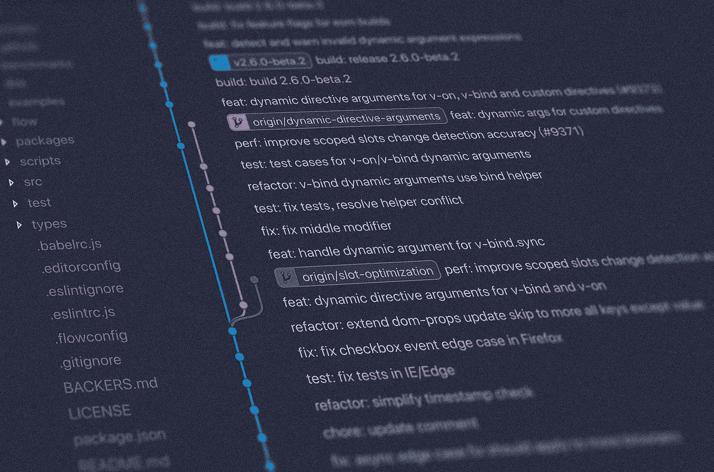

照片由[扬西·敏](https://unsplash.com/@yancymin?utm_source=unsplash&utm_medium=referral&utm_content=creditCopyText)在 [Unsplash](https://unsplash.com/s/photos/git?utm_source=unsplash&utm_medium=referral&utm_content=creditCopyText) 上拍摄

在相当长的一段时间里，git 对我来说是一个模糊的、可怕的东西。这有点像拿着一堆精美的瓷器走在绷紧的绳子上。是的，我知道如何做`git add`、`git commit`和`git push`。但是如果我不得不做除此之外的任何事情，我会很快失去平衡，摔下精美的瓷器，git 将不可避免地把我的项目摔成无法辨认的碎片。

如果您是一名开发人员，您可能非常了解 git。但是 git 现在已经成为编程和协作领域的任何人不可或缺的技能，尤其是在数据科学领域。

所以我最终咬紧牙关，试图理解 git 更全面的情况，以及它的命令对我的代码做了什么。幸运的是，事实证明这并不像我想象的那么复杂，通过纠正我潜在的心理模型，我在处理新项目时更有信心，更少焦虑。

# git 的四个领域

git 中有四个区域:存储区、工作区、索引和存储库。

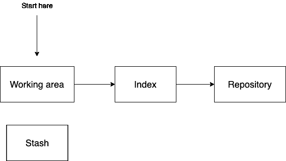

作者图片

典型的 git 工作流从左到右工作，从工作区开始。当您对 git 存储库中的文件进行任何更改时，这些更改都会显示在工作区中。要查看哪些文件随您创建的新文件一起更改，只需执行`git status`。要显示文件中具体更改了什么的更详细信息，只需执行一个`git diff [file name]`。

一旦您对您的更改感到满意，您就可以使用`git add`命令将更改后的文件从工作区添加到索引中。

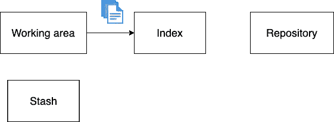

作者图片

索引的功能就像一个临时区域。它之所以存在，是因为您可能正在尝试一些东西，并且在工作区中更改了许多代码，但是您不一定希望所有这些更改都出现在存储区中。

因此，我们的想法是有选择地将您想要的更改添加到索引中，并且您添加的更改最好是一些逻辑单元或相关事物的集合。例如，您可能决定添加所有与您用 Python 编写的新预处理函数相关的文件。

一旦将所有相关文件添加到索引中，最后通过执行`git commit -m 'Explanation of my changes'`将它们移动到存储库中。您应该看到现在索引和存储库之间没有区别了——您可以用`git diff --cached`来验证这一点。

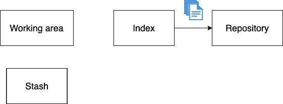

作者图片

# 犯了错误

但是生活并不那么理想。最终你会用一个你想改变的不恰当的信息做出承诺，或者你会决定你添加的所有新东西完全破坏了一切，现在你想回到以前的样子。曾经想要将同事的更新包含到您正在处理的代码中，却发现存在文件冲突？

您可能见过一些 git 命令，如`rebase`、`reset`和`revert`。如果这些命令吓到了你，你并不孤单。其中一些功能强大，如果您不知道如何使用它们，可能会破坏您的项目。但是不要担心，你将会学习如何使用它们。😊

# 向后移动

到目前为止，您习惯使用的命令`git add`和`git commit`已经将您的代码从左向右移动了。我们现在探索允许您在 git 区域中向后移动的命令，以便撤销您对文件所做的更改，或者完全恢复到以前的提交。

假设您正在处理一个文件，并意识到您所有的新更改都不会成功。您意识到您可以返回到上次提交时的文件版本，而不是手动计算如何撤销所有的更改。所以你执行`git reset --hard HEAD [file name]`。

让我们解开这个命令。`HEAD`指您之前的提交。这很有用，因为否则您将不得不寻找提交散列(尽管您可以使用`git log`很容易地找到它)。

把`reset`想象成那些起重机爪机器中的受控爪，你可能很高兴在小时候使用，或者更确切地说是被使用，以获得令人垂涎的填充动物玩具。

图片来自易贝

`reset`允许您从存储库中的特定提交中挑选您想要的文件。然后，通过使用以下标志命令之一，您可以选择将这些文件放入哪个 git 区域:`--hard`、`--mixed`和`--soft`。

正如你在上面看到的,`git reset --hard HEAD [file name]`将从之前的提交中获取`file name`,并将其应用于*索引和工作区。*

*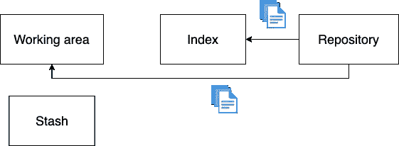*

*作者图片*

*另一方面，`git reset --mixed HEAD [file name]`将从之前的提交中获取`file name`，并将其应用于*索引。**

*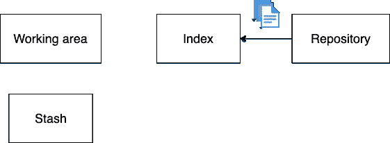*

*作者图片*

*最后，`git reset --soft HEAD [file name]`将从之前的提交中获取`file name`，并将其应用于*存储库。**

*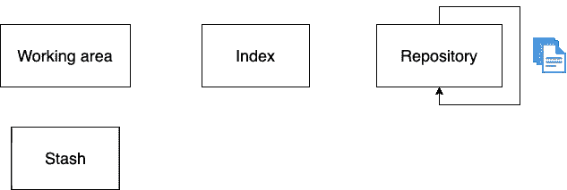*

*作者图片*

# *恢复到以前的提交*

*假设您将一些东西推送到您的存储库中，但是它没有工作。只需执行一个`git revert [commit hash]`，就可以轻松地返回到代码正在运行的前一次提交。记住，您可以通过执行`git log`来找到您的提交散列。*

*就这么简单，但是有一点要注意。还原不会擦除您选择提交之前的任何历史记录。相反，它只是使用您选择恢复到的上一个提交的确切状态创建一个新的提交。这很好，因为它不会弄乱您的任何 git 历史。*

# *编辑您的提交历史*

*在 git 的旅程中，您不需要花很长时间就能遇到一些您希望能够撤销的事情。例如，您向本地存储库提交了一个文件，但是您弄乱了提交消息。或者说，您进行了许多非常小的提交，您宁愿将它们组合成一个提交。这就是`git rebase`大放异彩的地方。*

*假设您有一组小提交。*

*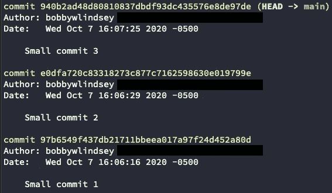*

*作者图片*

*您希望将它们合并在一起，然后给合并的提交一个新消息。要做到这一点，只需做`git rebase --interactive origin/main`。*

*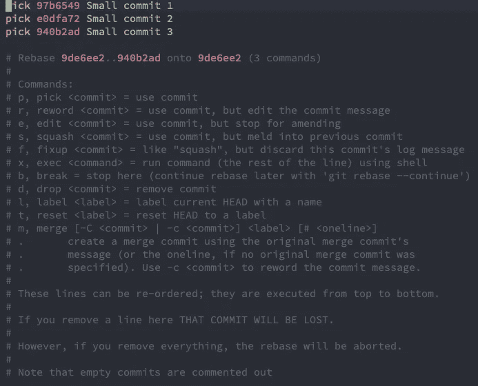*

*作者图片*

*那就去做我们想要的改变吧。在这种情况下，我们希望将最后两次提交压缩到第一次提交中。*

*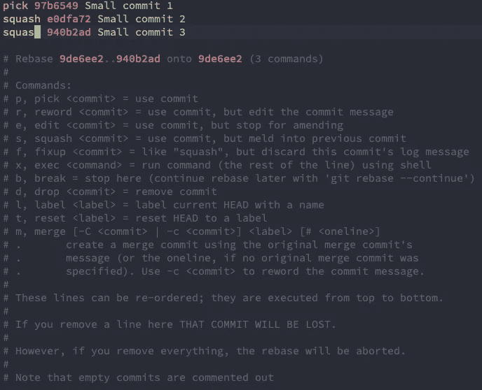*

*作者图片*

*完成此操作后，继续保存文件并关闭，这将带您到一个新窗口来编辑最终的提交消息。*

*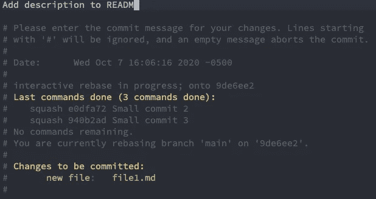*

*作者图片*

*我们对最终的提交消息进行了更改。*

*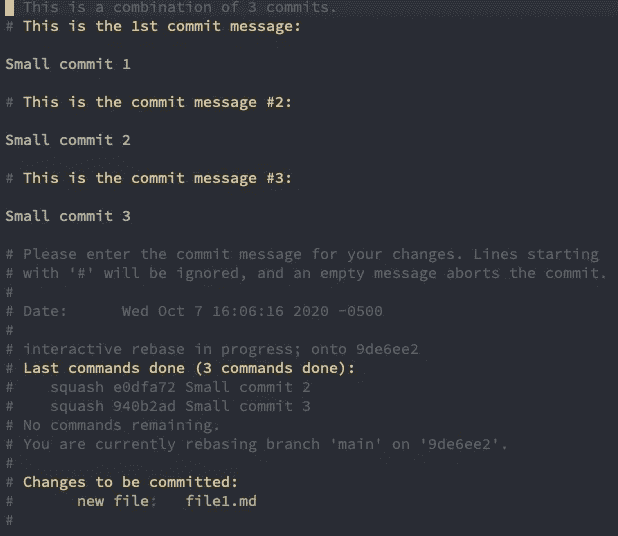*

*作者图片*

*现在您可以看到，我们之前的三次提交现在已经被合并或压缩为一次。*

*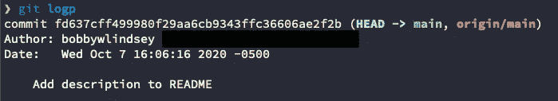*

*作者图片*

# *重命名远程分支*

*假设有一个您想要重命名的分支，它已经被推送到您在 GitHub 或其他地方的远程存储库中。假设只有您一个人在处理这个分支(因为更改远程历史可能会有一些不好的影响)，您可以通过执行以下操作来更改分支名称:*

1.  *`git checkout [your branch]`*
2.  *`git branch -m [new branch name]`*
3.  *`git push origin :[your branch] [new branch name]`*
4.  *`git push origin -u [new branch name]`*

# *典型的 git 工作流*

*假设你和你的团队是 GitHub 中一个资源库的贡献者。您已经将一个`main`分支作为您的默认主分支。但是你想知道如何相互协作，这样你就不会覆盖彼此的工作。以下是我过去经常使用的一个工作流程:*

1.  *首先确保`main`分支与`git checkout main; git pull`保持同步。*
2.  *用`git checkout -b [your branch name]`从`main`分支创建一个新分支。*
3.  *添加那个新特性或者修复那个 bug，然后做一个`git push`把它推送到你的分支。*
4.  *当您准备好将您的更改合并到`main`分支中时，在 GitHub 中创建一个 pull 请求，以便您的团队成员可以查看您的代码并提供任何改进建议。如果看起来不错，GitHub 会让你把修改合并到`main`里。*
5.  *现在只需清理您的本地存储库:1)用刚刚合并到远程`main`分支中的变更更新您的本地`main`分支，用`git checkout main; git merge your-branch` 2)删除您工作的本地分支，`git branch -d [your branch name]`。*

*现在，只需重复该工作流程，进行您想要的任何更改。👍*

# *结束语*

*如果你想学习更多关于 git 的知识或者喜欢一个交互式的环境，请随意查看[学习 Git 分支](https://learngitbranching.js.org/)。*

*如果你想知道如何处理其他一些棘手的 git 场景，请查看 Dangit，git！？！。*

*到目前为止你已经学到了很多。您已经了解了 git 的四个区域，在这些区域中移动您的更改的命令，如何恢复到以前的提交，编辑您的提交历史，重命名分支，并且您已经看到了典型的 git 工作流的样子。*

*我希望这篇文章对您有所帮助，并且您已经对这些 git 命令的作用有了更好的理解！*

 *[## 想在数据科学方面变得更好吗？

### 当我在我发布独家帖子的媒体和个人网站上发布新内容时，请单击此处获得通知。](https://bobbywlindsey.ck.page/5dca5d4310)* 

**原载于 2020 年 10 月 7 日*[*【https://www.bobbywlindsey.com】*](https://www.bobbywlindsey.com/2020/10/07/a-guide-to-git/)*。**