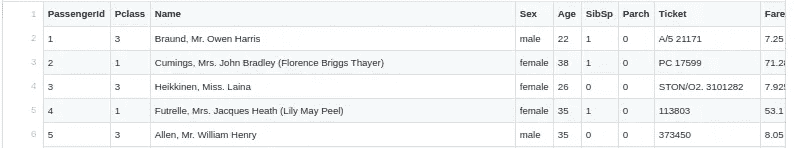
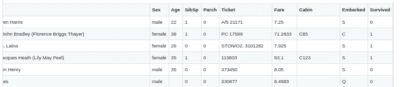
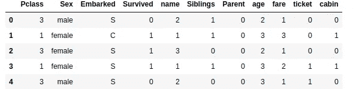
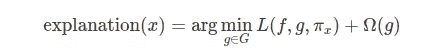
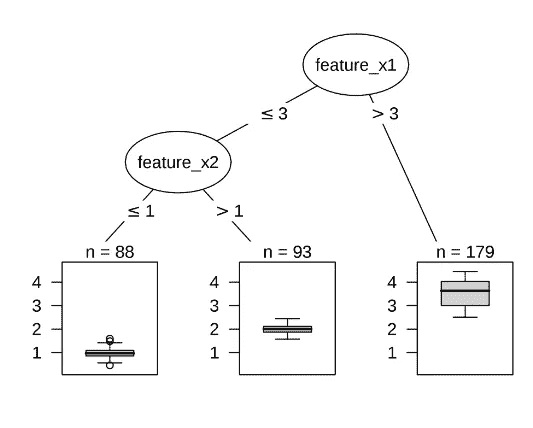
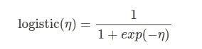
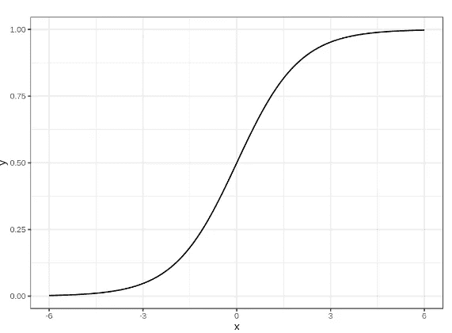
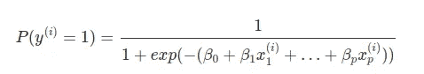
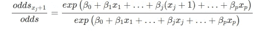
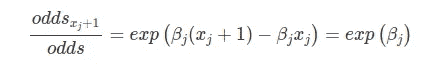

# 可解释机器学习指南—第 1 部分

> 原文：<https://towardsdatascience.com/a-guide-to-interpretable-machine-learning-1-139eae78113a?source=collection_archive---------47----------------------->


# 我们为什么要相信模型？

机器学习模型目前正以巨大的速度变得流行。它们现在被用来解决各种领域的各种问题。在这个越来越受欢迎并因此在我们日常生活中变得越来越重要的时刻，有一个潜在的危险，现在也是非常重要的:机器学习模型的可解释性。

最近，我们看到了图像处理如何用于安全部门和卫生部门，回归和分类模型如何用于股票市场和投资部门。如果我们仔细观察，我们会依赖机器学习来做出肯定会影响我们的重要决定。所以，问题来了，**我们为什么要相信模型？**

换句话说，我们为什么要依赖一个智能算法做出的决定，甚至不知道它是如何操作的？你可以说有各种各样的算法，比如决策树和线性回归，它们非常容易理解和解释。但是，在当前世界中，研究人员和数据科学家正在不断尝试解决具有挑战性的问题，这些问题无法通过可解释的模型有效解决，因此需要非常复杂的算法或基于定制神经网络的算法。如果我们环顾四周，我们会发现大多数情况下，使用复杂的黑盒模型，我们很难回答这个问题**“算法是如何做到的？”**

事实证明这是一个合理的问题。通常，在设计模型时，数据科学家会关注一些问题或关于某些特征的一些规定，他们希望模型能够学习并用于预测。比如我可能喂人口预测“是否在该地区开店”。原因是我可能认为，如果人口多，我的销售额就会高，所以这两者之间的相关性非常高，所以我的模型将学习这一特征，该特征的重要性将会很高。我训练我的模型，它给了我很高的准确性，但它可能没有按照计划的方式学习。所以，我们需要在几种情况下确定这些事情，以增加准确性，并确定我们的预测。

我举一个经典的例子，在一个“西伯利亚哈士奇”和“狼”的图像分类中，设计了一个模型。它给出了非常高的精确度。模型分析的时候发现，模型从来没有把哈士奇和狼分类。它划分了“下雪”或“不下雪”。雪被预言为哈士奇，无雪为狼。大多数哈士奇图像有雪，准确性非常好。


所以，从上面的例子我们可以理解，实际解释我们的模型有多重要。

## 问题的解决方法

处理机器学习模型的解释的许多方法已经发展了多年。不同的方法使用不同的逻辑和理论来解释难以理解的“黑盒”算法，如神经网络、Xgboost 和随机森林。两种最重要和最受欢迎的方法是石灰和 SHAP。它们被用来解释局部的或观察到的预测。换句话说，它们给了我们一个清晰的直觉，让我们知道给定的特征如何影响我们模型中的预测，以及该特征对我们的模型有多重要。

在这篇文章中，我们将详细而简要地谈论石灰和 SHAP。我们将尝试使用著名的泰坦尼克号数据集来解释。

> 泰坦尼克号的沉没是历史上最臭名昭著的海难之一。
> 
> 1912 年 4 月 15 日，在她的处女航中，被广泛认为是“不沉”的皇家邮轮泰坦尼克号在与冰山相撞后沉没。不幸的是，没有足够的救生艇容纳船上的每个人，导致 2224 名乘客和船员中的 1502 人死亡。虽然幸存有一些运气成分，但似乎某些群体比其他群体更有可能幸存。
> 
> 在这个挑战中，我们要求你建立一个预测模型来回答这个问题:“什么样的人更有可能生存？”使用乘客数据(即姓名、年龄、性别、社会经济阶层等)。

现在，让我们先谈一谈数据集，然后再谈我们的目标。

## 数据预处理和准备



数据集看起来像这样，它有 12 列。“幸存”是我们的目标栏目，其他是专题栏目。现在，特性列需要一些预处理。

**数据集提取片段:**

```
import pandas as pd
df1=pd.read_csv('train.csv')
df2=pd.read_csv('test.csv')
df=pd.concat([df1,df2],axis=0)
```

我们将删除 PassengerID，因为它没有任何相关性。下一步，我们将采取“姓名”列，并根据他们的头衔将他们分配，类，像“夫人”，将类 1，“先生”类 2，等等。我们可以使用下面的代码片段做到这一点。

```
i=0
name=[]
while i<len(df):
    #print(df.iloc[i]['Name'].type)

    if "Mrs." in df.iloc[i]['Name']:
        name.append(str(1))
        print("a")
    elif 'Mr.' in df.iloc[i]['Name']:
        name.append(str(2))
        print("b")
    elif "Miss." in df.iloc[i]['Name']:
        name.append(str(3))
        print("c")
    elif "Master." in df.iloc[i]["Name"]:
        name.append(str(4))
        print("d")
    else:
        name.append(str(5))
    i+=1
df=df.drop(['Name'],axis=1)
df['name']=name 
```

现在，我们转到 SibSp，这里我们也将创建一个具有两个类的特征，具有用 1 表示的兄弟，没有用 0 表示的兄弟，并将其包含在特征集中，删除原始特征。我们需要注意的一件事是，这些特征中的大多数都有 NaN，所以我们需要首先填充空值以避免错误。代码片段:

```
i=0
siblings=[]
df.fillna(0)
while i<len(df):
    if df.iloc[i]['SibSp']>0:
        siblings.append(str(1))
    else:
        siblings.append(str(0))

    i+=1
df=df.drop(["SibSp"],axis=1)
df["Siblings"]=siblings
```

接下来，我们对 Parch 特性做同样的事情，我们设计了两个类，用 1 表示父类，用 0 表示父类，并使用列作为特性。

```
i=0
parent=[]
df.fillna(0)
while i<len(df):
    if df.iloc[i]['Parch']>0:
        parent.append(str(1))
    else:
        parent.append(str(0))

    i+=1
df=df.drop(["Parch"],axis=1)
df["Parent"]=parent
```

我们选择“年龄”特征，也有一些 NaNs，我们将使用年龄列的平均值来填充它们。

```
df['Age'].fillna(df['Age'].mean())
```

然后，我们将创建一个具有 5 个类别的新特征列来分类和移除年龄的可变性质。我使用了给定的阶级界限:

> 年龄< 15 岁:1 级
> 
> 15≤年龄< 30:2 级
> 
> 30≤年龄< 45:3 级
> 
> 45≤年龄< 60:4 级
> 
> 年龄≥60 岁:5 级

15 岁以下的“年龄”归为 1 等。

代码:

```
i=0
age=[]
while i<len(df):
    if df.iloc[i]['Age']<15:
        age.append(str(1))
    elif df.iloc[i]['Age']<30:
        age.append(str(2))
    elif df.iloc[i]['Age']<45:
        age.append(str(3))
    elif df.iloc[i]['Age']<60:
        age.append(str(4))
    else:
        age.append(str(5))
    i+=1
df['age']=age
df=df.drop(['Age'],axis=1)
```

对于“Fare”特性，我们将执行与“age”特性相同的操作。我们将用平均值填充 NaN，并将其分类到一些固定的桶中。以下是我对桶边界的估计。

> 票价<15: Class 1
> 
> 15≤Fare<55: Class 2
> 
> 55≤Fare<120: Class 3
> 
> 120≤Fare<190: Class 4
> 
> Fare≥190: Class 5

Next, if we check the “Tickets” column, we will see a few special tickets with letters, and others are numeric. I have labeled the completely numeric ones 1 else 0\. Snippet:

```
i=0
ticket=[]
while i<len(df):
    if df.iloc[i]['Ticket'].isnumeric():
        ticket.append(str(1))
    else:
        ticket.append(str(0))
    i+=1
df['ticket']=ticket
df=df.drop(['Ticket'],axis=1)
```

Next, we do something similar to the cabin feature. Most of the entries in the “Cabin” feature are empty. We label the empty ones as 0 and others as 1.

```
z=0
df['Cabin'].fillna("NA")
cabin=[]
while z<len(df):
    print(df.iloc[z]['Cabin'])
    if 'NA' in str(df.iloc[z]['Cabin']):
        cabin.append(str(0))
    else:
        cabin.append(str(1))
    z+=1
```

Now, our preprocessing is complete. After the preprocessing our data looks like this.



We will now drop the Survived column and apply encoding on the categorical features. After application, we will obtain a Feature set X, of 31 columns i.e 31 features and a target set Y, of 1 column, Survived.

```
Index(['Survived', 'Pclass_1', 'Pclass_2', 'Pclass_3', 'Sex_female',
       'Sex_male', 'Embarked_C', 'Embarked_Q', 'Embarked_S', 'name_1',
       'name_2', 'name_3', 'name_4', 'name_5', 'Siblings_0', 'Siblings_1',
       'Parent_0', 'Parent_1', 'age_1', 'age_2', 'age_3', 'age_4', 'age_5',
       'fare_1', 'fare_2', 'fare_3', 'fare_4', 'fare_5', 'ticket_0',
       'ticket_1', 'cabin_0', 'cabin_1'],
      dtype='object')
```

These are our 31 features.

We split our dataset in X_train, Y_train, X_test, and Y_test.

```
from sklearn.model_selection import train_test_splitX_train,X_test,Y_train,Y_test=train_test_split(X,Y,test_size=0.3, random_state=42)
```

Thus we have processed our dataset and are ready for operations.

We go back to our application.

## LIME

LIME stands for Linear Model Agnostic Explanation. It is used for **当地口译。**它用于分析和解释底层黑盒模型的决策及其基于特定观察的预测，比如训练或测试数据集的特定行。现在，问题来了，它是怎么做到的？正如我们之前注意到的，有几个模型非常容易解释。LIME 使用这些可解释的模型来预测黑盒模型。

LIME 使用决策树和逻辑回归等模型来克隆黑盒模型给出的预测。它接收单个观察值，并通过对特征值进行一定程度的更改来创建一组观察值。因此，在尝试了所有的组合之后，LIME 获得了一个全新的特性集。然后将该特征集传递给黑盒模型，并获得相应的预测。现在，这些预测成为可解释模型的 Y 训练集或目标集，而特征集成为 X 训练集。

现在，LIME 有几个模型，如决策树、线性回归、套索回归和逻辑回归。目标可解释模型是所有可解释模型中产生最小损失的模型。这是因为最小损失函数意味着具有最大准确性的模型是克隆黑盒模型最好的模型。现在，由于可解释模型的行为类似于黑盒模型，解释它将给出黑盒模型的结果。



这是石灰的解释公式。这里，观察值 x 的解释由模型 f 或 g 中的一个示出，这取决于哪个将产生最小损失函数，并且 sigma(g)描述了保持尽可能低的解释模型的复杂性。现在，由 LIME 产生的数据的变化也给了解释模型获得特征边界的自由，例如，如果特征的值小于值 x，则它是 A 类，否则它是 b 类。

也有一些缺点。LIME 的问题在于它是一个局部算法，所以它的解释对整个数据集来说并不成立。

## 解释算法是如何工作的

一些最好的解释算法是决策树和逻辑回归。这里我们就来说说这两个算法。

**决策树:**用于非线性数据集。现在，该树接收一个数据集，并根据不同要素的边界值继续分割数据集。它多次分割数据集，并创建几个数据子集。最后的子集是叶节点。他们是分类班。内部节点是拆分节点。训练有助于树判断每个特征的边界值及其对决策路径的影响。



照片由[克里斯托弗](https://christophm.github.io/)拍摄

因此，每个节点代表一个要素和一个与该要素相对应的值，该值充当边界。现在，每个决策树都想最小化**基尼系数。**基尼系数是实际值与预测值的差值。因此，在每个节点之后，如果我们试图判断与父节点相比系数减少了多少，我们将清楚地了解节点的权重。节点的权重描述了特征的重要性。

**Logistic 回归:**是基于线性回归算法的分类。这不适用于非线性模型。在线性回归中，我们用一个方程表示一个 n 维超平面来预测值。

> Y=b0+b1x1+b2x2+………+bnxn

这里 b0 是截距，特征‘I’的 b{i}是回归中特征的系数或权重。它使用线性回归生成插值。

在分类中，我们预测概率，因此我们使用逻辑函数将值压缩在 0 和 1 之间。



就像这样，



照片由[克里斯托弗](https://christophm.github.io/)拍摄

因此，我们获得概率为



现在，我们处理事件发生的概率和事件不发生的概率之比。P(y=1)/P(y=0)。这个比率叫做**赔率**。


这是我们的方程式。这里 p(y=1)/p(y=0) =n 意味着事件发生的几率是事件不发生几率的 n 倍。

现在，如果我们将特性 j (xj)的值增加 1，则等式变为:



这导致了，



因此，如果我们将一个特征增加 1 个单位，它对概率的影响将是其权重的指数。所以，它的贡献是它的重量的函数。因此，我们可以很容易地使用逻辑回归中的权重来获得特征贡献。

## 结论

在[的下一部分](https://medium.com/@myac.abhijit/a-guide-to-interpretable-machine-learning-2-fa3c4489fb53)，我们将看到可解释模型的应用和实际实现。我们还将看到 SHAP 应用程序。