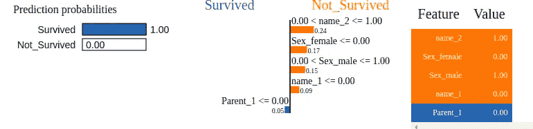

# 可解释机器学习指南—第二部分

> 原文：<https://towardsdatascience.com/a-guide-to-interpretable-machine-learning-2-fa3c4489fb53?source=collection_archive---------22----------------------->


# 石灰的应用

在这一部分，我们将介绍石灰的应用。我们已经在本文的第 1 部分看到了 Titanic 数据集的数据预处理和 LIME 的理论和工作。我们有了预处理过的数据。接下来，我们转到石灰应用程序。

## 神经网络

首先，我们将使用 LIME 应用程序来设计基于神经网络的模型。

这是我们的神经网络课。我用过 TensorFlow Keras 的几层。我们的输入层接受 31 列的数据集。它有 4 个密集层，输出层有 1 个神经元来决定“存活”或“不存活”。输出函数为 sigmoid。我们将使用 Adam 优化器和二元交叉熵。

现在我们将调用并训练模型。

```
import pandas as pd
import numpy as np
import matplotlib.pyplot as plt
from sklearn.metrics import accuracy_score,f1_scoremodel_nn=Neural_Network(X_train,Y_train, X_test,Y_test)
print(model_nn.predict_classes(X_train).astype(float))
```

在我们的训练集上,“predict_classes”函数生成一个二维列表。


如果我们观察，每个元素有 2 个值，第一个值是事件发生的概率，第二个值是不发生的概率。

现在，我们去吃酸橙。

```
import lime.lime_tabular
classes=['Survived','Not_Survived']df_k=df.drop(['Survived'],axis=1)
all_feat=df_k.columns
#model_gb.fit(X_train,Y_train)
print(model_nn.predict_classes(X_train).astype(float))
predict_fn_nn= lambda x: model_nn.predict_classes(x).astype(float)explainer = lime.lime_tabular.LimeTabularExplainer(X_train,mode='classification',feature_selection= 'auto',
                                               class_names=classes,feature_names = all_feat, 
                                                   kernel_width=None,discretize_continuous=True) 
```

接下来，我们呼叫解释者。

```
observation_1=24
exp=explainer.explain_instance(X_test[observation_1], predict_fn_nn, num_features=5,top_labels=1)
exp.show_in_notebook()
```


这将产生如图所示的结果。现在，这里最左边的方框是两类的预测概率,“幸存”类和“未幸存”类。中间的图表显示了重要的特征及其边界值，而右边的表格是所通过的观察行中实际对应的特征值。

```
observation_1=42
exp=explainer.explain_instance(X_test[observation_1], predict_fn_nn, num_features=5,top_labels=1)
exp.show_in_notebook()
```


这是第二个可供参考的例子。

## XGBoost

现在，让我们检查 XGBoost 的 LIME 解释器。下面的代码片段用于启动 XGBoost 的解释器。

```
from xgboost import XGBClassifier
classes=['Survived','Not_Survived']
all_feat=df_k.columns
model_xgb = XGBClassifier()
model_xgb.fit(X_train, Y_train)
predict_fn_xgb = lambda x: model_xgb.predict_proba(x).astype(float)
explainer = lime.lime_tabular.LimeTabularExplainer(X_train,mode='classification',feature_selection= 'auto',
                                                   class_names=classes,feature_names = all_feat, 
                                                   kernel_width=None,discretize_continuous=True)
```

我们称之为解释者。

```
observation_1=32
exp=explainer.explain_instance(X_test[observation_1], predict_fn_xgb, num_features=5,top_labels=1)
exp.show_in_notebook()
```


现在小字体 0.54，0.15 等是特征的对应贡献，值 1.0，0.0 是边界值。

二审:

```
observation_1=86
exp=explainer.explain_instance(X_test[observation_1], predict_fn_xgb, num_features=5,top_labels=1)
exp.show_in_notebook()
```


我们也可以用其他形式获得这些结果。

```
exp.as_map()
```

结果:

```
{1: [(3, 0.5441379658340547),
  (24, -0.15448119146031272),
  (2, -0.1233271814431237),
  (9, 0.11870380100373268),
  (8, -0.11796994360496856)]}
```

这提供了这种形式的地图。1 是预测，列表有特征号和重要性。

```
exp.as_pyplot_figure()
```


## 随机森林

我们还将看到一个使用随机森林的实例。

```
from sklearn.ensemble import RandomForestClassifier
classes=['Survived','Not_Survived']
all_feat=df_k.columns
model_rf = RandomForestClassifier()
model_rf.fit(X_train, Y_train)
predict_fn_rf = lambda x: model_rf.predict_proba(x).astype(float)
explainer = lime.lime_tabular.LimeTabularExplainer(X_train,mode='classification',feature_selection= 'auto',
                                                   class_names=classes,feature_names = all_feat, 
                                                   kernel_width=None,discretize_continuous=True)observation_1=47
exp=explainer.explain_instance(X_test[observation_1], predict_fn_rf, num_features=5,top_labels=1)
exp.show_in_notebook()
```



## 用可解释的模型解释

现在，在我们的理论中，我们已经看到一些可解释的模型被用来获得直觉。所以，让我们回溯一下，看看我们是否能得出类似的结果。

现在，我们不能通过调整要素来生成数据集，因为这是由 LIME 模块针对特定观测随机完成的。所以，让我们用整个数据集来试着解释结果。我们将使用我们的神经网络模型来这样做。

```
model_nn=Neural_Network(X_train,Y_train, X_test,Y_test)
pred=model_nn.predict_classes(X).astype(float)
print(pred)
```

结果:

```
[[4.87956345e-01 5.12043655e-01]
 [1.00000000e+00 0.00000000e+00]
 [9.99990702e-01 9.29832458e-06]
 ...
 [2.51247525e-01 7.48752475e-01]
 [3.47714871e-02 9.65228498e-01]
 [5.00362515e-01 4.99637485e-01]]
```

这是我们对整个数据集上每个类的神经网络预测。现在，让我们从结果中得出预测

```
Pred=[]
for j in pred:
    if (j[0]/j[1])>1:
        Pred.append(1)
    else:
        Pred.append(0)
print(Pred)
```


这些是我们得到的预测。现在，这个列表将作为我们的目标集和整个数据集，没有保留的列作为我们的特征集。因此，实际上我们正在尝试创建一个行为类似于我们的人工神经网络模型的模型。

先用决策树模型来解读吧。

```
from sklearn.tree import DecisionTreeClassifier
clf = DecisionTreeClassifier(criterion = "gini", 
            random_state = 100,max_depth=6, min_samples_leaf=8)
clf.fit(X,Pred)
```

我们用 X 作为训练集，pred 作为预测集来拟合模型。

```
y_pred_tree = clf.predict(X_test) 
accuracy_score(Y_test,y_pred_tree)
```

这给出了 87%的准确度，这对于我们的目的来说是非常好的。因此，我们的决策树模型表现为 87%的黑盒模型。现在，我们来试着解读一下。

```
from sklearn import tree
import graphviz
tree_data = tree.export_graphviz(clf, out_file=None, 
                                feature_names=df_k.columns,  
                                class_names=["Survived","Not_Survived"],  
                                filled=True, rounded=True,  
                                special_characters=True)  
graph = graphviz.Source(tree_data)  
#this will create an iris.pdf file with the rule path
graph.render("titanic")
```

这将给我们一个可视化的节点形成的树。


这是我们的树形成。每个节点都有一个关于节点的决策，该决策决定所获得的结果。从这里我们可以获得边界值。现在，我们来谈谈特性的重要性。

```
feat_importance = clf.tree_.compute_feature_importances(normalize=False)
print("feat importance = " + str(feat_importance))
print(len(feat_importance))
```

结果

```
feat importance = [0.00000000e+00 3.61136190e-03 1.39727482e-02 2.77128356e-01
 0.00000000e+00 1.01837874e-02 3.36657108e-03 0.00000000e+00
 3.66875884e-03 0.00000000e+00 4.96683522e-03 3.87192368e-03
 0.00000000e+00 4.20667376e-04 4.60591655e-03 8.34158579e-03
 0.00000000e+00 4.42596721e-03 6.48457847e-03 0.00000000e+00
 8.54240790e-04 2.40717013e-04 0.00000000e+00 6.19429971e-04
 6.36079009e-03 8.23858955e-05 0.00000000e+00 7.82349745e-03
 3.09307607e-03 6.90860184e-03 0.00000000e+00]
31
```

这提供了 31 个特性重要性的列表，每个特性有一个值。

```
import matplotlib.pyplot as plt; plt.rcdefaults()
import numpy as np
import matplotlib.pyplot as pltobjects = df_k.columns
y_pos = np.arange(len(objects))
performance = feat_importancefig, ax = plt.subplots(figsize=(20, 20))
plt.barh(y_pos, performance, align='center', alpha=0.5)
fontsize=14,
plt.yticks(y_pos, objects,fontsize=20)
plt.xticks(fontsize=20)
plt.xlabel('Contributions')
plt.title('Feature Contributions',fontsize=20)plt.show()
```


上图显示了要素重要性图。因此，我们可以使用决策树从整体上对我们的神经网络模型得出一个非常清晰的直觉。

现在，让我们看看我们是否能从回归模型中得出一些东西。

```
from sklearn.linear_model import LogisticRegression
model = LogisticRegression(solver='liblinear', random_state=0)
model.fit(X, Pred)
```

类似于这里的决策树，我们用 X 和 Pred 来复制我们的黑盒模型。

```
Weights=np.hstack((model.intercept_[:,None], model.coef_))

print(Weights)
print(len(Weights[0]))
```

结果:

```
[[ 0.12274084  0.5433339   0.21922863 -0.63982169  1.45315131 -1.33041046
   0.0827389   0.22923408 -0.22390968  0.56095332 -1.14391015 -0.04797768
   1.28082004 -0.52714469  0.30183458 -0.17909374  0.37075839 -0.24801754
   0.37928751  0.22380996  0.12957386 -0.51560858 -0.09432191 -0.18315589
  -0.00641827  0.49388734 -0.09299957 -0.08857277  0.10037632  0.02236453
  -0.34099133  0.46373217]]32
```

因此，它返回每个特征的权重和 B0 偏差。这是一个包含 32 个元素的列表。所以，这些是我们的特征重要性。


上面的列表给了我们这个情节。所以我们看到，根据理论，我们可以从可解释的模型中得到直觉。

石灰也可以应用于图像。但是这里的做法有点不同。在那里，改变一个像素无关紧要。因此，形成了一组称为超像素的像素。这些超像素变成灰色，然后再次预测图像。通过这种方式，可以判断图像的哪些部分实际上会影响决策。

## SHAP

SHAP 主张“沙普利附加解释”。它基于 Shapley 值，Shapley 值基于博弈联盟理论中的一种方法。它检查特定特征值如何影响模型预测。它首先采用两个特征，并尝试它们的组合，以检查它们如何影响预测，并为它们分配一些重要性。然后，它添加第三个特征，并检查它对预测的影响程度，再次为其分配权重，依此类推。SHAP 树解释器用于获取特性重要性。

```
import shapshap_values = shap.TreeExplainer(model_xgb).shap_values(X_train)
shap.summary_plot(shap_values, X_train, plot_type="bar")
```


这是应用 Xgb 产生的特性重要性图。

```
import shapshap_values = shap.TreeExplainer(model_rf).shap_values(X_train)
shap.summary_plot(shap_values, X_train, plot_type="bar")
```


这是通过应用随机森林生成的要素重要性图。

红色部分显示要素对 0 或“未存活”类的影响，蓝色部分显示 1 或“存活”类的影响。

## 结论

这是对人机学习解释库如何运行的基本洞察。希望这些文章有所帮助。

这是 [Github 链接。](https://github.com/abr-98/Interpretability_on_Titanic_Dataset-)