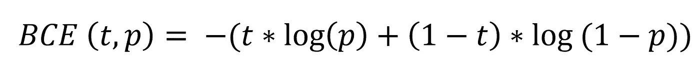
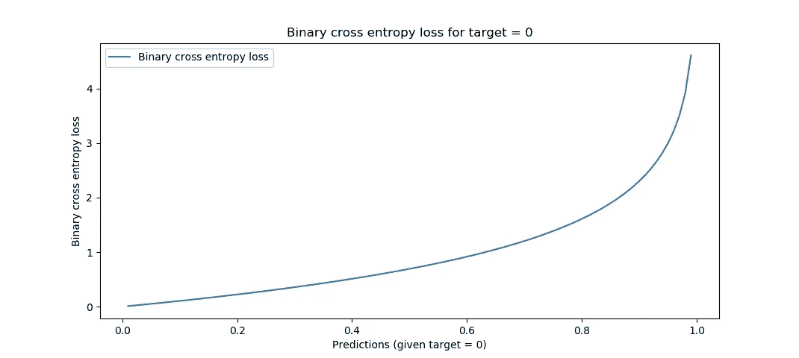
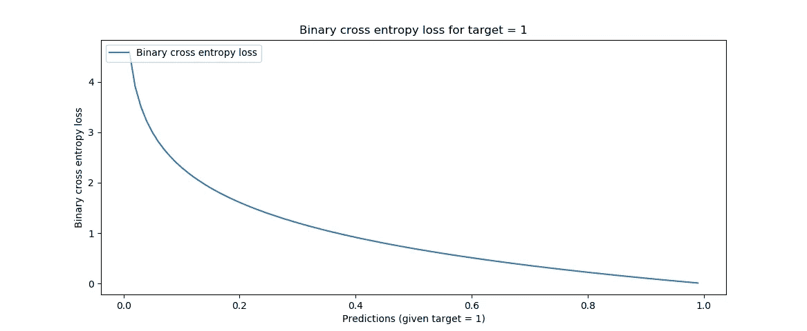
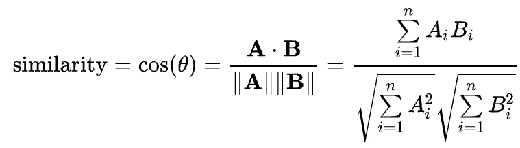
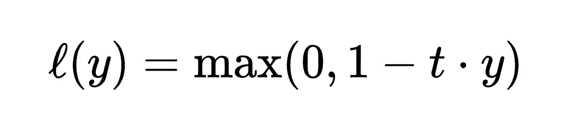
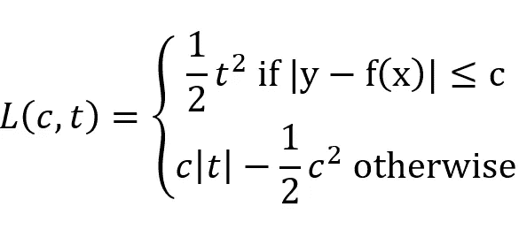
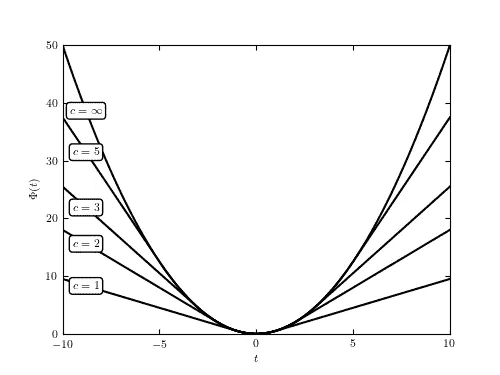
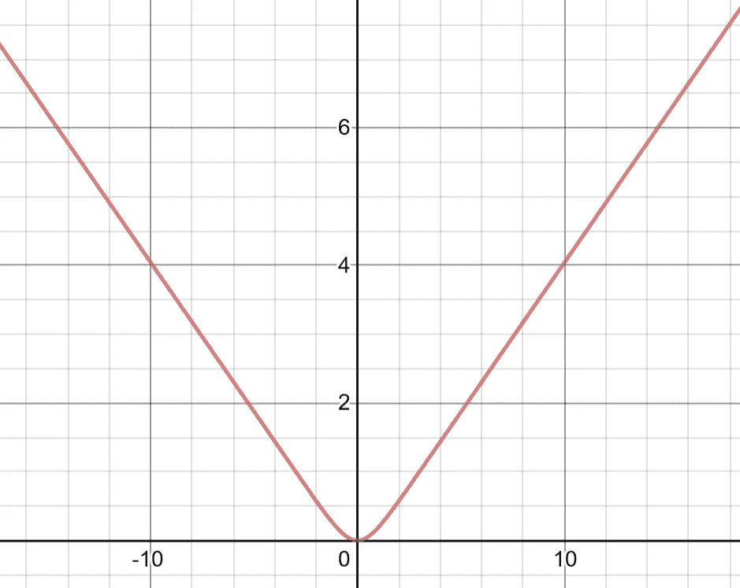
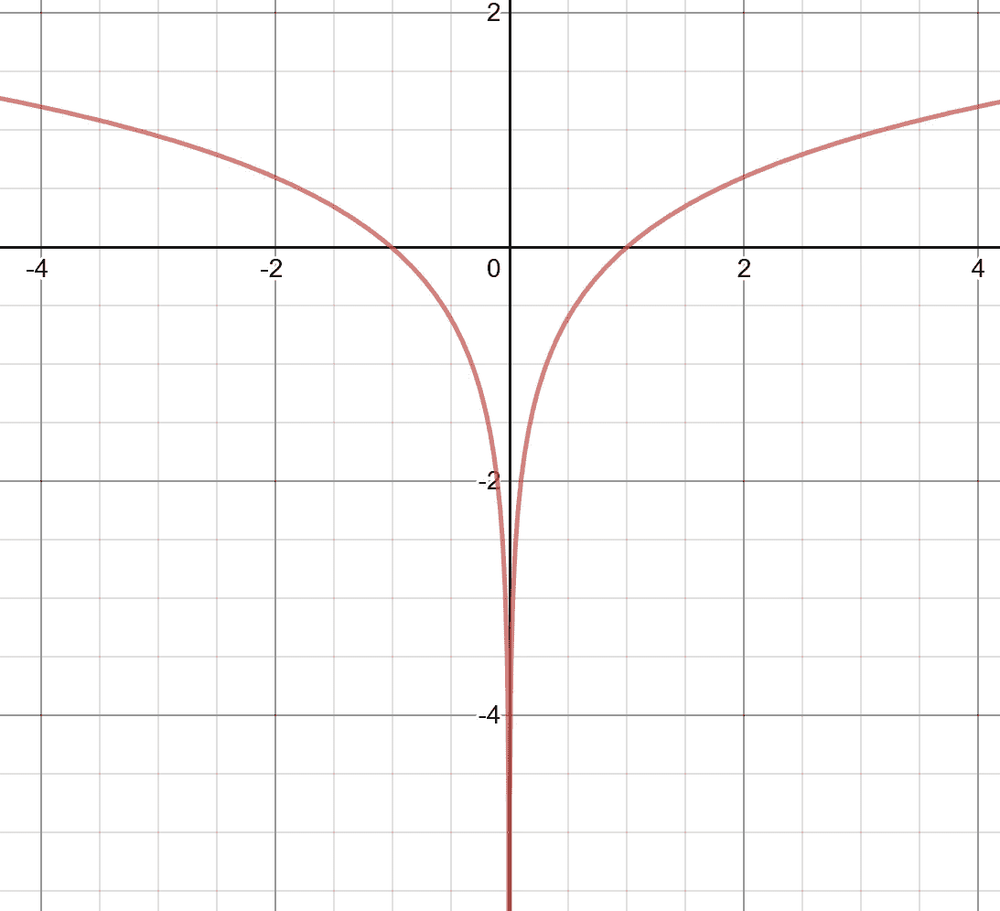

# 神经网络损失函数指南及其在 Keras 中的应用

> 原文：<https://towardsdatascience.com/a-guide-to-neural-network-loss-functions-with-applications-in-keras-3a3baa9f71c5?source=collection_archive---------24----------------------->

## *二元交叉熵、余弦邻近度、铰链损耗，还有 6 个更多*

损失函数是训练神经网络的重要部分，选择正确的损失函数有助于神经网络知道它有多远，因此它可以正确地利用其优化器。本文将讨论 Keras 支持的几个损失函数——它们是如何工作的，它们的应用，以及实现它们的代码。

# 交叉熵

二进制交叉熵在数学上定义为—



—给定正确的目标值 *t* 和预测值 *p* 。

给定正确目标值 0 的 *p* 值，二进制交叉熵值可以绘制为—



给定正确目标 1 的 *p* 值，二进制交叉熵值可以绘制为—



熵是对某一分布不确定性的度量，交叉熵是代表目标分布和预测分布之间不确定性的值。

```
#FOR COMPILING
model.compile(loss='binary_crossentropy', optimizer='sgd')
# optimizer can be substituted for another one#FOR EVALUATING
keras.losses.binary_crossentropy(y_true, y_pred, from_logits=**False**, label_smoothing=0)
```

分类交叉熵和稀疏分类交叉熵是二元交叉熵的版本，适用于几个类别。当一个样本有几个类别或标签是软概率时，应该使用分类交叉熵，当类别互斥时，应该使用稀疏分类交叉熵。

分类交叉熵:

```
#FOR COMPILING
model.compile(loss='categorical_crossentropy', optimizer='sgd')
# optimizer can be substituted for another one#FOR EVALUATING
keras.losses.categorical_crossentropy(y_true, y_pred, from_logits=**False**, label_smoothing=0)
```

稀疏分类交叉熵:

```
#FOR COMPILING
model.compile(loss='sparse_categorical_crossentropy', optimizer='sgd')
# optimizer can be substituted for another one#FOR EVALUATING
keras.losses.sparse_categorical_crossentropy(y_true, y_pred, from_logits=**False**, axis=-1)
```

# 余弦近似/余弦相似

余弦相似性是两个向量之间相似性的度量。数学表示是—



—给定两个向量 *A* 和 *B* ，其中 *A* 表示预测向量， *B* 表示目标向量。

较高的余弦接近度/相似度表示较高的准确度。完全相反的向量的余弦相似度为-1，完全正交的向量的余弦相似度为 0，相同的向量的余弦相似度为 1。

余弦近似可以在 Keras 中实现:

```
#FOR COMPILING
model.compile(loss='cosine_proximity', optimizer='sgd')
# optimizer can be substituted for another one#FOR EVALUATING
keras.losses.cosine_proximity(y_true, y_pred, axis=-1)
```

# 铰链损耗

铰链损耗在数学上定义为—



—给定预测 *y* 和目标值 *t* 的*1*。*注意 *y* 应该是一个概率而不是一个单一的类标签。*

下面是铰链损耗图，它是线性负值，直到达到 1 的 *x* 。


[来源](https://i.stack.imgur.com/Ifeze.png)

```
#FOR COMPILING
model.compile(loss='hinge', optimizer='sgd')
# optimizer can be substituted for another one#FOR EVALUATING
keras.losses.hinge(y_true, y_pred)
```

Hinge 还有另外一个离经叛道的，*平方 hinge* ，这(正如你能猜到的)就是铰链函数，平方。

```
#FOR COMPILING
model.compile(loss='squared_hinge', optimizer='sgd')
# optimizer can be substituted for another one#FOR EVALUATING
keras.losses.squared_hinge(y_true, y_pred)
```

# 胡伯损失

Huber 损耗在数学上定义为



…对于系数 *c* ，其中 *t* 表示目标值和预测值之间的差值，可绘制为



…对于 *c.* 的各种值

这可以在 Keras 中实现为

```
#FOR COMPILING
model.compile(loss='huber_loss', optimizer='sgd')
# optimizer can be substituted for another one#FOR EVALUATING
keras.losses.huber_loss(y_true, y_pred, delta=1.0)
```

# 双曲余弦的对数

双曲余弦函数是 log(cosh( *x* ))，图形如下



…其中 *x* 表示预测值和目标值之间的差值。

```
#FOR COMPILING
model.compile(loss='logcosh', optimizer='sgd')
# optimizer can be substituted for another one#FOR EVALUATING
keras.losses.logcosh(y_true, y_pred)
```

# 对数误差平方

平均绝对误差的对数或 log( *x* )如下图所示。



误差平方的对数比较特殊，因为如果误差更接近 0(比如 0.2 到 0.1)，那么误差减少 0.1，损失函数的下降幅度会比更大(比如 1.2 到 1.1)。

这可以在 Keras 中实现为:

```
#FOR COMPILING
model.compile(loss='mean_squared_logarithmic_error', optimizer='sgd')
# optimizer can be substituted for another one#FOR EVALUATING
keras.losses.mean_squared_logarithmic_error(y_true, y_pred)
```

如果你喜欢，看看其他帖子:

*   [神经网络层指南及其在 Keras 中的应用](/a-guide-to-neural-network-layers-with-applications-in-keras-40ccb7ebb57a?source=post_stats_page---------------------------)
*   [神经网络优化器指南及其在 Keras 中的应用](https://medium.com/@andre_ye/a-quick-guide-to-neural-network-optimizers-with-applications-in-keras-e4635dd1cca4)