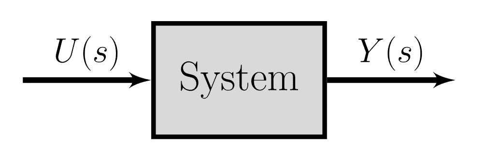
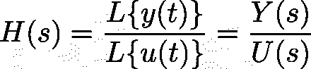
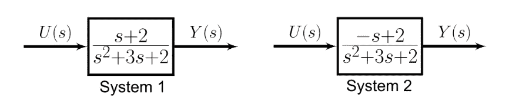
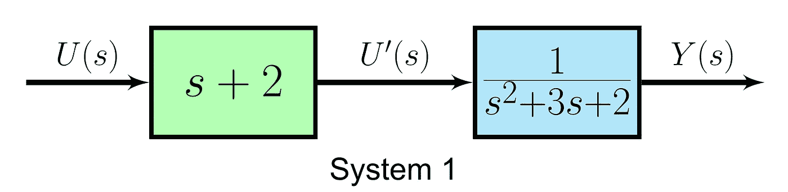
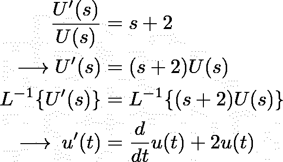
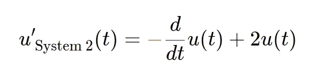
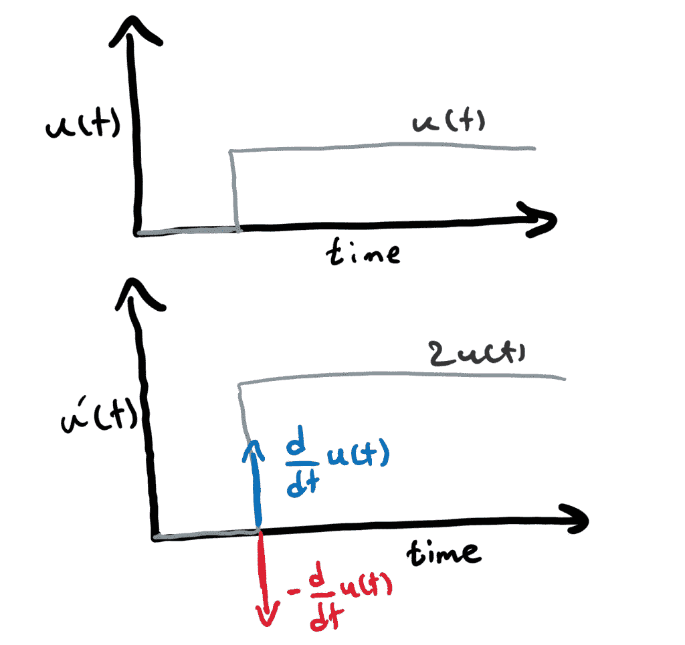
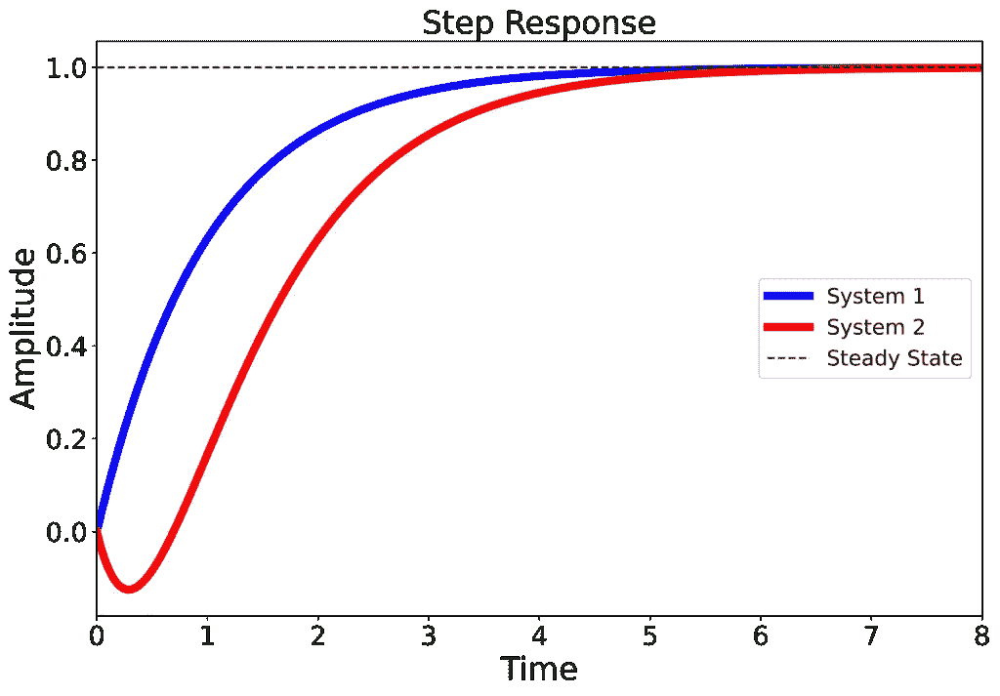

# 非最小相位系统指南

> 原文：<https://towardsdatascience.com/a-guide-to-non-minimum-phase-systems-1403350917a0?source=collection_archive---------15----------------------->

## 向导

## 为什么淋浴时打开热水旋钮时，水是先冷的？

你有没有想过，为什么当你在淋浴时打开热水旋钮，水会冷几秒钟，然后变热或反之亦然？

在本文中，我们将通过触及两个概念来回答这个问题，即[最小相位](https://en.wikipedia.org/wiki/Minimum_phase) (MP)系统和[传递函数](https://en.wikipedia.org/wiki/Transfer_function) s

# 介绍

让我先阐述一下这个问题。我在问题中提到的现象在气候条件下尤其明显，那里的水供应与环境温度不同。我在两种极端气候下都生活过。在一个炎热的国家，夏天温度达到 45 摄氏度(113 华氏度)，如果你转动冷水旋钮，供水首先是超热的，然后过一段时间，它会变冷。另一方面，我目前住在一个冬天温度达到零下 20 摄氏度甚至更低的城市。如果你转动热水旋钮，供水需要几秒钟变热。从控制工程的角度来看，这两种现象遵循相似的行为。

作者图片

本文将从控制系统理论的角度回答这个问题。简而言之，因为淋浴的供水系统是一个[非最小相位(NMP)系统](https://en.wikipedia.org/wiki/Minimum_phase#Non-minimum_phase)。

为了更好地理解 NMP 系统的行为，让我们来看一个例子。我们的系统需要一个数学模型。由于使用传递函数模型可以更好地理解 NMP，我们需要了解这个概念。然而，由于这种表示方式不如微分方程等其他数学模型常见，因此我们先简单介绍一下传递函数是什么，以及如何用这种方式表示模型。如果你已经知道什么是传递函数，那么可以直接跳到例子中。

物理系统的数学模型有几种表示方式，如[微分方程](https://en.wikipedia.org/wiki/State-space_representation)、[状态空间表示](https://en.wikipedia.org/wiki/State-space_representation)、[传递函数](https://en.wikipedia.org/wiki/Transfer_function)。最常见的是，我们使用基于时间的函数，通过前面提到的两种方法来为物理系统建模(为了清楚起见，我们可以在频域中编写模型的微分方程，但这在物理系统的数学建模中不太常见)。然而，传递函数为我们提供了另一种看待系统的方式，即在频域中分析系统。现在，让我们看看什么是传递函数！

# 传递函数是什么？

传递函数模型使用多项式的比率来描述系统的输入-输出关系。因此，一个输入信号给一个系统产生一个受控输出(又名响应)。这种类型的建模不同于使用微分方程和状态空间表示，其中模型动态是可用的。

> *💡*传递函数是观察动态系统的另一种方式，但在频域中，通过分析给定输入信号的系统响应。

控制系统的传递函数是输出信号的[拉普拉斯变换](https://en.wikipedia.org/wiki/Laplace_transform) ( *L* {})与输入信号的拉普拉斯变换之比。简而言之，这里的目标不是使用基于时间的微分方程在时域中分析模型，而是使用变换在频域中分析模型。

输入和输出信号位于 s 域的系统框图(图片由作者提供)

假设我们有一个系统，以 u(t)和 y(t)作为输入和输出信号。传递函数可以如上所示进行计算。

分子多项式的根称为模型*零点*，分母多项式的根称为模型*极点*。零点影响系统的输入，极点影响系统响应及其稳定性。对于零极点分析，我们应该使用[*s*-平面](https://en.wikipedia.org/wiki/S-plane)，它是一个复平面，拉普拉斯变换在其上绘制[1]。

*注:本文中，我们只对系统的初始响应感兴趣，是为了回答为什么淋浴先冷后热？如前所述，由于初始系统响应与系统零点密切相关，因此我们将不讨论极点(这可能是另一篇文章的主题)。*

# 什么是非最小相位系统？

现在我们已经熟悉了 NMP 系统，让我们正式定义这个系统:

> *👉*非最小相位(NMP)系统是[因果](https://en.wikipedia.org/wiki/Causal_system)和[稳定](https://en.wikipedia.org/wiki/BIBO_stability)系统，它们的逆是因果的但不稳定。[2]

在我们的系统中有一个延迟或者在*s*-平面(又名右半平面或 RHP)的右半部分有一个零模型可能导致一个非最小相位系统。

请注意，对于给定的幅度响应，只有一个最小相位系统，但 NMP 系统的数量是无限的。这就是为什么我们听不到像最大相位系统这样的术语。关于非最小相位系统的数学描述的更多细节可在[3]中获得。

# 个案研究

现在我们已经熟悉了传递函数，让我们看看非最小相位系统是什么样子，并回答为什么水在变热之前会先变冷！

下面是两个极点相同但零点不同的系统。系统 1 在 s = -2 处有一个零点，而系统 2 在 s = 2 处有一个零点。

MP 和 NMP 系统示例框图(图片由作者提供)

让我们分离系统 1 的极点和零点进行分析。如前所述，您可以将零视为修改后的输入(姑且称之为 U’(s))。如前所述，我们对本文中的模型零点感兴趣，因此我们将重点关注绿色模块。

由极点和零点分隔的最小相位系统的框图(图片由作者提供)

让我们通过应用逆 *L* 变换来看看系统 1 的修改输入 U’(s)在时域中的情况

按照系统 2 的相同过程，系统 2 的修改后的输入将为

所以，唯一的区别是负号。让我们画出两个系统的输入和修改后的输入信号，看看两者有何不同。

让我们将用作输入信号 u(t)(顶部的灰色函数)。由于输入信号是单位阶跃，输出 y(t)被称为[阶跃响应](https://en.wikipedia.org/wiki/Step_response)。修改后的输入 u'(t)如下图所示，它是 2u(t)和 u(t)的导数之和。u'(t)的导数分量对于系统 1 是蓝色的，对于系统 2 是红色的。

MP 和 NMP 系统的带导数方向的输入和修改输入信号(图片由作者提供)

系统 2 中 u(t)的负导数导致系统 2 的阶跃响应首先向预期响应(稳态值)的相反方向移动，然后向预期响应(红色曲线)移动。这与系统 1 的阶跃响应(蓝色曲线)形成对比，系统 1 在开始时没有这种下冲。

MP 和 NMP 系统的阶跃响应，NMP 阶跃响应在开始时有一个下冲(图片由作者提供)

参考文献中有一个很好的例子。[4].

那么，下一个问题是，当我们有一个非最小相位系统时，该怎么办？

解决办法就是等待⌛.我们必须等到下冲结束。我们也可以为这样的系统设计一个控制器/补偿器。然而，由于几个原因，如系统变得不稳定或响应较慢的风险，设计 NMP 系统的控制器更加困难。

现在，让我们回到开头的问题。为什么在还没热之前就打开热水供应，淋浴的水却先凉了？

答案是，当你打开淋浴的热水供应时，系统会经历一个欠冲，因为这是水变热之前的一个非最小阶段。在这种情况下，最好等待几秒钟，以便系统(从欠冲中)恢复。你不应该改变方向或打开另一个旋钮，因为从长远来看，这将导致更冷的淋浴！

另一个通常在控制系统书籍中使用的例子是响应升降舵偏转的飞机高度变化。在这种情况下，当飞机试图使用升降舵增加高度时，由于飞机在增加高度之前向下倾斜(导致向下的空气动力)，高度会稍微降低。这个例子可以从富兰克林的《动态系统的反馈控制》(第 7 版)[5]一书第 6 章的数学模型中得到。

# 结论

在本文中，我们了解了什么是非最小相位系统，以及为什么这样的系统首先经历错误方向的响应(你转动热水旋钮，水首先是冷的！).我们还讨论了传递函数，以及它在系统分析中的作用。

Jupyter 笔记本包含用于创建案例研究的阶跃响应的代码，可点击[此处](https://github.com/e-alizadeh/medium/blob/master/notebooks/Non-Minimum_Phase_Systems.ipynb)获取。感谢阅读！

*最初发表于*[T5【https://www.ealizadeh.com】](https://www.ealizadeh.com/blog/non-minimum-phase-systems/)*。*

# 参考

[1] MATLAB，[什么是传递函数模型？](https://www.mathworks.com/help/ident/ug/what-are-transfer-function-models.html) (2020)

[2]维基百科。2020.[最小相位](https://en.wikipedia.org/wiki/Minimum_phase)，(2020)

[3]Jesse b . Hoagg & Dennis s . Bernstein，[《非最小相位零点——无事可做(经典控制再探——第二部分)】【T3》，(2007 年 6 月)，IEEE 控制系统杂志。](https://ieeexplore.ieee.org/abstract/document/4213166)

[4] MATLAB，[实践中的控制系统，第 6 部分:什么是非最小相位系统？](https://www.youtube.com/watch?v=jGEkmDRsq_M) (2019)

[5] G. F .富兰克林，J. D .鲍威尔，a .埃马米-奈尼，*动态系统的反馈控制*，第七版