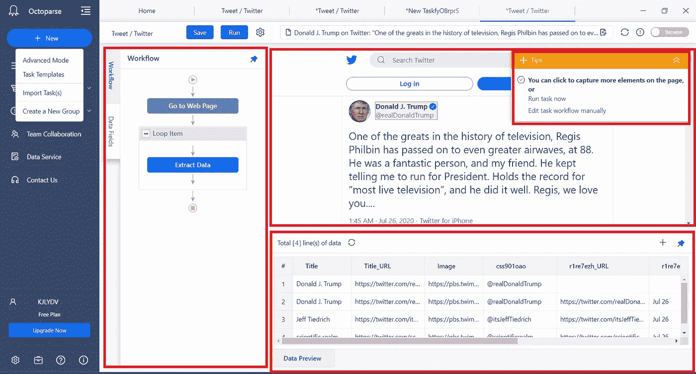

# 从推特上收集回复的指南

> 原文：<https://towardsdatascience.com/a-guide-to-scrape-tweet-replies-from-twitter-2f6168fed624?source=collection_archive---------11----------------------->

## 使用 Octoparse 抓取 tweet 回复的初学者指南


照片由[晨酿](https://unsplash.com/@morningbrew?utm_source=medium&utm_medium=referral)在 [Unsplash](https://unsplash.com?utm_source=medium&utm_medium=referral) 拍摄

我使用 [Octoparse](https://www.octoparse.com/download) 进行抓取。我必须说，这个软件有这么容易使用的界面，他们的团队真的做了很大的工作，为您提供教程和文章，开始使用这个软件。此外，您可以将您的疑问放在他们官方网站的帮助页面上，他们团队中的某个人一定会给您一个有效的答复。

**注意**:这里，我用的是 OCTOPARSE 版本，先从它开始[安装](http://agent.octoparse.com/ws/435)并注册。

如果你想购买该软件，请在这里浏览所有计划:[http://agent.octoparse.com/ws/436](http://agent.octoparse.com/ws/436)

## 对于本教程，按照以下步骤收集唐纳德·特朗普的推文回复 **:**

**第一步:**登录后，你会看到这个软件的一个主页→转到最左上角的“+New”按钮→点击它→从下拉菜单中选择一个高级选项→新任务窗口将打开→新建一个组来组织你在那个(可选)→输入你要抓取的网页网址(如[https://Twitter . com/realDonaldTrump/status/128711918732487444](https://twitter.com/realDonaldTrump/status/1287119187324874754)


**第二步:**保存后，你会看到一个弹出窗口，要求在两个选项中进行选择:要么自动让 Octoparse bot 抓取网页，要么手动选择特定元素。


*   因此，在这里我选择了第一个选项→单击它将显示如下内容:


*   当它完成 100%检测后，它会显示一个如下的窗口，有 3 个窗口界面同时打开。“提示”弹出框包含一些设置，您可以在保存前更改，也可以在自动检测结果之间切换，数据预览是一个包含数据集的界面，您可以预览抓取后的效果，Twitter 网页将在后台界面中打开。


*   在保存设置时，你会看到一个如下的窗口，有 4 个分割的窗口→现在，你可以很容易地看到工作流程和管理每个动作的设置。



*   这是机器人自动完成的所有工作，现在我们的任务是清理数据并相应地更改设置。在我们继续清理和更改设置之前，让我们创建一个分页循环。

由于 Twitter 没有下一步按钮或者被分成页面，机器人不会自动分页。否则，它会识别出来的。因此，要创建分页循环，我们必须设置一个无限滚动来通过分页加载更多数据。

*   为此，点击网页上的空白区域，如下图所示**【十字】** →然后，弹出窗口将打开→点击**循环点击单个元素**。


*   您将在工作流程中看到以下变化:


**步骤-4:** 现在，我们的下一步是相应地更改设置，让我们从分页开始→转到工作流中的“**单击以分页**”选项→悬停在它上面&您将看到“**动作设置**”选项→单击它→并在设置中指定这些更改，如下图所示:


*   AJAX 超时对于在滚动后加载数据是必要的，否则，它不会抓取任何数据并返回一个错误报告。因此，到目前为止，5s 是机器人可以自动加载数据的一个很好的平均值。
*   指定滚动的细节是必要的，因为我们正在为无限滚动设置分页循环。因此，选中“加载后向下滚动页面”框，选择“一屏显示”。因此，它将在 2 秒的等待时间内抓取屏幕上列出的所有内容。
*   现在转到工作流中的“分页”选项→转到其动作设置→然后选择“退出循环”设置并指定“重复次数”以获取更多数据:


**步骤 5:** 现在我们的下一个任务是清理数据，我只为我的项目提取推文回复。还可以提取类似“转发”、“点赞”等细节。因此，如果其他属性对您的项目有意义，您也可以选择保留它们。

*   要删除任何特定属性→转到下面的数据预览部分→然后，选择任何列标题→您可以在角上看到 3 个点“…”→右键单击它→然后从下拉列表中选择“删除”选项。


*   还有其他的选择，你也应该试试。
*   删除所有不必要的属性后，清理后的数据集将如下所示:


**步骤 6:** 在做了一些更改之后，如果您正在获得预期的数据，那么您就可以运行您的任务了。

*   只需简单地**保存**任务并点击**运行**以提取更多数据。


*   将出现另一个弹出窗口，询问您希望如何运行您的任务。因此，免费用户只能选择“在你的设备上运行任务”。如果您希望提取超过 10000 行的数据，并希望在预定的基础上进行所有操作，您可以升级到高级计划，该计划并不昂贵，但具有所有这些有效的功能，如果您选择升级的计划，他们甚至会在预定的基础上为您进行清理，并返回一个干净的数据集。
*   因此，我在这里选择第一个选项，因为我没有收集那么多数据。


*   这是我提取的数据的样子:


*   如果您完成了提取或如果您开始得到重复→只需简单地“停止运行”,然后单击“导出数据”。
*   现在，只需导出:


*   如果您的数据中有重复项，它会自动检测到这些重复项，您只需选择删除这些重复项。
*   数据科学的人在这里完全可以理解我，因为获得一组独特的数据是一项真正的任务。
*   导出数据后，您将看到另一个窗口，询问您机器上数据集的另存为格式。


*   简单地，选择任何格式→按下“ **OK** ”，在下一个弹出窗口看到你保存的文件的目录，并简单地从那里打开它。
*   看看我刮下来的 Excel 文件:


*   因此，正如你所看到的，它是多么漂亮地刮掉了所有的文字，没有图像和视频。不过，如果你去看看它的网页，你会发现每个回复里都有视频和图片。

**注** —该软件的使用因网站而异。如果你想抓取除此之外的任何网页，你必须改变一些设置。请参考他们的[文章](https://www.octoparse.com/tutorial-7)和[教程](https://www.youtube.com/channel/UCweDWm1QY2G67SDAKX7nreg/playlists)。大约，他们的团队已经覆盖了所有类型的网页，无论是静态的还是动态的。

所以，如果我的博客帖子对你有所帮助，而你此刻觉得很慷慨，请不要犹豫，请给我买杯咖啡。☕😍

[](https://www.buymeacoffee.com/techykajal)

是的，点击我。

```
And yes, buying me a coffee **(and lots of it if you are feeling extra generous)** goes a long way in ensuring that I keep producing content every day in the years to come.
```

您可以通过以下方式联系我:

1.  订阅我的 [**YouTube 频道**](https://www.youtube.com/channel/UCdwAaZMWiRmvIBIT96ApVjw) 视频内容即将上线 [**这里**](https://www.youtube.com/channel/UCdwAaZMWiRmvIBIT96ApVjw)
2.  跟我上 [**中**](https://medium.com/@TechyKajal)
3.  通过 [**LinkedIn**](http://www.linkedin.com/in/techykajal) 联系我
4.  跟随我的博客之旅:-[**https://kajalyadav.com/**](https://kajalyadav.com/)
5.  成为会员:-【https://techykajal.medium.com/membership】

**也可以看看我的其他博客:**

**[](/8-ml-ai-projects-to-make-your-portfolio-stand-out-bfc5be94e063) [## 8 ML/AI 项目，让您的投资组合脱颖而出

### 有趣的项目想法与源代码和参考文章，也附上一些研究论文。

towardsdatascience.com](/8-ml-ai-projects-to-make-your-portfolio-stand-out-bfc5be94e063) [](/scraping-1000s-of-news-articles-using-10-simple-steps-d57636a49755) [## 用 10 个简单的步骤搜集 1000 篇新闻文章

### 如果你遵循这 10 个简单的步骤，使用 python 进行网络抓取是非常简单的。

towardsdatascience.com](/scraping-1000s-of-news-articles-using-10-simple-steps-d57636a49755)**