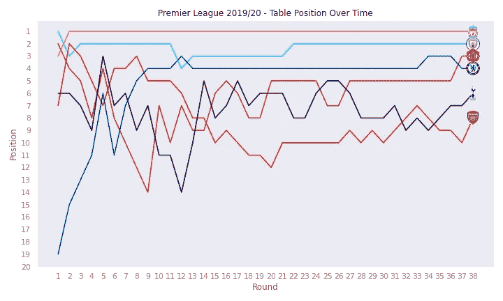

# 用熊猫和 BeautifulSoup 抓取 HTML 表格的指南

> 原文：<https://towardsdatascience.com/a-guide-to-scraping-html-tables-with-pandas-and-beautifulsoup-7fc24c331cf7?source=collection_archive---------1----------------------->

## 也是一个实际的例子


由[马库斯·斯皮斯克](https://unsplash.com/@markusspiske?utm_source=medium&utm_medium=referral)在 [Unsplash](https://unsplash.com?utm_source=medium&utm_medium=referral) 上拍摄

抓取网页时碰到 HTML 表格是很常见的，如果没有正确的方法，从这些表格中提取有用的、一致的数据可能会有点棘手。

在本文中，您将看到如何使用两种不同的方法快速、高效地抓取这些元素:仅使用 Pandas 库和使用传统的抓取库 BeautifulSoup。

举个例子，我刮了英超分类表。这很好，因为这是一个常见的表格，基本上可以在任何体育网站上找到。虽然有必要通知您这一点，但当您阅读时，表被刮擦不会产生太大的影响，因为我试图使这篇文章尽可能地一般化。

# pandas.read_html():快捷方式

如果你想要的只是从一个页面中获取一些表格，而不是别的，你甚至不需要设置一个完整的刮刀来完成这项工作，因为熊猫可以自己完成这项工作。`pandas.read_html()` 函数使用一些抓取库，如 *BeautifulSoup* 和 *Urllib* 来返回一个包含页面中所有表的列表作为数据帧。你只需要传递页面的 URL。

```
dfs = pd.read_html(url)
```

您现在需要做的就是从列表中选择您想要的数据帧:

```
df = dfs[4]
```

如果您不确定列表中帧的顺序，或者如果您不希望您的代码依赖于这种顺序(网站可能会改变)，您可以随时搜索数据帧，通过其长度找到您正在寻找的数据帧…

```
for df in dfs:
    if len(df) == 20:
        the_one = df
        break
```

…或者按其列的名称，例如。

```
for df in dfs:
    if df.columns == ['#', 'Team', 'MP', 'W', 'D', 'L', 'Points']:
        the_one = df
        break
```

但是熊猫并没有让我们的生活变得更容易。这个函数接受一些有用的参数来帮助您获得正确的表。您可以使用`match` 来指定表应该匹配的正则表达式字符串；`header` 获取带有您传递的特定标题的表格；例如，`attrs` 参数允许您通过表的类或 id 来标识表。

然而，如果你不是只抓取表，而是使用，比方说，获取页面的请求，那么鼓励你将`page.text`传递给函数，而不是 URL:

```
page = requests.get(url)
soup = BeautifulSoup(page.text, 'html.parser')

dfs = pd.read_html(page.text)
```

如果您使用 Selenium 的 web 驱动程序来获取页面，情况也是如此:

```
dfs = pd.read_html(driver.page_source)
```

这是因为这样做可以显著减少代码运行的时间，因为`read_html()` 函数不再需要获取页面。检查每个场景中一百次重复所用的平均时间:

```
Using the URL:
Average time elapsed: 0.2345 secondsUsing page.text:
Average time elapsed: 0.0774 seconds
```

使用 URL 使得代码速度慢了三倍。因此，只有当您不打算首先使用其他库获得页面时，使用它才有意义。

# 用 BeautifulSoup 获取表格的元素

虽然熊猫真的很棒，但它不能解决我们所有的问题。有时候，您需要按元素来抓取一个表，可能是因为您不想要整个表，或者是因为表的结构不一致，或者是出于其他任何原因。

为此，我们首先需要了解 HTML 表格的标准结构:

```
<table>
    <tr>
        <th>
        <th>
        <th>
        <th>
        <th>
        <th>
        <th>
    </tr>
    <tr>
        <td>
        <td>
        <td>
        <td>
        <td>
        <td>
        <td>
    </tr>
    <tr>
        <td>
        <td>
        <td>
        <td>
        <td>
        <td>
        <td>
    </tr>
.
.
.
</table>
```

其中,`tr` 代表“表格行”,`th` 代表“表头”,`td` 代表“表格数据”,数据以文本形式存储在这里。

该模式通常是有帮助的，所以我们剩下要做的就是使用 BeautifulSoup 选择正确的元素。

首先要做的是找到桌子。`find_all()` 方法返回满足我们传递给它的需求的所有元素的列表。然后，我们必须在列表中选择我们需要的表:

```
table = soup.find_all('table')[4]
```

例如，根据网站的不同，有必要指定表类或 id。

剩下的过程现在几乎是直观的了，对吗？我们只需要选择所有的`tr` 标签和它们里面的`th` 和`td` 标签中的文本。我们可以再次使用`find_all()` 来查找所有的`tr` 标签，是的，但是我们也可以以更直接的方式迭代这些标签。

`children`属性返回一个 iterable 对象，所有标签都在父标签的正下方，父标签是`table`，因此它返回所有的`tr` 标签。因为它是一个可迭代的对象，我们需要像这样使用它。

之后，每个`child`都是`tr`标签。我们只需要提取其中每个`td`标签的文本。以下是所有这些的代码:

```
for child in soup.find_all('table')[4].children:
    for td in child:
        print(td.text)
```

过程就完成了！然后你就有了你要找的数据，你可以用最适合你的方式操作它。

## 其他可能性

例如，假设您对表格的标题不感兴趣。不使用`children`，您可以选择第一个`tr`标签，它包含标题数据，并使用`next_siblings`属性。这和`children`属性一样，将返回一个 iterable，但是带有所有其他的`tr`标签，它们是我们选择的第一个标签的**兄弟标签**。你将会跳过表格的标题。

```
for sibling in soup.find_all('table')[4].tr.next_siblings:
    for td in sibling:
        print(td.text)
```

就像孩子和下一个兄弟姐妹一样，你也可以寻找上一个兄弟姐妹、父母、后代等等。可能性是无穷无尽的，所以请务必查看 [BeautifulSoup 文档](https://www.crummy.com/software/BeautifulSoup/bs4/doc/)，为您的铲运机找到最佳选择。

# **现实生活中的一个例子**

到目前为止，我们已经编写了一些非常简单的代码来使用 Python 提取 HTML 表格。然而，当真正这样做时，你当然会有一些其他的问题要考虑。

例如，你需要知道如何存储你的数据。会直接写在文本文件里吗？还是将它存储在一个列表或字典中，然后创建*。csv* 文件？还是会创建一个空的数据帧并用数据填充它？当然有很多可能性。我的选择是将所有内容存储在一个大的列表列表中，该列表列表稍后将被转换为 DataFrame 并作为*导出。csv* 文件。

在另一个主题中，您可能希望在代码中使用一些`try`和`except`子句，让代码准备好处理一些可能会发现的异常。当然，为了不使服务器过载，您还需要插入一些随机的暂停，并且利用代理提供者，比如 [Infatica](https://infatica.io/) ，来确保只要还有表需要清理，您的代码就会一直运行，并且您和您的连接会受到保护。

在这个例子中，我在整个 2019/20 赛季的每一轮比赛后都用我在本文中介绍的大部分内容刮出了英超积分榜。这是它的全部代码:

一切都准备好了:使用`children` 属性收集表中的所有元素，处理异常，将数据转换成 DataFrame，导出一个. csv 文件，并随机暂停代码几秒钟。在这一切之后，这段代码收集的所有数据生成了这个有趣的图表:



作者图片

你不会在互联网上找到绘制这样一个图表所需的数据。但是这就是抓取的好处:你可以自己去获取数据！

作为总结，我希望这是有用的，并且当你再次抓取 HTML 表时不会有问题。如果你有问题，有建议，或者只是想保持联系，请随时通过 [Twitter](https://twitter.com/_otavioss) 、 [GitHub](https://github.com/otavio-s-s) 或 [Linkedin](https://www.linkedin.com/in/otavioss28/) 联系。

感谢阅读！