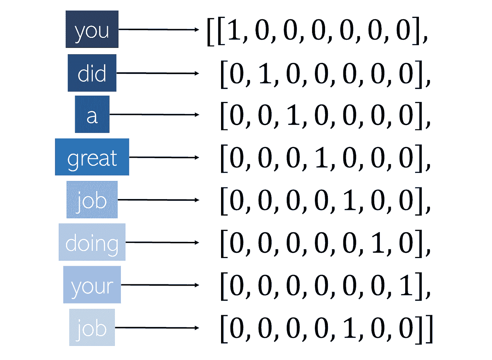
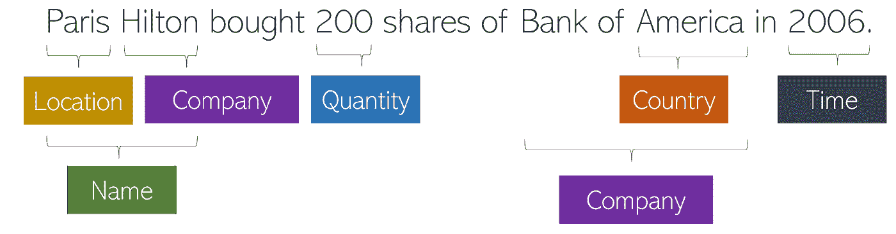
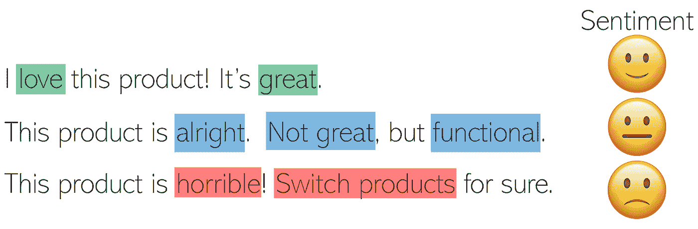

# 文本注释指南——理解语言的关键

> 原文：<https://towardsdatascience.com/a-guide-to-text-annotation-the-key-to-understanding-language-e221a69ee90e?source=collection_archive---------28----------------------->

[Pixabay](https://pixabay.com/photos/scrabble-game-letters-play-1615794/)

## 命名实体识别、情感分析等等

在一个越来越受数据驱动的数字世界中，企业必须利用用户在其平台上提供的大量数据，将自己与竞争对手区分开来。文本形式的数据是最常见、最丰富、最复杂的数据之一，从产品评论到社交媒体评论，理解组织或项目环境中的大量文本至关重要。

不幸的是，随着文本中大量信息的出现，处理这些非结构化的、机器不可读的数据也面临着挑战。与图像或录音等固有的数字数据不同，文本更加复杂。虽然通过自然语言处理(NLP)中的矢量编码(处理和建模文本的机器学习领域)等方法，模型可以表示单词的表层表示，但它必须手动学习(如果它学习的话)单个单词下面的深度。

标准的简单矢量化程序。每个单词代表向量中的一个索引，所以单词之间没有实际的联系或理解。

举个例子，单词“banks”有两个意思，比如“他刚刚抢劫了那些银行！”“河水又溢出了堤岸。”不管上下文如何，标准的矢量化模型都会认为这些是相同的。单词“banks”也是“bank”的复数形式，但天真的模型将无法绘制这些智能连接，而是标记，认为它们就像“apple”和“book”一样不同。没有人类的帮助，机器的简单文本到数组的转换缺乏人类操纵和创造语言的深度和独创性。出于这个原因，为非结构化文本提供高质量、信息丰富且准确的注释，以使机器对人类语言有更深入、更丰富的理解，这一点非常重要。这包括增加人类的解释，以提高机器的智能。创建各种标签的过程被称为文本注释，这些标签对人类来说是本能的，但却为人工智能提供了大量需要的信息。

例如，考虑命名实体标记，这是文本注释中的一个常见任务，其中非结构化文本中的实体(名词)被识别并被分配一个类别。这些可能包括组织、国家、位置、时间表达式、数量、货币、百分比、名称等。由于范围和定义的利益冲突，命名实体标记通常是极其复杂的。例如，考虑文本样本:“2006 年，亚历山大在弗吉尼亚的家中购买了 200 股美国银行股份。这相当于她投资组合的 30.5%。”理想情况下，完美的命名实体识别系统应该能够输出:“亚历山大[人名]于 2006 年[时间]在她位于弗吉尼亚[位置]的家中购买了 200[数量]股美国银行[公司]。这相当于她投资组合的 30.5%。命名实体标记有许多复杂之处——例如,“America”是一个国家，但是聪明的注释者会认识到这个实体本身嵌套在一个更大的实体中——美国银行，这是一个公司。

嵌套实体的一个常见示例。

或者，考虑这个句子，“亚历山大居住在弗吉尼亚州。”亚历山大港本身是弗吉尼亚州内的一座城市，但大多数人类注释者有一种本能的预感，亚历山大港。注释者能否区分“巴黎[城市]”、“希尔顿[公司]”、“巴黎希尔顿[人名]”？能够成功执行 NER 的智能模型——命名实体识别、自动命名实体标记——依赖于最初手动标注的文本样本。通过在我们的对话中提供对象背后的含义——通常是深层次的本能，并根据上下文而变化——模型的理解得到了加强。

情感分析是另一种常用的数据注释方法，在商业中有很强的直接应用。这个过程包括将文本样本中表达的观点按照积极、中立或消极的尺度进行分类。情感分析的一个细分还包括“主观性”——衡量一段文本有多固执己见(相对于更多事实内容而言)。

巧妙运用情感分析对做出商业决策至关重要。例如，假设你是一家应用公司的业务主管。您的应用程序在 app store 中的五星评级长期保持在 4.9/5，您的分析师已确定无需对应用程序进行进一步更改，因为最佳版本已经创建。然而，看似矛盾的是，你的 app 使用量在慢慢下降。如果进步的最明显和最公开的信号——评级——表明应用程序运行良好，这怎么可能呢？在对你的应用的评论(从应用商店到流行的技术博客)进行情绪分析后，你发现对你的应用的总体情绪实际上是负面的。喜欢这个应用程序的人更有可能对它进行评级，而不是全部删除，这产生了一个有偏见和淡化的进度信号。根据您的发现，您批准了进一步的开发，并看到您的应用程序使用量飙升。

# 总之…

*   为了给模型更多的视角和理解，文本模型需要文本注释。
*   命名实体识别是对文本中不同实体结构的标注。
*   情感分析是一种从文本中提取人类情感和印象的方法。