# 文本分类和情感分析指南

> 原文：<https://towardsdatascience.com/a-guide-to-text-classification-and-sentiment-analysis-2ab021796317?source=collection_archive---------7----------------------->


[腾雅特](https://unsplash.com/@tengyart?utm_source=unsplash&utm_medium=referral&utm_content=creditCopyText)在 [Unsplash](https://unsplash.com/s/photos/emotion?utm_source=unsplash&utm_medium=referral&utm_content=creditCopyText) 上拍摄的照片

## 如何利用机器学习对语句的情绪进行分类？

**动机:**文本分类和情感分析是一个非常常见的机器学习问题，被用在很多活动中，比如产品预测、电影推荐和其他一些活动。目前，对于像我一样对这个领域不熟悉的每个机器学习者来说，探索这个领域已经变得非常重要。在探索这个话题后，我觉得，如果我通过一篇文章分享我的经验，它可能会帮助一些试图探索这个领域的人。所以，我会试着从一个基本的层次来构建整个东西，所以这篇文章可能看起来有点长，但是如果你想的话，它有一些部分你可以跳过。

像情感分析这样的文本分类问题可以使用多种算法以多种方式实现。这些主要分为两大类:

1.  单词包模型:在这种情况下，我们数据集中的所有句子都被标记化，形成一个单词包来表示我们的词汇。现在，我们数据集中的每个单独的句子或样本都由单词包向量表示。这个向量称为特征向量。比如‘今天是晴天’，和‘太阳从东方升起’是两句话。单词包将是两个句子中唯一的所有单词。
2.  第二种方法是基于时间序列的方法:这里每个单词由一个单独的向量表示。所以，一个句子被表示为一个向量的向量。

这是两种方法之间最基本的区别。现在，我们来详细看看。

为此，我们将使用 IMDB 审查数据集。它有 50，000 条评论，它们相应的情绪被标记为“正面”和“负面”。因此，首先，我们需要检查和清理我们的数据集。

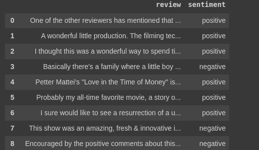

初始数据集

```
from bs4 import BeautifulSoupdef strip_html(text):
  soup = BeautifulSoup(text, "html.parser")
  return soup.get_text()import redef remove_between_square_brackets(text):
  return re.sub('\[[^]]*\]', '', text)def denoise_text(text):
  text = strip_html(text)
  text = remove_between_square_brackets(text)
  return textdef remove_special_characters(text, remove_digits=True):
  pattern=r'[^a-zA-z0-9\s]'
  text=re.sub(pattern,'',text) 
  return text def Convert_to_bin(text, remove_digits=True):
  if text=='positive': 
  text= 1   
  else: 
  text=0
  return text
```

这些是清理评论部分所需的预处理，Convert_to_binary 用于将“正面”情感转换为 1，将“负面”情感转换为 0。因此，在预处理之后，我们得到:


预处理后

如果我们计算出我们的目标阶级划分。

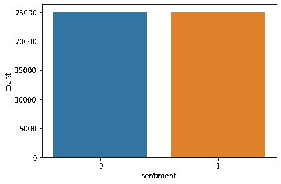

我们有 25k 的正面情绪和 25k 的负面情绪。所以，让我们把数据分开。

```
X=df['review'].values
Y=df['sentiment'].values
X_train, X_test, Y_train, Y_test= train_test_split(X,Y, test_size=0.3)
```

## 第一种方法

> 矢量器:词汇袋

在这种方法中，我们使用词汇表中的所有单词来创建单个特征向量，词汇表是通过对训练集中的句子进行标记化而获得的。这个特征向量用于表示我们集合中的所有评论。基本上每个字都算是一个特征。因此，特征的数量等于词汇表中唯一单词的数量。现在，每一句话或每一篇评论都被视为一个样本或记录。如果该词存在于该样本中，则该词具有被视为特征的一些值，如果该词不存在，则该值为零。所以，如果‘今天是晴天’，和‘太阳从东方升起’是两句话。并且他们的包将具有 10 个单词，这将是特征向量大小。说矢量是:['它'，'是'，'一'，'晴朗'，'天'，'太阳'，'升起'，'在'，'东方']。所以，第一句用[a，b，c，d，e，0，0，0，0]表示，a，b，c，d，e 是值，取决于我们使用的方案

因此，每个样本具有相同的特征集大小，这等于词汇表的大小。现在，词汇表基本上是由训练集中的单词组成的。训练集和测试集的所有样本都仅使用该词汇表进行转换。因此，测试样本中可能有一些词汇不在词汇表中，它们会被忽略。

它们形成非常稀疏的矩阵或特征集。类似于普通的分类问题，单词成为记录的特征，相应的标签成为目标值。如果我们考虑作为一个数据集，样本或评论将是行或记录，每个记录的特征集，或每个记录对应的特征列将等于词汇表的大小，其中每个单词将是一个特征。因此，它实际上就像一个常见的分类问题，特征的数量等于训练集中的不同标记。

这可以通过两种方式实现:

1.  计数矢量器:这里是特定样本或评论中的单词计数。该单词的计数成为相应单词特征的值。如果 vocab 中的单词没有出现在样本中，则其值为 0。因此，基本上，如果训练集中有 10 个句子，这 10 个句子将被标记化以创建包。比方说，创建的包长度为 100 个单词。因此，我们将形成一个长度为 100 的向量。对于特定的样本，如果有 15 个单词，其中有一个单词在该样本中出现三次，则对于该样本，对应于该单词的值变为 3，依此类推。
2.  TF-IDF 矢量器:这是一种更好的方法。它计算两个东西术语频率和逆文档频率。 ***词频=该词在样本中出现的次数。*** 和 ***IDF = log(该词在样本中出现的次数/该词在整个文档中出现的次数)*** 。这有助于注意到一些差异，如单词“the”在几乎所有句子中出现的频率相同，而像“good”这样具有重要意义的特殊单词则不同。因此，将特定样本的每个单词的 TF 和 IDF 值相乘，以获得该样本的特征向量。

我们将在这里使用 scikit-learn 的特征提取库。但这里需要注意的一点是，这也可以使用 TensorFlow 的 Tokenizer 函数来完成。使用 tokenizer 主要有三种方法:

1.  binary:X = tokenizer . sequences _ to _ matrix(X，mode='binary '):在这种情况下，如果单词出现在样本中，则单词特征值为 1，否则为零。
2.  count:X = tokenizer . sequences _ to _ matrix(X，mode='count '):在这种情况下，值是一个单词在句子中出现的次数。
3.  TF-IDF:X = tokenizer . sequences _ to _ matrix(X，mode='tfidf '):在这种情况下，我们考虑样本中单词的 TF 和样本中单词相对于该单词在整个文档中的出现次数的 IDF。

**计数矢量器:代码实现**

```
from sklearn.feature_extraction.text import CountVectorizer
vec = CountVectorizer()
vec.fit(X_train)
x_train=vec.transform(X_train)
x_test=vec.transform(X_test)
```

现在，如果我们注意到，向量只适合 X_train。这里是词汇形成的地方。所以词汇表只包含训练集中的单词。然后我们在训练集和测试集上进行转换。

```
from tensorflow.keras.models import Sequential
from tensorflow.keras.layers import Dense
from tensorflow.keras.optimizers import Adam
model = Sequential()
model.add(Dense(16, input_dim=x_train.shape[1], activation='relu'))
model.add(Dense(16, activation='relu'))
model.add(Dense(1, activation='sigmoid'))
model.compile(loss='binary_crossentropy',optimizer='Adam',metrics=['accuracy'])
```

这是我们计数矢量化方法的模型。我们可以看到，输入维度的大小等于每个样本的列数，也就是我们词汇表中的单词数。输出为 1，即情绪积极或消极。

该模型给出了 87.3%的准确度

**TF-IDF 矢量器:代码实现**

```
from sklearn.feature_extraction.text import TfidfVectorizer
vec = TfidfVectorizer()
vec.fit(X_train)
x_train=vec.transform(X_train)
x_test=vec.transform(X_test)
```

现在，我们调用 TF-IDF 矢量器，数据被转换。这里我们使用逻辑回归模型。

```
from sklearn.linear_model import LogisticRegression
lr = LogisticRegression()
lr.fit(x_train, Y_train)
```

该模型给出了 89.4%的准确度

## 第二种方法

> 单词嵌入:时间序列方法

在这种方法中，单词被单独表示为一个向量。在单词包的例子中，词汇表中的所有单词组成了一个向量。比方说，词汇表中有 100 个单词，因此，特定的单词将由大小为 100 的向量表示，其中对应于该单词的索引将等于 1，其他的将为 0。

因此，每个具有不同数量单词的样本将基本上具有不同数量的向量，因为每个单词等于一个向量。现在，为了给模型提供信息，我们需要让每个样本具有相同的维度，因此，需要填充以使每个样本中的单词数彼此相等。

基本上，在单词包或矢量器方法中，如果我们的总词汇中有 100 个单词，一个样本有 10 个单词，一个样本有 15 个单词，在矢量化之后，两个样本的大小都将是 100 个单词的数组，但在这里，对于 10 个单词，它将是(10 x 100)，即，10 个单词中的每个单词的长度向量为 100，类似地，第 15 个单词的长度向量将是(15 x 100)。因此，我们需要找到最长的样本，并填充所有其他样本以匹配大小。

我们可以通过一些方式做到这一点:

一键编码:正如我们上面讨论的，它只是获取词汇表的大小，并在所有索引处创建一个大小为 0 的数组，而仅在单词索引处创建一个大小为 1 的数组。但是这些东西给我们提供的信息非常少，创建了一个非常稀疏的矩阵。

***第二个选择是单词 embeddings。***

一键编码器是一种非常硬的编码方法。这是一个非常高的维度和稀疏的数据量非常低。**嵌入是一种创建密集矢量表示的方式。**维度更低，有助于捕捉更多信息。它更像是通过词与词之间的相似性来捕捉它们之间的关系和相似性。例如，国王、王后、男人和女人会有一些关系。

比方说，我们有 10k 个单词被嵌入到 300 维的嵌入空间中。为此，我们声明嵌入层中的节点数=300。现在，10k 字的每个字都进入嵌入层。每个单词都将根据它们彼此之间的相似性被放置在一个 300 维的平面上，这是由几个因素决定的，比如单词出现的顺序。现在，被放置在 300 维平面中的单词将具有 300 长度的元组来表示它，该元组实际上是 300 维平面上的点的坐标。因此，这个 300 维的元组成为新的特征集或表示单词的向量。

因此，单词的向量从 10k 减少到 300。元组用作两个单词之间的特征向量，向量之间的余弦角表示两个单词之间的相似度。

我们可以通过两种方式做到这一点:

1.  使用我们自己的嵌入
2.  使用预先训练的嵌入

**制作我们自己的嵌入**

现在，对于嵌入，我们需要首先通过嵌入层发送每个样本，然后使用嵌入使它们变得密集。这些嵌入层查看单词是如何被使用的，也就是说，它试图查看两个单词是否总是一起出现或者被对比使用。在判断所有这些因素之后，该层将该单词放置在 n 维嵌入空间中的一个位置。

**使用预先训练的嵌入式矩阵**

我们可以使用预先训练的单词嵌入，如 google 的 word2vec 和 Standford 的 GloveText。他们在拥有数十亿个例子和单词的巨大语料库上接受训练。现在，他们有几十亿个单词，而我们只有一万个单词，所以用十亿个单词来训练我们的模型是非常低效的。我们只需要从预先训练的嵌入中选择出我们需要的单词的嵌入。

现在，**这些嵌入是如何发现的？**

对于 google 的 word2vec 实现，有两种方法:

1.  滔滔不绝的话
2.  跳格。

这两种算法实际上都使用具有单个隐藏层的神经网络来生成嵌入。

**对于 CBOW** ，单词的上下文，即所需单词之前和之后的单词，被馈送到神经网络，并且需要模型来预测单词。

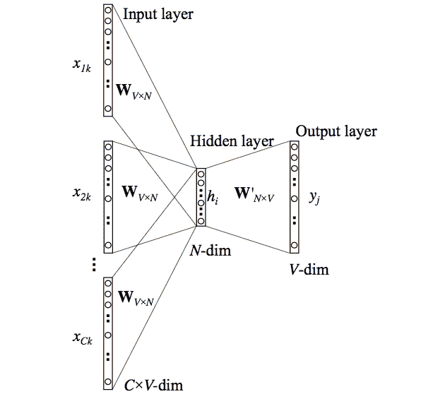

**对于 Skip-Gram** ，给定单词，模型必须预测上下文单词。

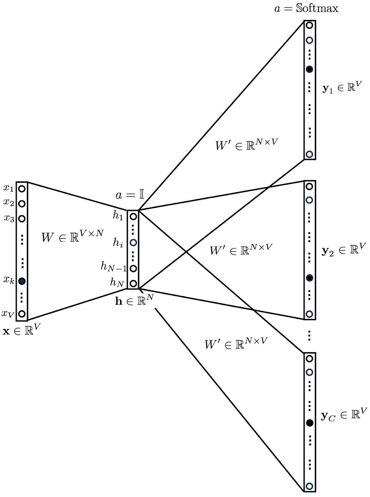

在这两种情况下，单词的特征向量或编码向量被馈送到输入端。输出有一个 softmax 层，其节点数等于词汇大小，它给出了每个单词的预测百分比，即，它告诉所需单词是 softmax 层中的节点所表示的单词的概率。虽然我们实际上没有使用输出层。

我们去寻找隐藏层中产生的权重矩阵。**隐藏层的节点数等于嵌入维数。**因此，假设词汇表中有 10k 个单词，隐藏层中有 300 个节点，隐藏层中的每个节点在训练后都会有一个每个单词的 10k 维的权重数组。

因为神经网络单元工作在

> y=f(w1x1+w2x2+………)。wnxn)

这里 x1，x2…xn 是单词，因此 n=词汇表中的单词数=10k。

所以对于 10k 的 x，会有 10k 的 w。现在，对于 1 个节点，有一个 10k 长的权重矩阵。对于 300 个组合，我们有一个 300 x 10k 重量的矩阵。现在，如果我们连接，我们将有 300 行和 10k 列。让我们转置矩阵。我们将得到 300 列和 10k 行。每行代表一个单词，300 个列值代表该单词的 300 个长度权重向量。

这个权重向量是所获得的长度为 300 的嵌入。

让我们看一下实现:

**训练自己的嵌入**

```
from keras.preprocessing.text import Tokenizer
tokenizer = Tokenizer(num_words=10000)
tokenizer.fit_on_texts(X_train)
```

Num_words 表示词汇的大小

```
x_train = tokenizer.texts_to_sequences(X_train)
x_test = tokenizer.texts_to_sequences(X_test)
```

1) tokenize.fit_on_text() →>根据词频创建词汇索引。例如，如果您有短语“我的狗与您的狗不同，我的狗更漂亮”，word_index[“狗”] = 0，word_index[“是”] = 1('狗'出现 3 次，'是'出现 2 次)

2) tokenize.text_to_sequence() →>将每个文本转换为一个整数序列。基本上，如果你有一个句子，它会给你句子中的每个单词分配一个整数。您可以访问 tokenizer.word_index()(返回一个字典)来验证分配给单词的整数。

```
vocab = len(tokenizer.word_index) + 1
from keras.preprocessing.sequence import pad_sequences
maxlen = 100
x_train = pad_sequences(x_train, padding='post', maxlen=maxlen)
x_test = pad_sequences(x_test, padding='post', maxlen=maxlen)
```

我们将所有句子填充到最大长度 100。

```
from tensorflow.keras.models import Sequential
from tensorflow.keras.layers import Embedding,Dense, Activation, MaxPool1D
from tensorflow.keras.optimizers import Adam
emb_dim=100
model= Sequential()
model.add(Embedding(input_dim=vocab, output_dim=emb_dim, input_length=maxlen))
model.add(MaxPool1D())
model.add(Dense(16,activation="relu"))
model.add(Dense(16,activation="relu"))
model.add(Dense(1, activation='sigmoid'))
model.compile(optimizer='Adam',loss='binary_crossentropy',metrics=['accuracy'])
```

最大池层用于挑选最能代表的特征以减少稀疏性。


模型摘要

该模型给出了 77.4%的准确度

**使用预训练嵌入**

我们将使用斯坦福的手套嵌入，它被训练了超过 60 亿个单词。

它有四个文件，每个文件有不同的嵌入空间，我们将使用 50d，这是一个 50 维的嵌入空间。

```
['glove.6B.100d.txt',  'glove.6B.200d.txt',  'glove.6B.50d.txt',  'glove.6B.300d.txt']
```

实施:

```
import numpy as np
from tensorflow.keras.preprocessing.text import Tokenizer
tokenizer = Tokenizer(num_words=10000)
tokenizer.fit_on_texts(X_train)
x_train = tokenizer.texts_to_sequences(X_train)
x_test = tokenizer.texts_to_sequences(X_test)
from keras.preprocessing.sequence import pad_sequences
maxlen=100
x_train = pad_sequences(x_train, padding='post', maxlen=maxlen)
x_test = pad_sequences(x_test, padding='post', maxlen=maxlen)
```

所以，让我们看看如何从给定的嵌入文件中提取我们需要的嵌入。

```
emb_dim=50
vocab=len(tokenizer.word_index)+1
emb_mat= np.zeros((vocab,emb_dim))
#Initializing a zero matrix for each word, they will be compared to have their final embeddingwith open(file_path+'glove.6B.50d.txt') as f:
  for line in f:
    word, *emb = line.split() 
    if word in tokenizer.word_index:
    ind=tokenizer.word_index[word]
    emb_mat[ind]=np.array(emb,dtype="float32")[:emb_dim]
```

这是一个任务的提取器，所以我们有一行嵌入和单词。所以，我们只是比较这些词来挑选出数据集中的索引。取向量，并把它们放在嵌入矩阵中对应于数据集中单词索引的索引处。

我们使用了*emb，因为嵌入矩阵的大小是可变的。

因此，我们这里有一个具有 10k 单词词汇表的特征集，每个单词由一个 50 长度的元组嵌入来表示，该元组嵌入是从手套嵌入中获得的。

接下来，我们建立我们的模型。

```
from tensorflow.keras.models import Sequential
from tensorflow.keras.layers import Embedding,Dense, Activation, MaxPool1D
from tensorflow.keras.optimizers import Adam
emb_dim=50
maxlen=100
model= Sequential()
model.add(Embedding(input_dim=vocab, output_dim=emb_dim,weights=[emb_mat], input_length=maxlen,trainable=False))
model.add(MaxPool1D())
model.add(Dense(16,activation="relu"))
model.add(Dense(16,activation="relu"))
model.add(Dense(1, activation='sigmoid'))
model.compile(optimizer='Adam',loss='binary_crossentropy',metrics=['accuracy'])
```


模型摘要

该模型给出了 67%的准确度，这可能是由于嵌入大小的减小。嵌入的大小越大，包含的信息就越多。

现在，这些方法是如何有益于单词袋模型的？正如我们所看到的，这些单词包模型只是看到了一个单词在文档中的表现，也就是说，我们可以知道这个单词出现的频率或这个单词出现的任何模式是什么？而这些方法也使用嵌入来考虑两个单词之间的关系。

## 卷积神经网络用于分类

在数学(特别是泛函分析)中，卷积是对两个函数(f 和 g)的数学运算，产生第三个函数，表示一个函数的形状如何被另一个函数修改。术语卷积既指结果函数，也指计算结果函数的过程。

因此，卷积最适合从图像的 2D 像素中提取特征值的特殊特征和行为。卷积层有一组内核，有助于从数据样本中提取几个重要特征。在文本分类的情况下，我们的特征矩阵是一维的。所以，这里用的是 Conv1D。基本上，它作为一个大小由用户决定的滑动窗口移动。我们选择了 5 个。

现在，最初在嵌入之后，我们得到 100 维嵌入。接下来使用 1D 卷积，我们试图使我们的特征集更小，并让特征集发现分类的最佳特征关系。max-pooling 层也有助于挑选具有最佳性能的特征或单词。

卷积层总是在嵌入层提供其嵌入的特征向量之后使用。

实施:

```
from tensorflow.keras.models import Sequential
from tensorflow.keras.layers import Embedding,Dense, Activation, MaxPool1D,Conv1D
from tensorflow.keras.optimizers import Adam
emb_dim=100
model= Sequential()
model.add(Embedding(input_dim=vocab, output_dim=emb_dim,
input_length=maxlen))
model.add(Conv1D(64, 5, activation='relu'))
model.add(MaxPool1D(5))
model.add(Conv1D(128, 5, activation='relu'))
model.add(MaxPool1D(5))
model.add(Dense(16,activation="relu"))
model.add(Dense(1, activation='sigmoid'))
model.compile(optimizer='Adam',loss='binary_crossentropy',metrics=['accuracy'])
```

模型摘要

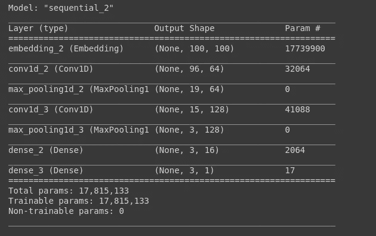

这里我们训练了自己的 100 维嵌入矩阵。我们使用了两个卷积层，分别具有 64 个和 128 个内核滤波器。我们保持了滑动窗口=5。

该模型给出了 77%的测试准确度

## 使用递归神经网络进行分类

**为什么选择递归神经网络？**

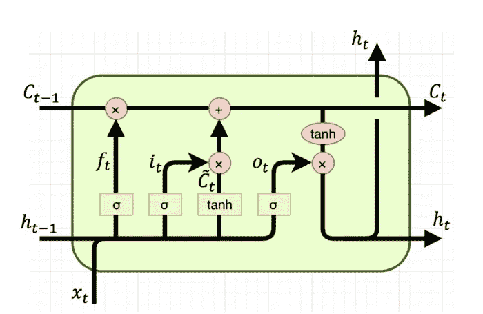

到目前为止，我们一直试图从样本中的所有单词中一次提取一些特征。所以，它们都是非时间方法。现在，让我们看看一个人将如何判断一种情绪。他/她不仅会考虑使用了什么单词，而且人类还会考虑如何使用它们，即在什么上下文中，前面和后面的单词是什么？所以，到目前为止，我们只关注了所使用的单词，所以，现在让我们看看故事的另一部分。

因此，对于这一部分，我们需要一个递归神经网络来记忆我们的模型。如果我们想讲述某人的陈述，我们通常会逐字逐句地听完整个陈述，然后做出评论。这就是递归神经网络要完成的任务。它将逐个以时间方式查看每个单词，并尝试使用该单词的嵌入特征向量与上下文相关联。

我们知道 **RNN 遭受消失和爆炸梯度问题**我们将使用 LSTM。

LSTM 对两件事进行操作，一个是从前一个时间戳发送的隐藏状态，另一个是实际保持权重以抵消消失梯度效应的单元状态。

LSTM 层基本上有 4 个组成部分:一个遗忘门，一个输入门，一个单元状态和一个输出门。

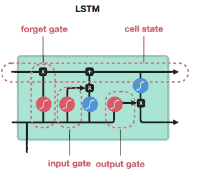

现在，让我们谈谈 LSTM 的工作和数据流，因为我认为这将有助于展示特征向量实际上是如何形成的，以及它看起来是什么样子。

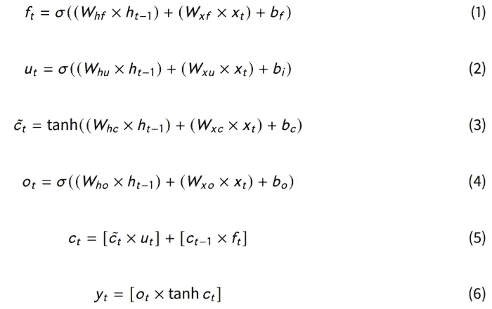

LSTM 方程

这些是 LSTM 运算的方程组。

**LSTM 为密集层提供了一个关于最后时间戳的特征集，以使用该特征集产生结果。**我们可以看到上面的方程是 LSTM 城门的方程。在这里，**每个门单独充当一个神经网络**。因此，在训练递归网络模型时，它们有自己的优化权重矩阵。使用这些权重矩阵，只有门学习它们的任务，例如要忘记哪些数据，以及需要将数据的哪一部分更新到单元状态。因此，门优化它们的权重矩阵，并根据它来决定操作。

现在，让我们看看它的用途。

假设我们有一个 100 维的向量空间。一批 16 个，每个样本长度= 10 个。并且每层中的节点数量= 64。

输入大小= batch_size *嵌入所以，这里是 16 x 100 矩阵= x(t)

时间戳 0 是每个样本或记录输入的第一个字。

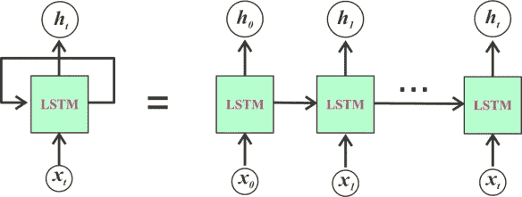

x0 代表样本的第一个字，x1 代表第二个字，依此类推。因此，每次 1 个字来自 16 个样本，并且每个字由 100 长度的向量表示。因此，每个输入的大小是(16 x 100)。

前一隐藏状态(tiemstamp 0 的 0 向量)=批量大小 x 隐藏单元因此，这里是 16 x 64 矩阵。= h(t-1)

连接后，矩阵形成 h(t-1)= 16×64 和 x(t)= 16×100

所以 h(t-1) + x(t)矩阵被发送到所有的门 f(t)，u(t)和 o(t)。

**忘门**

首先，隐藏状态的遗忘门权重矩阵 W{hf}的维数是 64×64，因为在隐藏状态中，对于时间戳(t-1)的 16 个字中的每一个，有来自 RNN 的 64 个节点中的每一个的 64 个值。

因此，实际上我们的隐藏状态矩阵的形状是(16 x 64):16 行记录，每条记录有 64 列或 64 个特征。

我们知道对于每个节点，

> y=w1x1+w2x2+……..wnxn

等式成立。

其中 x 是要素或列值。因此，对于网络的每个节点或单元，必须有一个维护的 64 个权重的数组，一个对应于一个 x。现在有 64 个这样的单元，所以总共有(64×64)个矩阵。

同样，现在对于 shape (16 x 100)的输入向量，100 列或 100 个特征中的每一列都有 16 行或 16 条记录。因此，一个隐藏单元的权重矩阵必须有 100 个值。总共有 64 个单元。所以，权重矩阵 W{xf}的维数为。(100 x 64)

所以在遗忘之门

根据等式 1。

f { t } = sigmoid((16 x 100)x(100 x 64)+(16 x 100)x(100 x 64))

F{t}=sigmoid (16 x 64)向量

Sigmoid 给出一个介于 0 和 1 之间的值。如果该值接近 0，则该值被忽略，否则在通过 F{t}后被添加到单元状态。

**现在，单元状态也具有相同的维度(16×64 ),因为它也具有 16 个样本单词乘以 64 个节点的权重，所以它们可以被容易地相加。**

**更新门**

接下来，是输入或更新门它决定数据应该进入的部分，这意味着递归神经网络的实际更新功能。它决定是否应该更新单元状态。

这些门的权重矩阵也与遗忘门的矩阵相同，在最后一个隐藏层中具有(64×64)个值，在输入中具有(100×64)个值。

W{hu}的尺寸为 64x 64，W{xu}的尺寸为 100 x 64。下标为“h”的权重矩阵与 h(t-1)部分相乘，相应地，下标为“x”的权重矩阵与级联的{x(t) +h(t-1)}向量的 x(t)部分相乘，该级联的{ x(t)+h(t-1)}向量是通过将先前隐藏的层与当前输入相加而获得的。

**每个带 h 的权重矩阵都有维数(64×64)，每个带 x 的权重矩阵都有维数(100×64)。**

因此，输入门的结果也是 sigmoid(16 x 64)

根据等式 2，

u { t } = sigmoid((16 x 100)x(100 x 64)+(16 x 100)x(100 x 64))

U{t}=sigmoid (16 x 64)向量

这里要注意的一件事是还有一个 tanh 层。tanh 在这里压缩 1 到-1 之间的值来处理爆炸和消失渐变。因此，它基本上像正则化值一样工作，表示该时间步长上临时单元状态的值。乙状结肠是开关。

根据等式 3，计算临时单元状态。

C1 { t } = tanh((16 x 100)x(100 x 64)+(16 x 100)x(100 x 64))

C1 { t } =双曲正切(16 x 64)向量

C1{t}和 U{t}向量矩阵具有相同的维数。因此，可以应用点积。

因此，在这之后，所获得的向量被相乘以获得 1 个结果。

关于这一点需要注意的一点是，虽然权重矩阵的维数相同，但它们并不相同。它们属于不同的门，它们的值和优化都是不同的。

**细胞状态**

现在，在下一步中，单元步骤被更新

它基本上是一个简单的总和。

新的 c 或单元状态是通过从上一步+当前时间步的完成中移除不需要的信息而形成的。如根据等式 5 所示。

**输出门**

接下来是输出门。这决定了隐藏层的下一步应该是什么。

为此，新的单元状态通过一个 tanh 门，h(t-1) + x(t)通过另一个 sigmoid。两个结果相乘。那是下一个。

根据等式 4，输出门决定下一个隐藏层。

o { t } = sigmoid((16 x 100)x(100 x 64)+(16 x 100)x(100 x 64))

O{t}=sigmoid (16 x 64)向量

这里我们可以看到 O(t)的维数和 h(t-1)匹配。

现在，这些权重随着每个单词在每个时间步更新，在第 10 个单词或时间戳(我们的情况中的最终时间戳)之后，模型已经遍历了样本中的所有单词，因此我们得到大小为 16 x 64 的矩阵，这基本上是与每个样本相对应的 64 个内部节点的权重值。但是，我们看不到同样经过优化的门的权重矩阵。这一行中的 64 个值基本上代表了由 64 个节点逐个产生的批次中的单个样品的重量。

对于所有的样本，我们获得一个值。这些值充当密集图层执行操作的要素集。

实施:

```
from tensorflow.keras.models import Sequential
from tensorflow.keras.layers import Embedding,Dense, Activation, MaxPool1D, LSTM
from tensorflow.keras.optimizers import Adam
emb_dim=50
maxlen=100
model= Sequential()
model.add(Embedding(input_dim=vocab, output_dim=emb_dim,weights=[emb_mat], input_length=maxlen,trainable=False))
model.add(MaxPool1D())
model.add(LSTM(64, return_sequences = False))
model.add(Dense(16,activation="relu"))
model.add(Dense(1, activation='sigmoid'))
model.compile(optimizer='Adam',loss='binary_crossentropy',metrics=['accuracy'])
```

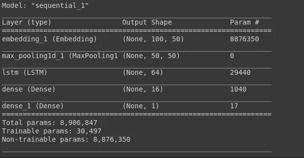

模型摘要

这里，我们使用了预先训练的单词嵌入。我们已经使用了 1 个具有 64 个隐藏单元节点的 LSTM 层。

该模型提供了 78%的准确度

## LSTM-CNN 模型

它是一个混合模型，由 LSTM 层和 CNN 层组合而成。

LSTM 图层正在为原始输入生成新的编码。然后，LSTM 层的输出被送入卷积层，我们希望卷积层能够提取局部特征。最后，卷积层的输出将汇集到一个更小的维度，并最终输出为正标签或负标签。

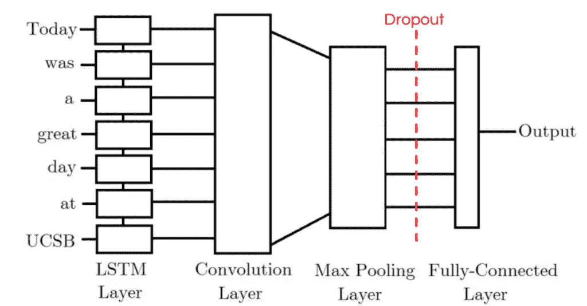

[来源](http://konukoii.com/blog/2018/02/19/twitter-sentiment-analysis-using-combined-lstm-cnn-models/)

## 结论

我们已经讨论了许多可以用于文本分类问题的方法，比如情感分析。

我希望这有所帮助。

Github 链接在这里是。