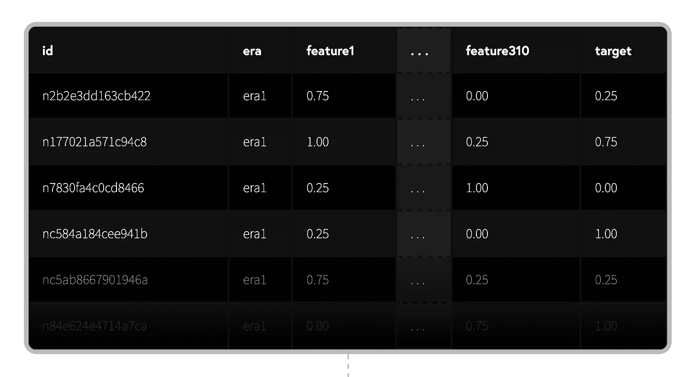
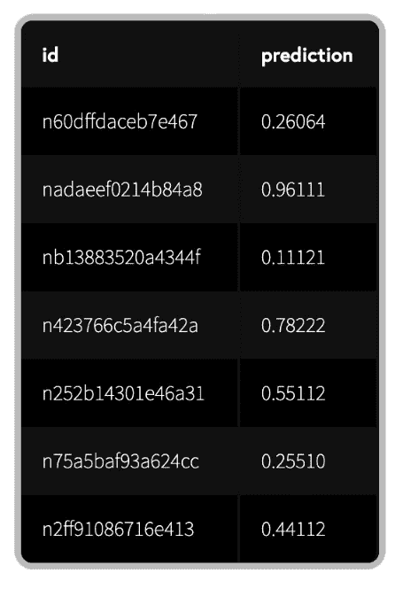
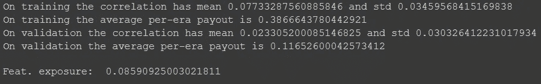
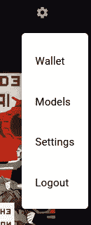
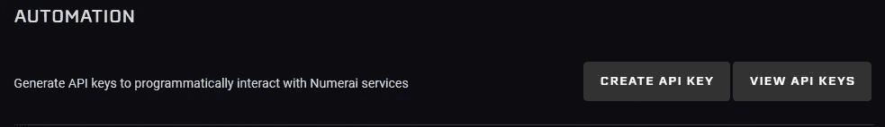
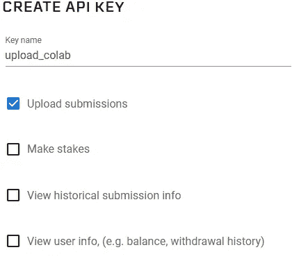
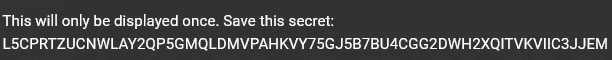
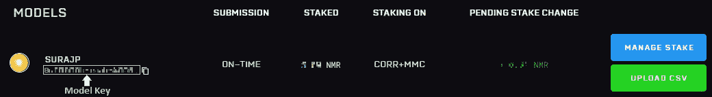
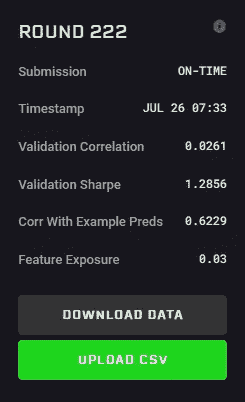

# “地球上最难的数据科学锦标赛”的简单指南

> 原文：<https://towardsdatascience.com/a-guide-to-the-hardest-data-science-tournament-on-the-planet-748f46e83690?source=collection_archive---------21----------------------->

## 好玩的数据科学？为了加密？为什么不两者都要？😀


来源:[数字博客](https://medium.com/numerai/numeraire-the-cryptocurrency-powering-the-world-hedge-fund-5674b7dd73fe)

***更新****—2020 年 12 月 01 日:笔记本已根据新目标“Nomi”更新。目标名称现在是“目标”，而不是“目标一杉”*

***更新****—2021 年 9 月:本笔记本使用的数据集现为旧版。一个新的超级海量数据集现已上线。只要稍加修改，代码仍然可以使用。*

# 告诉我密码:

确保你已经在[number . ai](https://numer.ai/)上[注册了](https://numer.ai/signup)，因为你需要设置你的 API 密匙来直接从 colab 提交。

[](https://colab.research.google.com/drive/1un9sQF5063VQ1UH13elYM269ZeYxHKFw?usp=sharing) [## 谷歌联合实验室

### 第一次数字投稿指南

colab.research.google.com](https://colab.research.google.com/drive/1un9sQF5063VQ1UH13elYM269ZeYxHKFw?usp=sharing) 

💡**数字锦标赛问题**

[数字](https://numer.ai)数据科学问题就像一个典型的**监督**机器学习问题，其中数据有几个输入**特征**和相应的**标签**(或**目标**)。我们的目标是使用各种技术学习从输入到目标的映射。我们通常将数据分成**训练**和**验证**两部分。而且大部分时间都花在清理数据上。



左图:训练数据样本。右图:样本提交

然而，数字数据是不同的。这是一个预测股票市场的问题，但它的独特之处在于数据被**混淆**并且已经被**清洗**！我们不知道哪一行对应哪一只股票。此外，每一行都被分成代表不同时间点的**时代**，但是只要它有结构，我们当然可以尝试从中学习和绘制模式。

Numerai 将这些经过清理的数据交给数据科学家，并要求他们为这些数据提供更好的估计。这些**众包**预测被用来建立一个元模型，并投资于世界各地的真实股票市场。奖励是基于你预测的质量和你的核磁共振赌注的数量。如果你的预测有助于获利，你就可以获得一定比例的股份，否则，你的股份就会被烧掉。这个赚/烧系统不断激励更好和独特的预测。因此，预测越准确和/或独特，回报越高。这就是它有趣和复杂的地方(最难的数据科学问题)。

让我们在 [Google Colab](https://colab.research.google.com) 上解决这个问题。使用简单但非常好的技术— **CatBoost** 的端到端走查。我将在这里解释 colab 片段。如果您在与此平行的新标签中打开[笔记本](https://colab.research.google.com/drive/1un9sQF5063VQ1UH13elYM269ZeYxHKFw?usp=sharing)链接，将会非常有帮助。

# 管道➿

1.  加载数据集(以及您将需要的一些操作)
2.  定义模型
3.  训练模特
4.  验证
    4.1 调整一些东西(回到步骤 1)
5.  预测并提交
    5.1 观察 4 周以上的表现

# 设置 Colab

我们需要切换运行时来使用 GPU，方法是转到

`Runtime -> Change runtime type -> GPU -> Save`

[Colab](https://colab.research.google.com/drive/1un9sQF5063VQ1UH13elYM269ZeYxHKFw?usp=sharing) 预装了如此多的数据科学库。我们需要安装`CatBoost`和`numerapi`。

我们将在 colab 中设置您的管道，并使其足够灵活，以便在那里执行实验并使用 API 键提交预测。因此，一旦设置好按键并完成模型，您只需按下 colab 上的`Run all`即可。

同样，确保你已经打开了这篇文章旁边的笔记本。

# 加载数据📊

使用 numerapi 下载数据并加载到内存中

锦标赛数据已经包含验证集(val1 和 [val2](https://forum.numer.ai/t/validation-2-announcement/166) )。我们通常评估我们的模型对这个子集的预测，目标是在看不见的数据上表现良好。

# 定义和训练模型🤖⚙️

定义和训练模型

这可能是您进行大部分观察和调优的地方。您应该尝试其他类型的建模算法。

# 做出和评估预测📐

不要被这里这么多的代码弄得不知所措。这主要是帮助评估预测的样板代码。你可能不需要改变太多。然而，一旦你对锦标赛感到满意，你可能会想要[添加更多的指标](https://forum.numer.ai/t/more-metrics-for-ya/636)以获得更好的评估。

预测和验证



训练和验证集的评估结果

一旦你认为你的预测满足了你的目标，你可以使用你的秘钥在`numerapi`的帮助下保存并上传它们。

# 提交预测📤



右上角的设置菜单

虽然您可以手动上传`predictions.csv` ，但我们将使用 API 来轻松提交。Numerai 允许你为不同的目的创建密钥，但是我们只为上传预测创建密钥。



用于创建密钥的自动化选项



不同用途的关键选项

要创建新的密钥，请转到

`Settings -> Create API key -> select "Upload Predictions" -> Save`

系统会提示您将密钥保存到安全的地方。

以下是提交预测的示例关键字。



提交预测的示例关键字

一个账号可以有 10 个型号。所以，在保持你的表现良好的模型不变的情况下，请随意试验新的技术。您可以使用`numerapi`提交不同模型的预测。您可以在“设置”上方的“选项”中看到您的型号列表。你只需要复制`model_id`并粘贴在这里。



获取模型密钥

提交预测



我的一个模型的统计，不是这个。

上传预测后，您将看到一些关于您提交的指标和信息。

从我的经验来看，在锦标赛中启动和运行需要几个提交。一旦你建立了你的工作流程，你需要做的就是在 Google colab 中按下`Run all`。

```
Your predictions will be tested on live data and given scores,[CORR](https://docs.numer.ai/tournament/learn#scoring): Correlation between your predictions and live data
[Meta Model Contribution(MMC)](https://docs.numer.ai/tournament/metamodel-contribution): *An advanced staking option which incentivizes models that are unique in addition to high performing*You can [stake](https://docs.numer.ai/tournament/staking-and-payouts) your NMR on either CORR or CORR+MMC.
```

# 下一步是什么？💭

你可以做几件事来提高你的表现。你也会因为你预测的独特性而得到报酬。

1.  玩弄数据
2.  调整模型参数
3.  变更模型架构
4.  在 [RocketChat](https://community.numer.ai/) 或[论坛](https://forum.numer.ai/)上提问
5.  加入每周办公时间——详情请访问 RocketChat