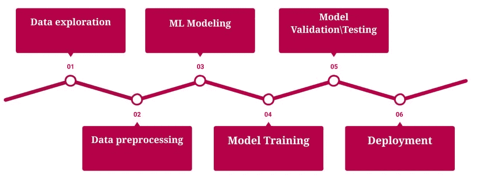

# 从软件开发人员/工程师过渡到机器学习工程师的指南

> 原文：<https://towardsdatascience.com/a-guide-to-transitioning-from-software-developer-engineer-to-machine-learning-engineer-49c8395dd63a?source=collection_archive---------3----------------------->

## 如何从软件开发人员过渡到机器学习工程师的指南

图片由[皮克斯拜](https://pixabay.com/illustrations/artificial-intelligence-brain-think-3382507/)的 Gerd Altmann 提供

他的博客面向任何对机器学习感兴趣的初学者或专业程序员/或学者。踏入机器学习工程领域，不需要依靠数据科学的工作经验。这个博客是为任何打算自学机器学习的人准备的。

我来告诉你我是如何开始成为一名机器学习工程师的旅程的。我有多年的 C++开发经验，对图像处理感兴趣。最近，机器学习已经被应用到许多现实世界的应用中。我很快就迷上了这种新的范式。从两年前开始，我一直在积极寻求更多的信息和知识，包括自学和做许多自己的项目。

> 作为一个热爱图像处理各方面的人，我从两年前开始决定探索深度学习。现在，我想发布这个资源来帮助其他人，那些像我一样对人工智能着迷的人，以及那些希望做同样事情的人。我希望这个博客能让他们更容易尝试我的方法。

# 目录

1.  数据科学 vs 机器学习工程
2.  机器学习技能
3.  机器学习编程技能
4.  其他活动
5.  结论
6.  资源

# **1。数据科学 vs 机器学习工程**

理解数据科学家和机器学习工程师之间的差异至关重要。机器学习工程师角色专门针对机器学习，在工作描述中也可能被称为“软件工程师、机器学习”或“数据工程师”。

关于数据科学家和机器学习工程师之间的区别，有大量的在线资源，请务必查看:

*   [Panoply:数据工程师和数据科学家有什么区别？](https://blog.panoply.io/what-is-the-difference-between-a-data-engineer-and-a-data-scientist)
*   [跳板:机器学习工程师 vs 数据科学家](https://www.springboard.com/blog/machine-learning-engineer-vs-data-scientist/)
*   [奥莱利:数据工程师与数据科学家](https://www.oreilly.com/ideas/data-engineers-vs-data-scientists)

作为机器学习工作流程的一部分[，数据科学家利用统计分析来确定使用哪种机器学习方法。只有到那时，他们才开始原型制作和构建这些模型。](https://skymind.ai/wiki/machine-learning-workflow)

> 机器学习工程师通常会在建模过程之前和之后与数据科学家合作；构建数据管道，将数据输入模型。最后，设计一个服务于这些模型的工程系统，以确保模型的持续健康。

下图将解释机器学习项目中不同角色的交互:

机器学习项目中的不同角色

# 2.机器学习技能

## 2.1.机器学习理论

有很多资源可以学习机器学习理论。就我个人而言，我喜欢 T2 和吴恩达的课程。以下是我发现对理解机器学习有用的一些课程:

[**斯坦福 CS229 by 吴恩达:机器学习**](https://www.youtube.com/watch?v=UzxYlbK2c7E&list=PLA89DCFA6ADACE599)

本课程提供了机器学习和统计模式识别的广泛介绍。这门课更深入算法的数学推导。

[**吴恩达斯坦福 CS229A:应用机器学习**](https://www.youtube.com/watch?v=PPLop4L2eGk&list=PLLssT5z_DsK-h9vYZkQkYNWcItqhlRJLN)

这是一门令人惊叹的课程，提供了机器学习的完整概述。作为一门应用机器学习课程，与 CS229 相比，它的数学性要低得多，在实践方面花费的时间更多。

[**吴恩达斯坦福 CS230:深度学习**](https://www.youtube.com/watch?v=PySo_6S4ZAg)

在这门课程中，你将学习深度学习的基础，了解如何构建神经网络，并学习如何领导成功的机器学习项目。本课程不太关注数学，而是花更多时间教授应用机器学习算法的实用方法。这是这个列表中最实用的。

[**斯坦福 CS231 作者费-李非:卷积神经网络**](https://www.youtube.com/watch?v=vT1JzLTH4G4&list=PLa-Bt050gYuhEeLRG8YBmFxwLvTJ5FqPS)

本课程详细介绍了深度学习架构的细节，重点是学习端到端模型，尤其是图像分类。它比 CS230 更深入地关注深度学习。

[**UC Berkeley stat-157 作者 Alex Smola:深度学习**](https://www.youtube.com/watch?v=jikAvn68mYY&list=PLZSO_6-bSqHQHBCoGaObUljoXAyyqhpFW&index=75)

这个课程是一个关于深度学习的很棒的课程，对最新的深度学习架构进行了解释。您将学习如何详细实现每个模型。你可以完全访问 [GitHub](https://github.com/d2l-ai/berkeley-stat-157) 中的所有代码。

> 这些课程都很有用，你将从探索所有这些课程中受益。在每门课程中，你会学到不同的东西。这些课程为该领域提供了良好的基础。如果你想学习深度学习，你将需要学习机器学习和深度学习的基础。在你深入研究计算机视觉、自然语言处理、机器人技术或深度强化学习之前，你将需要这个基础。你还会从计算机视觉，自然语言处理，语音识别，甚至自动驾驶汽车上看到一点点每个专业化。这将帮助你决定你对这个领域的哪个领域最感兴趣。

## 2.2.深度学习框架

存在许多用于构建深度学习应用的库。最常见的有 TensorFlow，Keras，PyTorch。这三个库都是开源的。有许多资源可以用来了解关于这些框架的更多信息。我做了一个比较，你可以在我的 [Github](https://github.com/ShiNik/DeepLearning_Tensorflow/blob/master/doc/deep_learning_frameworks.md) 中找到。

## 2.3.*机器学习工作流程*

机器学习工作流是从零开始构建机器学习项目所需的过程。这个过程可能因项目而异。然而，机器学习项目的核心通用步骤如下:

*机器学习工作流程*

# 3.机器学习编程技能

## 3.1.计算机编程语言

Python 是机器学习中最常用的语言。Python 的调试非常具有挑战性，因为它是基于动态数据类型的。对于那些来自强结构化语言(如 C++)的人来说，适应动态类型和脚本可能是一个挑战。

脚本语言旨在快速学习和编写，因为一般来说，它们要求简短的源代码。然而，随着应用程序的增长，您可能会面临一些困难。首先，你没有像 C++这样的编译器来捕捉你的错误。此外，所有的类型都是动态的，所以当你的程序变大时，你可能很难跟踪并找出变量的类型。这可能会使你的代码变得容易出错，尤其是如果它设计得不好的话。

使用 python 包管理器是一个很好的实践。全局安装的问题是，对于给定的 Python 解释器，一次只能安装一个版本的包。当您的应用程序需要同一库的不同版本时，这可能是一个问题。此外，升级库可能会破坏应用程序

有许多 python 包管理器，但是在数据科学工作中最常用的是 Anaconda。Anaconda 简化了包的管理和部署。它只需一次安装就可以带来许多数据科学和机器学习中使用的工具，因此它非常适合进行简短的设置。

Anaconda 的另一个重要特性是 conda，它是 Anaconda 包管理器。您可以使用 conda 安装许多库。此外，在 Anaconda 中，我们可以创建一个虚拟环境，这有助于隔离不同的库和版本。如果他们使用不同的 Python 库，那么为每个项目创建一个虚拟环境是一个好主意。

## **3.2。Python 库**

Python 的标准库非常大，您的项目可能需要很多。这些库包含了很多用 c 编写的模块，最常见的你应该知道的有 panda、numpy、matplotlib、opencv-python、scipy、scikit-learn、tensorboard。

> 如果您想了解更多，我会在参考资料部分留下有用的链接供您访问。

## **3.3。Python 集成开发环境**

有许多集成开发环境(ide)可供您选择来开发您的软件。用于机器学习的常见 ide 有 [Jupyter Notebook](https://jupyter.org/) 、 [PyCharm](https://www.jetbrains.com/pycharm/) 。这些 ide 使得机器学习的编程更加容易。

如果你正在构思一个想法或制作一个简单的功能，Juyter 笔记本是很容易的。我发现在 Jupyter Notebook 中格式化我的代码或调试我的代码并不容易。

PyCharm 是 JetBrains 公司开发的一款开源软件，JetBrains 公司以其名为 IntelliJ IDEA 的 Java IDE 而闻名。PyCharm IDE 的一些有趣特性包括一个代码编辑器，一个非常强大的带有图形界面和错误高亮的调试器。它内置了对 Git、SVN 和 Mercurial 的支持。

# **4。其他活动**

## **4.1。免费提供的博客**

有许多博客提供关于人工智能和机器学习的信息。其中一些博客属于谷歌或 Bair Blog 等知名公司。但是如果你正在寻找简单的例子和指南，你可以参考以下三个博客；[走向数据科学](https://towardsdatascience.com/)、[中等](https://medium.com/topic/machine-learning)和[机器学习精通](https://machinelearningmastery.com/about/)。

## **4.2。播客**

播客是获取新技术和市场方向信息的绝佳资源。下面是我最喜欢的两个播客:[实用 AI](https://podcasts.google.com/?feed=aHR0cHM6Ly9jaGFuZ2Vsb2cuY29tL3ByYWN0aWNhbGFpL2ZlZWQ&ved=0CAAQ4aUDahcKEwjQmsa3hKznAhUAAAAAHQAAAAAQAw) 和[今日 AI](https://podcasts.google.com/?feed=aHR0cHM6Ly93d3cuY29nbmlseXRpY2EuY29tL2ZlZWQvcG9kY2FzdC8)。

## **4.3。练习机器学习**

[send ex Youtube](https://www.youtube.com/user/sentdex)频道包含了很多机器学习和深度学习的实际应用。他专注于机器学习和深度学习的实现，因此他不会深入每个算法背后的理论。他用每个人都能听懂的非常简单的语言一步一步地解释一切。你可以从他的博客中获得所有的代码。

我使用 Keras 和 TensorFlow 做了一个简单的狗和猫的分类项目，可以帮助你开始建立深度学习项目。您还将熟悉使用 [TensorFlow 数据集](https://www.tensorflow.org/api_docs/python/tf/data/Dataset)构建数据管道来对猫和狗的图像进行分类。你可以访问我的 [GitHub](https://github.com/ShiNik/DeepLearning_Tensorflow) 中的代码。

我做了一个小的回归项目，演示了如何建立一个简单的线性回归。这段代码也可以从我的 [GitHub](https://github.com/ShiNik/wiki_ml) 中获得。

## **4.4。参加比赛**

另一个学习新技术和建立人际网络的好地方是 meetup。参加聚会会非常有用。黑客马拉松是练习和提高你的 python 和深度学习技能的另一个好方法。黑客马拉松通常是为期一天的比赛，在比赛中你会收到真实的数据和挑战，你需要在一天结束前解决这些问题。

现在，我们知道如果我们需要建立一个深度学习项目，我们需要数据。要开始一个深度学习项目，你首先需要有一个图像数据集。构建数据集可能非常具有挑战性，甚至是不可能的。幸运的是 [Kaggle](https://www.kaggle.com/competitions) 为我们提供了许多免费的数据集用于此目的。

如果你达到了需要更大挑战的地步，你可以参加 AI 比赛。每年，许多公司，如人工智能实验室、微软、Kaggle 和其他公司都会举办你可能会参加的竞赛。

# 5.结论

希望这篇文章对那些想知道如何成为一名机器学习工程师的人有所帮助。

以下是一些你可以自己研究的想法:

*   测试机器学习系统
*   尝试了解机器学习部署
*   尝试了解 Docker

# 6.资源

l \从[科里斯查费](https://www.youtube.com/user/schafer5) youtube 频道和[send ex](https://www.youtube.com/user/sentdex)YouTube 频道学习 python:这些频道是学习 Python、机器学习、深度学习和自然语言处理的丰富资源

[Conda](https://kapeli.com/cheat_sheets/Conda.docset/Contents/Resources/Documents/index) 备忘单:该备忘单总结了 Conda 命令行指令的常用方法，以供快速参考

[PyCharm 插件库](https://plugins.jetbrains.com/pycharm):插件非常有用，可以帮助你轻松扩展 PyCharm 的功能