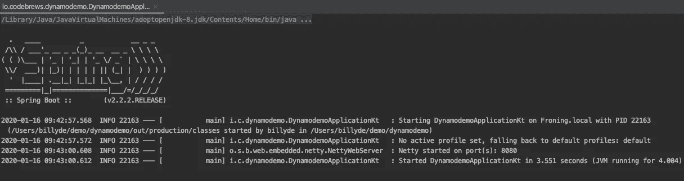
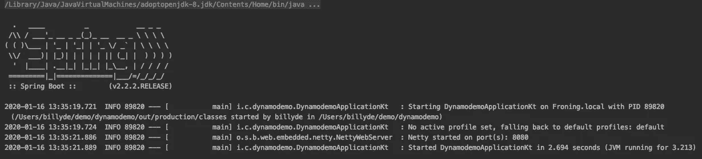

# Kotlin 数据类的 Spring Boot 配置属性指南

> 原文：<https://towardsdatascience.com/a-guide-to-use-spring-boots-configurationproperties-annotation-in-kotlin-s-dataclass-1341c63110f4?source=collection_archive---------0----------------------->


照片由[孙渔·金](https://unsplash.com/@mauveine)在 [Unsplash](https://unsplash.com/photos/3MplHv4cF2w) 上拍摄

> 我将 Spring Boot 描述为软件工程框架的苹果等价物。🍎原因是它设计得很好，允许你写更少更干净的代码。我是说，它很优雅，就像苹果一样。(由于我是苹果团队，所以我在这里可能有点偏见)。

Spring Boot 附带了很多注释，使得我们程序员的生活变得更加容易。🙂其中一个我经常使用的是`@ConfigurationProperties`。我发现它非常有用，因此，我想向您展示如何在您的应用程序中使用它。

更具体地说，您将学习如何将您的应用程序配置定义为一个由 Spring 管理的`dataclass`。我们将使用`@ConfigurationProperties`注释和`application.yml`文件的组合来创建配置`dataclass`。

定义一个配置类是很方便的。我们只需要定义它一次，之后，我们可以在需要它的不同类中多次使用它。

为了遵循这个指南，您可以克隆这个 Github [repo](https://github.com/billydh/dynamodemo) 。请注意，本教程是从这个[提交](https://github.com/billydh/dynamodemo/commit/c694fcff0703094c518cebf5c43b2e3b5703e9f1)开始的，所以如果您想在本教程中自己构建代码，请检查这个提交。如果没有，你可以直接复制回购协议，跟着读。🙂

回购中包含的应用程序是一个 Kotlin 应用程序，使用 Spring Boot 和 Spring Webflux 构建，并与 DynamoDB 相结合。如果您感兴趣，您可以查看这篇文章[来了解应用程序最初是如何构建的。](https://medium.com/swlh/how-to-build-a-reactive-microservice-api-with-spring-boot-spring-webflux-and-dynamodb-using-kotlin-e1be3e99b15e)

# 正在创建 DynamoConfigProperties 数据类

来看看我们现在的`DynamoClientProperties`班。您可以看到，它将`region`和`endpoint`作为其类构造函数的 2 个参数。这两个值都将由 Spring 通过`@Value`注释注入，该注释通过传递给参数的路径查看位于`src/main/kotlin/resources`目录中的`application.yml`文件。

`DynamoClientProperties.kt`

另一方面，让我们检查一下我们的`application.yml`文件的内容。非常简单直接。它只是定义了与 DynamoDB 相关的类的配置。

应用程序. yml

现在，如果我们让应用程序保持原样，一切都很好。真的没必要改变什么。但是，想象一下，如果我们的配置由几个值组成，而不仅仅是 2 个值(在我们的例子中，只有`region`和`endpoint`)，并且相同的配置用于多个类，而不仅仅是 1 个类(例如在`DynamoClientProperties.kt`)。

在这种情况下，这意味着我们需要在不同的地方编写相同的`@Values`语句。这就是为什么我们要改用`@ConfigurationProperties`的原因。它使我们能够在一个地方定义一个包含所有用于特定目的的配置值的`dataclass`(例如，与 DynamoDB 相关的配置),只需一次，并且我们可以根据需要在许多其他地方/类中使用它。

继续创建一个新的 Kotlin 文件并将其命名为`DynamoConfigProperties.kt`。文件的内容会是这样的。

DynamoConfigProperties.kt

很快您就可以看到，您编写了更少的代码来获得您需要的值。然后你可以去`DynamoClientProperties`班，注射`DynamoConfigProperties`而不是`region`和`endpoint`。就会变成这样。

使用 DynamoConfigProperties 的 DynamoClientProperties.kt

简单干净多了吧？另一个好处是，如果你需要任何值`customerTableName`、`region`或`endpoint`，你可以简单地传递`DynamoConfigProperties`，顺便说一下，它是一个 Spring bean，所以它只在 Spring Boot 应用程序启动时初始化一次。

## 运行应用程序

现在，如果您从 IntelliJ 运行应用程序的`DynamodemoApplication.kt`中的`main`函数，一切都将像更改前一样运行。一切都好，伙计们。😃



DynamodemoApplication.kt

您可以继续按照这个[教程](https://medium.com/swlh/how-to-build-a-reactive-microservice-api-with-spring-boot-spring-webflux-and-dynamodb-using-kotlin-e1be3e99b15e)来测试与 DynamoDB 的交互是否仍然如预期的那样工作(这是教程的最后一部分，抱歉，Medium 还不支持锚链接😜).

# 关于编写 DynamoConfigProperties 数据类的附加说明

当你看到`DynamoConfigProperties`是如何编写的，你可能会有点犹豫，或者认为它有点混乱(或者难看)，因为我们将字段声明为`var`而不是`val`，尽管事实上这些值永远不会改变(或者应该说不应该改变)。

此外，我们需要提供一个空字符串`""`(或者任何一个`String`)，或者`null`(为此，需要将`DynamoConfigProperties`中的字段类型改为`String?`)。

如果您将它们声明为`val`或者不提供默认值并运行应用程序，您将看到以下错误。

```
2020-01-16 07:21:57.883  WARN 97395 --- [           main] onfigReactiveWebServerApplicationContext : Exception encountered during context initialization - cancelling refresh attempt: org.springframework.beans.factory.UnsatisfiedDependencyException: Error creating bean with name 'customerHandler' defined in file [/Users/billyde/demo/dynamodemo/out/production/classes/io/codebrews/dynamodemo/CustomerHandler.class]: Unsatisfied dependency expressed through constructor parameter 0; nested exception is org.springframework.beans.factory.UnsatisfiedDependencyException: Error creating bean with name 'customerRepo' defined in file [/Users/billyde/demo/dynamodemo/out/production/classes/io/codebrews/dynamodemo/CustomerRepo.class]: Unsatisfied dependency expressed through constructor parameter 0; nested exception is org.springframework.beans.factory.UnsatisfiedDependencyException: Error creating bean with name 'dynamoClientProperties' defined in file [/Users/billyde/demo/dynamodemo/out/production/classes/io/codebrews/dynamodemo/DynamoClientProperties.class]: Unsatisfied dependency expressed through constructor parameter 0; nested exception is org.springframework.beans.factory.UnsatisfiedDependencyException: Error creating bean with name 'dynamoConfigProperties' defined in file [/Users/billyde/demo/dynamodemo/out/production/classes/io/codebrews/dynamodemo/DynamoConfigProperties.class]: Unsatisfied dependency expressed through constructor parameter 0; nested exception is org.springframework.beans.factory.NoSuchBeanDefinitionException: No qualifying bean of type 'java.lang.String' available: expected at least 1 bean which qualifies as autowire candidate. Dependency annotations: {}
2020-01-16 07:21:57.960  INFO 97395 --- [           main] ConditionEvaluationReportLoggingListener :Error starting ApplicationContext. To display the conditions report re-run your application with 'debug' enabled.
2020-01-16 07:21:58.085 ERROR 97395 --- [           main] o.s.b.d.LoggingFailureAnalysisReporter   :***************************
APPLICATION FAILED TO START
***************************Description:Parameter 0 of constructor in io.codebrews.dynamodemo.DynamoConfigProperties required a bean of type 'java.lang.String' that could not be found.Action:Consider defining a bean of type 'java.lang.String' in your configuration.Process finished with exit code 1
```

你可以看到 Spring 抱怨我们的`DynamoConfigProperties`的构造函数。😫

我想我们只需要处理我们的配置`dataclass`写得有多“丑”就行了，不是吗？🤷‍♂

不，我们没有。Spring Boot 来救援了。😊

## 为配置数据类使用 ConstructorBinding 批注

如果你的项目使用 Spring Boot 框架版本`2.2.0.RELEASE`或者更高版本，你可以改变你写`DynamoConfigProperties`的方式如下。

带有 ConstructorBinding 的 DynamoConfigProperties.kt

现在，继续运行应用程序的`main`功能。你应该看到下面的异常被抛出。😦

```
2020-01-16 13:29:03.367  WARN 87367 --- [           main] onfigReactiveWebServerApplicationContext : Exception encountered during context initialization - cancelling refresh attempt: org.springframework.beans.factory.UnsatisfiedDependencyException: Error creating bean with name 'customerHandler' defined in file [/Users/billyde/demo/dynamodemo/out/production/classes/io/codebrews/dynamodemo/CustomerHandler.class]: Unsatisfied dependency expressed through constructor parameter 0; nested exception is org.springframework.beans.factory.UnsatisfiedDependencyException: Error creating bean with name 'customerRepo' defined in file [/Users/billyde/demo/dynamodemo/out/production/classes/io/codebrews/dynamodemo/CustomerRepo.class]: Unsatisfied dependency expressed through constructor parameter 0; nested exception is org.springframework.beans.factory.UnsatisfiedDependencyException: Error creating bean with name 'dynamoClientProperties' defined in file [/Users/billyde/demo/dynamodemo/out/production/classes/io/codebrews/dynamodemo/DynamoClientProperties.class]: Unsatisfied dependency expressed through constructor parameter 0; nested exception is org.springframework.beans.factory.NoSuchBeanDefinitionException: No qualifying bean of type 'io.codebrews.dynamodemo.DynamoConfigProperties' available: expected at least 1 bean which qualifies as autowire candidate. Dependency annotations: {}
2020-01-16 13:29:03.422  INFO 87367 --- [           main] ConditionEvaluationReportLoggingListener :Error starting ApplicationContext. To display the conditions report re-run your application with 'debug' enabled.
2020-01-16 13:29:03.498 ERROR 87367 --- [           main] o.s.b.d.LoggingFailureAnalysisReporter   :***************************
APPLICATION FAILED TO START
***************************Description:Parameter 0 of constructor in io.codebrews.dynamodemo.DynamoClientProperties required a bean of type 'io.codebrews.dynamodemo.DynamoConfigProperties' that could not be found.Action:Consider defining a bean of type 'io.codebrews.dynamodemo.DynamoConfigProperties' in your configuration.Process finished with exit code 1
```

不幸的是，Spring 会向您抱怨它找不到我们的应用程序运行所需的`DynamoConfigProperties` bean。这是因为 Spring 不会扫描由`@ConfigurationProperties`注释的类。

我们最初的`DynamoConfigProperties`工作得很好，因为我们用`@Component`对它进行了注释，Spring 在构建应用程序上下文时会扫描它。

我知道你在想什么…你会给更新的`DynamoConfigProperties`添加`@Component`注释，是吗？但不幸的是，这也不行，当你启动应用程序时，它会抛出这个错误。

```
2020-01-16 13:45:06.021  WARN 92292 --- [           main] onfigReactiveWebServerApplicationContext : Exception encountered during context initialization - cancelling refresh attempt: org.springframework.beans.factory.BeanCreationException: Error creating bean with name 'dynamoConfigProperties': [@EnableConfigurationP](http://twitter.com/EnableConfigurationP)roperties or [@ConfigurationPropert](http://twitter.com/ConfigurationPropert)iesScan must be used to add [@ConstructorBinding](http://twitter.com/ConstructorBinding) type io.codebrews.dynamodemo.DynamoConfigProperties
2020-01-16 13:45:06.031  INFO 92292 --- [           main] ConditionEvaluationReportLoggingListener :Error starting ApplicationContext. To display the conditions report re-run your application with 'debug' enabled.
2020-01-16 13:45:06.039 ERROR 92292 --- [           main] o.s.boot.SpringApplication               : Application run failedorg.springframework.beans.factory.BeanCreationException: Error creating bean with name 'dynamoConfigProperties': [@EnableConfigurationP](http://twitter.com/EnableConfigurationP)roperties or [@ConfigurationPropert](http://twitter.com/ConfigurationPropert)iesScan must be used to add [@ConstructorBinding](http://twitter.com/ConstructorBinding) type io.codebrews.dynamodemo.DynamoConfigProperties
 at org.springframework.boot.context.properties.ConfigurationPropertiesBeanDefinitionValidator.validate(ConfigurationPropertiesBeanDefinitionValidator.java:66) ~[spring-boot-2.2.2.RELEASE.jar:2.2.2.RELEASE]
 at org.springframework.boot.context.properties.ConfigurationPropertiesBeanDefinitionValidator.postProcessBeanFactory(ConfigurationPropertiesBeanDefinitionValidator.java:45) ~[spring-boot-2.2.2.RELEASE.jar:2.2.2.RELEASE]
 at org.springframework.context.support.PostProcessorRegistrationDelegate.invokeBeanFactoryPostProcessors(PostProcessorRegistrationDelegate.java:286) ~[spring-context-5.2.2.RELEASE.jar:5.2.2.RELEASE]
 at org.springframework.context.support.PostProcessorRegistrationDelegate.invokeBeanFactoryPostProcessors(PostProcessorRegistrationDelegate.java:174) ~[spring-context-5.2.2.RELEASE.jar:5.2.2.RELEASE]
 at org.springframework.context.support.AbstractApplicationContext.invokeBeanFactoryPostProcessors(AbstractApplicationContext.java:706) ~[spring-context-5.2.2.RELEASE.jar:5.2.2.RELEASE]
 at org.springframework.context.support.AbstractApplicationContext.refresh(AbstractApplicationContext.java:532) ~[spring-context-5.2.2.RELEASE.jar:5.2.2.RELEASE]
 at org.springframework.boot.web.reactive.context.ReactiveWebServerApplicationContext.refresh(ReactiveWebServerApplicationContext.java:66) ~[spring-boot-2.2.2.RELEASE.jar:2.2.2.RELEASE]
 at org.springframework.boot.SpringApplication.refresh(SpringApplication.java:747) [spring-boot-2.2.2.RELEASE.jar:2.2.2.RELEASE]
 at org.springframework.boot.SpringApplication.refreshContext(SpringApplication.java:397) [spring-boot-2.2.2.RELEASE.jar:2.2.2.RELEASE]
 at org.springframework.boot.SpringApplication.run(SpringApplication.java:315) [spring-boot-2.2.2.RELEASE.jar:2.2.2.RELEASE]
 at org.springframework.boot.SpringApplication.run(SpringApplication.java:1226) [spring-boot-2.2.2.RELEASE.jar:2.2.2.RELEASE]
 at org.springframework.boot.SpringApplication.run(SpringApplication.java:1215) [spring-boot-2.2.2.RELEASE.jar:2.2.2.RELEASE]
 at io.codebrews.dynamodemo.DynamodemoApplicationKt.main(DynamodemoApplication.kt:15) [classes/:na]Process finished with exit code 1
```

那么，我们现在做什么？我们改进了代码的编写方式，但是我们的应用程序崩溃了！我们应该回到过去的方式吗？

绝对不行！🙅‍♂

以下是修复方法。(其实很简单)。

## 将配置属性扫描或启用配置属性应用到我们的主应用程序类

凭借另一个 Spring Boot 的注解——`@ConfigurationPropertiesScan`。我们试图用`@Component`注释更新的`DynamoConfigProperties`时，错误消息实际上告诉我们使用`@ConfigurationPropertiesScan`或`@EnableConfigurationProperties`。

在本教程中，我们将继续进行`@ConfigurationPropertiesScan`。因此，让我们像这样将注释添加到我们的`DynamodemoApplication`类中。

带有配置属性扫描的 DynamodemoApplication.kt

或者，如果你想用`@EnableConfigurationProperties`代替，这是你如何做。这需要一点额外的步骤来实现，也就是说，您需要明确地指定您想要启用哪个配置类。在我们这里是`DynamoConfigProperties`。

带有 EnableConfigurationProperties 的 DynamodemoApplication.kt

如果您想要启用其他配置类，您需要指定所有配置类，用逗号分隔，例如`@EnableConfigurationProperties(DynamoConfigProperties::class, KafkaConfigProperties::class)`。

应用上述任一项后，继续运行`main`功能。这次我不会再耍花招了。😜



DynamodemoApplication.kt 运行成功

瞧啊。现在一切正常。

干得好，伙计们！👍 👍


托里·莫里森在 [Unsplash](https://unsplash.com/photos/E0UKvm8rb8Q) 拍摄的照片

# 参考

这里的应用程序 Github—

关于应用程序最初是如何构建的教程— [此处](https://medium.com/swlh/how-to-build-a-reactive-microservice-api-with-spring-boot-spring-webflux-and-dynamodb-using-kotlin-e1be3e99b15e)

关于`@ConfigurationProperties`——[的 Spring Boot 官方文件在这里](https://docs.spring.io/spring-boot/docs/2.2.1.RELEASE/reference/html/spring-boot-features.html#boot-features-kotlin-configuration-properties)。