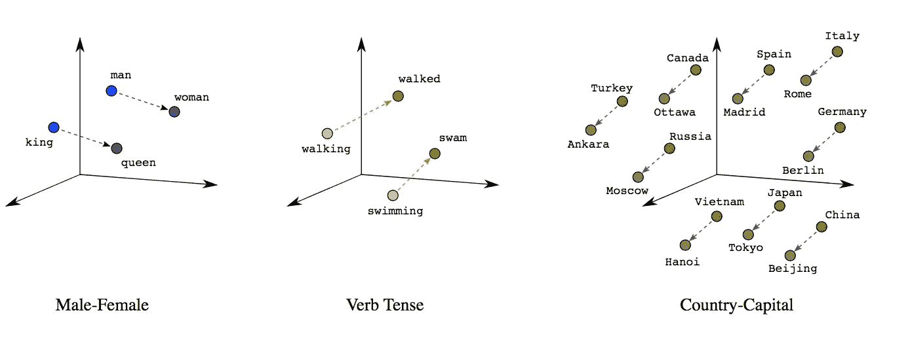
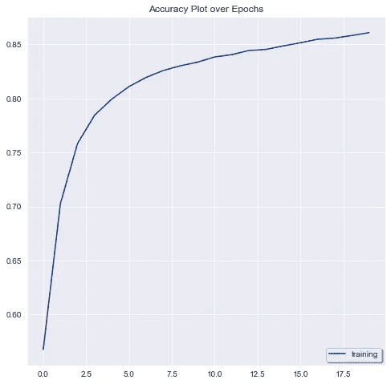
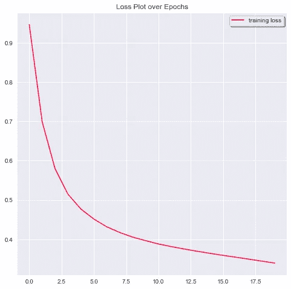

# 单词嵌入指南

> 原文：<https://towardsdatascience.com/a-guide-to-word-embeddings-8a23817ab60f?source=collection_archive---------20----------------------->

## 这是什么？它怎么会比单词袋模型更有用呢？

阅读、理解、交流并最终产生新内容是我们所有人都会做的事情，不管我们在职业生活中是谁。

当要从给定的文本体中提取有用的特征时，所涉及的过程与连续整数向量相比有着根本的不同。这是因为一个句子或一段文本中的信息是以结构化序列编码的，单词的语义位置传达了文本的意思。

因此，对数据的适当表示以及保留文本的上下文含义的双重要求使我了解并实现了两种不同的 NLP 模型来完成文本分类的任务。

> 单词嵌入是文本中单个单词的密集表示，考虑了上下文和该单个单词出现的其他周围单词。
> 
> 可以选择这个实值向量的维数，并且比简单的单词袋模型更有效地捕捉单词之间的语义关系。



单词之间的线性关系。图片来自 developers.google.com

> 简而言之，拥有相似含义或经常在相似上下文中一起出现的单词将具有相似的向量表示，这取决于这些单词在含义上的“接近”或“远离”。

在这篇文章中，我将探索两个单词嵌入——

> ***1。训练我们自己嵌入***
> 
> **2*。预先训练好的手套字嵌入***

# 数据集—

对于本案例研究，我们将使用 Kaggle 中的 [**堆栈溢出数据集**](https://www.kaggle.com/imoore/60k-stack-overflow-questions-with-quality-rate) 。该数据集包含用户在网站上提出的 60，000 个问题，主要任务是将所提问题的质量分为 3 类。

现在让我们看看这个多类 NLP 项目的实际模型本身。

但是，在开始之前，请确保您已经安装了这些包/库。

```
pip install gensim            # For NLP preprocessing taskspip install keras             # For the Embedding layer
```

# 1.训练单词嵌入—

如果您想跳过解释，请在此 访问第一个型号的完整代码 [**。**](https://github.com/shraddha-an/nlp/blob/main/word_embedding_classification.ipynb)

## 1)数据预处理—

在第一个模型中，我们将训练一个神经网络从我们的文本语料库中学习嵌入。具体来说，我们将使用 Keras 库向神经网络中的嵌入层提供单词标记及其索引。

在训练我们的网络之前，必须确定一些关键参数。这些因素包括词汇表的大小或语料库中独特单词的数量以及嵌入向量的大小。

下载 zip 中提供了 2 个 [**数据集**](https://www.kaggle.com/imoore/60k-stack-overflow-questions-with-quality-rate) 用于训练和测试。我们现在将导入它们，只保留问题和质量列进行分析。

我还更改了列名并定义了一个函数 ***text_clean*** 来清理问题。

如果您查看原始数据集，您会发现 HTML 标签中包含的问题如下所示，

…..*问题* < /p >。而且还有 href，https 等词。，遍布整个文本，所以我要确保从文本中删除这两组不需要的字符。

Gensim 的***simple _ preprocess***方法返回一个去掉了重音符号的小写记号列表。

在这里使用 apply 方法将通过预处理函数迭代运行每个观察/行，并在移动到下一行之前返回输出。继续将文本预处理功能应用于训练和测试数据集。

由于因变量向量中有 3 个类别，我们将应用一键编码并初始化一些参数以备后用。

## 2)标记化—

接下来，我们将使用 Keras Tokenizer 类将仍然由单词组成的问题转换为一个数组，该数组表示单词及其索引。

因此，我们首先必须使用 **fit_on_texts** 方法，从数据集中出现的单词中构建一个索引词汇表。

在构建了词汇表之后，我们使用 **text_to_sequences** 方法将句子转换成代表单词的数字列表。

**pad_sequences** 函数确保所有观察值长度相同，设置为任意数字或数据集中最长问题的长度。

我们之前初始化的 **vocab_size** 参数仅仅是我们的独特单词词汇表的大小(用于学习和索引)。

## 3)训练嵌入层—

最后，在这一部分中，我们将构建和训练我们的模型，该模型由两个主要层组成，一个嵌入层将从上面准备的训练文档中学习，另一个密集输出层用于实现分类任务。

嵌入层将在训练时学习单词表示和神经网络，并需要大量的文本数据来提供准确的预测。在我们的例子中，45，000 次训练观察足以有效地学习语料库并对所提问题的质量进行分类。正如我们将从指标中看到的。

## 4)评估和度量图—

剩下的就是评估我们的模型的性能，并绘制图表来查看模型的准确性和损失度量如何随时代而变化。

我们模型的性能指标显示在下面的屏幕截图中。


绩效指标。

其代码如下所示。

以下是准确度在训练中如何提高的…



超过 20 个训练时期的准确度

…损失在 20 个时期内下降。



超过 20 个训练时期的损失。

# 2.预先训练的手套单词嵌入——

完整代码 [**这里**](https://github.com/shraddha-an/nlp/blob/main/pretrained_glove_classification.ipynb) ，如果你只是想运行模型。

代替训练你自己的嵌入，另一个选择是使用预先训练的单词嵌入，像 GloVe 或 Word2Vec。在这一部分，我们将使用在 Wikipedia + Gigaword 5 上训练的手套单词嵌入；从 [**这里**](https://nlp.stanford.edu/projects/glove/) **下载。**

## I)选择预训练的单词嵌入，如果—

你的数据集是由更“通用”的语言组成的，而且你一开始就没有那么大的数据集。

由于这些嵌入已经在来自不同来源的大量单词上进行了训练，如果你的数据也被一般化，预训练模型可能会做得很好。

此外，通过预先训练的嵌入，您将节省时间和计算资源。

## ii)选择训练自己的嵌入，如果—

你的数据(和项目)是基于一个利基行业，如医药、金融或任何其他非通用和高度特定的领域。

在这种情况下，一般的单词嵌入表示可能不适合您，并且一些单词可能从预先训练的嵌入中完全丢失。

另一方面，需要大量的数据来确保正在学习的单词嵌入能够恰当地表示不同的单词以及它们之间的语义关系，这是您的领域所特有的。

此外，遍历您的语料库并构建单词嵌入需要大量的计算资源。

> 最终，选择从您已获得的数据中训练您自己的嵌入还是使用预训练的嵌入将归结为您独特的项目环境。

显然，您仍然可以试验这两种模型，并选择一个提供更好的准确性，但上面的指南是一个简化的指南，以帮助您做出决定。

# 这个过程—

所需的大部分步骤已经在前面的部分中完成，只需要做一些调整。

我们只需要建立一个单词和它们的向量的嵌入矩阵，然后用它来设置嵌入层的权重。

所以，如果你正在跟随这个教程*(你是吗？)*，保持预处理、标记化和填充步骤不变。

一旦我们导入了原始数据集并运行了前面的文本清理步骤，我们将运行下面的代码来构建嵌入矩阵。

决定嵌入的维数(50，100，200 ),并将其名称包含在下面的 path 变量中。

应该稍微修改构建和训练嵌入层和神经网络的代码，以允许嵌入矩阵用作嵌入层中的权重。

这是我们预训练模型的测试集的性能指标。


预训练手套模型的准确性和损失度量。

# 结论:

从两个模型的性能指标来看，训练嵌入层似乎更适合此数据集。

## 一些原因可能是—

1)大多数关于栈溢出的问题都与 IT 和编程有关，也就是说，一个从定制嵌入中获益更多的利基领域。

2)45，000 个样本的大型训练数据集为我们的嵌入层提供了良好的学习场景。

希望你觉得这个教程很有帮助，并且能够理解训练你自己的单词嵌入背后的概念。

一如既往，任何改进建议都是有益的，也是受欢迎的。

我将在下面留下一些链接供进一步阅读，因为这绝对是一个高级的主题，你应该进一步练习才能很好地理解。

感谢您的阅读，我们将在下一篇文章中再见。

## 更多资源:

[](/light-on-math-ml-intuitive-guide-to-understanding-glove-embeddings-b13b4f19c010) [## 数学之光 ML:理解手套嵌入的直观指南

### 理解 GloVe 和 Keras 实现背后的理论！

towardsdatascience.com](/light-on-math-ml-intuitive-guide-to-understanding-glove-embeddings-b13b4f19c010) [](https://aylien.com/blog/overview-word-embeddings-history-word2vec-cbow-glove) [## 词嵌入及其与分布式语义模型的联系综述

### 近年来，无监督的学习单词嵌入在许多 NLP 任务中取得了巨大的成功。以至于…

aylien.com](https://aylien.com/blog/overview-word-embeddings-history-word2vec-cbow-glove) [](https://pureai.com/articles/2020/01/06/neural-word-embeddings.aspx) [## 理解神经单词嵌入——纯人工智能

### 微软研究院的数据科学家解释了单词嵌入是如何在自然语言处理中使用的——这是一个…

pureai.com](https://pureai.com/articles/2020/01/06/neural-word-embeddings.aspx)