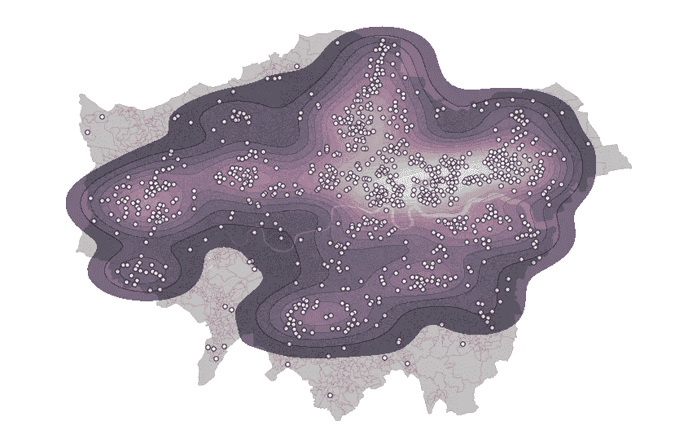
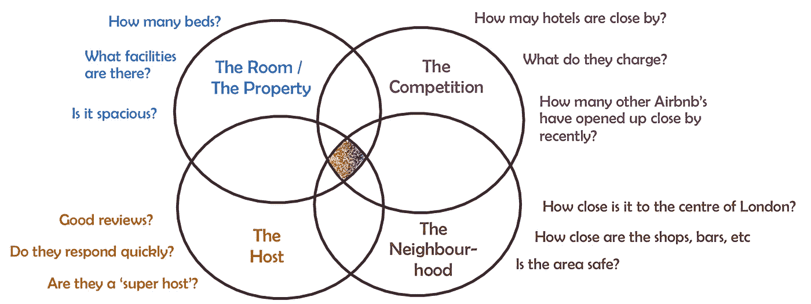
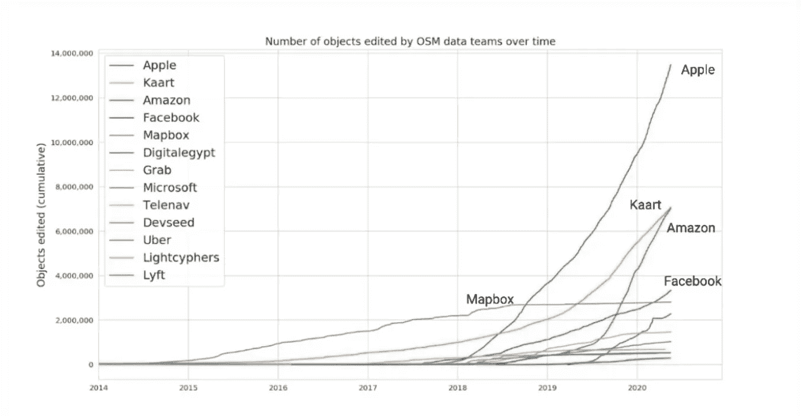
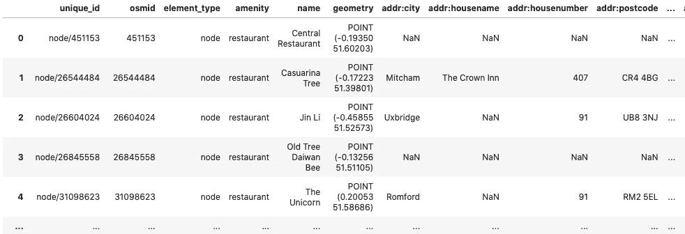
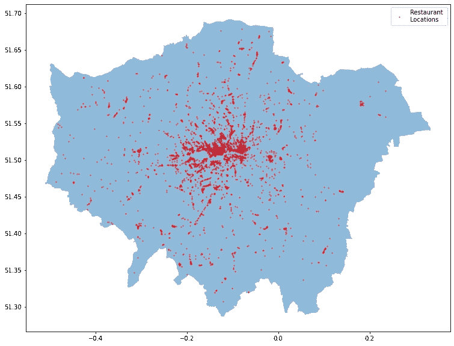
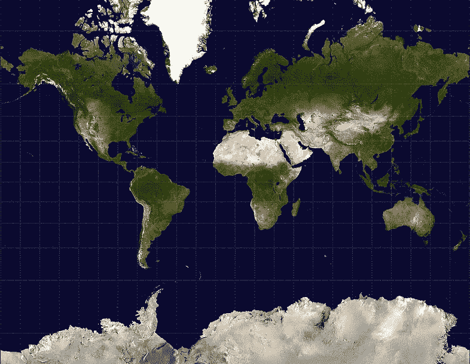
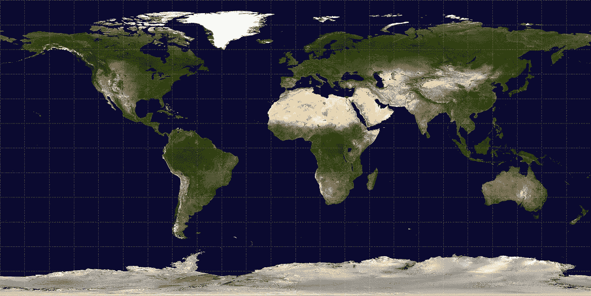
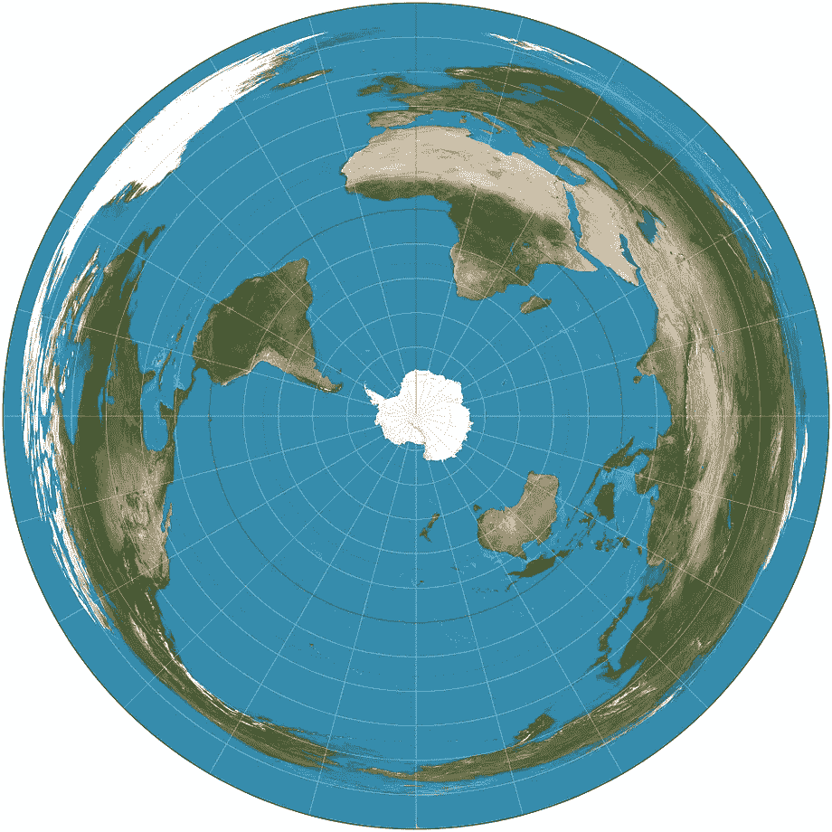
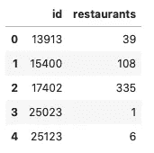
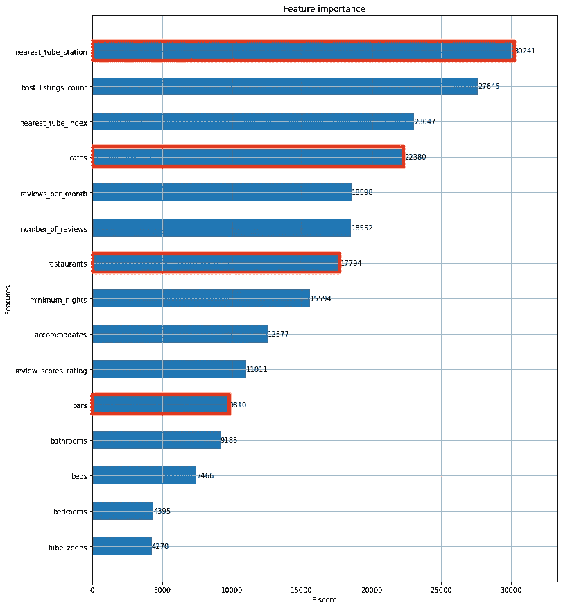

# 指南:将 OpenStreetMap 位置数据转化为 ML 要素

> 原文：<https://towardsdatascience.com/a-guide-turning-openstreetmap-location-data-into-ml-features-e687b66db210?source=collection_archive---------25----------------------->

## 如何将商店、餐馆、公共交通方式和其他当地设施融入您的 ML 模型。



伦敦一系列便利设施的热图。由作者用 Python 制作。

就拿下面这个问题来说。你的任务是预测一个新的 Airbnb 主机可能会在伦敦收取多少费用(推而广之，客人可能会支付多少)。要回答这个问题，你需要收集可能影响该市 Airbnb 房产夜间价格的因素的数据。

你收集的数据越多，你的 ML 模型就越能接近接近完美预测的最佳点。



作者制作

你已经有了关于伦敦 80，000 处 Airbnb 房产和它们的主人的信息。然而，你错过的是关于竞争的关键信息——酒店在哪里，附近有多少商店、酒吧、餐馆、旅游目的地等。毕竟，谁去伦敦旅游是为了呆在一个安静的街区，没有任何活动呢？这就是 OpenStreetMap 可以提供帮助的地方。

在我们继续之前，如果你更愿意以 Jupyter 笔记本的形式遵循这个指南，在文章的最后提供了一个链接。

# 什么是 OpenStreetMap？

OpenStreetMap (OSM)将自己描述为“一个创建免费可编辑世界地图的合作项目”。它们是地图的维基百科。它的 500 万贡献者可以做任何事情，从增加新的道路或移除已经关闭的商店。

## 可靠，准确，免费！

如果有人能改变它，它甚至是可靠的吗？是啊！除非你是谷歌的铁杆用户，否则你可能每天都在使用 OSM。苹果、微软、脸书、Mapbox 和 FourSquare 都使用 OSM 作为他们地图工作的基础。[亚马逊](https://wiki.openstreetmap.org/wiki/Amazon_Logistics)将其用于他们的物流链。[特斯拉](https://www.tesmanian.com/blogs/tesmanian-blog/tesla-owners-smart-summon-routes-open-street-maps-full-self-driving)在他们的自动驾驶汽车上使用。优步在他们的内部寻路平台上使用它。OSM 可能是现存最久经考验的地图平台。

你也可以从这些*企业技术贡献者*正在大规模增加平台的事实中得到一些安慰。微软将计算机视觉和卫星图像结合起来，在美国增加了 1 . 24 亿个建筑足迹。



随着时间的推移，企业对 OpenStreetMap 的贡献。来自 [SOTM2020](https://media.ccc.de/v/state-of-the-map-2020-academic-track-4858-curious-cases-of-corporations-in-openstreetmap) 的截屏(在 07:45)。

OSM 最大的优势是**绝对免费**，可以无限制使用。你可以获得大量关于当地的信息——从当地的便利设施到公交车站、自行车道甚至饮水机。[点击这里](https://wiki.openstreetmap.org/wiki/Map_Features#Aeroway)查看 OSM 特色的完整列表。

# 访问 OpenStreetMap 数据

## 安装和基本查询

我们通过 OSMnx 访问 OSM 数据——这是一个 python 模块，最初由 Geoff Boeing 编写，以支持他的博士论文。

```
pip install osmnx
```

假设我们想找到伦敦所有的餐馆:



Geopandas 是伦敦 OSMnx 搜索的数据框架。图片作者。

你可以循环这个过程，还可以提取酒吧、餐馆、夜总会和所有其他可能影响房东对 Airbnb 收费的便利设施的所有数据。

## 绘图和可视化

让我们快速检查一下我们得到的数据。我们将使用 OSMnx 绘制伦敦边界的几何图形，并使用 matplotlib 绘制两者。



伦敦机场地图。由作者使用上述代码制作。

# 将数据转化为要素

我们目前拥有的是伦敦所有餐馆的数据框架。对于机器学习模型，我们需要的是 Airbnb 每家酒店 10 分钟步行范围内的餐厅数量。要做到这一点需要相当多的操作。

## 步骤 1:将多边形转换为点

OSMnx 以单点(经度/纬度)坐标的形式返回大多数属性。但是，有一些会以多边形(一种形状)的形式返回。当属性很大时，通常会发生这种情况。处理多边形比处理点更复杂，所以我们将通过计算它们的中心点把它们都转换成点。我们用 shapely 来做这个。

## 步骤 2:将点坐标转换为局部投影

在我们进行任何计算之前，我们需要将我们的点坐标转换成局部投影。正如你所知道的，地球是一个球体。投影是一种展平地球表面的方法，因此我们可以在地图上显示它。然而，问题是，没有办法使球体表面变平，使得所有部分的大小成比例地相等。

以下面的例子为例。在左边，我们有墨卡托投影——一种流行的地图投影，最初是为了帮助 16 世纪的水手环游世界而设计的。注意，离赤道越远，陆地越大。在右边，我们有一个等矩形投影，它纠正了其中的一些问题。注意两张地图上非洲和格陵兰岛的大小差异。



左:[墨卡托](https://simple.wikipedia.org/wiki/Equirectangular_projection#/media/File:Equirectangular-projection.jpg)投影。右图:[等角矩形](https://simple.wikipedia.org/wiki/Equirectangular_projection#/media/File:Equirectangular-projection.jpg)投影。两张图片都来自维基百科。

一些等地球投影确实存在，但它们作为视觉工具毫无用处。取这两个方位等距投影。你应该能认出右边的那个是联合国的标志。



左图:方位角等距投影照片。右联合国标志。均来自[维基百科](https://en.wikipedia.org/wiki/Azimuthal_equidistant_projection)。

解决这个问题的唯一方法是找到一个投影，使你感兴趣的世界的特定部分大小相等。这些被称为本地 UTM 坐标参考系统。幸运的是，OSMnx 内置了一个方法，可以帮助我们快速找到正确的本地 UTM。

现在我们有了本地 UTM，我们导入 Airbnb 数据并将其转换为本地投影。我们对从 OSMnx 获取的原始餐馆数据进行同样的处理。

## 步骤 3:创建一个 K-D 树来计算距离

最后，我们需要遍历每个 AirBnb 酒店，并计算出在 10 分钟步行距离内(大约 1 公里)有多少家餐馆。

我用 K-D 树来做这个。解释 K-D 树是如何工作的超出了本文的范围，但简而言之，它们是搜索我们的 80，000 个 AirBnb 房间和 6，000 家餐厅并找出哪些房间靠近哪些餐厅的超级有效的方法。首先，我们建立所有餐馆点的树:

然后，我们创建一个函数，将在我们的每个 Airbnb 资产上执行该函数。该函数将查询该树，找到最近的 500 家餐馆，并计算它们离 Airbnb 酒店的距离。我们使用 500 这个数字，希望附近没有超过 500 家餐馆。

最后，我们设置了一个计时器，并将该函数应用于 Airbnb 的每一行:

该功能在 80，000 个属性上需要大约 90 秒。让我们来看看结果:`air_gdf[[‘id’,’restaurants’]].head(5)`



# 结果呢

所以你有它。现在你知道有多少家餐馆在每个 AirBnb 房产 10 分钟的步行范围内，有 80，000 个 Airbnb 房产。你可以对酒吧、商店、地铁站、旅游热点、公园以及任何你认为可能影响 Airbnb 房产价格的地方重复这个过程——就像我一样。

在我的最终 XGBoost 模型中，正如你在下面看到的，这些 OSM 的特征(用红色突出显示)最终成为伦敦价格的一些最重要的驱动因素。



功能重要性。由作者用 Python 制作。

完整的 Jupyter 笔记本[请看这里](https://github.com/dljthomas1/Accessing-OpenStreetMap-Data)。

*喜欢这篇文章吗？在 Instagram 上查看我的数据可视化页面:*[*HouseOfData*](https://www.instagram.com/HouseOfData/)*。*