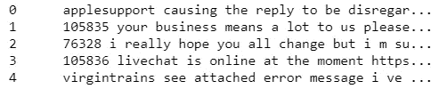

# 文本预处理手册

> 原文：<https://towardsdatascience.com/a-handbook-to-text-preprocessing-890f73fd28f8?source=collection_archive---------37----------------------->


帕特里克·托马索在 [Unsplash](https://unsplash.com?utm_source=medium&utm_medium=referral) 上的照片

## 自然语言处理的第一步

自然语言处理(NLP)是人工智能中最复杂的领域之一。这背后的原因是文本数据是上下文相关的，需要修改以使其能够被机器理解。它需要经历多个预处理阶段。

**在这篇博客中，我们将了解文本预处理是什么，为什么，如何用最简单的代码来尝试。**

# 文本预处理

文本数据很容易被人类理解。但是阅读和分析海量数据是一项复杂的任务。


为了完成这项任务，我们需要将这些文本转换为机器可理解的数据，即，将单词转换为与机器学习算法一起工作的数字特征。

但是，这种转换并不简单，因为文本数据包含冗余和重复的单词。因此，在将文本数据转换成数字特征之前，我们需要对文本数据进行预处理。

文本预处理的基本步骤包括:

1.  清理原始数据
2.  符号化
3.  规范化令牌

让我们用一段代码来看看每一步。

# 如何实现文本预处理？

在本文中，我们将在 Kaggle 的 Twitter 数据集上使用客户支持。

[](https://www.kaggle.com/thoughtvector/customer-support-on-twitter) [## Twitter 上的客户支持

### Twitter 上最大品牌的 300 多万条推文和回复

www.kaggle.com](https://www.kaggle.com/thoughtvector/customer-support-on-twitter) 

## 关于数据集:

Twitter 上的客户支持数据集是一个大型的现代推文和回复语料库，用于帮助自然语言理解和会话模型的创新，以及研究现代客户支持实践和影响。该数据集提供了 Twitter 上消费者和客户支持代理之间的大量现代英语对话。

**导入数据:**

```
import pandas as pd
data = pd.read_csv("customer-support-on-twitter.csv")
```

使用 *pandas* 库将数据从 CSV(逗号分隔值)加载到数据框中。

```
data.columns
```


数据列的输出

让我们只考虑用于预处理的*‘文本’*列。

## 1.清理原始数据

这个阶段包括删除对文本意义没有任何价值的单词或字符。一些常见的清洁步骤是，

*   下降箱
*   特殊字符的删除
*   停用词的删除
*   移除 URL
*   移除 HTML 标签
*   移除多余的空格

## 下降箱:

出于以下原因，降低文本的大小写非常重要:

*   单词“文本”、“文本”、“文本”给句子添加了相同的值
*   对于文本矢量化，使用像 TF-IDF 这样的技术计算单词的频率，而不考虑大小写
*   降低所有单词的大小写也非常有助于通过减少词汇量来降低维度。

```
data["text_lower"] = data["text"].str.lower()
```


降低外壳前后列'文本'

*观察:* *所有单词都转换成小写*

## 删除特殊字符:

这是另一种文本预处理技术，有助于处理“万岁”和“万岁！”同理。

```
import re
no_special_char=[]
for sentence in data.text_lower:
    no_special_char.append(re.sub('[^A-Za-z0-9]+', ' ', sentence))
data["no_special_char"]=no_special_char
```

正则表达式库提供了一个函数:
*sub( actual_pattern，replacing_pattern，data )*
帮助我们用数据中的第二个参数替换它的第一个参数


删除特殊字符前后的“文本”列

*观察:删除“@”、“`”等特殊字符。*

## 停用词的删除:

停用词是语言中常见的词，如“the”、“a”等。大多数时候，它们可以从文本中删除，因为它们没有提供有价值的信息。

```
from nltk.corpus import stopwords
stopwords = set(", ".join(stopwords.words('english')))
```

nltk.corpus 包含一个巨大的常用停用词库。

```
no_stopwords=[]
for sentence in data["no_special_char"]:
    no_stopwords.append(' '.join(e.lower() for e in sentence.split() if e.lower() not in stopwords))
data["no_stopwords"]=no_stopwords
```



删除停用词前后的“文本”列

*观察:* *删除“the”、“to”、“at”等词语*

## 删除任何 URL

下一个预处理步骤是删除数据中存在的任何 URL。这条推文很有可能会包含一些 URL。为了进一步分析，我们可能需要移除它们。消除 URL 的简单代码如下:

```
no_url=[]
for sentence in data["no_stopwords"]:
    no_url.append(re.sub(r"http\S+", "", sentence))
data["no_url"]=no_url
```

这里，*re()*用空字符串替换任何以*“http”*开头的单词。

## 移除 HTML 标签

另一种常见的预处理技术是去除 HTML 标签，这种技术在很多地方都会派上用场。如果我们从不同的网站上删除数据，这是非常有用的。我们最终可能会将 HTML 字符串作为文本的一部分。

```
no_html_tags=[]
for sentence in data["no_url"]:
    no_html_tags.append(re.sub(r"'<.*?>'", "", sentence))
```

在这里，使用*re()*，我们用一个空字符串替换包含在< >中的任何模式。

## 2.标记化

标记化是将文本分割成更小的块的过程，称为**标记** *。*每个令牌都是作为特征的机器学习算法的输入。

```
for sentence in data["no_url"]:
    sentence.split()
```

*Split( )* 将句子转换成单词

## 3.规范化令牌

规范化是基于单词语义的清洗。规范化令牌可确保进一步预处理或分析的数据的一致性。有两种规范化令牌的技术:

*   堵塞物
*   词汇化

## 词干:

这是从单词中移除和替换后缀以获得单词的词根或基本形式的过程，称为*词干*。波特词干分析器是一种广泛使用的词干分析技术。

```
from nltk.stem.porter import PorterStemmer
```

*nltk.stem* 提供*端口定时器*

```
def stem_words(text):
    return " ".join([stemmer.stem(word) for word in text.split()])
data["text_stemmed"] = data["no_url"].apply(lambda text: stem_words(text))
```


执行词干分析前后的列文本

*观察:所有单词都被转换为其基本形式，就像“消息”被转换为“消息”*

## 词汇化:

目标与词干化是一样的，但是词干化有时会失去单词的实际意义。

> 词汇化是指正确地使用词汇和词的形态分析来做事情。

它返回单词的基本形式或字典形式，也称为*词条*。

```
from nltk.stem import WordNetLemmatizer
lemmatizer = WordNetLemmatizer()
```

*nltk.stem* 提供了 *WordNetLemmatizer* ，它被广泛用于执行词汇化

```
def lemmatize_words(text):
    return " ".join([lemmatizer.lemmatize(word) for word in text.split()])data["text_lemmatized"] =data["text_stemmed"].apply(lambda text: lemmatize_words(text))
data["text_lemmatized"]
```


未规范化的列文本、带词干的文本、带词条的文本

*观察:词干提取通过移除后缀将单词转换为基本形式。这可能会导致更多的混乱。词汇化将单词转换成语义基础，从而使其可解释。*

这些是在文本数据上广泛执行的不同类型的文本预处理步骤。然而，我们不需要一直执行所有这些。我们需要根据我们的用例仔细选择预处理步骤，因为这也起着重要的作用。

我将继续这篇文章，将这些规范化的标记处理成向量，作为机器学习模型的输入。

谢谢你的阅读。以后我会写更多初学者友好的帖子。请在[媒体](https://medium.com/@ramyavidiyala)上关注我，以便了解他们。我欢迎反馈，可以通过 Twitter [ramya_vidiyala](https://twitter.com/ramya_vidiyala) 和 LinkedIn [RamyaVidiyala](https://www.linkedin.com/in/ramya-vidiyala-308ba6139/) 联系我。快乐学习！