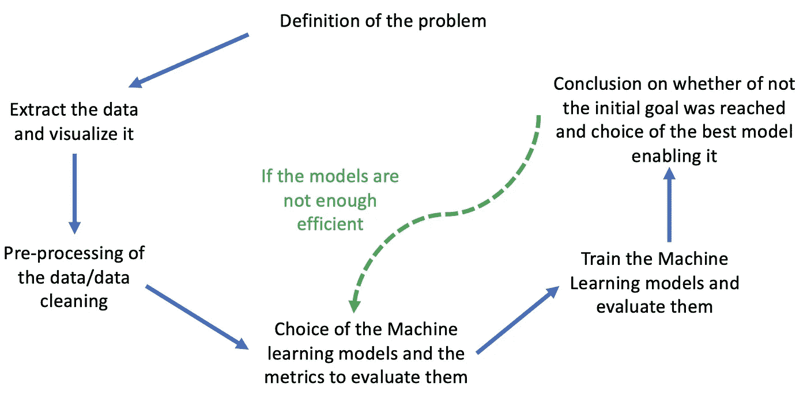
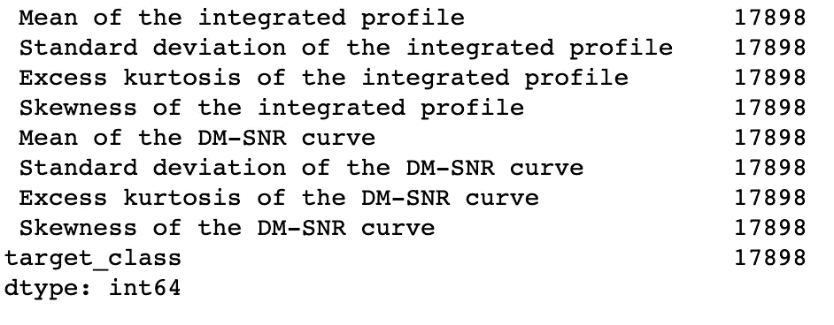
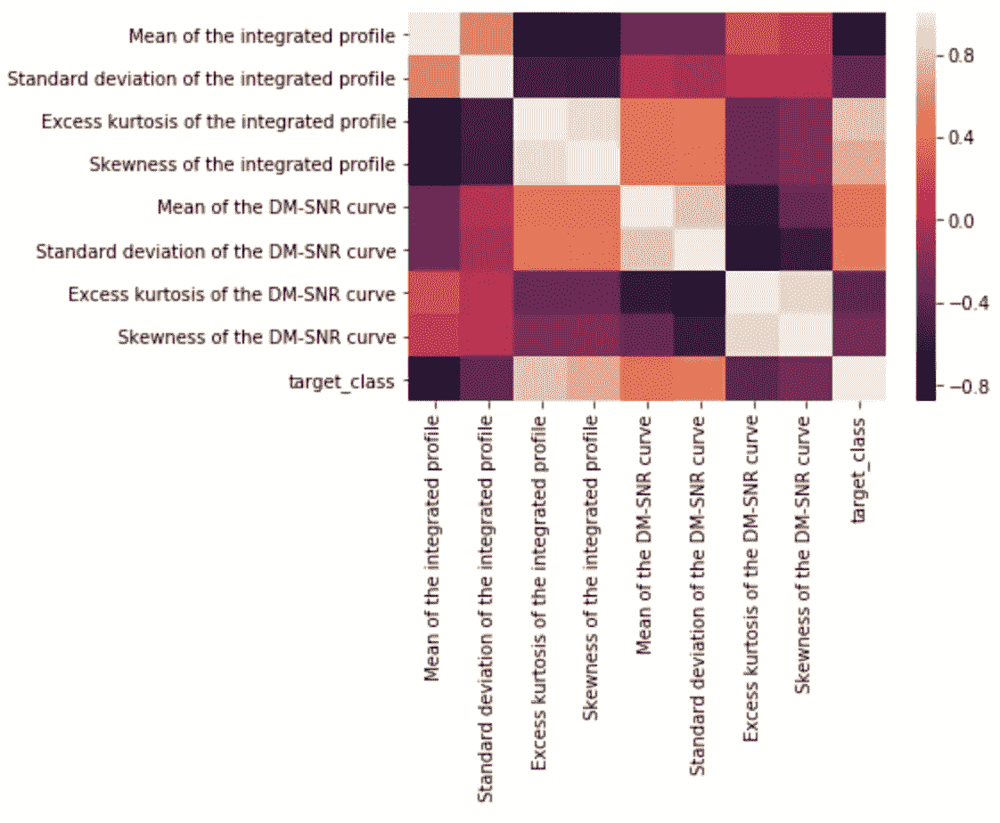
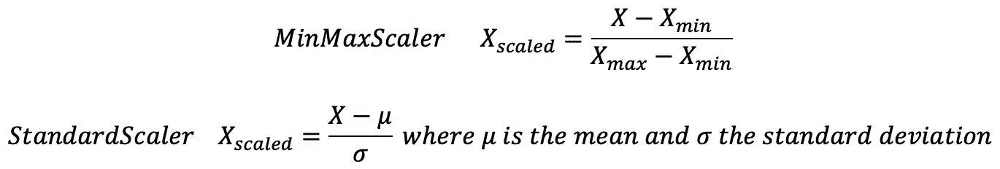
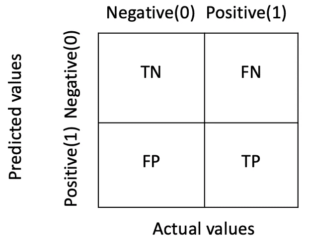
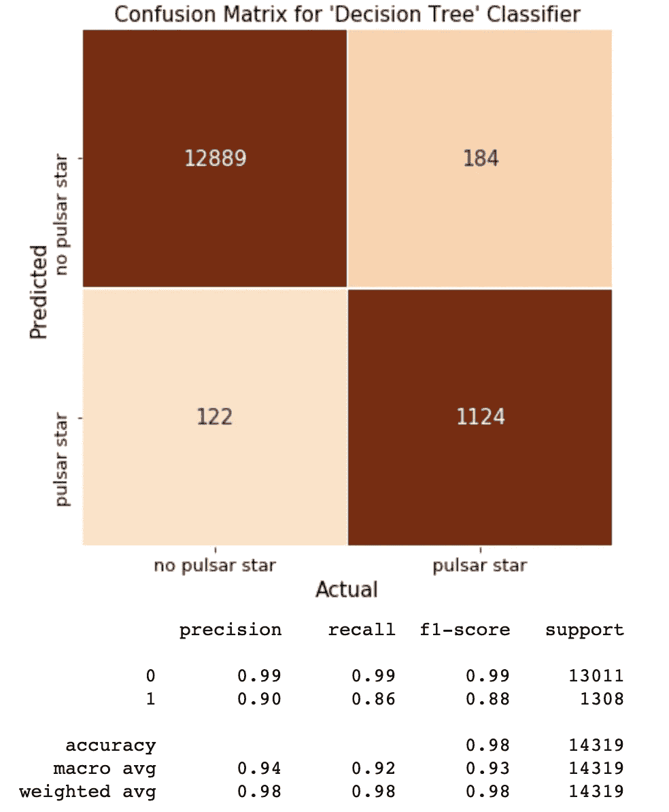
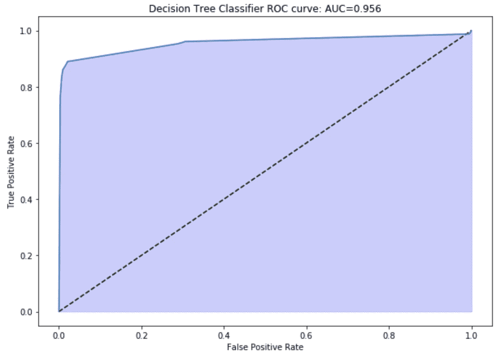
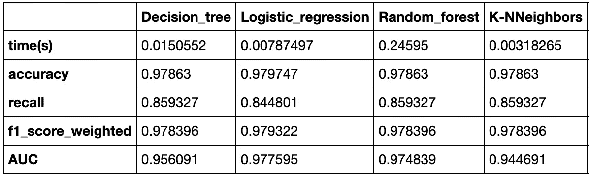
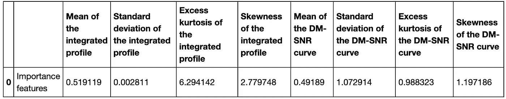

# 使用 Python 实践端到端数据科学项目

> 原文：<https://towardsdatascience.com/a-hands-on-an-end-to-end-data-science-project-using-python-4ed97842e27f?source=collection_archive---------32----------------------->


来源:未知，来自

## 使用 Python 运行数据科学项目的 6 步指南

**机器学习、数据科学、预测**，这些词你可能听过很多，但它们到底是什么？在什么情况下有用？
机器学习诞生于 20 世纪 60 年代，是人工智能的一个分支，它为系统提供了学习模型和进行预测的能力，例如根据房子的特征(位置、面积、房间数量……)预测房子的价格，或者预测肿瘤是否是良性的。在房子问题中，我们希望预测一个连续值，这类问题属于我们所说的**回归问题**。在肿瘤的情况下，结果是二进制值或更一般的离散值，这种类型的问题称为**分类问题**。在处理数据科学问题时，了解您正在寻找的结果的类型以了解您正在处理的是回归还是分类问题是极其重要的。

在这篇文章中，我写了一个进行端到端机器学习项目的指南。如下图所示，图中显示了数据科学项目问题的不同步骤，共有 **6 个步骤**。我们将在整篇文章中深入研究它们。



为了说明数据科学项目的不同步骤，我将使用一个数据集来描述在高时间分辨率宇宙巡天期间收集的脉冲星候选样本。脉冲星是一种罕见的中子星，它产生的无线电辐射在地球上可以探测到。作为时空、星际介质和物质状态的探测器，它们具有相当大的科学价值。随着脉冲星的旋转，它们的发射光束扫过天空，当光束穿过我们的视线时，会产生一种可检测的宽带无线电发射模式。随着脉冲星快速旋转，这种模式周期性重复。因此，脉冲星涉及到用大型射电望远镜寻找周期性的无线电信号。每颗脉冲星产生的发射模式略有不同，每次旋转都会略有不同。因此，被称为“候选者”的潜在信号探测在脉冲星的多次旋转中被平均化，这由观测的长度决定。在缺乏额外信息的情况下，每个候选者都有可能描述一颗真正的脉冲星。然而在实践中，几乎所有的检测都是由射频干扰(RFI)和噪声引起的，使得合法信号很难被发现。

在这里，使用机器学习模型来**预测一颗恒星是否是脉冲星**是完全合法的，因为纯物理模型有很多障碍要克服。通过使用机器学习模型，我们可以获得准确的结果，从而降低问题的复杂性。让我们看看我们能做什么！
你可以在这里找到数据集[。](https://www.kaggle.com/pavanraj159/predicting-a-pulsar-star)

# 1.问题的定义

在这个项目中，想法是预测一颗恒星是否是脉冲星。我们可以清楚地看到，我们的模型的结果将是二元的:**如果恒星是脉冲星，则为 1，否则为 0**。因此，我们将实现分类模型来回答这个问题。

# 2.提取数据并将其可视化

当我们使用 Python 时，我们将使用 **Pandas** 库从 csv 文件中提取数据。对于数据可视化，库 **seaborn** 是一个非常好的库，因为很多数据科学工具已经实现。 **matplotlib.pylab** 库对于绘制图形也很有用。

```
**import** **numpy** **as** **np** 
**import** **pandas** **as** **pd** 

*# for data visualization*
**import** **seaborn** **as** **sns** 
**import** **matplotlib.pylab** **as** **plt**
```

然后，我们可以从 csv 文件中提取数据，并查看不同的特征。您应该经常做的一件事是检查每个特性中的元素数量。如果某些特征的元素数量不同，您必须应用某些操作来填补空白，或者如果缺少太多的值，您必须放弃该特征。

```
pulsar_stars = pd.read_csv("pulsar_stars.csv") # read the data*# to check if we have to clean the data* 
print(pulsar_stars.apply(pd.Series.count))
```



我们可以看到，它们是定义恒星的 **8 个特征**，而**目标类**是一个二进制值(如果候选恒星是脉冲星，则为 1，否则为 0)。所有不同的特征具有相同数量的元素，因此没有必要进行填充间隙的操作。

下一步是**将数据**分割成我们将用来训练机器学习算法的数据和我们将用来测试它们各自性能的数据。

```
*# we set the seed for the random cursor* 
random.seed(10) *# we split the data* 
X = pulsar_stars.drop(['target_class'], axis = 1) 
y = pulsar_stars['target_class'] 
X_train, X_test, y_train, y_test = train_test_split(X,y,test_size = 0.8, random_state = 10) X_columns = X_train.columns
```

接下来，我们可以查看不同特性之间的**相关性**以及一个特性和目标类之间的链接，以便了解对结果的影响。

```
*#correlation plot*
corr = pulsar_stars.corr()
sns.heatmap(corr)
```



我们注意到，综合轮廓的过度峰度是与目标类更相关的特征。现在，我们将研究每个变量的**分布**，看看我们是否必须应用一个变换来使它更有价值。

```
*#create numeric plots*
num = [f **for** f **in** X_train.columns **if** X_train.dtypes[f] != 'object']
nd = pd.melt(X_train, value_vars = num)
n1 = sns.FacetGrid (nd, col='variable', col_wrap=3, height = 5.5, sharex=**False**, sharey = **False**)
n1 = n1.map(sns.distplot, 'value')
```


大多数变量具有高斯分布(对于大多数特征，您可能认为数据遵循右偏分布，但这只是因为数据的数量不够大)。

现在我们对数据有了更好的理解，我们可以对其进行预处理，以便为我们的机器学习算法提供信息。

# 3.数据的预处理

由于不同的特征有完全不同的尺度，我们需要将我们的数据标准化。当特征具有相同的尺度时，这个步骤是不必要的，除了诸如 PCA 的一些算法。

它们是规范化数据的不同方法:



```
scaler = StandardScaler()
X_train = scaler.fit_transform(X_train)
X_test = scaler.transform(X_test)
```

# 4.机器学习模型的选择及其评估指标

在这一部分中，我们实现了不同的机器学习模型来处理分类问题，并定义了评估其性能的措施。对于机器学习模型，我将使用决策树算法、逻辑回归算法、随机森林算法和 K-最近邻算法。我将使用时间、精确度、回忆、加权 f1 分数和 AUC 分数来评估模型。我将更详细地解释我的选择和每个措施的意义。

# 5.训练机器学习模型并评估它们

这些模型中的一些具有超参数，即其值在学习过程开始之前设定的参数。一种方法是建立超参数可以采用的值列表，并根据尽可能精确的度量通过网格进行搜索，以便找到最佳模型。另一种方法是使用贝叶斯优化(一种更有效的方法)。

```
*# we start by DecisionTreeClassifier*

dc = DecisionTreeClassifier(max_depth = 4)
dc.fit(X_train, y_train)

params = {'max_depth' : [2,4,8]}
dcgrid = GridSearchCV(estimator = dc, param_grid = params, cv = KFold(5, random_state = 10) , scoring = 'accuracy')
dcgrid.fit(X_train, y_train)

*# Then by LogisticRegression*

lg = LogisticRegression(C=0.001, solver='liblinear')
lg.fit(X_train, y_train)

params = {'C':[0.01,0.1,1,10]}
lggrid = GridSearchCV(estimator = lg, param_grid = params, cv = KFold(5, random_state = 10), scoring = 'accuracy')
lggrid.fit(X_train, y_train)

*# then by RandomForestClassifier*

rf = RandomForestClassifier(n_estimators = 10, max_depth = 10)
rf.fit(X_train, y_train)

params = {'n_estimators' : [10, 20, 50, 100], 'max_depth' : [10, 50]}
rfgrid = GridSearchCV(estimator = rf, param_grid = params, cv = KFold(5, random_state = 10), scoring = 'accuracy')
rfgrid.fit(X_train, y_train)

*# then KNeighborsClassifier*

kn = KNeighborsClassifier(n_neighbors = 10, p = 2)
kn.fit(X_train, y_train)

params = {'n_neighbors' : [2, 5, 10, 50], 'weights' : ['uniform', 'distance'], 'p' :[1,2]}
kngrid = GridSearchCV(estimator = kn, param_grid = params, cv = KFold(5, random_state = 10), scoring = 'accuracy')
kngrid.fit(X_train, y_train)
```

然后我们找到最佳模型，我们还可以看到训练这些模型所需的**时间**，这可以作为选择最终模型的一个指标。

```
*# we define the best models* 
dc_best = dcgrid.best_estimator_
lg_best = lggrid.best_estimator_
rf_best = rfgrid.best_estimator_
kn_best = kngrid.best_estimator_

*# now we will launch each model and see the time and the performance of each* 
start = time.time()

dc = dc_best
dc_best.fit(X_train, y_train)

end = time.time()
print('time for Decision Tree Classifier = ', end - start, 's')
performance_df['Decision_tree']['time(s)'] = end - start

*# Then by LogisticRegression*
start = time.time()

lg = lg_best
lg_best.fit(X_train, y_train)

end = time.time()
print('time for Logisitic Regression= ', end - start, 's')
performance_df['Logistic_regression']['time(s)'] = end - start *# then by RandomForestClassifier*
start = time.time()

rf = rf_best
rf_best.fit(X_train, y_train)

end = time.time()
print('time for Random Forst Classifier = ', end - start, 's')
performance_df['Random_forest']['time(s)'] = end - start

*# then KNeighborsClassifier*
start = time.time()

kn = kn_best
kn_best.fit(X_train, y_train)

end = time.time()
print('time for K_Neighbors Classifier = ', end - start,'s')
performance_df['K-NNeighbors']['time(s)'] = end - start
```

现在，我们还可以根据另一个指标来评估模型，这个指标就是**召回**。回忆，也称为敏感度，衡量模型预测积极结果的强度，即 1 正确识别的比例。

```
*# we will calculate the scores of each model* 
y_predict_dc = dc_best.predict(X_test)
accuracy = accuracy_score(y_test, y_predict_dc)
recall = recall_score(y_test, y_predict_dc)
performance_df['Decision_tree']['accuracy'] = accuracy
performance_df['Decision_tree']['recall'] = recall

y_predict_lg = lg_best.predict(X_test)
accuracy = accuracy_score(y_test, y_predict_lg)
recall = recall_score(y_test, y_predict_lg)
performance_df['Logistic_regression']['accuracy'] = accuracy
performance_df['Logistic_regression']['recall'] = recall

y_predict_rf = dc_best.predict(X_test)
accuracy = accuracy_score(y_test, y_predict_rf)
recall = recall_score(y_test, y_predict_rf)
performance_df['Random_forest']['accuracy'] = accuracy
performance_df['Random_forest']['recall'] = recall

y_predict_kn = dc_best.predict(X_test)
accuracy = accuracy_score(y_test, y_predict_kn)
recall = recall_score(y_test, y_predict_kn)
performance_df['K-NNeighbors']['accuracy'] = accuracy
performance_df['K-NNeighbors']['recall'] = recall
```

然后，我们可以计算作为误差矩阵的**混淆矩阵**:



```
*# generate confusion matrix for Decision Tree classifier* 
conf_mat_dc = confusion_matrix(y_test, y_predict_dc) *# put it into a dataframe for seaborn plot function* conf_math_dc_df = pd.DataFrame(conf_mat_dc)  *# Use a seaborn heatmap to plot confusion matrices* *# The dataframe is transposed to make Actual values on x-axis and predicted on y-axis* 
*# annot = True includes the numbers in each box* 
*# vmin and vmax just adjusts the color value* 
fig, ax = plt.subplots(figsize = (7,7)) sns.heatmap(conf_math_dc_df.T, annot=**True**, annot_kws={"size": 15}, cmap="Oranges", vmin=0, vmax=800, fmt='.0f',              linewidths=1, linecolor="white", cbar=**False**, xticklabels=["no pulsar star","pulsar star"],              yticklabels=["no pulsar star","pulsar star"]) plt.ylabel("Predicted", fontsize=15) 
plt.xlabel("Actual", fontsize=15) 
ax.set_xticklabels(["no pulsar star","pulsar star"], fontsize=13) ax.set_yticklabels(["no pulsar star","pulsar star"], fontsize=13) plt.title("Confusion Matrix for 'Decision Tree' Classifier", fontsize=15) plt.show()
print("")
print(classification_report(y_test, y_predict_dc))
```



在对其他模型做了这些之后，我们计算最后的测量，即 AUC 曲线。AUC-ROC 曲线是在不同阈值下对分类问题的性能测量。ROC 是概率曲线，AUC 是可分性的程度或度量。它表明模型区分不同类别的能力。AUC 越高，模型就越能预测 0 是 0，1 是 1。

```
*#Plotting the ROC curve*

*#Generating points to plot on ROC curve (logistic model)*
dc_best_prob = dc_best.predict_proba(X_test)
fpr_logis, tpr_logis, thresholds_logis = roc_curve(y_test, dc_best_prob[:, 1])

fig, ax = plt.subplots(figsize = (10,7))*#plotting the "guessing" model* plt.plot([0, 1], [0, 1], 'k--')*#plotting the logistic model*
plt.plot(fpr_logis, tpr_logis)
plt.fill_between(fpr_logis, tpr_logis, alpha=0.2, color='b')
plt.xlabel('False Positive Rate')
plt.ylabel('True Positive Rate')
AUC = roc_auc_score(y_test, dc_best_prob[:, 1])
plt.title('Decision Tree Classifier ROC curve: AUC=**{0:0.3f}**'.format(AUC))
plt.show()

performance_df['Decision_tree']['AUC'] = AUC
```



# 6.关于是否达到初始目标的结论，以及实现这些目标的最佳模式的选择

最后我们得到了下表:



根据我们的问题，这些指标对我们的结果没有同等的权重。AUC 分数是我们模型中最重要的指标，因为预测一颗恒星为非超级恒星，而犯错是我们想要避免的。因此，逻辑回归似乎是最有效的模型。

基于我们选择的模型，我们可以检查不同特征对结果的重要性。

```
*# thus the logistic regression is the best model : we will keep it* 
*# Now we want to see the importance of each feature on the result* 
dataframe_importance = pd.DataFrame()
columns = X_train.columns
importances = np.abs(lg_best.coef_[0])

**for** i **in** range(len(columns)):
    dataframe_importance[columns[i]] = [importances[i]]

dataframe_importance.insert(0, '', 'Importance features')
dataframe_importance.head(10)
```



# 如果模型不够有效

有时我们可能有时间限制或计算能力限制，我们需要使模型更简单。一种方法是进行[特征选择](/the-5-feature-selection-algorithms-every-data-scientist-need-to-know-3a6b566efd2)。我们可以通过使用统计方法，如[卡方检验](https://en.wikipedia.org/wiki/Chi-squared_test)，或使用维度缩减算法，如 [PCA](https://en.wikipedia.org/wiki/Principal_component_analysis) 。然后，我们重新评估模型，我们可以得出结论，是否考虑了我们在时间和精度方面的约束。

# 为您介绍数据科学世界提供一些评论和提示

不要犹豫花很多时间来定义问题。一旦你习惯了数据科学项目的实现技术，你就会意识到这是你的项目中最容易的部分。另一个相当棘手的部分是数据提取和数据清理。在我在本文中向您展示的项目中，数据非常干净，但是情况几乎从来不是这样。最后，我希望你喜欢这篇文章，并且这是一门实用的科学，熟悉它的最好方法是实践它。选择一个你感兴趣的话题，把你学到的东西付诸实践！

你可以在我的 [github](https://github.com/Jleban/pulsar-stars/blob/master/Stars_Kaggle.ipynb) 上找到作为神经网络的其他实现的整个项目。

如果你喜欢阅读这样的故事，并想支持我成为一名作家，考虑注册成为一名灵媒成员。每月 5 美元，你可以无限制地阅读媒体上的故事。如果你注册使用[我的链接](https://medium.com/@jonathan_leban/membership)，我会赚一小笔佣金，你仍然要支付 5 美元。谢谢大家！！

[](https://medium.com/@jonathan_leban/membership) [## 通过我的推荐链接加入媒体-乔纳森·莱班

### 阅读乔纳森·莱班的每一个故事(以及媒体上成千上万的其他作家)。您的会员费直接支持…

medium.com](https://medium.com/@jonathan_leban/membership) 

*PS:我目前是伯克利的工程硕士，如果你想讨论这个话题，请随时联系我。*[](http://jonathan_leban@berkeley.edu/)*[*这里的*](http://jonathan_leban@berkeley.edu) *是我的邮箱。**