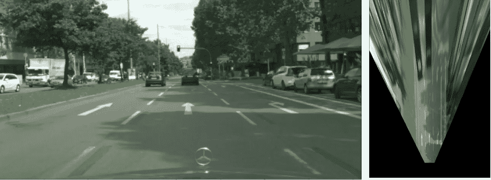
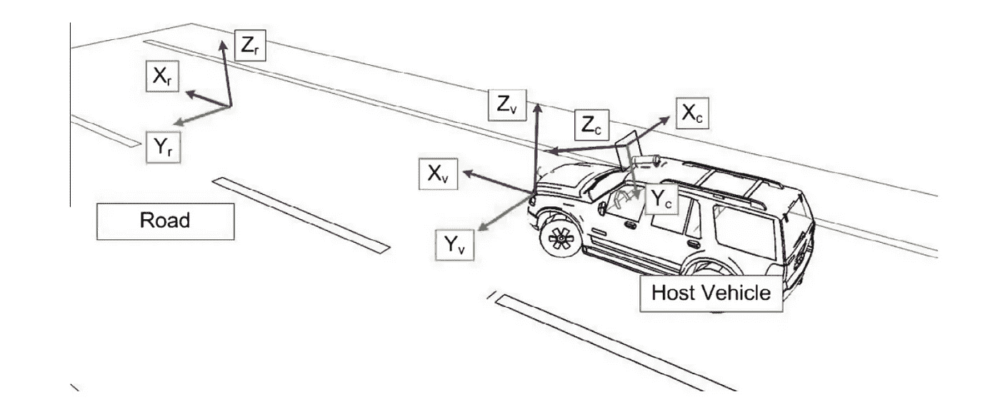
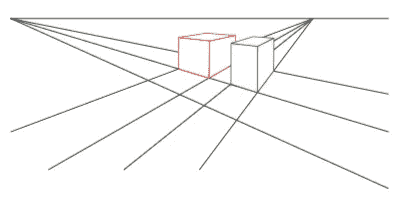
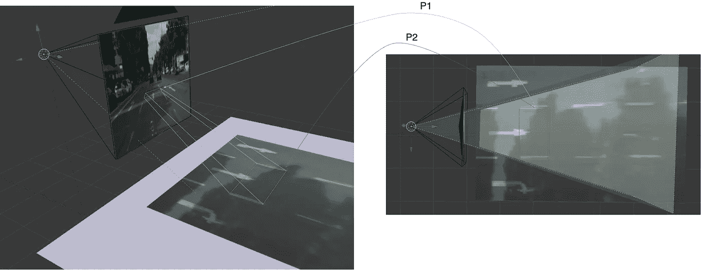
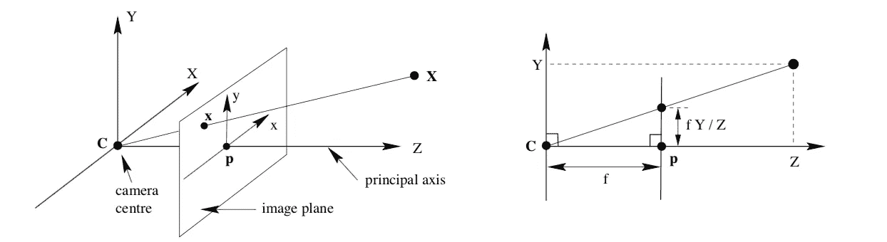
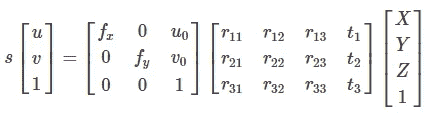
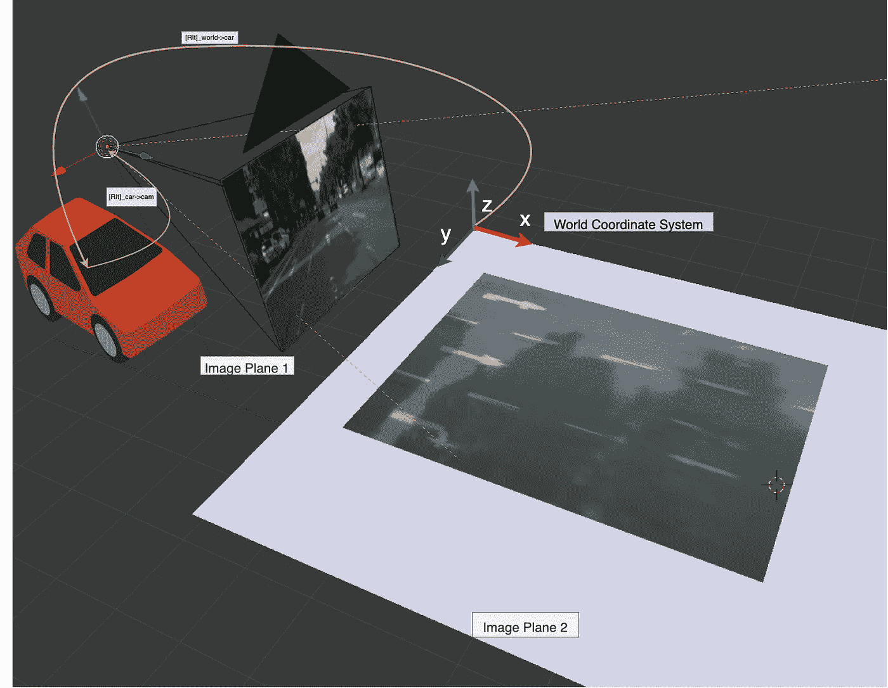
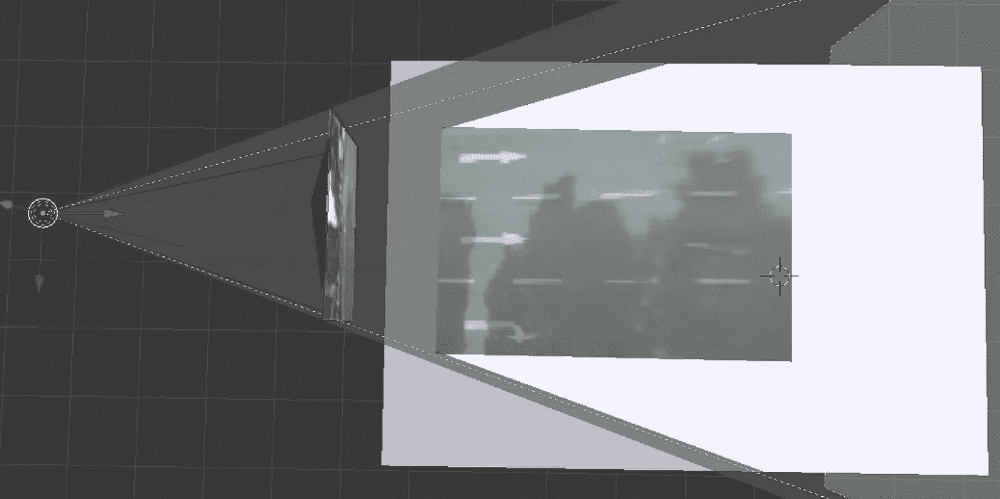
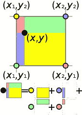

# 单应性的实际应用:IPM

> 原文：<https://towardsdatascience.com/a-hands-on-application-of-homography-ipm-18d9e47c152f?source=collection_archive---------7----------------------->

## 校正透视



[图一。](https://www.cityscapes-dataset.com/)左:正面视图 RGB。右图:来自 IPM 的 BEV

# 基于单应性的 IPM

在计算机视觉中，单应矩阵是一个变换矩阵 **H** 当应用于一个投影平面时将它映射到另一个平面(或图像)。在反向透视映射( **IPM** )的情况下，我们想要从正面图像平面产生场景的鸟瞰图像。

在自动驾驶领域，IPM 有助于一些下游任务，如车道标志检测、路径规划和路口预测，仅通过使用单目摄像机，因为这种正交视图是比例不变的。强调这项技术的重要性。

## IPM 是如何工作的？

IPM 首先假设世界是平面的。然后，它通过单应投影将来自给定视点的所有像素映射到这个平面上。

## IPM 什么时候起作用？

实际上，IPM 在摄像机附近工作良好。对于场景中的远处特征，在透视投影过程中，场景的模糊和拉伸变得更加突出，因为表现了较少数量的像素，这限制了 IPM 的应用。这可以在图 1 中观察到，在更远处产生严重的不良失真。准确地说，图中的前瞻距离约为 50 米。

此外，必须满足以下约束条件:

1.  相机处于固定位置:由于道路的位置对相机敏感，位置或方向的轻微扰动将改变 3D 场景投影到图像平面上的方式。
2.  表面是平面的:任何具有高度或高程的对象都将违反此条件。非平面表面将在 BEV 图像中产生伪影/失真。
3.  没有带高度的物体。由于在 3D 场景中任意放置的两个平面之间的透视投影，地面上的所有点都将引起假象。

在本文中，我将尝试解释 IPM 的思想。更重要的是，这篇文章致力于我们如何仅使用 Python 和 Numpy 来计算和应用单应性。

接下来，我将展示使用 OpenCV 可以获得多少有些相似的结果。我们将使用城市景观数据集中相对常见的道路场景作为示例。如有任何问题/疑问，甚至是你可能发现的错误，请随时给我发信息。

这篇文章的代码可以在[这里](https://github.com/darylclimb/cvml_project/tree/master/projections/ipm)找到。并且所有的`inline`文本都是指代码中的某个变量或函数。

# 设置问题

我们试图解决的问题是将正面视图图像转换成鸟瞰视图图像。IPM 通过消除前置摄像头的透视效果并将其图像重新映射到俯视 2D 域来实现这一点。BEV 中的图像试图保持距离和平行线，纠正透视效果。

以下要点总结了基于单应性的 IPM 程序:

*   将道路(X，Y，Z=0)建模为平坦的 2D 平面。当道路被离散到 BEV 图像上时，必须对分辨率进行一些近似。
*   根据已知的外部和内部参数确定并构建投影矩阵 **P** 。通常，这是通过校准获得的。
*   通过应用 **P** 来变换和扭曲道路。也称为透视投影。
*   将正面像素重新映射到新的图像平面。

我将在接下来的章节中详细介绍。



图二。[信号源](http://www.cvc.uab.es/~asappa/publications/J__Elsevier_IF_Vol_24_July_2015_pp_108-121.pdf)

在我们开始之前，知道相机相对于道路的位置是很重要的。对于 Cityscape 中的道路场景，摄像机安装在稍微向下倾斜的车辆顶部。确切的位置和方向写在文件`camera.json`中。注意，这些值是相对于自我载体而言的。

# 概念

要理解 IPM，需要一些透视投影和相机射影几何的背景知识。在本节中，我将简要描述您需要了解的关于这些主题的内容。

## **1。透视投影**

透视投影精确地描述了我们周围的世界是如何被映射到 2D 平面上的。在这个映射过程中，世界(欧几里得空间)中的两条平行线被转换成新平面中的一对线，这对线收敛于无穷远点。参考图 3，放置在世界中的两个立方体的平行属性在我们现在观察的地方没有被保留。这方面的一个例子就是车道线。



图 3

在图 4 所示的例子中，当从不同的视角观察道路时，注意到相同的区域看起来不同。平行谎言不再保留在射影变换中。



图 4。左图:通过车辆顶部的摄像头观察。右图:场景的俯视图。

## **2。相机射影几何**



图 5。针孔照相机模型

摄像机模型描述了从 **3D** 场景到 **2D** 图像的透视投影。形成的图像取决于内在和外在属性。

**外部【R | t】**描述了世界相对于相机的相对位置和方向。它将世界坐标中的场景引入相机坐标系统。

**固有，K** 定义 3D 场景将如何根据焦距和相机中心的变化扭曲到图像上。**注:**这是一个简单的针孔摄像头模型。其他因素，如像素倾斜和镜头失真，并没有反映在方程中。

我们的问题。原点设置为图像平面 2 的左上角。想法是将位于图像平面 2 上的整个场景(X，Y，Z)投影到摄像机图像平面 1 上。



图 6。场景的 3D 视图。只有道路被建模

## 3.将这种正向投影视为单应

如前所述，我们假设道路是平坦的。因此，`Z = 0`对于每一个躺在路上的分。这有效地将问题转化为平面单应。这是一种可以在 OpenCV 中执行图像变形的方法。

# 实施细节

`ipm_from_parameters`

我处理这个问题的方法如下:

1.  在 BEV `plane`中截取我们希望看到的道路区域。对于该区域，定义像素分辨率、每个像素的绝对距离(比例)和姿势(位置和方向)。
2.  使用相机投影模型将透视投影`perspective`应用于像素坐标区域中的所有 3D 点(X，Y，Z=0)。
3.  从前视图图像重新采样相应的像素，并将其映射回图像平面 2。需要某种形式的插值来防止空洞和混叠效应。我使用双线性插值`bilinear_sampler`。

现在让我们讨论一下上面提到每一点。

## 1.定义地面上的平面

当车辆移动时，我们希望观察区域相对于它保持一致。因此，该平面是相对于车辆定义的。

平面的原点位于左上角。可视区域被照亮，并取决于摄像机的视野。这就是 IPM 后图像上出现不可见像素(黑色)的原因。我定义了具有以下属性的平面(图 7)

*   以像素为单位的区域大小:500 X 500
*   分辨率:每像素 0.1m。
*   相机被定位并与平面 y 轴的中点对齐。



图 7。该平面由灰色区域定义。可见区域被照亮，表示摄像机的视野

## 2.导出和应用透视投影

摄像机参数在`camera.json`中给出，并针对本车给出。由于投影模型要求我们相对于摄像机定义场景，因此需要一些操作来反转变换。

```
# Notably
np.linag.inv(T) = - T
np.linag.inv(R) = np.transpose(R) # property of orthogonal matrix
```

外部和内部参数在此函数`load_camera_params`中构建。

然后，在将点变换成同质表示之后，应用投影变换。像素被比例归一化。即有效焦距= 1。这是在`perspective`中完成的。

## 3.重新采样像素

随着我们离相机越远，稀疏度就越容易被观察到。因此，我使用双线性插值作为近似。



图 8。[双线性插值](https://en.wikipedia.org/wiki/Bilinear_interpolation)

这是通过取 4 个角的加权(按距离)和来完成的

```
(px, py) = w0 * im0 + w1 * im1 + w2 * im2 + w3 * im3
```

# 使用 OpenCV 的单应性

`ipm_from_opencv`

既然我们已经了解了如何进行透视变形。让我们看看如何在 OpenCV 中轻松执行上述所有步骤。这是通过将问题公式化为平面到平面的变换来实现的。

OpenCV 通过使用点对应在内部求解单应矩阵 **H** 来实现这一点。现在相当于我上面讨论过的相机矩阵。通过最小二乘法估计 H 至少需要 4 个点。

只有 2 个步骤来执行转换

*   在图像中选取至少 4 个显著特征，并定义其在目标图像中的新位置。将这些对应关系传入`cv2.getPerspectiveTransform`以获得投影矩阵。
*   使用`cv2.warpPerspective`将投影矩阵应用于图像。这将扭曲到一个鸟瞰图，同时，应用你选择的插值方法。

可供选择的最方便的特征是车道线。因为我们确实知道它们在目标图像(BEV)中将是平行的。

为了说明它产生的结果与前面讨论的派生方法大致相同，我挑选了表示绿色多边形顶点的点，如图 4 所示。


## 结束

现在我们有了。如果你正在研究计算机视觉，我希望你会发现这篇文章很有用。

[](https://github.com/darylclimb/cvml_project/tree/master/projections/ipm) [## darylclimb/cvml_project

### 使用计算机视觉和机器学习的项目和应用

github.com](https://github.com/darylclimb/cvml_project/tree/master/projections/ipm)