# 爱因斯坦引力方程的启发式推导

> 原文：<https://towardsdatascience.com/a-heuristic-derivation-of-einsteins-gravity-equations-8d3659c8a46c?source=collection_archive---------0----------------------->

## 从简单论证中获得爱因斯坦方程

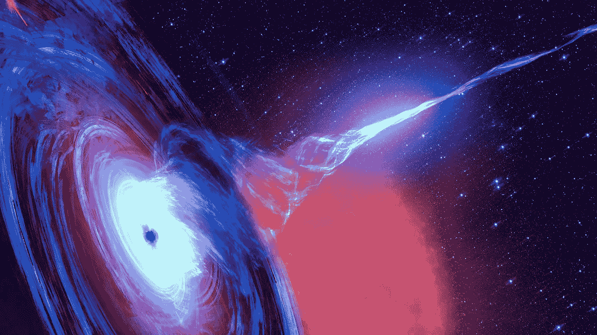

图 by[Elena 11](https://www.shutterstock.com/g/Elena11)/shutterstock . com

广义相对论对所有认真研究过它的人都有独特的美学吸引力。英国理论物理学家[保罗·狄拉克](https://en.wikipedia.org/wiki/Paul_Dirac)，20 世纪最有影响力的物理学家之一曾经说过:

> “牛顿引力理论及其力的瞬时传播很难符合狭义相对论的要求；爱因斯坦在这个难题上的努力导致了他的相对论的推广——这可能是有史以来最伟大的科学发现。”
> 
> —保罗·狄拉克

伟大的苏联物理学家[列夫·兰道](https://en.wikiquote.org/wiki/Lev_Landau)和[叶夫根尼·利夫希兹](https://en.wikiquote.org/wiki/Evgeny_Lifshitz)在他们的著作《[经典场论](https://books.google.com.br/books?id=HudbAwAAQBAJ&printsec=frontcover&dq=The+Classical+Theory+of+Fields+landau&hl=en&sa=X&ved=0ahUKEwj5_cXYhJjoAhVYILkGHe8vD-UQ6AEIKTAA#v=onepage&q=The%20Classical%20Theory%20of%20Fields%20landau&f=false)》中写道:

> “建立在相对论基础上的引力场理论，叫做广义相对论。它是由爱因斯坦建立的，代表了可能是所有现存物理理论中最美好的一种。”

在这篇文章中，我将密切关注钱德拉塞卡 T10 的这篇出色的文章(任何省略或不清楚的细节都可以在其中找到)，并试图澄清导致这些伟大科学家做出如此强烈声明的一些原因。

# 对等原则

在牛顿力学中，质量有两个概念，分别是[惯性质量和](https://en.wikipedia.org/wiki/Mass#Inertial_vs._gravitational_mass)引力质量。前者是对施加的外力的抵抗力的量度(根据牛顿第二定律)。后者是引力场的来源，也是对另一个大质量物体产生的场的反应。

图 1:根据牛顿万有引力定律，两个质量相互吸引的示意图([来源](https://en.wikipedia.org/wiki/Newton%27s_law_of_universal_gravitation))。

相距 *R* 的两个质量 *m* 和 *M* 相互吸引的大小

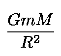

根据牛顿第二定律， *m* (或等价地 *M* )所经历的加速度为:

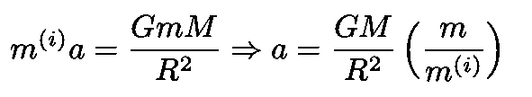

等式 1:惯性质量和重力质量之间的等效性是加速度不依赖于被研究物体的事实的结果。由于加速度*不变，质量比必然是常数。更明显选择是常数为 1。*

*a* 不依赖于 *m* 的事实意味着上述质量比是一个普适常数。由此可以推断惯性质量和引力质量大小相等。

## 时钟滴答之间的关系

请考虑下图:

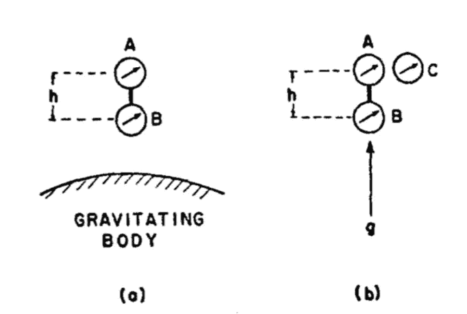

图 2:根据等效原理，时钟 *A* 和 *B* 会根据时钟 *C (* [源](https://aapt.scitation.org/doi/10.1119/1.1986496))保持相同的相对时间。

随着时钟向上移动，根据狭义相对论，由 *A* 和 *B* 测量的间隔与在自由空间中的时钟 C 中的相应间隔具有以下关系:

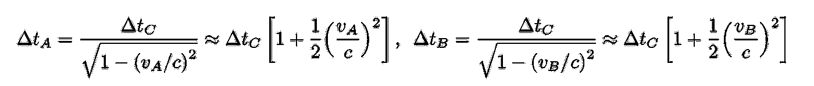

结合这两个表达式，我们得到:

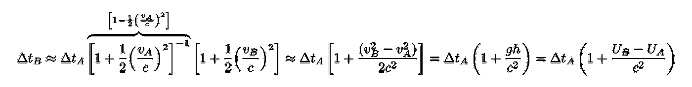

我们使用了托里切利方程和引力势的定义:

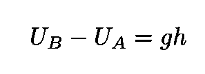

现在，如果我们把时钟 B 带到一个没有引力场的位置 *x* ，上面的表达式变成:

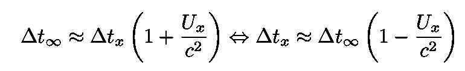

等式 2:两个事件之间的时间间隔如何随引力势 U(x)变化。

# 广义相对论中的时空

在狭义相对论中，我们知道闵可夫斯基区间具有以下形式:

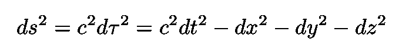

等式 3:狭义相对论的闵可夫斯基区间。

其中 *dτ* 是所谓的[适当时间](https://en.wikipedia.org/wiki/Proper_time)的度量。沿着[世界线](https://en.wikipedia.org/wiki/World_line)(物体在时空中的轨迹)的正确时间是沿着这条线的时钟所测量的时间。

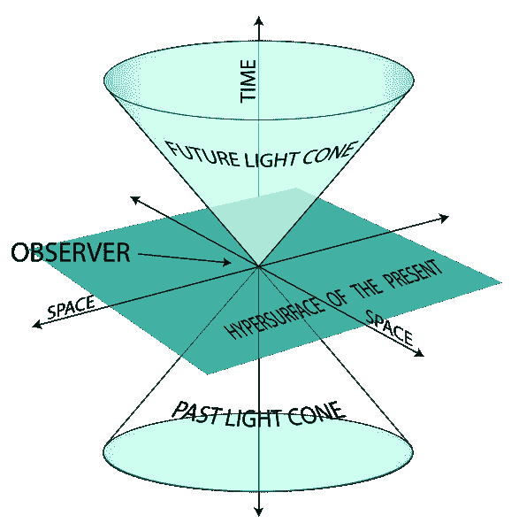

图 3:对于一个给定的事件，图中显示了闵可夫斯基时空(源)的四个不相交的细分。

如图 3 所示，时空中的世界线可以有三种(详见此[链接](https://en.wikipedia.org/wiki/World_line)):

*   类似光的曲线，在每一点都有光速。这样的世界线在时空中形成一个[光锥](https://en.wikipedia.org/wiki/Light_cone)。
*   时间曲线。这些速度小于光速的曲线落在光锥内(注意大质量粒子的世界线总是类时的)
*   类似空间的曲线。例如，这些曲线代表一个物体的长度。

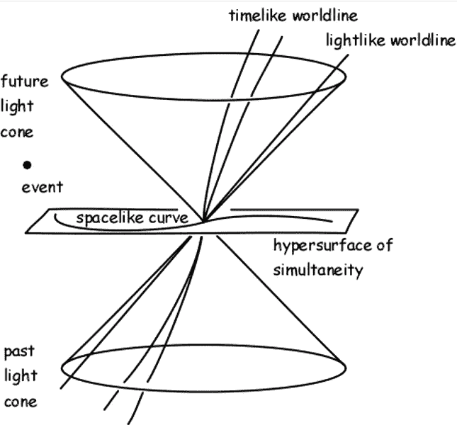

图 4:多种类型的世界线，每一种对应一个符号 dτ。

合适的时间间隔 *dτ* 取决于时空的性质。在一个时空区域里。2 是有效的，我们可以在等式中代入。3 获取:

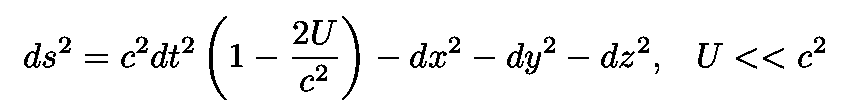

等式 4:由恒定引力场的存在引起的闵可夫斯基时空间隔的变化。

现在考虑一个到匀加速坐标系的坐标变换。新的 *x* 和 *t* 成为

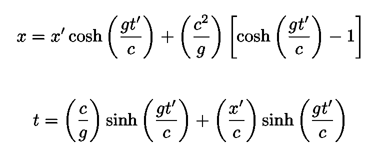

等式 5:到匀加速坐标系的坐标变换。

*y* 和 *z* 保持不变*。**闵可夫斯基区间方程。3 在这个坐标中表示为:*

*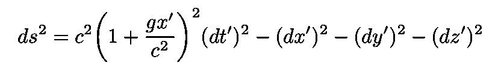*

*等式 6:匀加速框架的闵可夫斯基区间。*

*现在，选择时间乘以小于或等于变换方程 Eq.5 中的 *c* / *g* ，并执行简单的扩展，新的时空间隔 Eq。3 变成了:*

*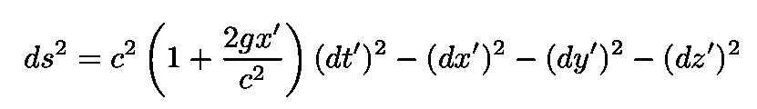*

*等式 7:用非惯性坐标表示的平坦闵可夫斯基时空中的时空间隔。*

*请注意，这与等式的形式相同。4.因此，我们看到转换到一个[加速框架](https://en.wikipedia.org/wiki/Acceleration_(special_relativity)#Accelerated_reference_frames)相当于引入一个引力场，这证实了等效原理。*

*到目前为止，我们只考虑了平坦闵可夫斯基度规的小偏差。按照爱因斯坦的说法，我们假设一般情况下(不仅仅是小偏差)，引力场的存在会扭曲时空的几何形状。更准确地说，爱因斯坦的引力理论假设在存在引力场的情况下，时空变成光滑的[伪黎曼流形](https://en.wikipedia.org/wiki/Pseudo-Riemannian_manifold)，其时空间隔的形式为:*

*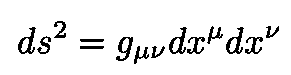*

*等式 8:拟[黎曼流形](https://en.wikipedia.org/wiki/Riemannian_manifold)上的时空区间。*

*在闵可夫斯基时空中，粒子以匀速直线运动:*

*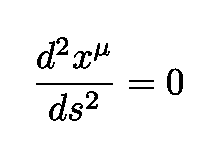*

*方程式 10:在闵可夫斯基时空中，粒子以匀速直线运动。*

*还是在没有重力的情况下，让我们把下面的变换转换成曲线坐标系:*

*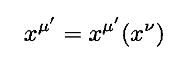*

*方程式 11:在没有重力的情况下，转换成曲线坐标。*

*时空间隔变成:*

*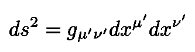*

*情商。12:变换等式后的时空间隔。11.*

*其中:*

**

*情商。13:变换 Eq 后的度量张量。11.*

**

*图 5:在惯性参考系中(上图)，黑球做直线运动。然而，站在旋转参照系(底部)中的观察者(红点)看到，由于该参照系中存在的科里奥利力和离心力，它沿着一条弯曲的路径运动([源](https://en.wikipedia.org/wiki/Coriolis_force))。*

*运动方程。10 成为无处不在的[测地线方程](https://en.wikipedia.org/wiki/Geodesics_in_general_relativity):*

*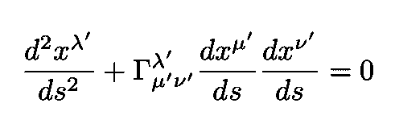*

*情商。14:运动方程 Eq。10 坐标变换后的等式。11、仍处于无重力状态。*

*那里的物品*

*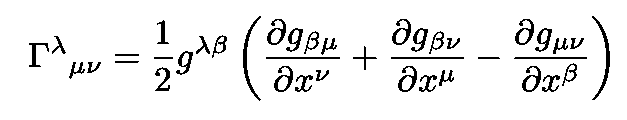*

*情商。15:出现在测地线方程中的克里斯托夫符号。*

*被称为[克里斯托夫符号](https://en.wikipedia.org/wiki/Christoffel_symbols)。*

*Christoffel 符号生成(在等式中。14)一个“表观”加速度，它仅仅是使用曲线坐标来描述笛卡尔坐标中的线性运动的结果。但它们实际上是惯性加速度(例如科里奥利加速度)。但是根据等效原理，所有的加速度，无论是来自惯性力还是来自重力的加速度，在起源上都是度规的:重力扭曲了时空几何(这是一个具有关联度规的准黎曼流形),粒子在时空上以方程式(1)给出的测地线运动。16.*

**

*情商。16:粒子在时空中运动的测地线运动方程。*

*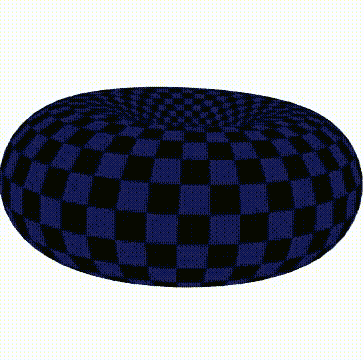*

*图 6:在 2D 表面移动的插图。如果昆虫继续往前走，它会描绘出一条测地线。*

# *推导爱因斯坦引力定律*

*在牛顿物理学中，描述引力场的方程是以引力势 *U.* 来表述的，当没有引力时，人们只需*U*= 0；当有一个大质量物体，但受其场作用的测试粒子在物体外时，∇*u*= 0；在有物质的区域，方程变成∇ *U =4* π *Gρ。**

*让我们看看如何将这三个方程推广到广义相对论的背景下。首先，考虑一个粒子按照运动方程运动。16.如果 Eq。16 可以转化为 Eq。10 坐标的某些变化，意味着粒子不在引力场中。同样，对于现在的重力来说，克里斯托夫符号不会在任何坐标变换后消失。利用克里斯托夫符号的变换定律，很容易证明一般的坐标变换*

*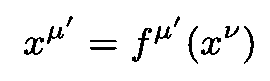*

*情商。17:应用于 Christoffel 符号的变换。*

*将使所有的克里斯托夫符号消失，只有当方程*

*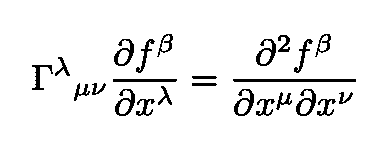*

*情商。18:γs 消失的条件*

*对等式中的四个变换 *f* s 有一个(非平凡的)解。17.如果所谓的[黎曼-克里斯托费尔张量](https://en.wikipedia.org/wiki/Riemann_curvature_tensor)消失，这就会发生。后者由下式给出:*

*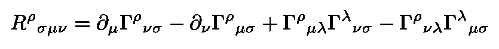*

*情商。19:黎曼曲率张量或黎曼-克里斯托费尔张量。*

*我们得出结论，引力场不存在的条件是:*

*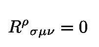*

*情商。20:无重力的条件。这个方程是 U=0 牛顿方程的相对论对应物。*

*这个方程是牛顿方程 *U* =0 的广义相对论版本。可以证明，∇ U=0 的最简单的推广是等式的收缩。20，即:*

*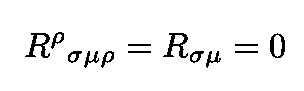*

*情商。21:瑞奇标量的消失是∇ *U* =0 牛顿方程的相对论对应。*

*这个消失的物体被称为[瑞西张量](https://en.wikipedia.org/wiki/Ricci_curvature)。最后一步是确定∇右侧的一般化 *U =4* π *Gρ。*想到的第一个对象是能量动量张量。从狭义相对论中我们知道，它的导数消失了。但是广义相对论是一个[协变理论](https://en.wikipedia.org/wiki/General_covariance)，所以标准导数的消失是不够的:我们需要*的[协变导数的消失](https://en.wikipedia.org/wiki/Covariant_derivative)**

**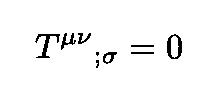**

**这在所有坐标系中都是成立的。但是 Ricci 张量的协变导数不为零。这是通过引入一个相关的张量来解决的，即所谓的[爱因斯坦张量](https://en.wikipedia.org/wiki/Einstein_tensor)，其协变导数为零。**

**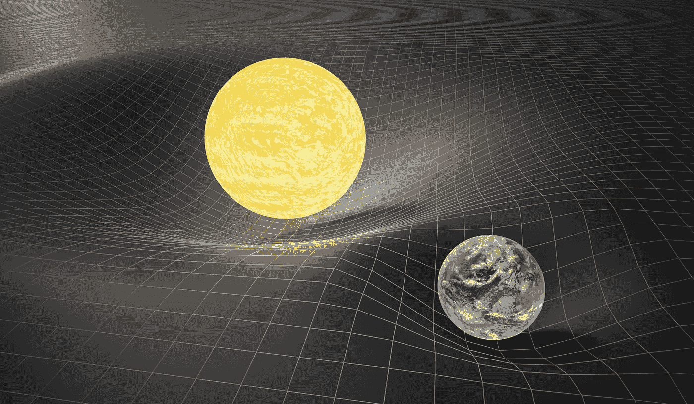**

**图 7:在广义相对论中，质量之间的引力效应是时空扭曲的结果。**

**因此，爱因斯坦引力定律变成:**

**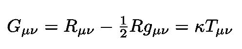**

**常数 k 可以通过在极限 c → ∞中求得到，牛顿方程被恢复(详见[钱德拉塞卡](https://aapt.scitation.org/doi/10.1119/1.1986496))。**

**我的 [Github](https://github.com/marcotav) 和个人网站 [www.marcotavora.me](https://marcotavora.me/) 有一些其他有趣的材料，既有关于物理的，也有关于数学、数据科学和金融等其他主题的。看看他们！**