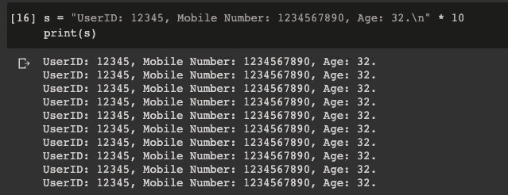

# 你可能不知道的 Python 正则表达式的一个隐藏特性

> 原文：<https://towardsdatascience.com/a-hidden-feature-of-python-regex-you-may-not-know-f00c286f4847?source=collection_archive---------22----------------------->


由[蓝皮鹦鹉](https://pixabay.com/users/bluebudgie-4333174/)在 [Pixabay](https://pixabay.com/illustrations/computer-science-pattern-digital-3848288/) 上拍摄的照片

## Python 编程技巧

## re.sub()函数的高级用法

众所周知，Python 为正则表达式(regex)提供了许多方便的内置函数，使得字符串操作变得极其简单和方便。

在本文中，我将介绍 Python 中内置于`re`库中的一个非常棒的特性，用于使用 regex 替换字符串组件。

让我们看看下面的例子。

# 问题定义


由 [papazachariasa](https://pixabay.com/users/papazachariasa-12696704/) 在 [Pixabay](https://pixabay.com/photos/rubik-s-cube-cube-rubik-dice-pc-5017116/) 上拍摄的照片

在一些面向客户的软件/web 开发中，当我们在 UI 中显示一些敏感信息时，我们可能需要隐藏这些信息。例如，我们有这样一个包含用户手机号码的字符串:

```
s = "User's mobile number is 1234567890"
```

如果我们想用星号隐藏手机号码，这并不太难。

```
import res_hide = re.sub('\d', '*', s)
print(s_hide)
```


库`re`是 Python 中的内置库，所以我们可以简单地导入并使用它。这里我们使用`re.sub()`函数，它有 3 个参数:

1.  正则表达式模式将用于匹配字符串中的模式
2.  我们要用来替换字符串中每个模式的字符串
3.  原始字符串

但是，大多数情况下我们可能并不想隐藏一切。例如，我们可能希望只显示最后 3 个数字，这样用户就可以得到我们在这里提到的手机号码的提示。这是一个非常常见的密码重置用例。我们不想显示手机号码的所有数字，因为我们不想向任何未经授权的人透露该号码，但同时，我们希望提供几个数字作为用户经过身份验证的提示。

这意味着我们所期望的如下:

```
User's mobile number is *******890
```

让我们把它变得更复杂。如果一个字符串中有多个数字，我们想隐藏其中的一部分，该怎么办？

```
s = "UserID: 12345, Mobile Number: 1234567890"
```

假设我们有一个用户 ID 和手机号码，我们想只显示用户 ID 的后 2 位和手机号码的后 3 位，这是如何实现的？使用`re.compile()`、`re.search()`还是其他功能？

我确信有很多解决方案，但我认为使用`re.sub()`是最直观的，也是可读性最好的。让我们看看如何实现这一点。

# 将功能传递到`re.sub()`


照片由 [MarandaP](https://pixabay.com/users/MarandaP-7632346/) 在 [Pixabay](https://pixabay.com/photos/math-numbers-number-counting-5247958/) 上拍摄

在关于`re.sub()`的 Python 官方文档(见参考文献部分)中，我们可以发现该函数的签名如下:

```
re.**sub**(*pattern*, *repl*, *string*, *count=0*, *flags=0*)
```

让我们注意第二个参数，我们已经介绍了这个参数，它将用于替换在字符串中找到的模式。然而，文档说它也可以是一个函数。

> 返回用替换 *repl* 替换*字符串*中*模式*最左边不重叠出现的字符串。如果没有找到模式，*字符串*不变地返回。 ***repl* 可以是字符串也可以是函数**；

让我们看看如果我们传递一个函数作为第二个参数会发生什么。

```
def replace(term):
    print('Matched term: ', term)
    return '*'s = "UserID: 12345, Mobile Number: 1234567890"
s_hide = re.sub('\d+', replace, s)
```


太酷了！我们定义了一个名为`replace()`的函数，并将其作为第二个参数传递。然后，在我们的`replace()`函数中，我们可以有与模式匹配的`term`。

看起来我们可以用这个`term`做很多事情。在 Python 文档的同一个页面上，我们可以看到有一个例子告诉我们使用`.group(0)`来获取匹配的字符串，返回的字符串将用来替换**这个**匹配的词条。

让我们做一个测试。

```
def replace(term):
    print('Matched term: ', term.group(0))
    return term.group(0)s = "UserID: 12345, Mobile Number: 1234567890"
s_hide = re.sub('\d+', replace, s)
print('String should not change: ', s_hide)
```


有用！我们找到了两个匹配的术语。同样，因为我们将`term.group(0)`返回，所以字符串没有改变。

好的。现在，很明显，我们可以转换函数中的项，然后将它传递回来。那么，我们应该这样做。

```
def replace(term):
    if len(term.group(0)) == 5:  # UserID
        return '***' + term.group(0)[-2:]
    elif len(term.group(0)) == 10:  # Mobile
        return '*******' + term.group(0)[-3:]
    else:
        return term.group(0)s = "UserID: 12345, Mobile Number: 1234567890, Age: 32"
s_hide = re.sub('\d+', replace, s)
print(s_hide)
```


这正是我们想要的！在这个例子中，我还添加了一个年龄，它也是数字，但假设我们不想隐藏它。这个功能运行得很好。

# 其他提示


照片由[pix abay](https://pixabay.com/users/Free-Photos-242387/)上的自由照片拍摄

如果您已经阅读了参考资料中附带的文档页面，您可能会注意到还有一个名为`subn()`的函数。老实说，在我重新检查文档之前，我从来不知道这个功能，但我相信它在某些情况下非常有帮助。

函数`subn()`的作用与`sub()`相同。唯一的区别是，它还会返回匹配了多少个`terms`(不一定被替换，因为它是我们定义的函数来决定如何替换)。

出于测试目的，让我们重复这个字符串 10 次。

```
s = "UserID: 12345, Mobile Number: 1234567890, Age: 32.\n" * 10
print(s)
```



然后，让我们将`re.subn()`与我们之前定义的`replace()`函数一起使用。这里我们需要将结果解包到两个变量中，因为它将返回一个元组。

```
s_hide, num_matched = re.subn('\d+', replace, s)print('String with hidden ID and Mobile:\n', s_hide)
print('Total number of users: ', int(num_matched/3))
```


因此，如果你想做下面的两件事，你现在可以在单个函数中实现它们！

*   统计字符串中模式的出现次数
*   替换字符串中出现的所有模式

> 感谢 Eric PASCUAL 在我的代码和解释中发现了一个错误。重要的是澄清`re.subn()`方法将返回匹配而不是替换的术语数量，因为如何替换术语是在我们的定制函数中定义的，而不一定被`re.subn()`函数检测到。

# 摘要


照片由 [Engin_Akyurt](https://pixabay.com/users/Engin_Akyurt-3656355/) 在 [Pixabay](https://pixabay.com/photos/coffee-pen-notebook-caffeine-cup-2306471/) 上拍摄

在本文中，我介绍了如何以更高级的方式使用函数`re.sub()`。它不仅可以帮助我们替换字符串中某个正则表达式模式的所有出现，还支持深度定制的替换模式，因为它可以在一个单独的函数中完成。

本文中的所有代码都可以在这个 Colab 笔记本中找到:

[](https://colab.research.google.com/drive/1eZ5QWo17fGIorISEYeFDe0WZdWpE2o-e?usp=sharing) [## Regex sub()示例

### Python re.sub()和 re.subn()函数示例

colab.research.google.com](https://colab.research.google.com/drive/1eZ5QWo17fGIorISEYeFDe0WZdWpE2o-e?usp=sharing) [](https://medium.com/@qiuyujx/membership) [## 通过我的推荐链接加入 Medium 克里斯托弗·陶

### 作为一个媒体会员，你的会员费的一部分会给你阅读的作家，你可以完全接触到每一个故事…

medium.com](https://medium.com/@qiuyujx/membership) 

如果你觉得我的文章有帮助，请考虑加入 Medium 会员来支持我和成千上万的其他作者！(点击上面的链接)

# 参考

Python 文档:re . sub()
[https://docs.python.org/3/library/re.html#re.sub](https://docs.python.org/3/library/re.html#re.sub)