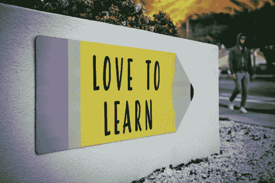

# 一个数据科学计划，以提高你的 ML 问题解决技能的酒吧

> 原文：<https://towardsdatascience.com/a-highly-recommended-data-science-program-de46eae796ea?source=collection_archive---------39----------------------->

## **一位在线微大师将为你的数据科学职业生涯提供助力**

由[蒂姆·莫斯霍尔德](https://unsplash.com/@timmossholder?utm_source=unsplash&utm_medium=referral&utm_content=creditCopyText)在 [Unsplash](https://unsplash.com/s/photos/learning?utm_source=unsplash&utm_medium=referral&utm_content=creditCopyText) 上拍摄的照片

> “教育没有止境。不是说你读了一本书，考了一个，学历就完了。整个人生，从你出生的那一刻到你死去的那一刻，都是一个学习的过程。”—吉杜·克里希那穆提

引用的相关性增加了多倍的 ML 从业者。随着海量数据的激增，市场越来越需要能够通过挖掘海量数据来解释和提供决策解决方案的候选人。

> 这种动态的需求要求不断提高自己在数据科学(DS)领域的技能。虽然对一些人来说这是一项沉闷的任务，但对另一些人来说却是一种纯粹的快乐。

如果你属于后一类，并且总是在寻找一个新的概念或者重温这些概念，仅仅是为了更新和验证你当前的理解，那么这篇文章就是为你准备的。

随着教育民主化的到来，学习从未如此简单。随着整个教育系统在疫情经历范式转变，在线学习成为新的规范。

谢天谢地(或者不是😊)，有一大群数据科学 MooCs 帮助参与者准备进入 DS 职业生涯或晋升。

我最近完成了麻省理工学院统计学和数据科学的 [Micromasters 项目的 3 门课程，我想分享一下这是多么丰富的经历。一般来说，当我们考虑选择特定课程的标准时，我们会检查课程主题的广度和深度，时间和金钱投资的回报是什么，在建立直觉方面的回报是多少。该计划在更大程度上符合所有这些要求。](https://www.edx.org/micromasters/mitx-statistics-and-data-science)

麻省理工学院的 Micromasters 课程经过精心策划，为数据科学、机器学习和统计学奠定了坚实的基础。

> Micromasters 计划是一系列课程，旨在提供与特定职业领域相关的更深层次的概念性理解。参与者在完成 Micromasters 后，可以申请该大学更快、更便宜的硕士学位。

麻省理工学院微硕士课程的完成也使一个人有资格成为麻省理工学院校友会的会员，该校友会有各种好处，例如:

*   访问 Micromasters 证书持有人和图书馆期刊的在线目录
*   一些麻省理工学院校友会活动的邀请，有资格在所有麻省理工学院的新闻出版物和在 edx 主办的麻省理工学院课程上获得折扣

该计划期望大学水平的微积分和数学推理和 Python 编程的舒适。

**项目涵盖的课程:**

它由 4 门强化在线课程(和一门顶点课程)组成，每门课程预计每周 12-14 小时，持续 13-16 周。

*   **概率:**麻省理工学院教授了几年的经典概率课程，内容包括离散或连续随机变量、贝叶斯推理方法、随机过程(泊松过程和马尔可夫链)
*   **社会科学中的数据分析:**因果关系，分析随机实验，&非参数回归
*   **统计学基础:**参数估计、假设检验、使用拟合优度的模型选择
*   **使用 Python 的机器学习:**线性和非线性分类器、神经网络、无监督学习、强化学习、SGD、推荐器问题、协同过滤、生成模型、混合、EM 算法
*   **顶点考试:**虚拟监考考试，以获得微观硕士证书

## **结束语:**

这是我经历过的最累人的数据科学项目之一，但在概念的内化方面回报同样巨大。包括概率和统计等课程使其成为一个非常全面的数据科学项目。

你将开始编写各种 ML 模型的实现，从线性模型到深度学习和强化学习。

**即使到目前为止你已经在你的数据科学旅程中学习了机器学习的基础——统计学和概率，我仍然建议你报名参加这个项目。你将有新的东西要学——建立 ML 算法背后的直觉或作为 ML 基础的复习。**

我希望这篇文章能给你足够的动力去检查项目课程，并融入学习的世界！！！

> 声明:这不是为了做节目的营销。写这篇文章的唯一原因是分享它如何有效地巩固了我职业生涯中 ML 的基础。我希望在整个 ML/DS 社区分享这些知识。