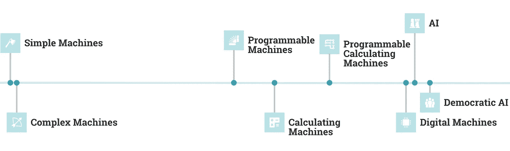
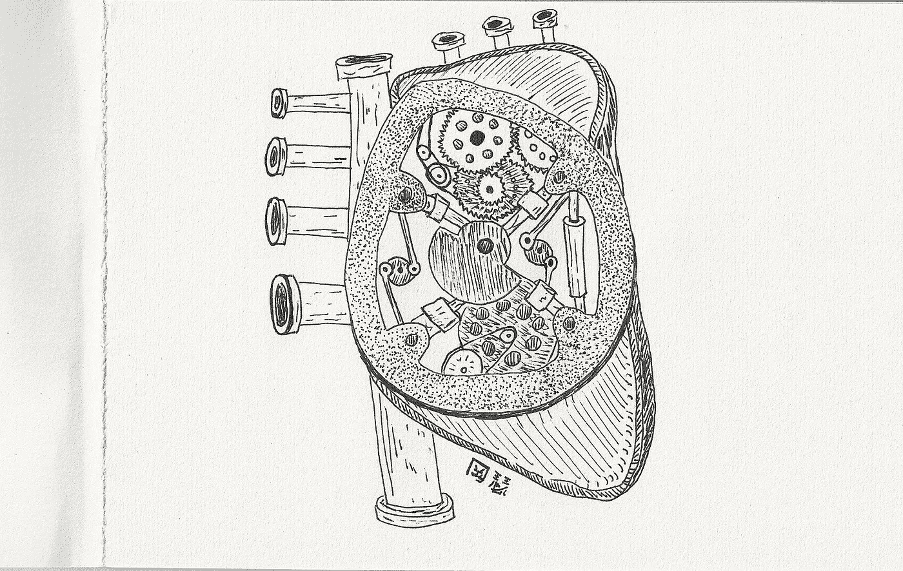
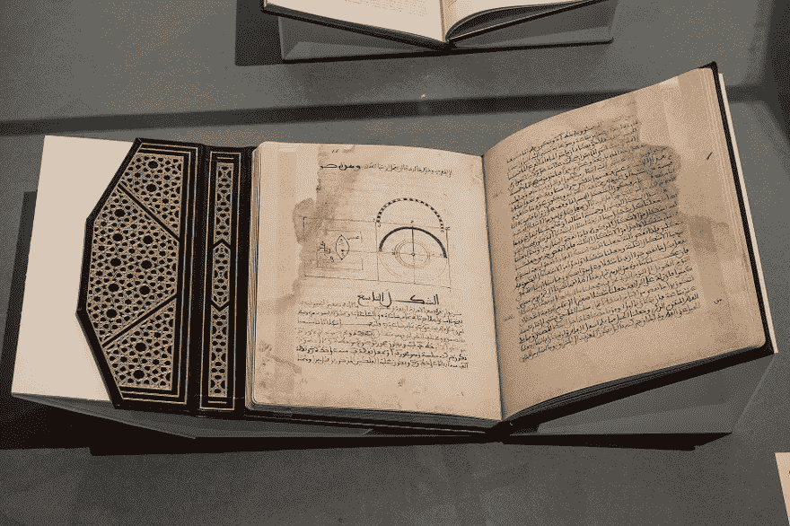
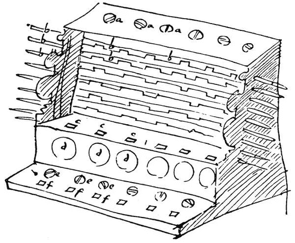
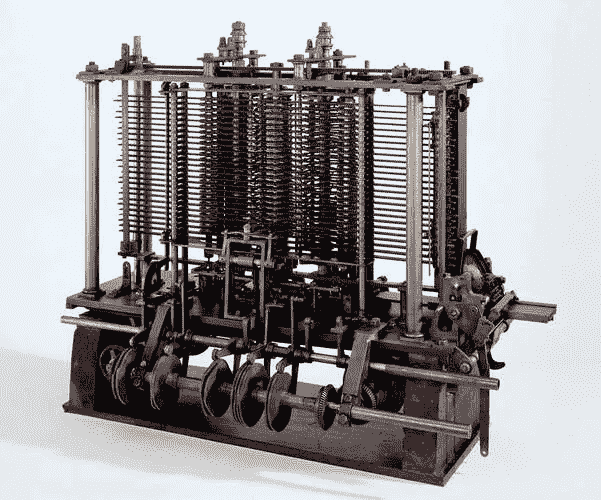
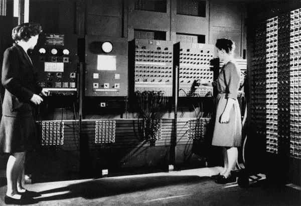
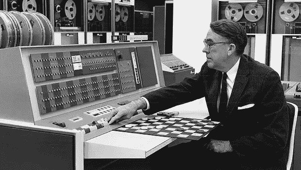
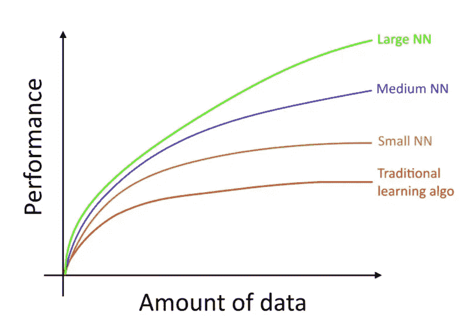
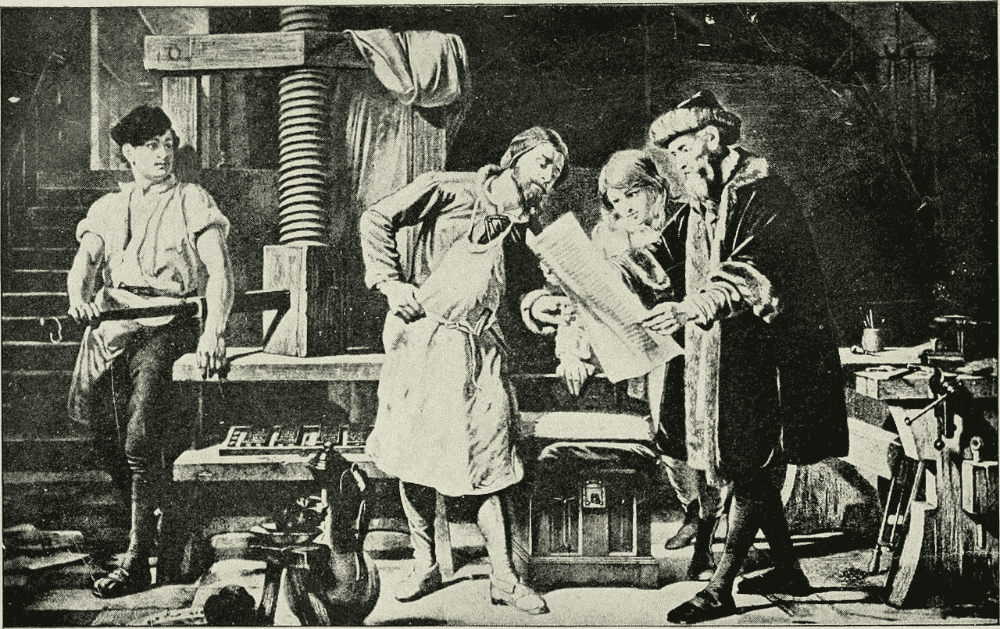

# 人工智能的历史——从头开始

> 原文：<https://towardsdatascience.com/a-history-of-artificial-intelligence-from-the-beginning-10be5b99c5f4?source=collection_archive---------46----------------------->

## 人工智能的历史远早于图灵，甚至早于计算机。

从简单机器到民主 AI 的时间线(非线性时间轴)。由作者在 [Apteo](http://apteo.co) 创作。

在关于人工智能的开创性论文中，题为 [*计算机械和智能*](https://www.csee.umbc.edu/courses/471/papers/turing.pdf) ，艾伦·图灵提出了一个著名的问题:“机器能思考吗？”—或者，更准确地说，机器能成功模仿思维吗？

70 年后，答案仍然是“不”，因为一台机器还没有通过图灵测试。

图灵澄清说，他对“旨在执行任何可以由人类计算机完成的操作”的机器感兴趣。换句话说，他对复杂的数字机器感兴趣。

既然具有思维能力的数字机器的实现事关机器的进化，那就从机器历史的开端说起吧。

# 机器的历史

机器是一种做功的装置。在工程术语中，*功*的意思是将能量从一个物体转移到另一个物体。机器使我们能够施加更大的力，或者更有效地工作，从而完成更多的工作。

波士顿动力公司的机器人从 2009 年到 2019 年的演变。

现代机器——就像上面的波士顿动力机器人一样，*Atlas——*使用数百个零件，包括液压接头、活塞、齿轮、阀门等等，来完成复杂的任务，比如自校正稳定，甚至后空翻。

## 简单的机器

然而，“简单的机器”也符合我们早先的定义，包括轮子、杠杆、滑轮、斜面、楔子和螺丝钉。事实上，所有的机械都是由这六种简单的机器组合而成的。

*图册*不仅仅是机械机器，还是数字机器。

简单的机械机器已经有几百万年的历史了。例如，“石头切割工具[一种楔子]和人类社会一样古老，”考古学家发现了“150 万到 200 万年前”的石头工具

## 复杂的机器

简单机器的组合可以用来制造任何东西，从手推车到自行车到机械机器人。

事实上，机械机器人的记录可以追溯到 3000 多年前。

写于公元前 5 世纪的道教文献 [*【列子】*](https://archive.org/stream/taoistteachingsf00liezrich/taoistteachingsf00liezrich_djvu.txt)*记载了周穆王(公元前 1023 年至公元前 957 年)和一位名叫颜石的工程师的一次更早的会面。颜石向国王赠送了一个真人大小的人形机械机器人:*

> *”国王惊讶地盯着那个身影。它迈着大步，上下移动着它的头，这样任何人都会把它当成一个活生生的人。工匠摸了摸它的下巴，它开始唱歌，完全合拍。他摸了摸它的手，它开始摆姿势，保持着完美的时间……当表演接近尾声时，机器人眨了眨眼睛，并向在场的女士们示好，于是国王变得愤怒，如果不是后者在致命的恐惧中，立即把机器人撕成碎片，让他看看它到底是什么，他会当场处决颜氏。事实上，它只是一个由皮革、木材、胶水和油漆构成的建筑……”*

**

*机械心脏图。日期未知。*

*国王问道:“人类(创造机器)的技能能与伟大的自然(上帝)作者的技能相提并论吗？”*

*换句话说，图灵关于机器能否模仿人类的问题其实已经有几千年的历史了。*

*与此同时，希腊科学家正在创造各种各样的自动机。阿尔库塔斯(约公元前 428-347 年)创造了一种能飞约 200 米的机械鸟，被描述为一种鸟形的人工蒸汽推进飞行装置。*

> *"阿尔库塔斯用如此精巧的机械和艺术制作了一只鸽子的木制模型，以至于它能飞起来。"*

*一些现代历史学家认为，这可能得益于电线的悬挂，但无论如何，这显然是为了创造一台机器。*

*另一位希腊科学家代达罗斯创造了会移动的雕像:*

> *"据说代达罗斯创造了栩栩如生的雕像，它们可以自己移动。"*

*“第一座布谷鸟钟”在《亚历山大的兴衰:现代世界的发源地》一书中有所描述(第 132 页)；*

> *很快，克特西比乌斯的钟就被塞住了，它们控制着一系列装置，从铃铛到木偶，再到唱歌来标志每个小时过去的机械鸽子——这就是第一个布谷鸟钟*

*几个世纪以来，越来越多复杂的装置被用来创造自动机，如风力驱动的移动机器。*

## *可编程复杂机械设备*

*直到公元九世纪[CE](http://ed-thelen.org/comp-hist/ProgrammableMachinePreHistory_MechMachTheor_May2001.pdf)才出现了第一台有记载的*可编程的*复杂机械机器:*

> *已知最早的可编程机器设计是 9 世纪巴格达的穆萨兄弟描述的自动长笛演奏器*

*这也被描述为“自我演奏的乐器”一本关于这些设备的书保存在梵蒂冈图书馆。*

**

**创意成果中的秘密之书*ZKM·卡尔斯鲁厄，摄影:哈拉尔德·沃尔克尔。由 ZKM·卡尔斯鲁厄和梵蒂冈图书馆提供。*

## *机械计算机器*

*通往现代人工智能的漫长道路上的另一步是机械计算器的发明。*

*第一台机械计算器是由威廉·席卡在 17 世纪上半叶制造的，允许加法和乘法。*

**

*Schickard 的计算器。图宾根大学提供。*

*下一台由布莱士·帕斯卡制造的机械计算器也可以进行减法运算。*

*这些机器启发了像戈特弗里德·威廉·莱布尼茨这样的思想家去思考下面的想法:*

> *如果人类经验的每一个领域都可以通过数学思维来理解，如果思维是一种计算形式，并且计算可以机械化，那么原则上所有关于现实的问题都可以通过机器执行的计算来回答*

*在很多方面，这类似于我们今天的人工通用智能概念。*

*莱布尼茨的想法是，一个*特性一个普遍性，*或一个普遍的逻辑程序，可以回答所有关于现实的问题。*

## *可编程计算机器*

*1833 年，查尔斯·巴贝奇将 9 世纪可编程机器的创新和 17 世纪计算机器的创新结合起来，构想出了一种*分析引擎*:可编程计算机器。*

**

*查尔斯·巴贝奇分析引擎的一部分(完成于 1910 年)。在巴贝奇于 1871 年去世时，这部分建筑只完成了一部分，它包括“磨坊”(功能上类似于现代计算机的中央处理器)和一个印刷机构。伦敦科学博物馆。*

*巴贝奇从未制造出一台完整的机器，但他的“穿孔卡片技术”后来被用于第一批数字机器。*

## *数字机器(计算机)*

*从机械计算机到数字计算机的转变是我们今天的巨大飞跃。*

*在 20 世纪 30 年代末到 40 年代，出现了几台数字计算机，竞争“第一台数字计算机”的位置*

*ENIAC 被广泛认为是第一台数字计算机，于 1946 年完成建造，因为它是第一台具有完整功能的计算机。*

**

*鸣谢:[计算机历史博物馆](https://www.computerhistory.org/revolution/birth-of-the-computer/4/78)*

*其他的数字计算机包括 1943 年的巨像，它帮助英国密码破译者阅读加密的德国信息，以及 1942 年的 ABC 计算机。*

*从这里开始，进步迅速加快，在内存中存储程序、RAM、实时图形和晶体管等进步相对较快地相继推出。*

## *机器学习*

*最后，随着复杂的数字机器的出现，我们可以讨论机器学习的主题。*

*正如一开始所探讨的，机器的兴起促使艾伦·图灵在 1950 年提出了一个问题:“机器能思考吗？”五年后，达特茅斯大学发表了一篇关于人工智能的[开创性论文](http://jmc.stanford.edu/articles/dartmouth/dartmouth.pdf)，自那以后，该领域的基本原则一直保持相似。*

*1955 年，M.L .明斯基写道:*

> *一个“**机器可以通过“试错”过程被“训练”以获得一系列输入输出功能中的一个。这样一台机器，当它被放在一个合适的环境中，并给出一个“成功”或“失败”的标准时，它可以被训练成表现出“寻找目标”的行为。”***

*换句话说，机器学习算法在“训练数据”上建立数学模型来做出决定，而不是通过*显式编程*来做出这些决定。*

*这是计算器和机器学习(或人工智能)之间的关键区别:计算器或任何形式的自动机都有预先确定的输出。人工智能即时做出概率决策。*

*机械机器也有更严格的物理限制，在一个装置中可以安装多少机器组件(如滑轮、杠杆、齿轮)方面，而现代数字机器的 CPU 可以安装数十亿个晶体管。*

*“机器学习”这个词是阿瑟·塞缪尔在 1952 年发明的，当时他开发了一个用死记硬背的方法玩跳棋的计算机程序。*

**

*在 IBM 701 上玩亚瑟·塞缪尔的跳棋。信用: [IBM](https://www.ibm.com/ibm/history/ibm100/us/en/icons/ibm700series/impacts/) 。*

*在 [1957](https://blog.knoldus.com/introduction-to-perceptron-neural-network/) 年，Frank Rosenblatt 创造了 Mark I 感知器——一种二进制分类器的监督学习算法——用于图像识别。*

*在 1958 年向美国海军展示了他的工作后，[《纽约时报》报道了](https://www.nytimes.com/1958/07/08/archives/new-navy-device-learns-by-doing-psychologist-shows-embryo-of.html):*

> *感知机是“电子计算机的胚胎，海军期望它能够行走、说话、看、写、自我复制并意识到自己的存在。”*

*甚至在 1958 年，研究人员就预见了人工智能有感知能力的一天。*

*后来的成就包括前馈神经网络(像一个感知器，但有多层)，67 年的[最近邻算法](https://ieeexplore.ieee.org/abstract/document/1053964/)，70 年代计算机上的[反向传播](https://link.springer.com/article/10.1007/BF01931367)(现在用于训练深度神经网络)，90 年代初的[助推算法](https://dl.acm.org/doi/abs/10.1145/130385.130429)，97 年的 [LSTMs](https://www.bioinf.jku.at/publications/older/2604.pdf) 。*

## *数据和计算能力带来的改进*

*在首席人工智能研究员吴恩达最近的[人工智能课程](https://www.coursera.org/learn/ai-for-everyone#syllabus)中，他指出，在人工通用智能方面“几乎没有进展”，但在“狭义智能”方面取得了令人难以置信的进展——输入输出功能“做一件事，比如智能扬声器或无人驾驶汽车。”*

*在高层次上，人工智能仍然是关于“学习一个从 x 映射到 y 的函数。”*

*我们最近看到的令人难以置信的进步主要是由于数据和计算能力的爆炸，以及更好的(更高质量的)数据和更多的人工智能工程师。*

*更多的数据和计算能力自然会提高大多数人工智能模型的准确性，尤其是在深度学习方面。*

**

*鸣谢:*吴恩达《机器学习的向往》。**

## *AI 的民主化*

*随着人工智能架构、计算能力和数据的发展，人工智能最近在行业中占据了一席之地，这要归功于更容易获得的人工智能工具的激增。*

*让技术变得更容易使用的工具的出现有很长的历史。例如，古腾堡的印刷机在 15 世纪使知识民主化。*

**

*约翰内斯·古腾堡，1904 年重建。*

*在互联网时代，像 Wordpress 和 Wix 这样的“无代码”工具使网站建设民主化。*

*同样，在 50 年代人工智能提出后的几十年里，人工智能在很大程度上仅限于学术界，没有看到多少实际用途。*

*像 [TensorFlow](https://www.wired.com/2015/11/google-open-sources-its-artificial-intelligence-engine/) 和 [Keras](https://blog.keras.io/introducing-keras-10.html) 这样的工具使更多的企业实现人工智能变得可行，尽管它们仍然是技术复杂的工具，需要使用高薪的机器学习工程师。*

*加剧这一复杂性的是，[数据科学专业人员的短缺](https://app.apteo.co/workspaces/2300510291097552329)导致那些可以创建人工智能系统的人获得天价薪酬。结果，像 FAANGs 这样的大公司控制了 AI 的大部分。*

*像 [Apteo](http://apteo.co) 这样的无代码人工智能工具的出现降低了前期成本，同时消除了对技术专业知识的需求，实现了真正民主化的人工智能。*

## *没有代码 AI*

*无代码人工智能工具是民主化人工智能道路上合乎逻辑的下一步。*

*200 万年前，早期人类制造了石头切割工具，能够比用手做更多的工作。*

*今天，AI 使我们更加高效，可以为我们做工作，而无代码 AI 则为每个人带来这些好处。*

*随着无代码人工智能工具的兴起，我们正在走向一个无障碍人工智能的时代。*