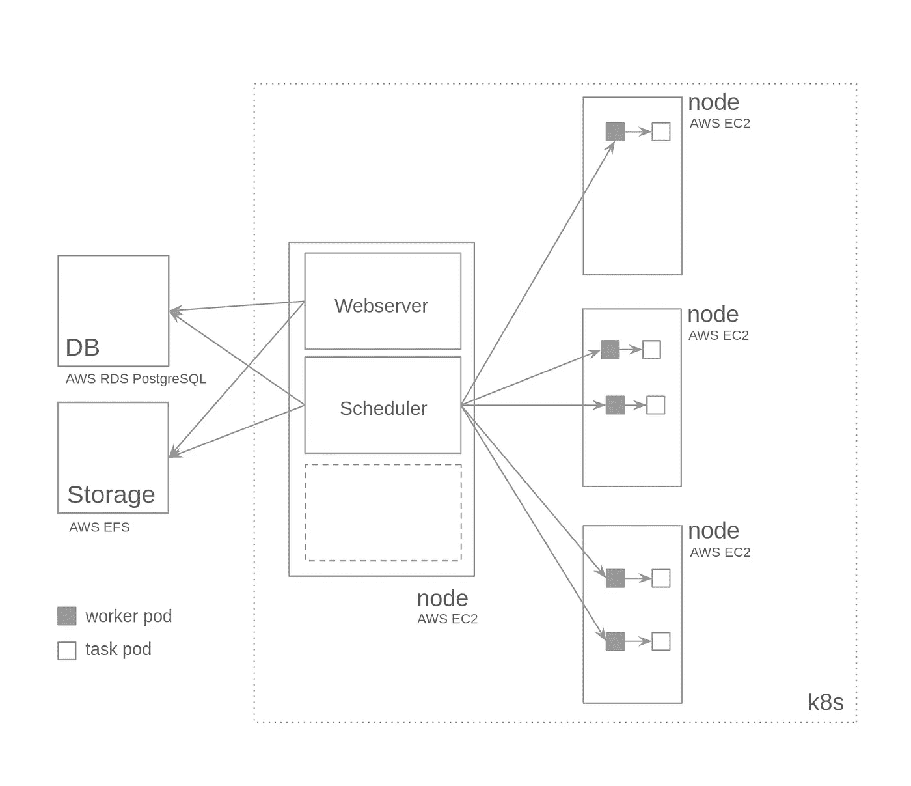

# 库伯内特斯的气流之旅

> 原文：<https://towardsdatascience.com/a-journey-to-airflow-on-kubernetes-472df467f556?source=collection_archive---------4----------------------->

## …或者我是如何让它一点一点地、合乎逻辑地运转起来的


当阿帕奇气流任务着陆图看起来更像波洛克的画(来源:作者)

# 简介

我对 Apache Airflow 的拙见:基本上，如果您有多个自动化任务要调度，并且您正在摆弄 *cron 任务*,即使它们的一些依赖项失败了，您也应该尝试一下。但是如果你不愿意接受我的话，请随意查看这些帖子。 [](https://medium.com/analytics-and-data/10-benefits-to-using-airflow-33d312537bae) [](https://www.solita.fi/en/blogs/why-we-switched-to-apache-airflow/)[](https://robinhood.engineering/why-robinhood-uses-airflow-aed13a9a90c8)深入研究气流概念及其工作原理超出了本文的范围。就此而言，请检查这些其他职位。[⁴](/airflow-how-and-when-to-use-it-2e07108ac9f5)t11】⁵

长话短说，它的任务定义是基于*代码的*，这意味着它们可以如你所愿的那样*动态*。您可以创建任务，并根据变量或条件定义任务相关性。它有大量的本地*操作符*(任务类型的定义) [⁶](https://airflow.apache.org/docs/stable/_api/airflow/operators/index.html) 将您的工作流与许多其他工具集成在一起，并允许您使用 Apache Spark 运行从最基本的 shell 脚本到并行数据处理，以及大量其他选项。贡献者操作员⁷也可以用于大量的商业工具，而且这个列表每天都在增长。这些操作符是 *python 类*，因此它们是可扩展的，并且可以根据您的需要进行修改。您甚至可以从零开始创建自己的操作符，从`BaseOperator`类继承。此外，使用它的分布式执行器(如 Celery 或 Kubernetes ),它使您的工作流可以轻松扩展到数百甚至数千个任务。

我们从 2018 年开始在 [iFood](https://institucional.ifood.com.br/) 使用气流。我们的第一个实现非常好，基于 docker 容器在一个隔离的环境中运行每个任务。从那时起，它经历了很多变化，从一个服务于我们团队工作负载的简单工具到一个服务于 200 多人的*任务调度平台*，上面有很多抽象。最后，不管您是有多年经验的软件工程师还是 SQL 知识很少的业务分析师，您都可以使用我们的平台编写一个 *yaml* 文件来调度您的任务，该文件包含三个简单的字段:您的任务的 ID、包含您的查询的文件的路径及其表依赖项的名称(即，要运行我的任务，我依赖于表`orders`和`users`)，瞧，您已经将您的任务调度为每天运行。*但不幸的是，这是未来文章的主题*。


拥有超过 1000 个任务的巨型 DAG 的一部分。其中大部分是由业务分析师或数据分析师安排的 Apache Spark / Hive 作业(来源:作者)

# 为什么是 Kubernetes？

很明显，我们需要将我们的应用程序从 AWS `t2.medium` EC2 实例扩展到更强大的东西。我们最初的方法是垂直扩展到一个`r4.large`实例，然后扩展到一个`r4.xlarge`，但是内存使用量一直在增加。

我们公司发展很快。每天都有几十个任务被创建，突然间我们将运行在一个`r4.16xlarge`实例上。我们需要一种方法来横向扩展应用程序，更重要的是，考虑到高峰时间来扩展应用程序，并在黎明时缩减应用程序，以最大限度地减少不必要的成本。当时，我们正在将所有平台迁移到 Kubernetes 集群上运行，那么为什么不迁移 Airflow 呢？

我在互联网上搜索，从官方的 Apache Airflow 文档到 Medium 文章，寻找如何在 Kubernetes 上使用`KubernetesExecutor`运行 Airflow 的简单实现的信息(我知道`CeleryExecutor`的存在，但它不符合我们的需求，考虑到您需要预先安排您的工作人员，没有本机自动伸缩)。我发现很多人都在谈论在 Kubernetes 上运行 Airflow 的好处，它背后的架构和一堆掌舵图，但很少有信息告诉我如何以一种符合逻辑的方式一点一点地为 Kubernetes 初学者部署它。这是本文的主要观点。假设您知道 Apache Airflow，以及它的组件如何协同工作，这个想法是向您展示如何利用`KubernetesExecutor`的优势部署它在 Kubernetes 上运行，并提供一些有关 Kubernetes 资源的额外信息( *yaml* 文件)。这些例子将是基于 AWS 的，但我确信，只需很少的研究，您就可以将信息移植到任何您想要的云服务，甚至可以在本地运行代码。

# 考虑

为了完全理解下面的部分并让事情运转起来，我假设您已经:

1.  一个可用的 AWS EKS 集群，或另一种类型的 Kubernetes 集群，在本地或在云环境中。
2.  Kubernetes 和`kubectl`工具的基本“实践”知识。至少在如何部署资源以及检查它们的描述和日志方面。
3.  关于 Apache Airflow 及其单元(配置、调度程序、web 服务器、数据库、Dag 和任务)的扎实知识

如果你没有，我建议你在当地玩一会儿 Kubernetes 和 Airflow。你可以在网上找到很棒的教程，甚至在官方网站上。对于 Kubernetes，您可以从 Katacoda 教程开始。关于阿帕奇气流，这是我尝试的第一个教程。 [⁹](https://github.com/hgrif/airflow-tutorial)

# 起点

首先，我找到了一种方法，可以从 Airflow git 存储库中的官方舵图中获取 Kubernetes 资源 *yaml* 文件。 [⁰](https://github.com/apache/airflow/tree/master/chart) 给我带来了很多资源，其中一些是空的(可能是因为我使用了 base `values.yaml`来填充 Helm 使用的模板)，还有一些对于`KubernetesExecutor`方法是无用的(也就是说，我不需要 Redis 集群，或者 Flower 资源，或者结果后端，因为这些是芹菜特有的)。除去那些无用的资源，我最终得到了大约 15 个资源文件，其中一些我当时甚至都不知道。有点势不可挡！我还删除了与 PostgreSQL 实例相关的所有资源(即 pgbouncer)，因为我知道我将使用一个在 Kubernetes 集群外部的 AWS RDS 实例。

如何从 Apache Airflow 舵图导出 Kubernetes 资源 yaml 文件

Obs:我在本地有这些图表，所以当我执行`helm template`命令时，`helm`抱怨找不到 PostgreSQL 图表(如果您使用 Helm 存储库，这不会发生)。如果是这种情况，只需在包含你的舵轮图的文件夹中创建路径`charts/`，并将`postgresql/`舵轮图文件夹放入其中(可从官方舵轮图 github 库获得)。同样重要的是要注意，与我使用的图表相比，在 https://github.com/helm/charts[提供的阿帕奇气流舵图表将带给你一组不同的资源。](https://github.com/helm/charts) [⁰](https://github.com/apache/airflow/tree/master/chart)

经过所有的清理，我得到了这 12 种资源:

```
resources
├── configmap.yaml
├── dags-persistent-volume-claim.yaml
├── rbac
│   ├── pod-launcher-rolebinding.yaml
│   └── pod-launcher-role.yaml
├── scheduler
│   ├── scheduler-deployment.yaml
│   └── scheduler-serviceaccount.yaml
├── secrets
│   └── metadata-connection-secret.yaml
├── statsd
│   ├── statsd-deployment.yaml
│   └── statsd-service.yaml
├── webserver
│   ├── webserver-deployment.yaml
│   └── webserver-service.yaml
└── workers
    └── worker-serviceaccount.yaml
```

# 思考体积

我找到的大多数文章都描述了两种存储 DAG 信息的方法:将 DAG 存储在可从多个 AWS 可用性区域访问的持久卷上，例如 AWS 弹性文件系统(EFS ),或者将它们从 git 存储库同步到集群中挂载的临时卷。如果该 pod 终止，当创建另一个 pod 时，它将再次与存储库同步以获得最后的修改。

由于我们目前的工作流，我们需要从许多写在 *yaml* 文件中的任务动态构建我们的 Dag，这意味着当文件在 git 存储库上被版本化时，我们的 Dag 还没有准备好。一个简单的 git-sync 带来的信息对我们来说是不可行的，但它可能是一个起点。考虑到我们还需要日志的某种持久性，我们决定也采用 EFS 方法，使用我们在网上找到的某种混合方法:将我们的 *yaml* 文件 git-sync 到安装在 EFS 顶部的`PersistentVolume`中，并让另一个 pod 处理它，并将新构建的 Dag 扔进调度程序和 web 服务器不断查看以填充`DagBag`的文件夹中。

用于存储 Apache Airflow DAG 文件的持久卷配置

用于存储 Apache Airflow DAG 文件的 PersistentVolumeClaim 配置

基于 AWS EFS 的存储的存储类配置

如上所示，为了在 EKS 集群中挂载 EFS，我使用了官方的 AWS CSI 驱动程序， [](https://github.com/kubernetes-sigs/aws-efs-csi-driver) ，它必须安装在集群中。除了驱动因素之外，这种方法还占用了五种 Kubernetes 资源:

*   2 个持久卷:Dag、日志
*   2 个 PersistentVolumeClaim:Dag、日志(类似于前面的那些)
*   1 节储物课

这些资源不在初始列表中，因为最初的部署使用了`emptyDir`卷。

# 我应该在哪里存储我的 airflow.cfg 文件？

任何使用过 Apache Airflow 一段时间的人都知道`airflow.cfg`文件(也许还有`webserver_config.py`文件)对于设置这些东西非常重要。但是将它放入 EFS 卷似乎并不明智，因为它包含敏感信息(数据库密码、fernet 密钥)。然后，我发现 Kubernetes 存储配置文件的方式是使用`ConfigMap`，这是一种“卷”,您可以将其安装在 pod 中，以便为它们公开配置文件。还有 Kubernetes `Secret`来存储敏感数据。它们一起工作，所以我可以在一个`ConfigMap`中引用一个`Secret`，或者甚至将一个`Secret`传递给一个环境变量。任务完成！

随着您对 Kubernetes 了解得越来越多，您会注意到在存储库中发布“普通”秘密有些不安全。它们包含 base64 字符串，可以在您的终端中使用`base64 -d`命令轻松“解密”。看看这个 ExternalSecrets API， [](https://github.com/godaddy/kubernetes-external-secrets) 将您的秘密存储在 AWS 参数存储中，并从那里检索它们。

如果您检查上面的文件列表，您会注意到`ConfigMap`已经存在，您只需定制它。

# 好的，但是*部署*呢？

我在 Kubernetes 上的一点点经验足以让我认为我至少需要两个部署:一个用于*调度器*，一个用于*web 服务器*。它们就在那里，躺在舵轮图爆炸产生的`scheduler`和`webserver`文件夹里。还有第三个部署，是一个`statsd`应用程序，我后来发现它与应用程序内部的指标收集有关。酷，少了一件事要担心！*普罗米修斯*会乐意刮的。

我打开文件，注意到它们有一些熟悉的环境变量，与 fernet 键和数据库连接字符串相关。我用库本内特公司的秘密获取的数据填充了它们。我需要稍微调整一下音量部分，以匹配我的 EFS `PersistentVolume`和`PersistentVolumeClaim`。

气流调度程序的部署配置

很容易注意到这些 shell 脚本是作为 *init 容器*执行的。它们与气流开始时发生的数据库迁移相关。scheduler 窗格一启动就运行迁移，webserver 窗格在启动 webserver 容器之前一直等待迁移完成。webserver 部署具有非常相似的结构，所以我冒昧地省略了它。

# Webserver 是一个…服务器！应该有与之相关的服务！

有过。公开容器端口 8080 的 Kubernetes 服务资源。后来我加入了一个`Ingress`资源，给它一个 AWS Route53 友好的 DNS。

Airflow 服务器的服务配置

`statsd`应用程序也在一个端点监听，并有一个与之相关联的服务。这两个服务都包含在由`helm template`命令导出的文件中。

# 嗯，应该可以的，对吧？

我尝试将这些配置应用到集群中。Scheduler 和 webserver 都启动了，它们都连接到我的外部 RDS PostgreSQL 数据库。我想:“如果我把一些 DAGs 扔进`dags`文件夹，那么它应该可以工作，对吗？”的确如此。我创建了一个简单的 DAG，其中有一个基于`KubernetesPodOperator`的任务，使用了存储在 AWS 弹性容器注册表中的容器映像。我仔细检查了我的 pod 是否被允许访问 ECR 存储库。

然后，我触发了 DAG，但是失败了(你真的没想到会那么容易吧？).检查日志时，我注意到它是由于某种权限问题而发生的。我的调度程序没有权限生成新的 pod。然后我明白了分散在文件夹中的`ServiceAccount`资源以及`ClusterRole`和`ClusterRoleBinding`的需求。这些人允许你的资源产生新的资源。完成所有配置后，我可以让我的任务成功运行。`KubernetesPodOperator`也有`service_account_name`参数，应该用能够生成 pod 的`ServiceAccount`资源名来填充，因为这就是它要做的:用您作为参数传递给`image`参数的图像生成另一个 pod。那个舱将负责运行你的任务。

气流调度程序的 ServiceAccount 配置

如果你想直接从你的网络服务器上运行任务，点击任务菜单中的“运行”按钮，你必须给你的网络服务器`ServiceAccount`权限来观察和产生 pod。如果您忘记了这一点，您的任务将被触发，但它们永远不会运行。

# 作为可信实体的服务帐户

如果你在 AWS 上运行你的东西，你需要确保你的 pods 能够访问所有的 AWS 资源，比如 S3、DynamoDB 表、EMR 等等。为此，您需要将您的`ServiceAccount`资源绑定到一个附加了 IAM 策略的 AWS IAM 角色，以授予您所需的所有访问权限。只需为您的 IAM 角色提供一个假定角色策略:

允许 Kubernetes ServiceAccounts 承担具有所需权限的 IAM 角色的策略

您的员工和任务的`ServiceAccount`应与上述政策所附的 IAM 角色相关联。您可以使用注释来完成:

注释 AWS IAM 角色的 ServiceAccount 资源示例

# 现在，让那里有光！

如果您是作为一个教程来跟随这个旅程的，那么在所有的调整之后，您可以在您的集群中创建所有上述资源:

```
kubectl apply -f resources/ --recursive
```

*但是，等等！暂时不要应用它们！*如果你是一个细心的读者，你会注意到上面的大多数资源都引用了`airflow-on-k8s`名称空间。`Namespace`是一种告诉 Kubernetes 同一个名称空间中的所有资源多少有些关联(即它们是同一个项目的一部分)的方式，也是一种在集群内部组织事物的好方法。您应该在`resources/`文件夹中声明您的`Namespace`资源，并在应用其他所有资源之前应用它，否则您将得到一个错误。

声明 airflow-on-k8s 命名空间。小菜一碟，不是吗？

仅供参考，并不是 Kubernetes 上的每个资源都有名称空间(即`PersistentVolume`、`StorageClass`和其他低级资源)，这就是为什么其中一些资源没有对名称空间的任何引用。

# 体系结构



这种方法如何工作的一个极简主义的表现(来源:作者)

# 收场白

这是我在 Kubernetes 上展开气流之旅的一个快进。我试图涵盖舵图导出生成的各种资源，但如果您认为我遗漏了什么，请在评论部分随意提问。

上面这些 *yaml* 资源来自我做的一个功能部署。其中一些是我从头开始构建的，另一些是我从导出的版本中改编的。我建议你花时间去理解它们，并为更好的组织和表现做出改变。

要充分利用这种实现，您还可以做更多的事情。您可以为部署中的容器设置`limits`和`requests`字段，以确保它们拥有正常工作所需的资源。进一步了解 Kubernetes 的优势，您将会看到`KubernetesPodOperator`允许您标记您的 pod 并向其传递许多 Kubernetes 配置，例如*亲和力*、*耐受性*和一堆其他东西。如果你有被感染的节点，你可以保证只有一些特定的 pods 会在上面运行，把最强大的节点留给最关键的任务。

如果你尝试过这个设置，并且有什么要补充的，有什么有用的或者是一个糟糕的选择，请在评论中告诉我们。


Kubernetes 上的气流(来源:基于官方徽标的作者组合)

[1]: **使用气流的十大好处**:[https://medium . com/analytics-and-data/10-Benefits-to-use-air flow-33d 312537 BAE](https://medium.com/analytics-and-data/10-benefits-to-using-airflow-33d312537bae)

[2]: **我们为什么改用阿帕奇气流**:[https://www . solita . fi/en/blogs/Why-we-switched-to-Apache-air flow/](https://www.solita.fi/en/blogs/why-we-switched-to-apache-airflow/)

[3]: **罗宾汉为什么使用气流**:[https://robin hood . engineering/Why-robin hood-uses-air flow-aed 13 a9 a90 c 8](https://robinhood.engineering/why-robinhood-uses-airflow-aed13a9a90c8)

【4】:**气流:如何及何时使用**:[https://towardsdatascience . com/air flow-How-and-when-to-use-it-2e 07108 ac9f 5](/airflow-how-and-when-to-use-it-2e07108ac9f5)

[5]:**Apache air flow 入门**:[https://towards data science . com/Getting-started-with-Apache-air flow-df 1a 77d 7 B1 b](/getting-started-with-apache-airflow-df1aa77d7b1b)

[6]: **Airflow 原生操作符**:[https://air flow . Apache . org/docs/stable/_ API/air flow/operators/index . html](https://airflow.apache.org/docs/stable/_api/airflow/operators/index.html)

[7]:**air flow contrib operators**:[https://air flow . Apache . org/docs/stable/_ API/air flow/contrib/operators/index . html](https://airflow.apache.org/docs/stable/_api/airflow/contrib/operators/index.html)

[8]: **卡塔科达的库伯内特斯**:[https://www.katacoda.com/courses/kubernetes](https://www.katacoda.com/courses/kubernetes)

[9]: ***hgrif* 气流教程**:[https://github.com/hgrif/airflow-tutorial](https://github.com/hgrif/airflow-tutorial)

[10]: **气流舵图表**:[https://github.com/apache/airflow/tree/master/chart](https://github.com/apache/airflow/tree/master/chart)

[11]: **亚马逊 EFS CSI 司机**:[https://github.com/kubernetes-sigs/aws-efs-csi-driver](https://github.com/kubernetes-sigs/aws-efs-csi-driver)

【12】:【https://github.com/godaddy/kubernetes-external-secrets】Go-daddy Kubernetes:[外部秘密](https://github.com/godaddy/kubernetes-external-secrets)

*Apache Airflow 徽标*是 Apache 软件基金会在美国和/或其他国家的注册商标或商标。使用这些标志并不意味着 Apache 软件基金会的认可。 *Kubernetes logo* 文件在 Apache-2.0 或 CC-BY-4.0(知识共享署名 4.0 国际版)的选择下获得许可。