# 用于图形出版物图形布局的 juypter 笔记本扩展

> 原文：<https://towardsdatascience.com/a-juypter-notebook-extension-for-graphical-publication-figure-layout-d2f207d7e63f?source=collection_archive---------49----------------------->

沟通是科学的关键，在许多领域，沟通意味着以可视格式呈现数据。在一些领域，比如神经科学，花上*年*编辑数字以发表论文并不罕见。这一方面是由于数据的复杂性，另一方面是由于使用 matplotlib 等工具很难快速绘制出符合该领域出版标准的图。不同大小的支线剧情、错综复杂的插图和复杂的配色方案常常驱使科学家使用基于图形的工具，如 photoshop 或 inkscape。

这篇文章描述了一对工具的开发，它们可以扩展使用 python 和 matplotlib 很容易实现的图形复杂性。主要的想法是在图形中定义支线剧情。这是利用 jupyter 笔记本在浏览器中运行的事实完成的，对笔记本的扩展可以将 HTML/javascript 绘图小部件注入到笔记本中。这使得用户可以使用鼠标来定义子图布局，而不是使用更麻烦的 matplotlib 数字方式来定义轴。然后，一旦粗略的绘图完成，各种组件可以通过算法调整大小，以适应分配的画布空间。

# 第 1 部分:绘图小部件

## **设置扩展框架**

如前所述，小部件构建在`jupyter-contrib-nbextensions`包之上，它为创建可独立启用/禁用的分区扩展提供了良好的基础设施。创建自己的扩展需要将现有扩展的功能拼凑起来。[这个](/how-to-write-a-jupyter-notebook-extension-a63f9578a38c)环节是一个很好的起点。

`nbextensions`包将每个扩展保存在一个已知目录下自己的文件夹中。一旦你安装了`nbextensions`包，这个代码片段将帮助你找到目录

```
from jupyter_core.paths import jupyter_data_dir
import os
nbext_path = os.path.join(jupyter_data_dir(), 'nbextensions')
```

`nbext_path`是您的扩展代码最终应该结束的地方。然而，这个位置并不是开发代码最方便的位置，更重要的是，如果我们想将我们的扩展分发给其他人*而*不需要将它包含在主`nbextensions`库中，我们将需要某种方式在这里自动“安装”代码。(这样做有各种各样的原因，包括“beta 测试”新的扩展，并且在撰写本文时，对`nbextensions`库的“master”分支的最后一次提交是在将近 1 年前)。

比直接在`nbext_path`中开发更好的方法是创建一个更容易访问的编码位置的符号链接。在你的代码目录中包含这个 python 脚本将作为一个安装脚本。执行`python install.py`将创建一个从当前目录到`nbext_path`的适当命名的符号链接。

现在分发你的扩展！

## 创建扩展

**用户流**
在开始实现之前，让我们简单讨论一下扩展的用户流

从一个空的笔记本单元格开始，按下最右边的图标，它看起来像两个桌面窗口。

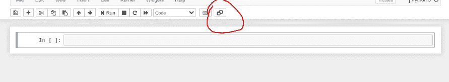

你可以用鼠标创建一个初始支线剧情:

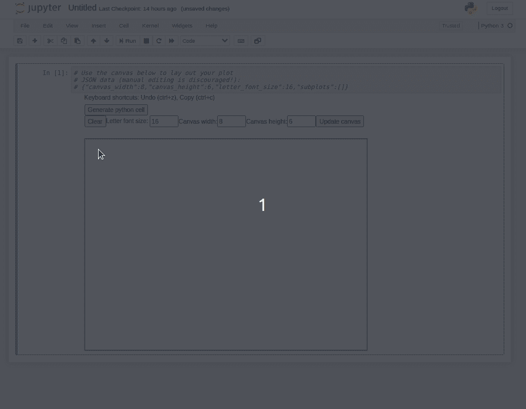

当你对你的布局感到满意时，点击“生成 python 单元”按钮，用等效的 python/matplotlib 代码创建一个单元。

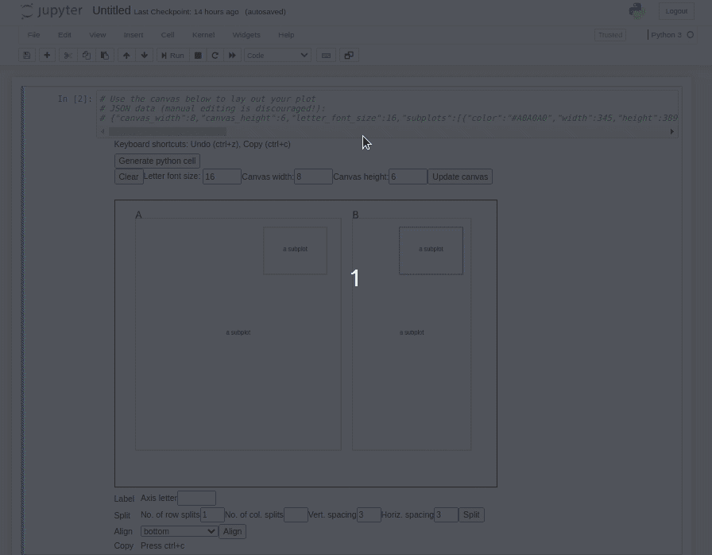

主要的挑战是在按下工具栏按钮时注入 HTML 画布，然后在布局就绪时自动创建 python 单元。一旦完成了这些，剩下的实现就和其他 javascript 项目一样了。

**实现**
`main.js`文件是大部分编码发生的地方。下面是空扩展的轮廓

```
define([
  'base/js/namespace',
  'base/js/events'
], function(Jupyter, events) {// add a button to the main toolbar
  var addButton = function() {
    Jupyter.toolbar.add_buttons_group([
      Jupyter.keyboard_manager.actions.register({
        'help': 'Add figure layout generator',
        'icon': 'fa-window-restore',
        'handler': inject_figure_widget
      }, 'add-default-cell', 'Default cell')
    ])
  } // This function is run when the notebook is first loaded
  function load_ipython_extension() {
    addButton();
  }
  return {
    load_ipython_extension: load_ipython_extension
  };
});
```

这个框架代码在笔记本加载时运行一个“启动”功能。这个“启动”函数创建了工具栏按钮，并注册了一个对工具栏按钮的回调。这个回调函数`inject_figure_widget`是扩展的“主”函数，它将把 HTML 画布注入到笔记本中。为了使`main.js`独立，您可以在主`function(Jupter, events)`中定义助手函数。

使用控制台和元素检查器，找出 JS/HTML 来将画布插入输出字段是一个反复试验的过程。大致的轮廓是:

```
// execute the current cell to generate the output field; otherwise it won't be created
Jupyter.notebook.select();
Jupyter.notebook.execute_cell();// get reference to the output area of the cell
var output_subarea = $("#notebook-container")
  .children('.selected')
  .children('.output_wrapper')
  .children('.output');// add to DOM
let div = document.createElement("div");
output_subarea[0].appendChild(div);
```

现在，小部件的 HTML 元素可以添加到`div`中，就像在任何 javascript 支持的网页中一样。然而，键盘输入元素需要一些特殊的处理。您会发现，如果您尝试在输入字段中键入数字，它会将您的单元格转换为 markdown 并消除输出字段。这是因为 Jupyter 笔记本的默认按键。修复方法是当您的一个文本字段成为焦点时禁用 Jupyter 的键盘管理器，当它退出焦点时重新启用:

```
function input_field_focus() {
 Jupyter.keyboard_manager.disable();
}function input_field_blur() {
 Jupyter.keyboard_manager.enable();
}
$("#subplot_letter_input").focus(input_field_focus).blur(input_field_blur);
```

**其他功能**
实现的小部件有许多其他功能，我不会描述它们的实现，因为它们都是相当标准的 javascript:

*   将情节分割成网格状支线情节
*   用鼠标调整支线剧情的大小
*   将所选地块的水平/垂直边缘与其他地块对齐
*   用鼠标移动支线剧情
*   通过键盘箭头移动支线剧情
*   复制/粘贴、撤消、删除
*   创建标签
*   代码生成
*   从笔记本中保存和重新加载

参见小工具的[自述文件](https://github.com/sgowda/jupyter-subplot-layout-widget)了解功能说明。

# 第 2 部分:编程调整大小

基于鼠标的布局工具(希望)是定义复杂支线剧情布局的更简单的方法。在 matplotlib 中布局具有多个子情节的图形的一个困难是，有时文本会在子情节之间重叠。Matplotlib 开始用[紧凑布局](https://matplotlib.org/tutorials/intermediate/tight_layout_guide.html)特性来处理这个问题，但是这个特性似乎与这里使用的定义子情节位置的一般方式不兼容；它旨在与基于网格的子图布局定义一起使用。

作为用户，我们希望

1.  以图形方式创建粗略的布局
2.  填写所有数据和标签
3.  调用一个例程来自动使所有东西“适合”可用空间。

第二步必须发生在一切都可以“适应”之前。这是因为很难事先考虑基于文本的元素的大小。您可以添加或省略文本标签，这会占用或释放空间。根据您的数据范围，刻度标签可能包含不同数量的字符，占据不同数量的画布区域。

使所有情节元素适合画布的一个非常简单的算法是

1.  计算所有子情节元素周围的边界框。
2.  对于每对图，根据边界框确定图是否重叠。
3.  如果有重叠，计算一个比例因子来减少最左边/最上面的图的宽度和高度。假设每个支线剧情的左上角都是锚定的。当应用该比例因子时，这对图应该没有重叠。(旁注:如果两个图重叠，假设为文本分配的区域为零，则不会调整它们的大小；假设重叠是有意的，例如对于插图)。
4.  全局应用最小的成对比例因子。

这绝不是最好的数据可视化算法，但它应该总是产生一个无重叠的图。这个算法在这个简单的 python [模块](https://github.com/sgowda/autodrag)中实现

## 轴边界框

在`maplotlib`中寻找各种元素的边界框需要一些反复试验。表示绘图元素的数据结构非常灵活，如果您不熟悉 API(我坚定地站在“不熟悉”的阵营)，这可能会使您很难弄清楚如何在画布上获得元素的大小。下面是一个简单的搜索，它遍历一个轴的所有子元素，并试图获得不同的识别元素的大小。我想不出比下面这个更统一的方法了。

```
def get_axis_bounds(fig, ax, scaled=False):
    children = ax.get_children()# initial est based on ax itself
    p0, p1 = ax.bbox.get_points()
    xmax, ymax = p1
    xmin, ymin = p0for child in children:
        if isinstance(child, matplotlib.axis.XAxis):
            text_obj = filter(lambda x: isinstance(x, matplotlib.text.Text), child.get_children())
            text_obj_y = [x.get_window_extent(renderer=fig.canvas.renderer).p0[1] for x in text_obj]
            ymin_label = np.min(text_obj_y)
            if ymin_label < ymin:
                ymin = ymin_label
        elif isinstance(child, matplotlib.axis.YAxis):
            text_obj = filter(lambda x: isinstance(x, matplotlib.text.Text), child.get_children())
            text_obj_x = [x.get_window_extent(renderer=fig.canvas.renderer).p0[0] for x in text_obj]
            xmin_label = np.min(text_obj_x)
            if xmin_label < xmin:
                xmin = xmin_label
        elif hasattr(child, 'get_window_extent'):
            bb = child.get_window_extent(renderer=fig.canvas.renderer)
            if xmax < bb.p1[0]:
                xmax = bb.p1[0]
            if xmin > bb.p0[0]:
                xmin = bb.p0[0]
            if ymin > bb.p0[1]:
                ymin = bb.p0[1]
            if ymax < bb.p1[1]:
                ymax = bb.p1[1]if scaled:
        rect_bounds = np.array([xmin, ymin, xmax, ymax])
        fig_size_x, fig_size_y = fig.get_size_inches() * fig.dpi
        rect_bounds /= np.array([fig_size_x, fig_size_y, fig_size_x, fig_size_y])
        return rect_bounds
    else:
        return np.array([xmin, ymin, xmax, ymax])
```

有一个小问题:这个方法要求`matplotlib`首先呈现人物画布。在这个渲染之前，`matplotlib`可能不会正确的通知你一个元素会占用多少空间。所以你必须在交互模式下使用`matplotlib`。如果您使用的是第 1 部分中的小部件，想必您已经处于 jupyter 环境中。如果你使用交互式的`%matplotlib notebook`风格的图形生成，这个问题应该不成问题。

获取绘图区域的边界要简单得多，因为这是指定在哪里绘制轴的方法。信息存储在轴的`bbox`属性中。

```
fig_size_x, fig_size_y = fig.get_size_inches() * fig.dpi
plot_bounds = ax.bbox.get_points() / np.array([fig_size_x, fig_size_y])
```

一旦知道了轴边界和绘图边界，就可以计算每一边包含文本元素的边界的大小。边框的大小是固定的(除非文本发生变化)，因此计算绘图上的重定比例因子的算法是简单地按边框文本所占的分数将其缩小

## 调整大小示例

下面是几个自动缩放图的例子，以适应文本占用的错误空间。

*轴水平延伸过远*
前:

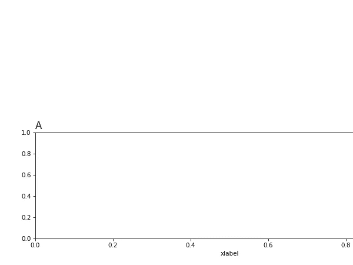

之后:

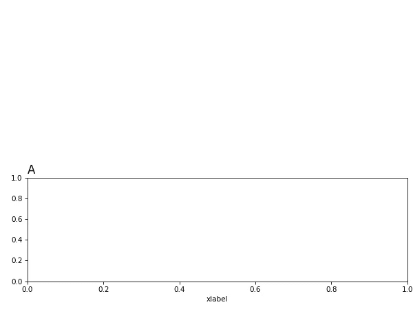

*轴垂直延伸过远*前
:

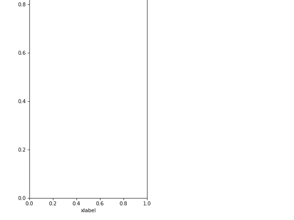

之后:

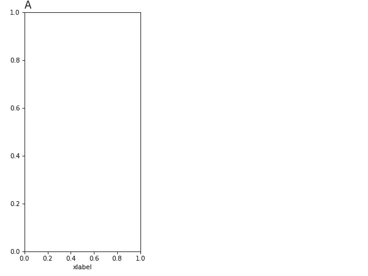

*轴水平重叠*前
:

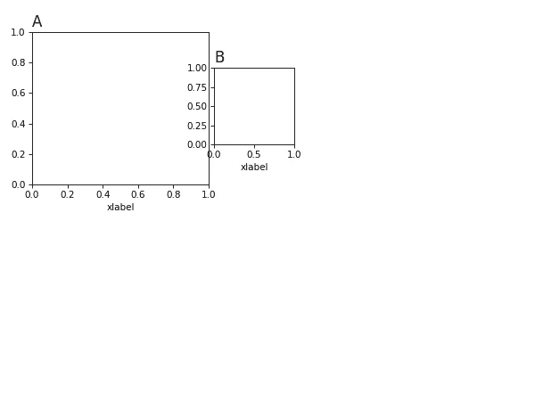

之后:

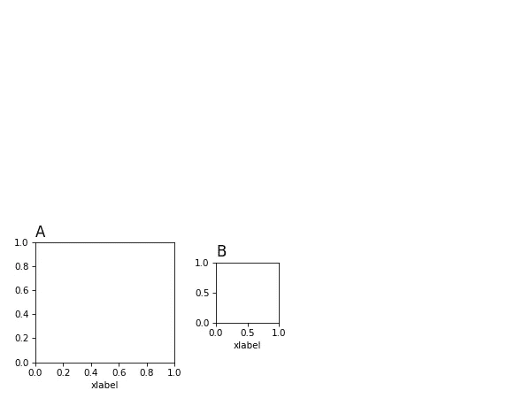

*轴垂直重叠*前
:

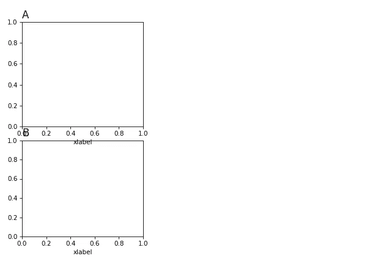

之后:

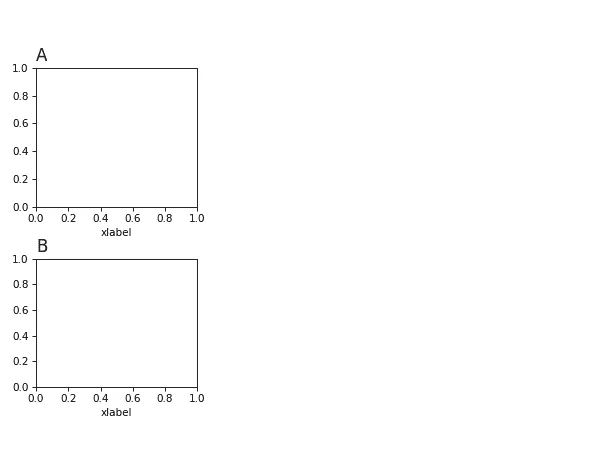

# 结论

总的来说，这种方法可能会使研究人员在发布时可能面临的一些更繁琐的数据可视化任务自动化。从算法上处理布局问题可能有助于开发更复杂的算法，使图形的布局更加自然可读。