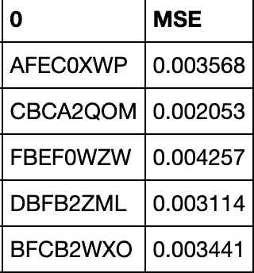
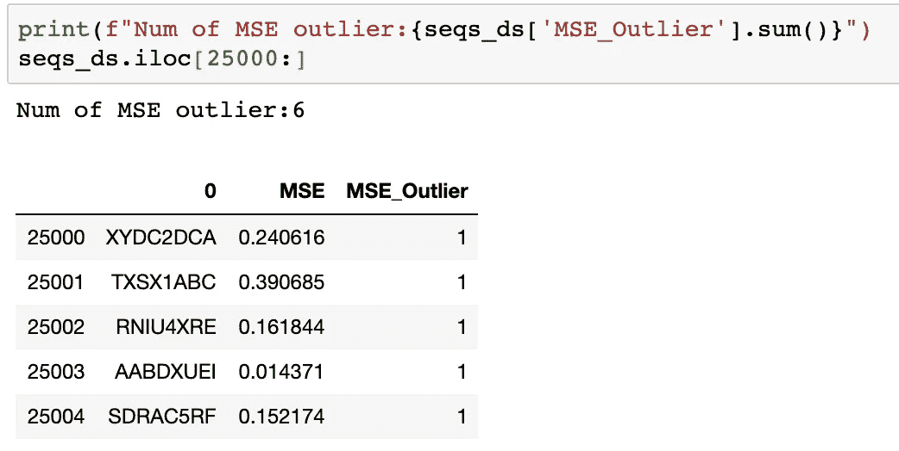

# 基于 Keras 的序列异常检测自动编码器

> 原文：<https://towardsdatascience.com/a-keras-based-autoencoder-for-anomaly-detection-in-sequences-75337eaed0e5?source=collection_archive---------4----------------------->

## 使用 Keras 开发一个健壮的神经网络结构，可以用来有效地识别序列中的异常


马库斯·斯皮斯克在 [Unsplash](https://unsplash.com?utm_source=medium&utm_medium=referral) 上的照片

假设您有一个很长的字符串序列列表，例如氨基酸结构列表(' PHE-SER-CYS '，' GLN-ARG-SER '，…)，产品序列号列表(' AB121E '，' AB323 '，' DN176'…)，或者用户 uid，您需要创建某种验证过程来检测这个序列中的异常。异常可能是一个与其他字符串格式稍有不同或不寻常的字符串(无论是错误创建的还是故意创建的)，或者只是一个极其罕见的字符串。更有趣的是，假设您不知道序列应该遵循的正确格式或结构是什么。

这是一个相对常见的问题(尽管不常见)，许多数据科学家通常使用流行的无监督 ML 算法来解决，如 DBScan、Isolation Forest 等。这些算法中的许多通常通过挑选出相对远离其他数据点或大多数数据点所在区域的数据点，在发现异常或异常值方面做得很好。虽然自动编码器也因其异常检测能力而闻名，但它们的工作方式非常不同，在遇到这类问题时不太常见。


照片由[米卡·鲍梅斯特](https://unsplash.com/@mbaumi?utm_source=medium&utm_medium=referral)在 [Unsplash](https://unsplash.com?utm_source=medium&utm_medium=referral) 上拍摄

我将把什么是自动编码器的解释留给许多有见地的、写得很好的帖子和在线免费提供的文章。非常简单地说(如果这对你没有意义，请继续读下去)，就像其他类型的 ML 算法一样，自动编码器通过创建不同的数据表示并通过测量这些表示在生成预期结果方面的表现来学习；就像其他类型的神经网络一样，自动编码器通过创建这种表示的不同*层*来学习，这使它们能够学习更复杂和复杂的数据表示(在我看来，这正是它们在像我们这样的任务中更胜一筹的原因)。然而，自动编码器是一种特殊形式的神经网络，因为它们试图生成的输出是它们接收到的输入的的*重构。自动编码器从输入数据(即一组数字)开始，然后使用一组数学运算以不同的方式对其进行转换，直到它学习到应该使用的参数，以便重建相同的数据(或非常接近该数据)。在这个学习过程中，自动编码器本质上学习输入数据的格式规则。这正是它在我们这样的环境中作为异常检测机制表现出色的原因。*

使用自动编码器检测异常通常包括两个主要步骤:

首先，我们将数据输入自动编码器，并对其进行调整，直到它经过良好的训练，能够以最小的误差重建预期的输出。例如，如果我们认为重建的输出足够接近输入，并且如果自动编码器能够以这种方式成功地重建大部分数据，那么接收类似 10，5，100 的输入并返回 11，5，99 的自动编码器就是训练有素的。

第二，我们再次将所有数据馈送给我们训练过的自动编码器，并测量每个重构数据点的*误差项*。换句话说，我们测量*重建的*数据点离*实际的*数据点有多远。一个训练有素的自动编码器本质上学习如何重构遵循特定格式的输入，因此，如果我们给一个训练有素的自动编码器一个糟糕的数据点，那么我们很可能会得到与我们的输入完全不同的东西，以及一个大的误差项。

## 是时候写点代码了

让我们进入细节。不过，我应该强调，这只是使用自动编码器完成这项任务的一种方式。还有其他方法和技术来构建自动编码器，您应该进行试验，直到找到适合您项目的架构。

这些是我将要遵循的步骤:

1.  生成一组遵循指定格式的随机字符串序列，并添加一些异常。
2.  将这些序列编码成数字并进行缩放。
3.  设计、安装和调整自动编码器。
4.  将序列输入到经过训练的自动编码器，并计算每个数据点的误差项。
5.  通过找到具有最高误差项的数据点来找到异常。
6.  **生成一长串字符串。**

首先，我们将编写一个函数来创建以下格式的字符串:CEBF0ZPQ ([4 个字母 A-F][1 个数字 0–2][3 个字母 QWOPZXML])，并生成这种格式的 25K 个序列。

字符串生成

2.**将字符串序列编码成数字并缩放**

现在我们有一个如下形状的数组，因为每个字符串序列有 8 个字符，每个字符编码为一个数字，我们将把它作为一个列。

```
encoded_seqs.shape
#(25005,8)
```

最后，在将数据输入 autoencoder 之前，我将使用 MinMaxScaler 对数据进行缩放，并将其分成训练集和测试集。适当的缩放通常可以显著提高神经网络的性能，因此尝试多种方法非常重要。

**3。设计、安装和调整自动编码器。**

如前所述，设计自动编码器的方法不止一种。它通常基于用较大的层包裹的小的隐藏层(这就是产生编码-解码效果的原因)。我进行了几次调优，以确定这里使用的最佳参数，因为不同种类的数据通常会产生非常不同的最佳性能参数。

事实上，我们的自动编码器似乎表现得非常好，因为它能够最大限度地减少误差项(或损失函数),令人印象深刻。


**4。计算误差，找出异常！**

现在，我们再次将数据作为一个整体馈送给自动编码器，并检查每个样本的误差项。回想一下 *seqs_ds* 是一个 pandas 数据帧，它保存实际的字符串序列。第 2 行对每个字符串进行编码，第 4 行对其进行缩放。然后，我使用 predict()方法获得存储在 seqs_ds 中的字符串的重构输入。最后，通过计算输入数据点(或实际数据点)与自动编码器重建的输出之间的“距离”,我得到了每个数据点的误差项:

```
mse = np.mean(np.power(actual_data - reconstructed_data, 2), axis=1)
```

在我们将误差项存储在数据帧中之后，我们可以看到每个输入数据由我们的自动编码器构造得有多好。



**我们如何发现异常？**

嗯，我们需要做的第一件事是决定什么是我们的阈值，这通常取决于我们的数据和领域知识。例如，有些人会说异常是一个数据点，它的误差项高于我们数据的 95%。如果我们预计有 5%的数据是异常的，这将是一个合适的阈值。但是，回想一下，我们向 25，000 个完全格式化的序列列表中注入了 5 个异常，这意味着只有 0.02%的数据是异常的，因此我们希望将阈值设置为高于 99.98%的数据(或 0.9998 百分点)。首先让我们找到这个门槛:


接下来，我将向数据集添加一个 MSE_Outlier 列，并在误差项超过这个阈值时将其设置为 1。


现在我们要做的就是检查我们有多少异常值，以及这些异常值是否是我们在数据中注入和混合的

```
['XYDC2DCA', 'TXSX1ABC','RNIU4XRE','AABDXUEI','SDRAC5RF']
```

所以让我们看看我们有多少异常值，它们是否是我们注入的异常值。



还有…瞧啊。我们发现了 6 个异常值，其中 5 个是“真正的”异常值。

看起来像魔术哈？

git 上的源代码可用