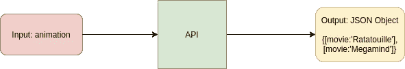
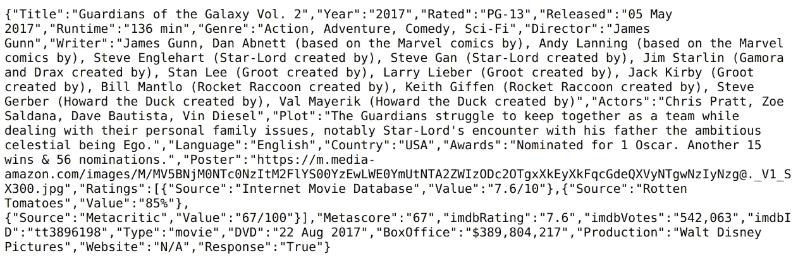
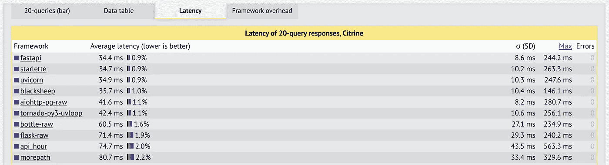
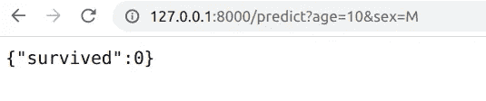
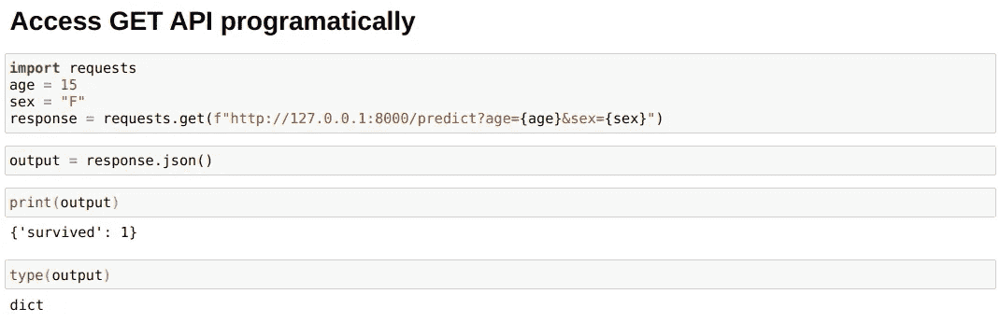
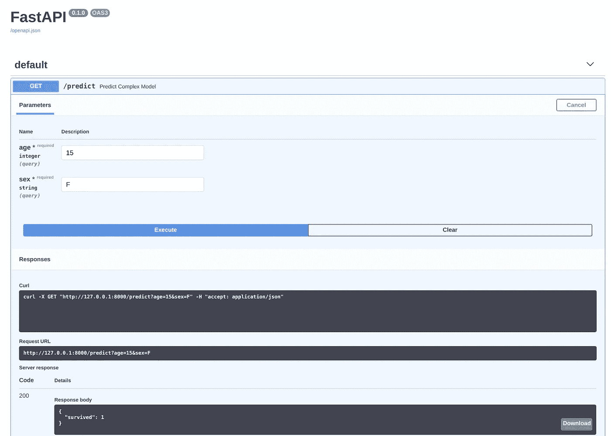
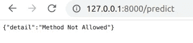
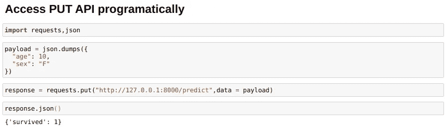
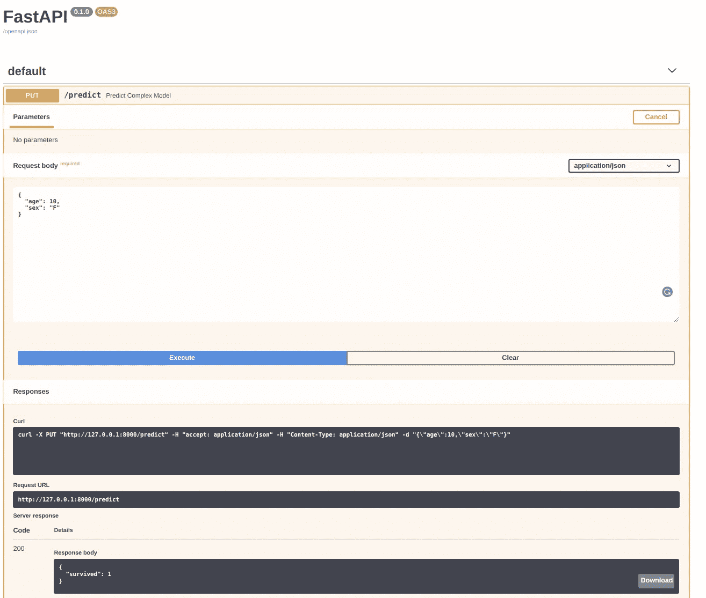

# 数据科学家在几分钟内创建 API 的外行指南

> 原文：<https://towardsdatascience.com/a-layman-guide-for-data-scientists-to-create-apis-in-minutes-31e6f451cd2f?source=collection_archive---------9----------------------->


图片由[转化为图形](https://pixabay.com/users/intographics-2633886/?utm_source=link-attribution&utm_medium=referral&utm_campaign=image&utm_content=1690452)来自 [Pixabay](https://pixabay.com/?utm_source=link-attribution&utm_medium=referral&utm_campaign=image&utm_content=1690452)

## API 创建变得简单了

您是否曾经遇到过这样的情况:您希望将您的模型预测提供给前端开发人员，而他们却无法访问与模型相关的代码？或者有没有开发人员要求您创建一个他们可以使用的 API？我已经面对过很多次了。

随着数据科学和 Web 开发人员试图合作，API 成为使代码和技能更加模块化的难题的重要部分。事实上，同样地，不能指望数据科学家对 Javascript 或 nodeJS 了解很多，前端开发人员应该能够在不了解任何数据科学语言的情况下应付过去。API 在这个抽象中扮演了相当重要的角色。

但是，API 令人困惑。我自己在创建它们并与我的开发团队分享它们时也感到很困惑，我的开发团队使用他们的 API 术语，如 GET request、PUT request、endpoint、Payloads 等。

***这篇文章将会简化和理解 API 是如何工作的，解释上面的一些术语，并使用优秀的 API 构建框架 FastAPI 创建一个 API，这使得创建 API 变得轻而易举。***

# 什么是 API？

在我们继续深入之前，我们需要理解什么是 API。根据维基百科:

> 一个**应用编程接口** ( **API** )是一个[计算接口](https://en.wikipedia.org/wiki/Interface_(computing))，它定义了多个软件中介之间的交互。它定义了可以进行的调用或请求的种类、如何进行、应该使用的数据格式、应该遵循的约定等等。

*我喜欢理解 API 的方式是它是一个“在线函数”，一个我可以在线调用的函数。*

例如:

我可以有一个电影 API，当我将“动画”类型作为输入时，它会返回戏剧电影的名称。



使用这种机制的好处是，API 用户不必访问整个数据集或源代码，但他们可以获得他们需要的所有信息。 *这是互联网上有多少服务像* [*亚马逊 Rekognition*](https://aws.amazon.com/rekognition/) *，是一个图像和视频 API，或者* [*谷歌自然语言 API*](https://cloud.google.com/natural-language/pricing) *，是一个 NLP API 作品。它们让我们可以使用一些很棒的功能，却不让我们拥有源代码，而源代码通常是很有价值的，而且是隐藏的。例如，我可以将一张图像发送到亚马逊 Rekognition API，它可以为我提供人脸检测和分析。*


[来源](https://aws.amazon.com/rekognition/?blog-cards.sort-by=item.additionalFields.createdDate&blog-cards.sort-order=desc)

例如，这里有一个由 Open Movie DB 提供的免费 API，它允许我们使用参数搜索电影:

```
[http://www.omdbapi.com/?i=tt3896198&apikey=9ea43e94](http://www.omdbapi.com/?i=tt3896198&apikey=9ea43e94)
```

这里我为电影《银河护卫队 2》提供了 IMDB id，使用了 API 的参数`i`。如果您在浏览器中打开此链接，您将看到电影的所有信息，如打开的电影数据库所示



来自 OMDB 的输出

但在我们继续之前，让我们先了解一些术语:

*   **端点:**以上 API 调用中，端点为:`http://www.omdbapi.com/`。简单地说，这就是函数代码运行的位置。
*   API 访问键:大多数公共 API 都会有一些访问键，你可以请求。对于 OMDB API，我必须注册并获得 API 密钥`[9ea43e94](http://www.omdbapi.com/?i=tt3896198&apikey=9ea43e94)`。
*   `**?**` **操作符:**该操作符用于指定我们想要发送给 API 或我们的“在线函数”的参数这里我们给 API 两个参数，即 IMDB 电影 ID 和使用`?`操作符的 API 访问密钥。由于有多个输入，我们也使用`&`操作符。

# 为什么选择 FastAPI？

*“如果你想学习一个构建 REST APIs 的现代框架，那么试试 FastAPI 吧……它快速、易用、易学……*”—[空间](https://spacy.io/)创造者

虽然 Python 有许多构建 API 的框架，最常见的是 Flask 和 Tornado，但 FastAPI 在易用性方面比可用的替代方案好得多，因为与 Flask 相比，它似乎更 Python 化。

还有，FastAPI 很快。正如 Github 文档所说， ***“非常高的性能，与 NodeJS 和 Go 不相上下。”*** *我们也可以为自己检查延迟* [*基准*](https://www.techempower.com/benchmarks/#section=test&runid=7464e520-0dc2-473d-bd34-dbdfd7e85911&hw=ph&test=query&l=z8kflr-v&a=2) *。*



[来源](https://www.techempower.com/benchmarks/#section=test&runid=7464e520-0dc2-473d-bd34-dbdfd7e85911&hw=ph&test=query&l=z8kflr-v&a=23)

与 Flask 相比，速度提高了大约 2 倍，而且没有太多代码更改。当构建一个可以服务数百万客户的 API 时，这意味着一笔巨大的交易，因为它可以减少生产工作，还可以使用更便宜的硬件来服务。

比较和讨论到此为止，让我们尝试使用 FastAPI 来创建我们的 API。

# 如何用 FastAPI 写一个 API？

数据科学最常见的用例之一是如何创建一个 API 来获得模型的预测？让我们假设我们有一个巨大的生存模型来预测一个人是否能生存。并且，它需要一个人的`age`和`sex`作为输入参数来预测。我们将使用 FastAPI 以两种方式创建这个 API:GET 和 PUT。不用担心；我会边走边解释。

**什么是 GET？—** 在 GET 请求中，我们通常尝试使用嵌入查询字符串本身的查询参数来检索数据。例如，在 OMDB API 中，我们使用 GET 请求来指定电影 id 和访问键，作为查询本身的一部分。

**放的是什么？—**GET 请求的另一种选择是 PUT 请求，我们使用有效载荷发送参数，正如我们将在第二个方法中看到的。有效负载不是查询字符串的一部分，因此 PUT 更安全。看到第二部就更清楚了。

但是在我们继续之前，我们需要安装 FastAPI 和`uvicorn` ASGI 服务器:

```
pip install fastapi
pip install uvicorn
```

## 1.那位挨道:

为我们的 titanic 模型用例编写 GET API 的一个简单的 FastAPI 方法如下:

```
from fastapi import FastAPIapp = FastAPI()@app.get("/predict")
def predict_complex_model(age: int,sex:str):
    # Assume a big and complex model here. For this test I am using a simple rule based model
    if age<10 or sex=='F':
        return {'survived':1}
    else:
        return {'survived':0}
```

将上面的代码保存在一个名为`fastapiapp.py`的文件中，然后您可以在终端上使用下面的命令运行它。

```
$ uvicorn fastapiapp:app --reload
```

以上意味着您的 API 现在正在您的服务器上运行，`--reload`标志表示当您更改`fastapiapp.py`文件时，API 会自动更新。这在开发和测试时非常有帮助，但是在将 API 投入生产时，您应该移除这个`--reload`标志。现在，您可以在浏览器中访问以下路径，您将获得预测结果:

```
[http://127.0.0.1:8000/predict?age=10&sex=M](http://127.0.0.1:8000/predict?age=10&sex=M)
```



当您在浏览器中点击该命令时，它调用`[http://127.0.0.1:8000/](http://127.0.0.1:8000/predict?age=10&sex=M)predict`端点，而端点又调用带有参数`age=10 and sex='M'`的关联方法`predict_complex_model`

因此，它允许我们从浏览器使用我们的功能，但这仍然不是很有帮助。你的开发者朋友需要使用你的 predict 函数在前端网站上显示输出。你如何让他使用这个功能？

这很简单。例如，如果你的开发者朋友也使用 Python，他可以像下面这样使用`requests`模块:

```
import requestsage = 15
sex = "F"response = requests.get(f"[http://127.0.0.1:8000/predict?age={age}&sex={](http://127.0.0.1:8000/predict?age=10&sex=M)sex}")
output = response.json()
```



因此，我们可以将正在运行的 API(在服务器上)的输出放到我们的 Python 程序中。Javascript 用户将使用 Javascript 请求库，nodeJS 开发人员将在 nodeJS 中使用类似的东西来做这件事。我们只需要向他们提供所需的端点和参数。

要测试您的 API，您也可以访问:

```
[http://127.0.0.1:8000/docs](http://127.0.0.1:8000/docs)
```

在这里您可以找到一种测试 API 的 GUI 方式。



但是正如我们前面所说的，**这是不安全的**，因为 GET 参数是通过 URL 传递的。这意味着参数存储在服务器日志和浏览器历史中。这不是有意的。此外，这个玩具示例只有两个输入参数，所以我们可以这样做，考虑一下我们需要为预测函数提供许多参数的情况。

在这种情况下或者我敢说在大多数情况下，我们使用 PUT API。

## 2.推杆方式

使用 PUT API，我们可以通过向函数提供有效负载来调用任何函数。有效负载不过是一个输入参数的 JSON 字典，不会附加到查询字符串中，因此比 get 安全得多。

这是一个最小的例子，我们用 PUT 做同样的事情。我们只是将`fastapiapp.py`的内容改为:

```
from fastapi import FastAPI
from pydantic import BaseModelclass Input(BaseModel):
    age : int
    sex : strapp = FastAPI()[@app](http://twitter.com/app).put("/predict")
def predict_complex_model(d:Input):
    if d.age<10 or d.sex=='F':
        return {'survived':1}
    else:
        return {'survived':0}
```

注意，我们在这里用`app.put`代替前面的`app.get`。我们还需要提供一个新的类`Input`，它使用一个名为`pydantic`的库来验证我们将从 API 最终用户那里获得的输入数据类型，而之前在 get 中，我们使用函数参数列表来验证输入。此外，这一次您将无法使用网络上的 URL 查看您的内容。例如，使用浏览器指向端点位置给出:



因此，我们可以再次使用 Python 中使用请求的编程方式进行检查:

```
import requests,json
payload = json.dumps({
  "age": 10,
  "sex": "F"
})
response = requests.put("[http://127.0.0.1:8000/predict](http://127.0.0.1:8000/predict)",data = payload)
response.json()
```



注意，我们在这里使用了`requests.put`，我们使用`requests.put`函数中的数据参数提供了有效载荷，我们还使用了`json`库将有效载荷从 dict 对象转换为 JSON。

我们也可以像以前一样使用 GUI 方式:

```
[http://127.0.0.1:8000/docs](http://127.0.0.1:8000/docs)
```



我们已经完成了 API 的创建。换换口味很简单。

FastAPI 使得 API 创建变得更加直观、简单和快速，而 API 创建曾经是数据科学过程中令人恐惧的部分之一。

你可以在我的 [GitHub](https://github.com/MLWhiz/data_science_blogs/tree/master/fastapi) 库找到这篇文章的代码以及我所有的文章。

还有很多人在评论“ ***中问我，如何在 ec2 上部署 FastAPI API，如何使用图像数据而不是简单的字符串、整数和浮点数作为 API 的输入？”，*** 我写了这个帖子的继任者。如果你觉得有趣的话，一定要看一看，

[](/deployment-could-be-easy-a-data-scientists-guide-to-deploy-an-image-detection-fastapi-api-using-329cdd80400) [## 部署可能很容易—数据科学家指南使用…部署图像检测 FastAPI API

### 使用亚马逊 EC2+Pytorch+Fastapi 和 Docker

towardsdatascience.com](/deployment-could-be-easy-a-data-scientists-guide-to-deploy-an-image-detection-fastapi-api-using-329cdd80400) 

# 继续学习

如果你想了解更多关于构建机器学习模型并将其投入生产的知识，这个关于 AWS 实现机器学习应用的[课程正好可以满足你的要求。](https://coursera.pxf.io/NKERRq)

谢谢你的阅读。将来我也会写更多初学者友好的帖子。在[媒体](https://medium.com/@rahul_agarwal?source=post_page---------------------------)上关注我或者订阅我的[博客](http://eepurl.com/dbQnuX?source=post_page---------------------------)来了解他们。一如既往，我欢迎反馈和建设性的批评，可以通过 Twitter [@mlwhiz](https://twitter.com/MLWhiz?source=post_page---------------------------) 联系到我

此外，一个小小的免责声明——这篇文章中可能会有一些相关资源的附属链接，因为分享知识从来都不是一个坏主意。