# 深度 Q 学习的门外汉衍生|强化学习

> 原文：<https://towardsdatascience.com/a-laymans-derivative-on-deep-q-learning-reinforcement-learning-5e79506a7020?source=collection_archive---------63----------------------->

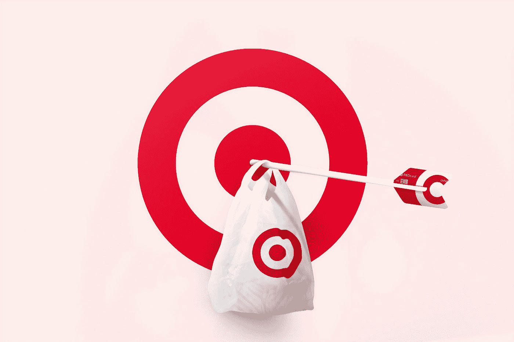

照片由[晨酿](https://unsplash.com/@morningbrew?utm_source=medium&utm_medium=referral)在 [Unsplash](https://unsplash.com?utm_source=medium&utm_medium=referral) 拍摄

本文试图建立深 Q 网络背后的直觉。在我们开始之前，让我们花一些时间来理解什么是 Q 学习。太长了，一定要读！

简单来说， **Q 学习**是一种**无模型**强化学习方法，使智能体能够在环境中采取行动或导航，并达到其目标。无模型并不意味着没有任何网络来训练代理(像在 Deep Q 网络中使用的那样)，而是没有能够理解环境并预测下一个状态或回报的模型。在像这样的无模型学习中，代理主要依赖于过去对变迁的记忆(在状态 *s* 给出一些奖励 *r* 时采取的动作 *a* 来训练网络。这组转换也被称为**动作重放**或**重放缓冲器**。

给定一个状态，奖励或惩罚由环境在每一步安排。当然，达到目标会得到更高的回报。

当谈到现实生活中的用例时，环境会变得复杂，有多个动作空间。我们将在这里使用一个简单的基于网格的例子，只有 4 个动作:*左，上，右，下*

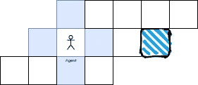

基于网格的环境示例(图片由作者提供)

突出显示的框是代理的目的地。在给定的情况下，没有奖励或惩罚，代理很容易到达目的地。一个喜欢解谜的孩子可能会这样画:

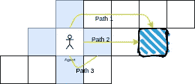

多重解决方案(图片由作者提供)

## 计划

现在让我们制作一个更有趣的网格。代理商达到目标后将获得 **1** 的奖励，但每走一步将被罚款 **-0.5** (活罚)。聪明的孩子选择了最小的路。他的回答大概是这样的:

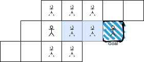

(图片由作者提供)

虽然孩子很容易找到最佳路径，但这里的代理必须从目标开始追踪路径。以蓝色突出显示的路径是给定状态(起始位置)的最佳路径。对于每个状态，一个由最优路径(如路径 2)组成的**行动计划**可以通过奖惩系统来确定。

> 路径 1 的开销= 4 * -0.5 + 1 = -1
> 路径 2 的开销= 2* -0.5 + 1 = 0
> 路径 3 的开销= 4 * -0.5 + 1 = -1

在这种情况下，代理的行为是确定的。当一个代理人决定向右走，代理人就迈出正确的一步。现在你会想，当代理已经决定向右时，它怎么会向下呢？想象一个机器人在沙地上行驶。当它决定右转 20 度时，它无法克服沙子的阻力，一直往前走。还有其他环境条件会影响行动。这就是行动变得**不确定** **的地方。**让我们坚持这个想法，稍后我们将回到这个话题。

## 贝尔曼方程

这与我们的谜题略有不同，但我们最终会将它连接回来，这一部分将帮助我们理解为什么这个等式很重要，并且是许多强化学习方法的基础。

还记得我们讨论过的**重放缓冲器**吗？它存储所有状态转换和代理采取的动作。让我们找出代理成功到达目标的路径，*路径 3* 。现在，我们开始追溯它的路径，并确保我们在返回起点的路上留下了面包屑。代理知道当它从倒数第二个州拿了权时，它得到了奖励 1。

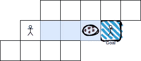

回来的路上的面包屑(作者图片)

同样地，追根溯源。

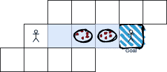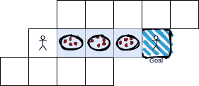

这是代理看到的内容(图片由作者提供)

现在，我们清楚地知道从这个特定的起点该走哪条路。跟着面包屑走就行了。这个聪明的孩子给我画了另一个谜题:这个怎么样？

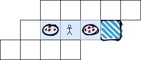

聪明的孩子:1，特工:0(图片由作者提供)

现在，我们必须确保面包屑以这样一种方式放置，即面包屑有梯度，代理可以跟随它们。这就是贝尔曼方程的由来。

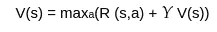

贝尔曼方程

> γ:贴现因子
> R:每采取一步的奖励
> s:状态
> V:状态的值
> Y:γ或贴现因子，< 1

将该方程扩展到下面的状态 S0

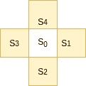

州(图片由作者提供)

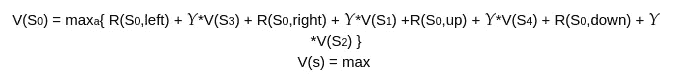

S0 的最大值

## 马尔可夫决策过程

虽然这是在确定性空间中发生的事情，但在非确定性的情况下，每个动作都有可能导致期望的状态。贝尔曼方程现在

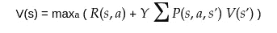

> P(s，a，s’)基本上是从状态 **s** 完成预定动作 **a** 并到达新状态 **s** 的概率。假设当代理人试图上升时，上升的概率是 0.5，下降的概率是 0.2，向右上升的概率是 0.2，向左上升的概率是 0.1。这个等式基于马尔可夫性质，即当前状态足以让代理决定未来的行动。
> 1)到目前为止，不依赖于历史动作/状态。
> 2)通过执行一个动作从一个状态到另一个状态的转换可能并不总是具有相同的结果。因此，对于每个(s，a)或状态-动作转换，都有一个与之相关的概率。

所以 action = top 的第二项看起来会是:
*Gamma *(0.5 * V(s _ up)+0.2 * V(s _ down)+0.2 *(s _ right)+0.1 *(s _ left))*

现在让我们来计算面包屑的外观。为了简单起见，让我们假设目标的奖励= 1。活罚= 0。

> 对于倒数第二个状态，
> 终态值:V(s _ pre _ final)= R+Y * V(s _ final)
> V(s _ pre _ final)= 1，我们这里有一个大面包屑
> V(s _ left _ pre _ final)= R+Y * V(s _ pre _ final)= 0+Y = Y，面包屑减少到 1 的 Y%
> V(s _ left _ pre _ final)= R+Y * V(s _ left _ pre _ pre

假设 Y = 0.7，那么面包屑将是 0.49，0.7，1

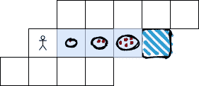

应用贝尔曼方程后的路径(图片由作者提供)

现在，代理更容易按顺序跟踪更大的面包屑。

## q 学习:

状态的 V(s)或值基本上表示一个状态有多好。为了解决这个难题，Q 函数很有帮助。这基本上意味着给定一个状态，这个动作有多好。q 可以被认为是一个动作的质量。

由于状态的值将依赖于给出最大值的动作，所以状态 s’的值函数:

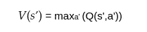

价值-质量关系

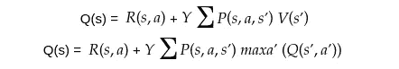

只有 Qs 形式的 q 学习方程

使用这些等式，可以创建一个 Q 表来确定实现目标的最佳路径或行动顺序。

## 深度 Q 学习:

与 Q 学习相反，我们不使用表格，而是依靠深度学习网络。这个网络或深度 Q 网络将帮助代理在给定状态下决定最佳行动。

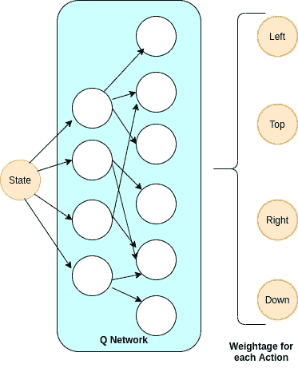

带有密集图层的 DQN 样本(图片由作者提供)

这里，我们将状态值传递给网络，让它决定动作空间中每个动作的值。这种网络的工作方式与任何深度神经网络非常相似——最小化损失并更新权重，直到它们达到最优。现在你可能想知道我们从哪里获得这个网络的数据——这就是**重放缓冲器**开始工作的地方。

好像理论很多啊！如果你有兴趣 [**使用深度 Q 网络**](https://medium.com/@anurag2das/reinforcement-learning-train-your-own-agent-using-deep-q-networks-9b2c02528596) 培训你自己的代理。

本文试图在贝尔曼方程和 Q 学习背后建立一种直觉。我们将在下一篇文章中尝试揭示 Q 学习、时间差异、计划与政策的细节。

> 参考文献
> [贝尔曼方程解释](https://www.youtube.com/watch?v=14BfO5lMiuk)