# 使用 Keras 在 R 中构建第一个图像分类模型的外行指南

> 原文：<https://towardsdatascience.com/a-laymans-guide-to-building-your-first-image-classification-model-in-r-using-keras-b285deac6572?source=collection_archive---------21----------------------->

## 动手香草建模第一部分

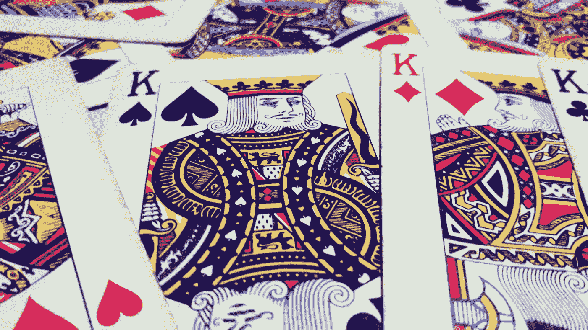

作者图片

机器学习的应用现在几乎是我们日常生活中不可或缺的一部分。从智能手机中基于语音识别的虚拟助理到超级智能的自动化无人机，人工智能和人工智能(AI)正在彻底改变人机交互的动态。人工智能算法，特别是卷积神经网络(CNN)使得计算机视觉比以往任何时候都更加强大。虽然它的应用程序令人惊叹，但构建自己的 CNN 模型可能会非常令人生畏，特别是对于非程序员或数据科学初学者来说。作为一个 R 爱好者，我不难断言，对于一个 R 程序员新手来说，它变得更加神秘。这种不平衡的合理原因可能是，标准神经网络和 ML 库(如 Keras 和 Tensorflow)主要与 Python 兼容，并自然地吸引大众使用 Python 本身，导致严重缺乏新手指南和文档来帮助在 r 中实现这些复杂的框架。在本文中，我们将使用 Keras 和 Tensorflow 框架在 R 中制作一个基于 CNN 的普通图像分类模型。通过这篇文章，我的目标是使您能够使用 Keras 在 R 中概念化和构建自己的 CNN 模型，并通过亲自动手编码来帮助增强您的信心，以便在将来使用这个深奥的 API 构建更复杂的模型。除了模型的脚本之外，我还将尽量简明地阐述必要的组件，同时深入核心的底层数学。现在我们开始吧。

## 卷积神经网络(CNN)快速介绍。

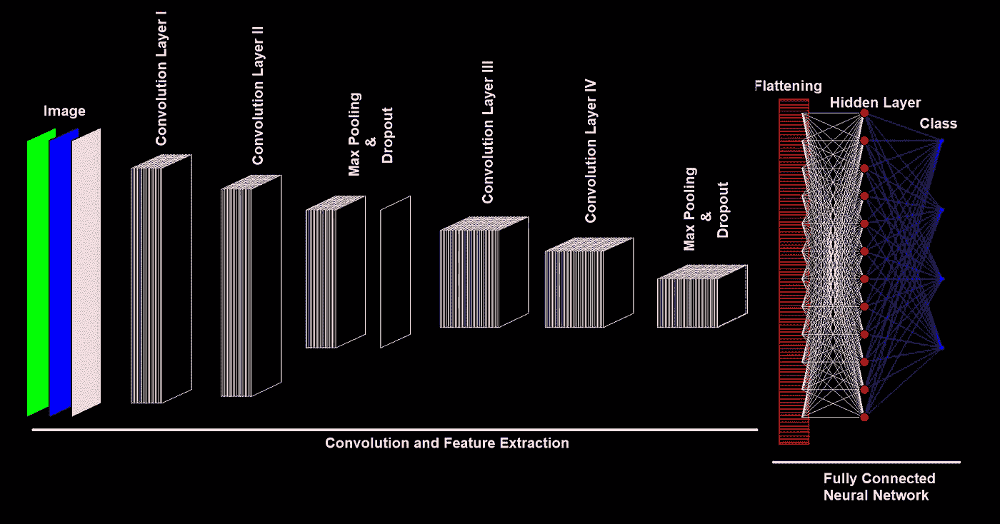

图一。卷积神经网络架构(*图片作者*

作为 CNN 脚本的前奏，让我们简单了解一下它的形式主义。就像人眼只在有限的接收框架中记录信息，并学习特定的模式和空间特征，随后触发特定的神经反应一样，CNN 模型也以相同的方式运行。我们将尝试探索 CNN 架构并理解其关键组件(图 1)。

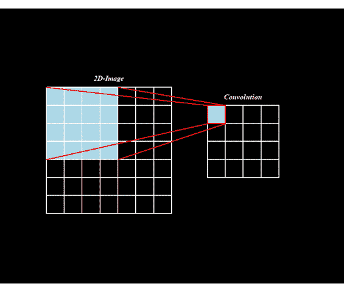

图二。可视化卷积(作者的*图像)*

不是一次合并整个图像像素，而是将一个像素子集卷积成一个数据*图 2* 。卷积是通过在整个图像上滑动一个较小尺寸的帧来实现的，该帧充当考虑了时间-空间特征的感受域。这个帧被称为**内核/过滤器**。想象一下用手电筒扫描一面建筑墙，过滤器以同样的方式工作。现在，如果您有多种过滤器，您可能会提取或观察到更具鉴别性的空间要素和经常重复出现的相邻值。该方案通过不仅以最少的信息损失保持空间特征，而且显著地减少所需的权重数量来增强学习，使得图像分类实际上可行并且可扩展。例如，考虑一幅 2D 黑白(b & w)图像作为 CNN 的输入。该模型通过使用**滤波器**开始卷积图像，然后以给定的步长滑过图像，也称为**步长**。滤波器值类似于神经网络中的权重。在一个实例中，这些滤波器值和图像的前景像素值的线性组合生成单个**特征输出**。生成的一组这些值产生一个新层，称为**特征图**。直观地说，特征图是输入图像的浓缩形式，它将所有主要特征和模式保留在较小的维度中，以便有效学习。

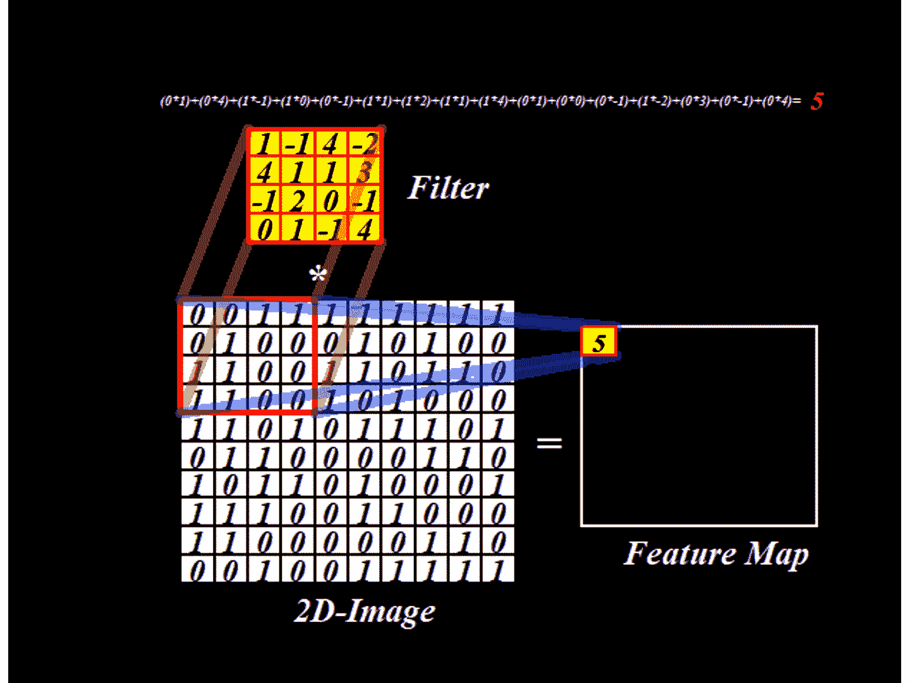

图 3。卷积方案(*图片作者*

为了说明这一点，在图 3 中，在尺寸为 10X10 的黑白图像上使用了尺寸为 4x4 的滤波器。滤镜以 1 个单位的步幅在图像上滑动，从而生成一个维度为(10–4+1)X(10–4+1)的回旋层，即 7X7。注意，本例中的偏差/截距假定为 0。类似地， *n* 个滤波器将生成 *n* 个特征图。

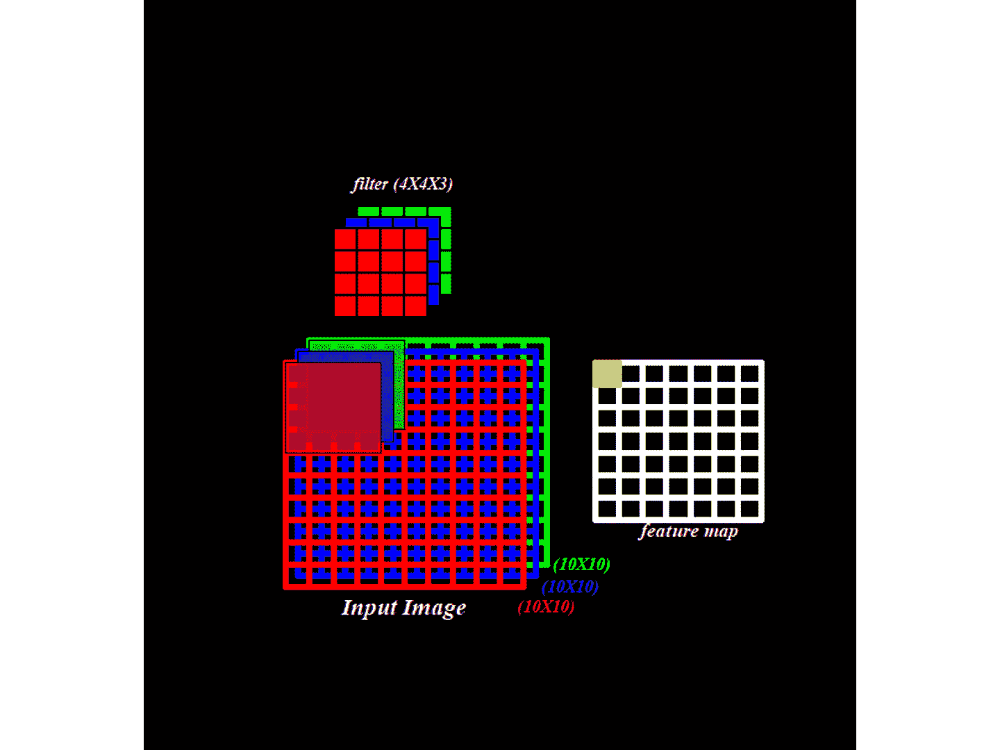

图 3。彩色图像的卷积(作者的*图像)*

对于黑白图像，深度为 1，因此滤镜的深度为 1。然而，彩色图像是红色、蓝色和绿色(RBG)通道的集合。确切地说，是三个 2D 层的堆叠，其中每一层代表特定颜色通道的强度。所以对于深度为 3 的彩色图像，你需要一个尺寸为(4X4)X **3 的滤镜(**图 4)。

一旦生成了特征图，就对它们中的每一个应用一个**激活函数**。为此，**整流线性单元(ReLU)** 激活功能就派上了用场。如果 ReLU 的输入是一个负值，它就简单地将它转换为零，否则它将输出完全相同的输入值(图 4)。数学上， *f(x)= max(0，x)。*

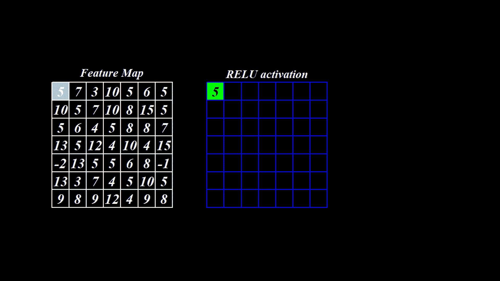

图 5。ReLU 和 Max Pooling ( *图片作者*)

在激活层之后，另一种方案被用来在不丢失重要信息的情况下灵活地降低特征图的维数。这种技术被称为**最大池**。与卷积方案非常相似，这里只选取最大池窗口中的最高值。该窗口以与过滤器相同的方式滑动，但是步长等于池窗口的尺寸(图 5)。最大池显著降低了特征图的维度，同时还保留了重要的/主要的特征。最终的最大池层然后被挤压和展平成神经元层，该神经元层连接到完全连接的神经网络以执行分类任务。

请注意，CNN 并不局限于单个卷积或一组上述方案。有足够数量的过滤器支持，你的网络越深入，它将实现更高的性能。直观地说，初始卷积将捕获低级的循环特征，例如边缘和颜色。随后，深层往往会捕捉高级特征，如重复出现的像素簇，如肖像中的眼睛或鼻子。所以，总之，基于你的图像复杂性和计算能力，你应该选择足够的有效数量的层和过滤器。

现在让我们开始制作我们的玩具模型🤓！！

## 数据集

我相信，要理解任何统计概念，没有什么比一副扑克牌更容易的了。在这里，我将利用一副扑克牌，但在一个稍微非正统的形式。是的，你猜对了！！我将制作一个预测模型，它应该能够准确地分类和预测任何任意非正面扑克牌的给定图像的花色。

[该数据集](https://github.com/AbhibhavS/CNN-Toy-model)包含每种花色的一组 43 张纸牌图像*，即*梅花♣、红心♥️、方块♦️和黑桃♠️。请注意，每种花色的符号都遵循标准的形状，但是这些符号的设计和排列因卡而异。我们将结合这个数据集来训练和测试我们的模型。(为了方便地遵循脚本，我建议您下载图像，并将所有文件保存在一个父文件中，就像它们出现在 Github 存储库中一样)

## 需要软件包和安装

对于这个任务，你需要 Keras 和 [*EBImage*](https://bioconductor.org/packages/release/bioc/html/EBImage.html) *包*。前者可从 cran 知识库中获得。后者用于有效处理图像，可以从一个名为 [Bioconductor](https://bioconductor.org/) 的开源软件中调用。这些可以安装在 Windows 操作系统上，如下所示:

```
install.packages(“keras”) # Install the package from CRAN
library(keras)
install_keras() #to setup the Keras library and TensorFlow backendif (!requireNamespace(“BiocManager”, quietly = TRUE))
install.packages(“BiocManager”)
BiocManager::install(“EBImage”)
library(EBImage)
```

这将安装 Keras API 的 CPU 版本，目前推荐新手使用。

***注意:****Keras API 将需要 Python 支持和 R tools 插件。因此，请确保在您的机器上安装了 anaconda 和 R 工具，并将其正确添加到您的系统路径中。*

## 探索数据集

接下来，我们将把每套衣服的图像转换成一个张量(编号矩阵)。EBImage 库中的 readImage() 函数可以很好地做到这一点。让我们试着从数据集中读取一幅图像。

```
setwd(“C:/parent/spade”) # To access the images of Spades suit.
                         # The path should be modified as per your 
                         # machinecard<-readImage(“ace_of_spades (2).png”) # Reading an imgae from the
                                         # dataset
print(card) # Print the details of image
```

这给出了如下输出:

```
Image 
colorMode : Color 
storage.mode : double 
dim : 500 726 4 
frames.total : 4 
frames.render: 1imageData(object)[1:5,1:6,1]
[,1] [,2] [,3] [,4] [,5] [,6]
[1,] 1 1 1 1 1 1
[2,] 1 1 1 1 1 1
[3,] 1 1 1 1 1 1
[4,] 1 1 1 1 1 1
[5,] 1 1 1 1 1 1
```

这表示图像的颜色尺寸为 500 X 726 X 4。注意，正如我们之前讨论的，这里图像深度是 4，所以我们需要深度为 4 的过滤器。为了揭示这四个矩阵，我们使用:

```
getFrames(card, type=”total”)
```

这将分别给出四个通道的详细信息。

```
[[1]]
Image 
colorMode : Grayscale 
storage.mode : double 
dim : 500 726 
frames.total : 1 
frames.render: 1imageData(object)[1:5,1:6]
[,1] [,2] [,3] [,4] [,5] [,6]
[1,] 1 1 1 1 1 1
[2,] 1 1 1 1 1 1
[3,] 1 1 1 1 1 1
[4,] 1 1 1 1 1 1
[5,] 1 1 1 1 1 1[[2]]
Image 
colorMode : Grayscale 
storage.mode : double 
dim : 500 726 
frames.total : 1 
frames.render: 1imageData(object)[1:5,1:6]
[,1] [,2] [,3] [,4] [,5] [,6]
[1,] 1 1 1 1 1 1
[2,] 1 1 1 1 1 1
[3,] 1 1 1 1 1 1
[4,] 1 1 1 1 1 1
[5,] 1 1 1 1 1 1[[3]]
Image 
colorMode : Grayscale 
storage.mode : double 
dim : 500 726 
frames.total : 1 
frames.render: 1imageData(object)[1:5,1:6]
[,1] [,2] [,3] [,4] [,5] [,6]
[1,] 1 1 1 1 1 1
[2,] 1 1 1 1 1 1
[3,] 1 1 1 1 1 1
[4,] 1 1 1 1 1 1
[5,] 1 1 1 1 1 1[[4]]
Image 
colorMode : Grayscale 
storage.mode : double 
dim : 500 726 
frames.total : 1 
frames.render: 1imageData(object)[1:5,1:6]
[,1] [,2] [,3] [,4] [,5] [,6]
[1,] 0 0 0 0 0 0
[2,] 0 0 0 0 0 0
[3,] 0 0 0 0 0 0
[4,] 0 0 0 0 0 0
[5,] 0 0 0 0 0 0
```

哦耶！为了阐明我们选择的卡，我们:

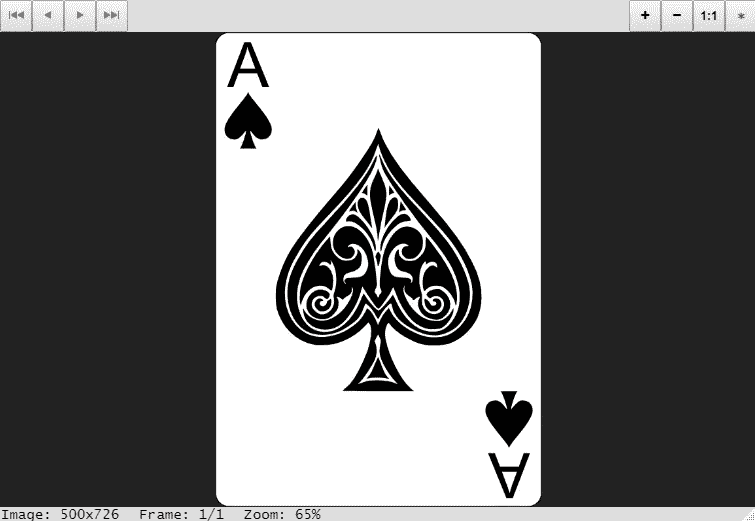

图 6。显示在 R 查看器中的所选卡片(*作者图片*)

```
display(card)
```

尽管数据集中每张卡片的深度都相同，但像素尺寸却各不相同，因此我们必须将每张卡片的尺寸调整为 100x100x4，并将它们组合在一个与 Keras 兼容的堆栈中。这个堆栈然后直接进入架构作为输入。

```
setwd(“C:/parent/club”) # To access the images of Clubs suit.
                        # The path should be modified as per your 
                        # machineimg.card<- sample(dir()); #-------shuffle the order
cards<-list(NULL);        
for(i in 1:length(img.card))
{ cards[[i]]<- readImage(img.card[i])
 cards[[i]]<- resize(cards[[i]], 100, 100)} #resizing to 100x100club<- cards              # Storing stack of the Clubs cards in
                          # matrix form in a list
#-----------------------------------------------------------setwd(“C:/parent/heart”)# To access the images of Hearts suit.
                        # The path should be modified as per your 
                        # machineimg.card<- sample(dir());
cards<-list(NULL);
for(i in 1:length(img.card))
 { cards[[i]]<- readImage(img.card[i])
cards[[i]]<- resize(cards[[i]], 100, 100)} #resizing to 100x100heart<- cards             # Storing stack of the Hearts cards in
                          # matrix form in a list
#------------------------------------------------------------setwd(“C:/parent/spade”)# To access the images of Spades suit.
                        # The path should be modified as per your 
                        # machineimg.card<- sample(dir());
cards<-list(NULL);
for(i in 1:length(img.card))
{ cards[[i]]<- readImage(img.card[i])
cards[[i]]<- resize(cards[[i]], 100, 100)} #resizing to 100x100spade<- cards             # Storing stack of the Spades cards in
                          # matrix form in a list
#------------------------------------------------------------setwd(“C:/parent/diamond”) # To access the images of Diamonds suit.
                           #The path should be modified as per your 
                           # machine
img.card<- sample(dir());
cards<-list(NULL);
for(i in 1:length(img.card))
{ cards[[i]]<- readImage(img.card[i])
cards[[i]]<- resize(cards[[i]], 100, 100)} #resizing to 100x100
diamond<- cards           # Storing stack of the Diamonds cards in
                          # matrix form in a list
#-------------------------------------------------------------train_pool<-c(club[1:40], 
              heart[1:40], 
              spade[1:40], 
              diamond[1:40]) # Vector of all the training images. 
                             # The first 40 images from each suit 
                             # are included in the train settrain<-aperm(combine(train_pool), c(4,1,2,3)) # Combine and stackedtest_pool<-c(club[41:43], 
             heart[41:43], 
             spade[41:43], 
             diamond[41:43]) # Vector of all test images. The last
                             # 3 images from each suit is included
                             # in test settest<-aperm(combine(test_pool), c(4,1,2,3)) # Combined and stacked
```

> 为了查看测试集中包含了哪些图像，我们这样做:

```
par(mfrow=c(3,4)) # To contain all images in single frame
for(i in 1:12){
  plot(test_pool[[i]])
  }
par(mfrow=c(1,1)) # Reset the default
```

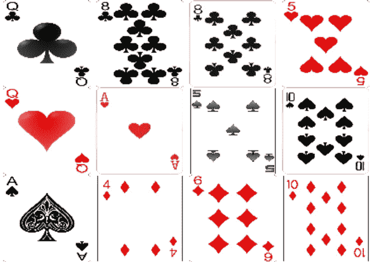

图 8。测试集(*作者图片*)

> 我得到了如图 8 所示的卡片。对你来说可能是一套不同的卡片。

**需要一个热编码**来创建对应于输入数据的分类向量。

```
#one hot encoding
train_y<-c(rep(0,40),rep(1,40),rep(2,40),rep(3,40))
test_y<-c(rep(0,3),rep(1,3),rep(2,3),rep(3,3))train_lab<-to_categorical(train_y) #Catagorical vector for training 
                                   #classes
test_lab<-to_categorical(test_y)#Catagorical vector for test classes
```

# 让我们来构建架构

下面是构建 CNN 模型的 R 脚本。我还提供了一个全面的动画，演示了脚本运行的过程(图 9)。

```
# Model Buildingmodel.card<- keras_model_sequential() #-Keras Model composed of a 
                                      #-----linear stack of layersmodel.card %>%                   #---------Initiate and connect to #----------------------------(A)-----------------------------------#layer_conv_2d(filters = 40,       #----------First convoluted layer
 kernel_size = c(4,4),             #---40 Filters with dimension 4x4
 activation = ‘relu’,              #-with a ReLu activation function
 input_shape = c(100,100,4)) %>%   
#----------------------------(B)-----------------------------------#layer_conv_2d(filters = 40,       #---------Second convoluted layer
 kernel_size = c(4,4),             #---40 Filters with dimension 4x4
 activation = ‘relu’) %>%          #-with a ReLu activation function
#---------------------------(C)-----------------------------------#layer_max_pooling_2d(pool_size = c(4,4) )%>%   #--------Max Pooling
#-----------------------------------------------------------------#layer_dropout(rate = 0.25) %>%   #-------------------Drop out layer
#----------------------------(D)-----------------------------------#layer_conv_2d(filters = 80,      #-----------Third convoluted layer
 kernel_size = c(4,4),            #----80 Filters with dimension 4x4
 activation = ‘relu’) %>%         #--with a ReLu activation function
#-----------------------------(E)----------------------------------#layer_conv_2d(filters = 80,      #----------Fourth convoluted layer
 kernel_size = c(4,4),            #----80 Filters with dimension 4x4
 activation = ‘relu’) %>%         #--with a ReLu activation function
#-----------------------------(F)----------------------------------#layer_max_pooling_2d(pool_size = c(4,4)) %>%  #---------Max Pooling
#-----------------------------------------------------------------#layer_dropout(rate = 0.35) %>%   #-------------------Drop out layer
#------------------------------(G)---------------------------------#layer_flatten()%>%   #---Flattening the final stack of feature maps
#------------------------------(H)---------------------------------#layer_dense(units = 256, activation = ‘relu’)%>% #-----Hidden layer
#---------------------------(I)-----------------------------------#layer_dropout(rate= 0.25)%>%     #-------------------Drop-out layer
#-----------------------------------------------------------------#layer_dense(units = 4, activation = “softmax”)%>% #-----Final Layer
#----------------------------(J)-----------------------------------#compile(loss = 'categorical_crossentropy',
          optimizer = optimizer_adam(),
          metrics = c("accuracy"))   # Compiling the architecture
```

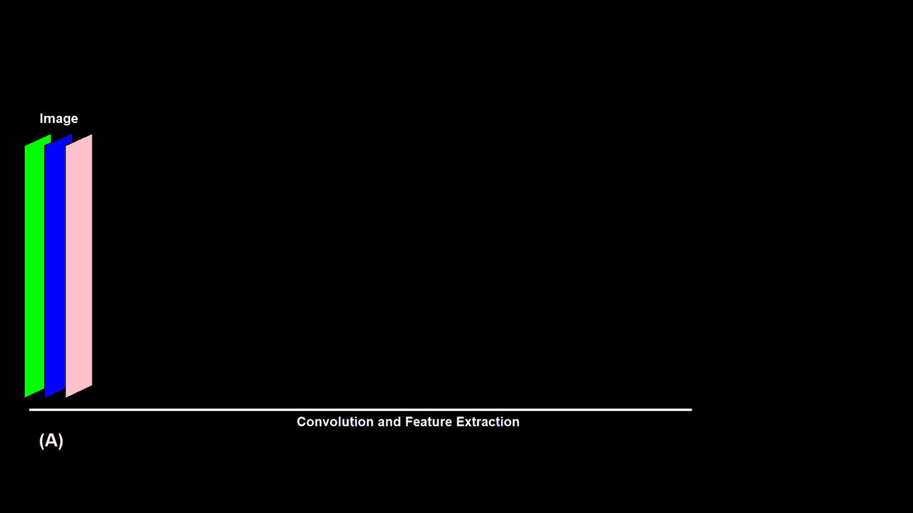

图 8。说明模型创建 **( *作者图片* )**

*我们可以使用****summary(model . card)****得到这个模型的概要。这样的输出将是一个简洁明了的模型总结。*

```
Model: “sequential”
____________________________________________________________________
Layer (type) Output Shape Param # 
====================================================================
conv2d (Conv2D) (None, 97, 97, 40) 2600 
____________________________________________________________________
conv2d_1 (Conv2D) (None, 94, 94, 40) 25640 
____________________________________________________________________
max_pooling2d (MaxPooling2D) (None, 23, 23, 40) 0 
____________________________________________________________________
dropout (Dropout) (None, 23, 23, 40) 0 
____________________________________________________________________
conv2d_2 (Conv2D) (None, 20, 20, 80) 51280 
____________________________________________________________________
conv2d_3 (Conv2D) (None, 17, 17, 80) 102480 
____________________________________________________________________
max_pooling2d_1 (MaxPooling2D) (None, 4, 4, 80) 0 
____________________________________________________________________
dropout_1 (Dropout) (None, 4, 4, 80) 0
____________________________________________________________________
flatten (Flatten) (None, 1280) 0 
____________________________________________________________________
dense (Dense) (None, 256) 327936 
____________________________________________________________________
dropout_2 (Dropout) (None, 256) 0 
____________________________________________________________________
dense_1 (Dense) (None, 4) 1028 
====================================================================
Total params: 510,964
Trainable params: 510,964
Non-trainable params: 0
____________________________________________________________________
```

## 模型拟合

一旦构建了架构，就该让数据集适合模型的训练了。拟合过程如下:

```
#fit model
history<- model.card %>%
 fit(train, 
 train_lab, 
 epochs = 100,
 batch_size = 40,
 validation_split = 0.2
 )
```

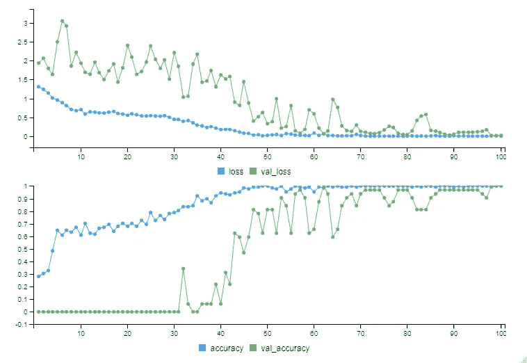

图 9 ( *作者图片*)

装配时，每个**时期**(前馈-反馈)将出现在控制台区域。处理时间可能因机器而异。当 epochs 运行时，您应该会在 Rstudio 查看器中看到一个图形(图 9)。这些是训练集和验证集的损失和准确性的并列曲线。

控制台中出现的运行时期如下所示:

```
Train on 128 samples, validate on 32 samples
Epoch 1/100
128/128 [==============================] — 10s 78ms/sample — loss: 1.3648 — accuracy: 0.3281 — val_loss: 2.0009 — val_accuracy: 0.0000e+00
Epoch 2/100
128/128 [==============================] — 8s 59ms/sample — loss: 1.3098 — accuracy: 0.3359 — val_loss: 1.9864 — val_accuracy: 0.0000e+00
Epoch 3/100
128/128 [==============================] — 8s 61ms/sample — loss: 1.2686 — accuracy: 0.3516 — val_loss: 2.5289 — val_accuracy: 0.0000e+00
```

*整个训练过程的总结可以用* ***【剧情(历史)*** *来绘制。*

## 模型评估

一旦训练结束。是时候评估我们新训练的模型了。首先，我们将查看 moel 在训练数据集上的性能，然后我们将最终在我们的测试集上测试和评估我们的训练模型。

```
#Model Evaluationmodel.card %>% evaluate(train,train_lab) #Evaluation of training set pred<- model.card %>% predict_classes(train) #-----Classification
Train_Result<-table(Predicted = pred, Actual = train_y) #----Resultsmodel.card %>% evaluate(test, test_lab) #-----Evaluation of test set
pred1<- model.card  %>% predict_classes(test)   #-----Classification
Test_Result<-table(Predicted = pred1, Actual = test_y) #-----Resultsrownames(Train_Result)<-rownames(Test_Result)<-colnames(Train_Result)<-colnames(Test_Result)<-c("Clubs", "Hearts", "Spades", "Diamonds")print(Train_Result)
print(Test_Result)
```

这个会吐槽:

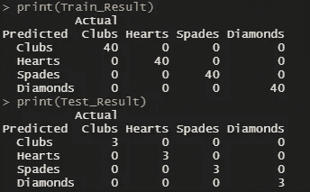

(*图片作者*)

在训练集上 100%的准确率可能是过度拟合的迹象，但是请注意，我们的模型在测试集上也达到了 100%的准确率。这意味着我们已经成功地制作了一个卷积神经网络模型，将一个给定的纸牌图像正确地分类到它真正的花色中。

如果你在这里，那么恭喜你！！你已经成功地制作了你的卷积神经网络模型。希望你旅途愉快。如果你发现任何错误或不正确的地方，请随时联系我。我也欢迎所有可以提高本文件质量的建议。

谢谢你的阅读和快乐的 R-ing😀

# 其他著名读物

> [人工智能用在哪里:可以用 AI 的领域](https://medium.com/vsinghbisen/where-is-artificial-intelligence-used-areas-where-ai-can-be-used-14ba8c092e73)
> 
> [图解:10 个 CNN 架构](/illustrated-10-cnn-architectures-95d78ace614d#:~:text=AlexNet%20(2012)&text=With%2060M%20parameters%2C%20AlexNet%20has,on%20the%20subsets%20of%20ImageNet.%E2%80%9D)
> 
> [深入了解卷积神经网络背后的数学知识](/gentle-dive-into-math-behind-convolutional-neural-networks-79a07dd44cf9)
> 
> [卷积神经网络综合指南 ELI5 方式](/a-comprehensive-guide-to-convolutional-neural-networks-the-eli5-way-3bd2b1164a53)
> 
> [Keras 代表 R](https://blog.rstudio.com/2017/09/05/keras-for-r/)
> 
> [电子图像简介](https://bioconductor.org/packages/release/bioc/vignettes/EBImage/inst/doc/EBImage-introduction.html)