# 深度卷积神经网络的外行指南

> 原文：<https://towardsdatascience.com/a-laymans-guide-to-deep-convolutional-neural-networks-7e937628605f?source=collection_archive---------17----------------------->

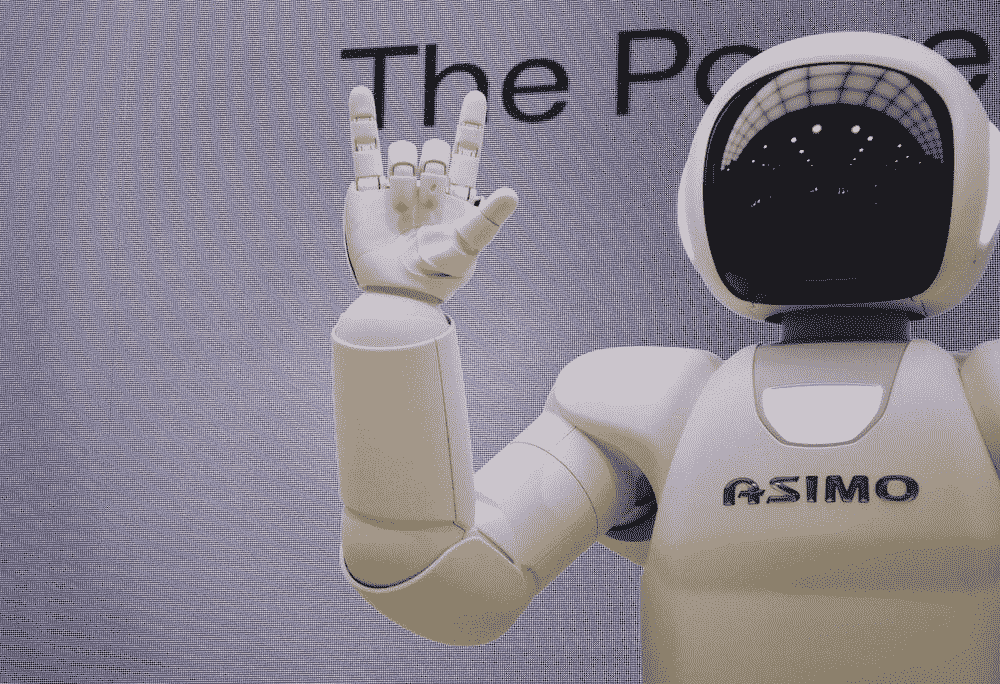

图片鸣谢—[@ frankin Japan](https://unsplash.com/@franckinjapan)[Unsplash]

## 深度学习基础

## **用 PyTorch 对卷积神经网络进行快速、非数学和实用的介绍**

*这篇文章是我计划以增量方式发布的基于中级的'* ***深度学习外行指南*** *'系列的一部分。目标受众是具备基本编程技能的初学者；最好是 Python。*

## 先决条件

这篇文章假设你对深度神经网络有一个基本的了解。关于这一点的详细帖子已经在之前的帖子中发表了— [深度神经网络的外行指南](/a-laymans-guide-to-deep-neural-networks-ddcea24847fb)。强烈建议阅读之前的帖子，以便更好地理解这篇帖子。

## 序幕

随着深度学习的出现，计算机视觉作为一个领域已经发展到了新的高度。与孤立的像素值或少量手工制作的特征相比，帮助机器以更直观的方式理解图像细节的能力已经在该领域带来了范式转变。如今，我们的日常生活、商业以及企业和工业技术产品中使用了大量尖端的计算机视觉应用。我们在日常生活中从计算机视觉深度学习的最新进展中受益匪浅；你可能没有意识到该领域在某些产品中的应用细节。几个值得注意的例子是，特斯拉的自动驾驶模式，iPhones 的 face-id 解锁，Animoji 和高级相机功能，智能手机相机的散景效果(人像模式)，Snapchat 和脸书信使的滤镜等。

> 计算机视觉领域的基本思想始于一个非常简单的问题，即识别图像中存在的内容。事实证明，这个问题是一个非常难解决的任务，尽管我们人类觉得它非常容易。

图像以其数字形式使用具有像素值的三维矩阵来表示，即长度 x 宽度和#通道(RGB)。从这个三维矩阵中提取信息并不简单。

# 让我们从一些历史开始

## 传统计算机视觉解决方案

在早期，当机器学习被接受时，计算机视觉问题取得了相当大的成功。这些问题主要是通过使用手工制作的特征和传统的机器学习算法如 SVM(支持向量机)来解决的。手工制作的特征是使用各种其他算法得到的图像的属性。这种特征的一个常见例子是边缘和拐角的存在。一个基本的边缘检测算法的工作原理是找到图像强度突然变化的区域，即附近像素值的巨大差异。几个这样的基本属性和几个更复杂的特征使用算法的组合来导出，然后结果被馈送到监督的 ML 算法。

这种方法可行，但结果并不令人鼓舞。手工制作功能所需的工作量首先是巨大的；此外，它需要相当数量的领域知识，并且非常特定于用例。比方说，为检测 X 射线图像中的骨折而创建的手工制作的特征对于识别写在递送包裹上的名字可能没有用。

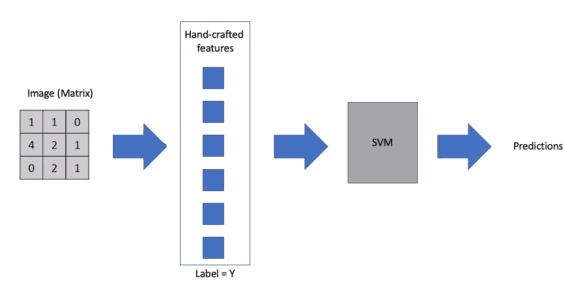

图 1-插图-使用机器学习的传统计算机视觉解决方案

为了减少手工制作特征的工作量，如果我们考虑以表格形式表示图像，即每个像素值都转换为一个特征，结果会非常令人失望。网络/ML 算法捕获的图像几乎没有任何信息，因此性能很差。

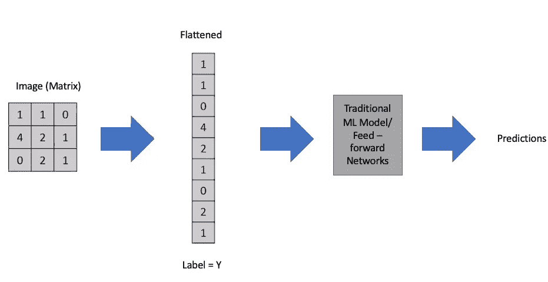

图 2 —插图—将图像展平为 ML 解决方案的表格数据

> 从上面的问题空间，我们可以推断出一个重要的细节——图像的**特征提取是不可避免的，但很难解决**。

这里有几个例子可以帮助你理解基于计算机视觉的任务难以解决的原因。为了简单起见，让我们假设我们正试图从图像中预测一只猫，作为一个二元问题。

参考下面演示的两幅图像；基于像素值，这两个图像在数字格式中将具有完全不同的表示。由于像素值仅表示每个像素应该输出的颜色，因此底层表示的语义没有任何直观意义。

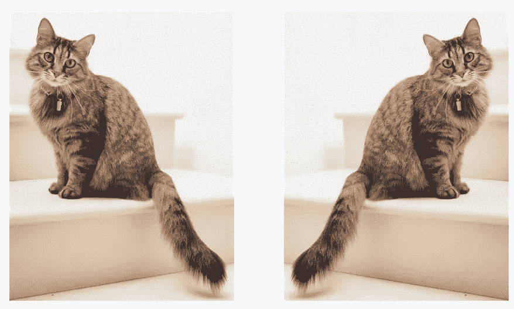

图片来源——亚历山大伦敦[https://unsplash.com/photos/mJaD10XeD7w](https://unsplash.com/photos/mJaD10XeD7w)

类似地，一只猫经常被表现为背景分离不良。看看下面的图片；传统的功能大多会产生徒劳的结果。因此，手工制作的功能在这里将不会那么有效。

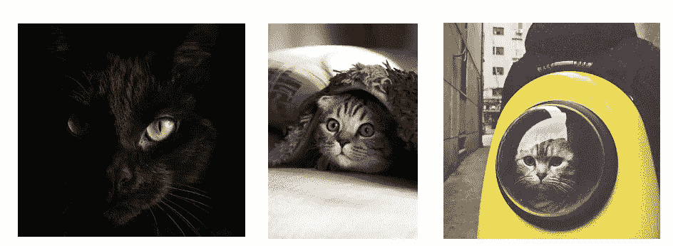

图片鸣谢——米哈伊尔·瓦西里耶夫、赵凯文、汉娜剧团@ Unsplash.com

此外，给猫拍照的方式多种多样，这使得拍摄过程变得更加困难。这些与猫不同的姿势只是其中的几个。

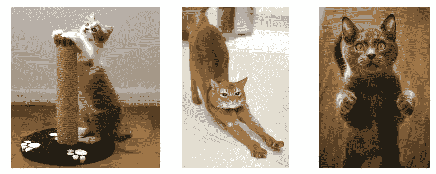

图片来源:马尔科·布拉泽维奇、蒂莫·沃尔茨、威利安·贾斯登·德·瓦斯康塞洛斯@ Unsplash.com

这些问题，当外推到一个更一般的用例时，比如说在一幅图像中检测多个对象，会成倍地增加复杂性。

> 显然，像素的表格表示或开发检测特定特征的手工特征或将两者结合起来并不是解决计算机视觉问题的最佳手段。

## 那么，解决计算机视觉问题的更好方法是什么呢？

从历史上看，我们已经看到手工制作的功能，虽然需要大量的努力，但是在一定程度上解决了问题。但是这个过程非常昂贵，并且需要大量的领域知识来解决特定的问题。

## 如果我们能自动提取特征会怎么样？

幸运的是，这是可能的，它最终将我们的讨论主题'**卷积神经网络**'带到了最前沿。CNN 提供了一种优越的方法来解决计算机视觉问题，它使用一种通用的、可扩展的但可持续的方法，这种方法可以跨领域应用，而无需预先了解该领域。不再需要创建手工制作的特征，因为给定足够的训练和数据，网络可以自我学习提取强大的特征。

深度卷积神经网络的想法最初由 Hinton，Krizevsky，Sutskever 发表，并在当时的 ImageNet 分类挑战中用于实现最先进的性能。这项研究彻底改变了计算机视觉领域。你可以在[这里](https://papers.nips.cc/paper/4824-imagenet-classification-with-deep-convolutional-neural-networks.pdf)阅读更多原文。

# 深入了解深度卷积神经网络

CNN 的通用架构如下所示。目前细节可能有点抽象，但只要再坚持一会儿，很快就会了解每个组件的细节。该架构中的特征提取组件将是“**卷积+汇集**”的组合。您可能已经注意到这个组件是重复的，在大多数现代架构中，您会看到这个组件在一个层次结构中重复多次。这些特征提取器首先提取低级特征(比如边缘、线)，然后从若干低级特征中提取作为形状或组合的中级特征，最后提取高级特征，比如在猫检测示例的情况下的耳朵/鼻子/眼睛。最后，这些层被展平，并使用激活连接到输出层(类似于前馈神经网络)。

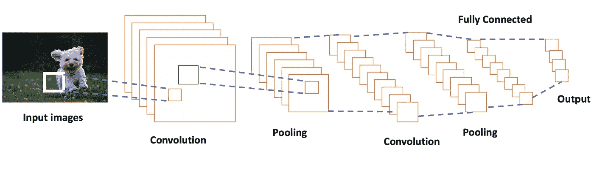

图 3—卷积神经网络示意图

# 但是首先，让我们从基础开始

让我们花一点时间来了解人类大脑通常是如何通过视觉识别物体的。简而言之，我们的大脑从视网膜接收关于它从外部世界感知的视觉信号。首先，检测边缘，然后这些边缘有助于检测曲线，然后是更复杂的图案，如形状等。从小边缘到线条、曲线、复杂形状甚至更复杂的形状，神经活动的层次编排最终有助于识别特定的对象。当然，这是一个高度简化的过程，人类大脑同时处理更复杂的操作。

类似地，在卷积神经网络中，我们在学习非常基本的特征的早期层中进行特征学习。“深度 CNN”中的“深度”是指网络的层数。在常规 CNN 中，通常有 5-10 个甚至更多的特征学习层。尖端应用中使用的现代架构的网络深度超过 50-100 层。CNN 的工作非常类似于人脑通过视觉皮层识别视觉成分的过于简化的工作。

## 让我们进入 CNN 构建模块的细节

我们将首先从理解什么是卷积开始。

“卷积”是从信号处理领域借用的运算；在深度学习领域，它基本上是通过滑动图像的长度和宽度来执行图像(矩阵)与核或过滤器(另一个更小的矩阵)之间的矩阵乘法。下面的动画演示了在[5x5]图像上卷积[3x3]滤镜/内核。卷积运算的结果是一个尺寸为[3x3]的较小图像。

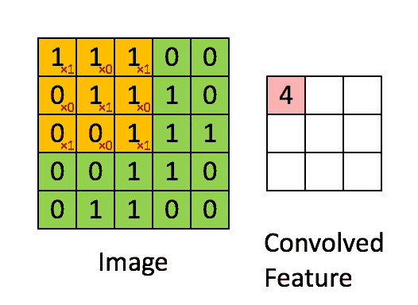

来源—[https://giphy.com/gifs/blog-daniel-keypoints-i4NjAwytgIRDW](https://giphy.com/gifs/blog-daniel-keypoints-i4NjAwytgIRDW)

这种矩阵乘法本质上是特征提取的基础。使用正确的内核值，我们可以从图像中提取显著的特征。下面演示了在真实图像上进行这种操作的一个示例。我们可以看到，在使用核作为单位矩阵时，原始图像保持不变。然而，当我们使用不同的内核时，可以看到类似于使用其他边缘检测器/平滑/锐化等的结果。图像处理技术。

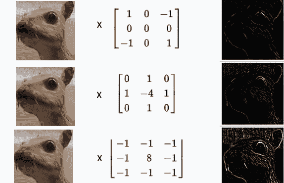

来源——维基百科

这就完成了故事的一部分，同一组件的下一部分是池。一个**池**层有助于减少图像表示的空间大小，以减少**网络**中的参数和计算的数量。这个操作简单地通过使用定义的内核大小的最大值来进行。下图是一个简单的池操作示例。对来自大小为[20×20]的卷积(另一个矩阵)的输出执行使用大小为[10×10]的核的池操作。最终结果是一个[2 x 2]矩阵。

来源—[http://deep learning . Stanford . edu/tutorial/supervised/Pooling/](http://deeplearning.stanford.edu/tutorial/supervised/Pooling/)

使用卷积层和池层(通常是最大池)的组合，我们创建了 CNN 的基本构建块。根据内核和池的大小，执行卷积+池操作可以减小原始输入的大小。使用 1 核，当我们对输入图像执行卷积时，我们得到一个特征图。在 CNN 中，通常在单个卷积单元中使用几个核。下图突出显示了卷积过程中从 **n** 内核中提取的特征图。

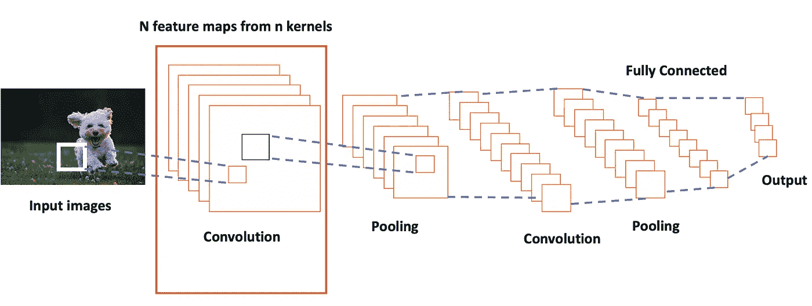

图 4——CNN 架构示意图

多次重复这个过程会产生更深的卷积神经网络。每个图层都有助于从前一个图层中提取要素。这些层的分级组织有助于增量学习特征，从小边到从较低级别特征创建的更复杂的特征，再到捕获足够信息的高级特征，以便网络可以准确预测。

最后一个卷积层连接到一个全连接层，该全连接层用于应用相关的激活来预测结果；对于二元结果，我们对非二元结果使用 sigmoid 和或 softmax 激活。

所讨论的整个架构可以简化如下——

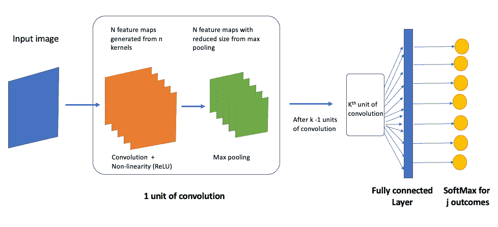

图 5——简化 CNN 架构示意图

到目前为止，我们已经忽略了复杂的 CNN 架构中的几个重要方面。但这是有意让事情变得简单，并帮助您了解 CNN 的基本概念。

其他几个重要的关键概念是-

*   **步距** —简单来说，步距可以定义为过滤器移动的量。当我们讨论滤波器在输入图像上的滑动时，我们假设该移动只是在预定方向上的 1 个单位。然而，我们可以用我们选择的数来控制滑动(尽管通常使用 1)。基于用例的需要，我们可以选择一个更合适的。更大的步幅通常有助于减少计算、概括特征学习等。
*   **填充—** 我们还看到，与输入图像的大小相比，应用卷积会减小特征图的大小。在应用大于 1x1 的过滤器并避免边界处的信息丢失之后，零填充是控制维度收缩的通用方法。

为了说明填充和步幅的概念，下面的图片会非常方便

1.  无步长填充*(蓝色为输入，绿色为输出)*

来源和学分-【https://github.com/vdumoulin/conv_arithmetic 

2.无步长填充*(蓝色为输入，绿色为输出)*

来源和信用—[https://github.com/vdumoulin/conv_arithmetic](https://github.com/vdumoulin/conv_arithmetic)

我们直到现在才接触到的其他几个重要方面是**批量规范化层**和**漏失层**。这两者都是 CNN 关注的重要话题。今天，我们通常将卷积单元定义为**(卷积+最大池化+批处理规范化)**的组合，而不仅仅是前两者。批量标准化是一种技术，通过对每个小批量的层的输入进行标准化，有助于轻松训练非常深的神经网络。标准化输入有助于稳定学习过程，从而大大减少训练深度网络所需的训练次数。

**另一方面，**是一种最有助于减少过度拟合和泛化的正则化技术。

# 将这些点连接起来

现在我们已经对卷积神经网络的基本构建模块有了一个相当好的理解，我相信你会有几个问题困扰着更好的细节。你可能会想到的最重要的问题是‘我们如何决定使用什么过滤器’，‘有多少过滤器？’等。

让我们逐一解决这些问题

## 我们如何决定使用什么样的过滤器？

这个问题的答案很简单。我们用从正态或其他分布中采样的随机值来设置过滤器。这个想法可能有点令人困惑，难以推理，但它工作得很好。在训练网络的过程中，它逐步学习最佳过滤器，这些过滤器将有助于提取准确预测标签所需的最多信息。这就是神奇的地方，我们从技术上消除了手工制作特征的过程。给定足够的训练和数据，网络负责制作适当的过滤器来提取最佳特征。

## 在每个卷积单元中，我们使用多少个滤波器？

没有标准的数字。过滤器的尺寸和数量是可以调节的超参数。一般的经验法则是使用奇数尺寸的过滤器，比如 3x3、5x5 或 7x7。此外，较小的过滤器通常比较大的过滤器更受欢迎，但这也带来了一种折衷，可以通过经验验证来解决。

## **网络如何学习？**

这类似于我们在之前的[博客](/a-laymans-guide-to-deep-neural-networks-ddcea24847fb)中研究的前馈神经网络。我们使用网络的反向传播技术来更新滤波器中的权重，从而学习图像中的地面特征。学习过程有助于网络发现能够从输入图像中提取最多信息的最佳过滤器。

## 上面的图像是一个简单的 2D，大多数图像是三维的；3D 图像的网络是如何工作的？

为了简单起见，插图使用了 2D 图像。我们使用的大多数图像都是带有(RGB)颜色通道的三维图像。在这种情况下，除了内核的维度之外，一切都保持不变。核现在将是 3 维核，其中第 3 维将等于通道的数量。比方说，输入图像中的 3 个颜色通道(R、G 和 B)的 5x5x **3** 。

## 卷积神经网络和深度卷积神经网络有什么区别？

他们两个是一样的；这里的深是指架构中的层数。大多数现代 CNN 架构有 30-100 层深。

## 训练一个 CNN 需要 GPU 吗？

不是强制性的，而是建议性的。利用 GPU 几乎可以将训练神经网络的处理速度提高 50 倍。此外，Kaggle 和 Google Colab 平台免费提供基于 GPU 的环境(每周使用上限。

# 好了，基础完成了；给我一个切实的例子

让我们用一个实际的例子来演示如何使用 PyTorch 构建一个 ConvNet。

我们将回忆在上述内容中涉及的所有主题。

首先，让我们导入所有必需的包。我们将从 Scikit-learn 导入所需的实用工具、神经网络核心模块和少量外部模块，以评估网络性能。

接下来，让我们将数据集加载到内存中。对于这个例子，我使用的是 Kaggle 上的 MNIST csv 数据集。你可以在 Kaggle 上找到完整的数据集[。](https://www.kaggle.com/c/digit-recognizer)

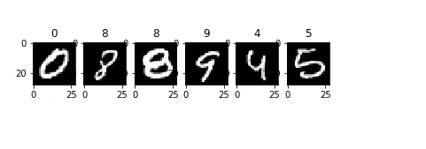

图 6—上述代码片段的输出

现在，我们已经加载了数据集，让我们将它转换成 PyTorch 友好的抽象。

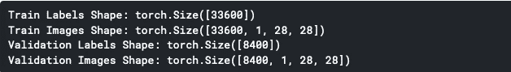

图 7—上述代码片段的输出

我们现在将定义 CNN 架构，还将定义有助于我们评估和生成预测的其他功能。

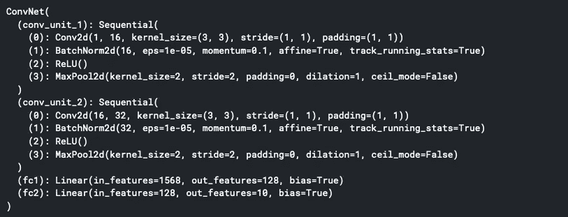

图 8—上述代码片段的输出

最后，让我们来训练我们的模型。

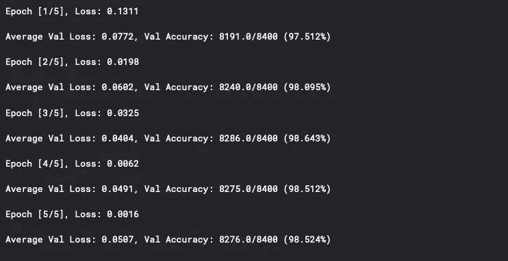

图 9—上述代码片段的输出

我们现在有一个经过 5 个时期训练的简单模型。对于大多数用例，您需要 30 个以上的历元才能获得出色的性能。现在，让我们计算验证数据集的准确度，并绘制混淆矩阵。

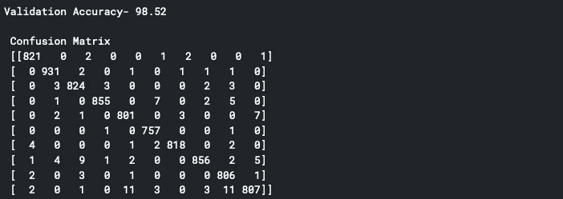

图 10—上述代码片段的输出

这就完成了对这个沉重话题的简单介绍。希望你喜欢。此外，我建议玩这个神奇的工具，以了解每个图层如何为不同的输入图像生成过滤器和特征地图。

[**工具——可视化 CNN 在行动**](https://www.cs.ryerson.ca/~aharley/vis/conv/)

您可以从我的 git 资源库—[pytorchesamples](https://github.com/jojo62000/PyTorchExamples)访问并下载整个笔记本

# 总结想法

这篇文章的目的是用一种非常简单的语言给初学者一个简单的入门。保持数学的抽象性，将注意力从纯粹的功能性方法转移到利用现代企业项目的深度卷积神经网络。

在下一篇文章中，我将介绍“递归神经网络的外行指南”,这些例子将再次出现在 PyTorch 中。