# 模糊文档重复数据删除的外行指南

> 原文：<https://towardsdatascience.com/a-laymans-guide-to-fuzzy-document-deduplication-a3b3cf9a05a7?source=collection_archive---------6----------------------->

## 检测近似重复文档的实用概念，后面是一个 Python 代码示例。


来源:aitoff via [Pixabay](https://pixabay.com/photos/stormtrooper-star-wars-lego-storm-1343772/)

在我们这个数据呈指数级增长、项目复杂、团队庞大、渴望进入下一个截止日期的时代，小事情经常被忽略。

我们的数据分析师团队在一家大型律师事务所看到了这种情况，在那里，重要的文档经常被共享、编辑、再次共享，并存储在专用的文档服务器上。二十年和一百万份文档之后，服务器变成了一个由嵌套文件夹、难以理解的文件名和损坏的文件组成的迷宫。

我们的目标是在海量存储中筛选重要文件，但我们首先要解决一个问题。

我们为非常重要的文件建议了一个新的干净的地方。然而，这需要文档是可搜索的，相关的，特别是**独特的**。快速浏览一下文件，我们可以发现数据中有许多重复的地方。

我们不能依赖文件名、日期或任何其他唯一的标识符。我们所拥有的只是文本文档本身的内容。

为什么这个问题比编写一个简单的“完全相等”的脚本来查找文本完全相同的文档更复杂呢？问题在于，在实践中，搜索 *100%* *相似度*会漏掉许多重复的文档。原因多种多样，但包括:

*   OCR(光学字符识别—将 PDFs 图像转换为文本时使用)期间的差异
*   小的修改、草稿
*   用于保存或加载文档的软件版本/方法的可变性

通过允许“模糊”的重复数据删除，其中脚本识别出*大部分*相似的文档，我们可以避开任何可能导致两个重复文档彼此不一致的问题，例如标点符号、大写字母、空格等。如您所见，我们将有一个杠杆来调整*如何将*相似的文档归类为副本。

虽然此使用情形非常具体，但在许多情况下可能需要大规模重复数据消除，包括:

*   节省存储空间
*   检查抄袭/版权
*   确保问答网站上只有新问题
*   检查数据库中的新条目以确保唯一性
*   消除膨胀数据集中的噪音

首先，让我们从理论的角度来看解决方案。之后，我们可以向那些对理论背后的代码感兴趣的人展示一个简短的 Python 实现。

为了便于说明，我们将考虑一个现实生活中的用例。我们将使用来自 [Kaggle 竞赛](https://www.kaggle.com/c/avito-duplicate-ads-detection/data)的数据集，其目标是检测在线市场中的重复广告。在本指南中，我们将重点关注广告文本。

提交广告的人通常会对他们现有的广告进行调整，然后重新提交，以提高人们找到他们产品的几率。

在 Craigslist 上的一次快速旅行马上向我们展示了这样一个例子:


Craigslist 上发布的多余广告

看到其中一些措辞略有不同了吗？精确匹配系统永远不会发现这些。

我们希望通过标记和删除重复广告(即使它们不是逐字相同的)来减少用户的混乱。

关于数据集的一些基本信息:

*   我们使用了 100，000 个广告样本。这个解决方案可以扩展到数百万个文档，这取决于您有多少时间和计算能力/内存可用。
*   执行一个简单的“完全相同”的脚本，就像我们上面描述的那样，我们看到大约 96，000 个广告是原创的(或者至少，不是任何其他广告的精确复制)。
*   大约有 1000 个广告是完全相同的。有些是复制了几十次的，有些只是一次。
*   虽然重复的广告应该只占数据集的 1%，但大量的副本使它们膨胀到数据的 3.7%。
*   文本本身是俄语的——幸运的是这并不重要，因为解决方案对语言来说是矛盾的。必要的地方我会用谷歌翻译。

让我们使用“完全相等”脚本来看看数据集中重复次数最多的广告:

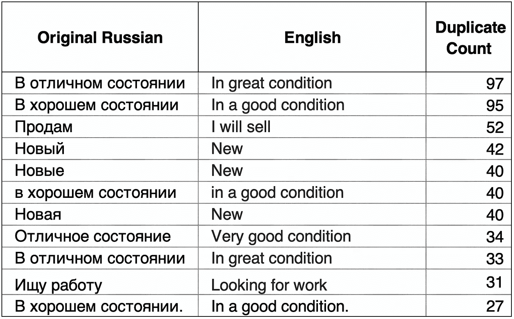

网上销售跨越语言障碍！

我们可以马上看到严格重复检测的一些缺点。请注意“状况良好”是如何因为大写或标点符号而被分成三个独立的类别的。我们简单的脚本错误地将这些归类为完全独立的原始文本。

数据中的另一个常见模式更加可疑——更长、措辞略有不同的特定广告:

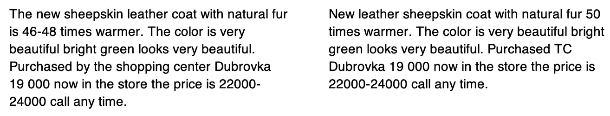

太巧了！

下面我们将开发一个更复杂的解决方案来检测附近的*副本以及精确副本。*

在我们深入研究这个案例之前，让我们先来谈谈支持我们努力的概念。

## **字符串相似度与余弦距离**

为了以一种“模糊”的方式删除这些冗余广告，我们需要找到一种方法，将文本转化为数字，以定量分析相似性。

有几种不同的方法，但最流行和有效的测量“字符串相似性”或文本相同性的方法之一被称为**余弦相似性**。

背后的逻辑非常简单。如果我们可以将文本转换成一个**向量**(图上的一条线)，我们就可以在数字上将其与其他向量(同一张图上更多的线)进行比较。线条的位置取决于文档的内容。

例如，考虑以下三个短语:

"黄油爆米花"

“咸爆米花”

"黄油羊角面包"

直观上，我们可以看到这些短语或**文档**之间的一些相似之处。其中两个是黄油，两个是爆米花。然而，为了扩展到比较数百万个文档，我们需要使问题能够被机器理解。

让我们简单统计一下一个单词在每个短语中出现的时间。结果将如下所示:

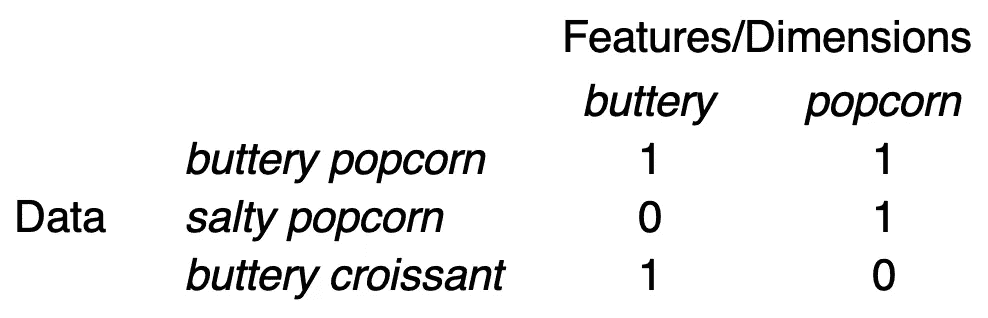

将文档转换成文档向量

每一行都是我们称之为**的文档向量**，定量地表示每个文档。

我们在这里只包括了两个特性(列)，尽管您可以拥有与您的**语料库**(整个文档集合)中的独特单词一样多的特性。例如，我们可以为*羊角面包*添加第三维度。

因为我们只有 *buttery* 和 *popcorn* ，我们可以在 2D 绘制这个数据集来说明余弦相似性是如何工作的:

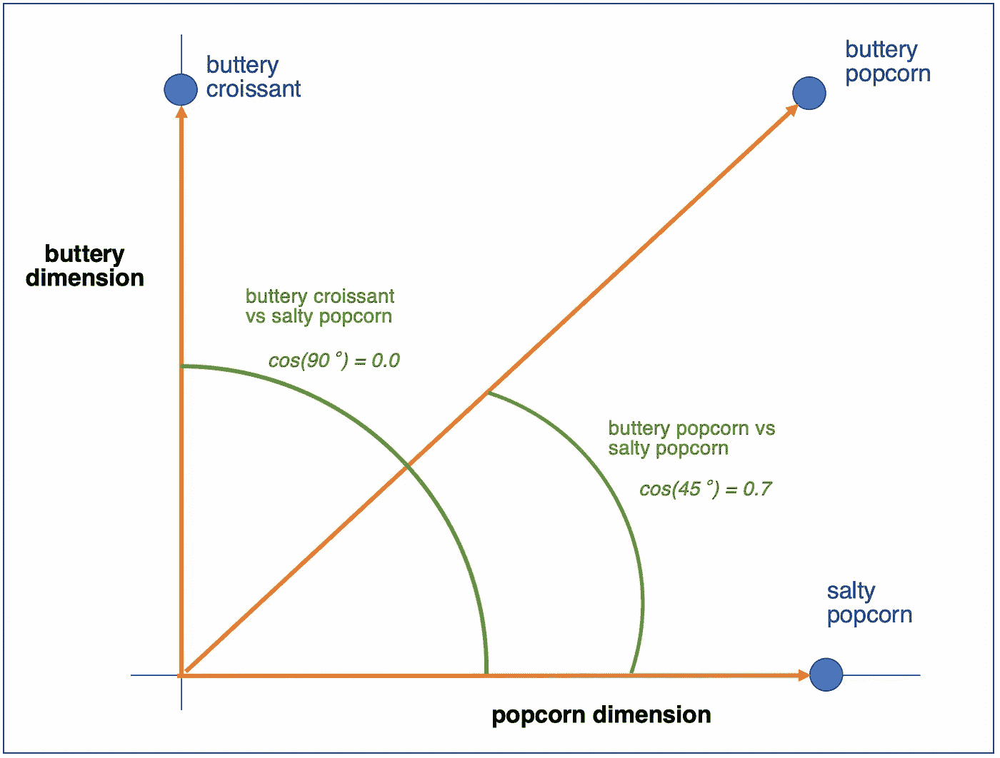

y 轴测量我们看到“黄油”的频率，而 x 轴测量我们看到“爆米花”的频率。我们可以看到我们的三个文档标有蓝点。

*   *黄油羊角面包*富含黄油
*   *咸爆米花*在爆米花维度上很高
*   *黄油爆米花*两样都有

绿色文本表示我们的余弦相似度计算。我们可以看到*黄油羊角面包*和*咸爆米花*之间有一个非常大的 90 度角。*黄油爆米花*和*咸爆米花*的角度更小，只有 45 度。

我们可以停在这里，但是取这些角度的余弦值将会使它们归一化，分别为 0.0 和 0.7。很方便，余弦计算的最小值总是-1(180 度)，最大值总是 1(0 度)。

我们已经成功地用两个特征量化了这些文本的不同之处。考虑到我们的文档包含成百上千个独特的单词，我们将拥有同样多的特性。不可能在上面这样的图上可视化这么多的文档向量，但是请放心，逻辑在数千个维度上是完全相同的。电脑会帮我们处理的。

然而，还有一个问题。如果我们只是计算文档中的字数，我们的方法不会考虑词序。例如，我们上面的余弦相似性方法如何解释以下两者之间的差异:

*   *“条件好，没得商量”*
*   *“条件不好，可以商量”*

不是很清楚，因为它们包含完全相同的单词，只是顺序不同。我们可以看到这些短语具有非常不同的含义，但是我们的余弦相似性将简单地看到它们包含所有相同的单词，对于 100%相似的分数！

## **N-Grams 保持词序**

一个 **n-gram** 简单地描述了来自给定样本的一系列 *n* 项。在文本中，这可能是给定句子中的一系列单词。因此，假设您想要文档“条件良好，不可转让”中的所有 2 个字母(或**字母组合**),以下是您将收到的三个字母组合:

“状态良好”

"条件 _ 非"

“不可协商”

类似地，如果您想要 3-grams(或**三元组**，您将收到:

“良好 _ 条件 _ 不”

“条件不可协商”

你能明白为什么拥有这些额外的特性会有用吗？

我们不仅在单个单词上创建文档向量，还在所有二元模型和三元模型上创建它！现在“条件好，不可协商”和“条件不好，可协商”将理所当然地获得较低的相似性分数，因为它们的二元模型和三元模型不一致。

## **为什么不是欧几里德距离？**

你可能会问的一个问题是——为什么要费力测量文档向量之间的角度？从上面的图表中我们可以看到，您可以为每个文档绘制一个点—为什么不只是查看点之间的距离(**欧几里德距离**)？

这是一个很好的问题。要回答这个问题，让我们看看下图:

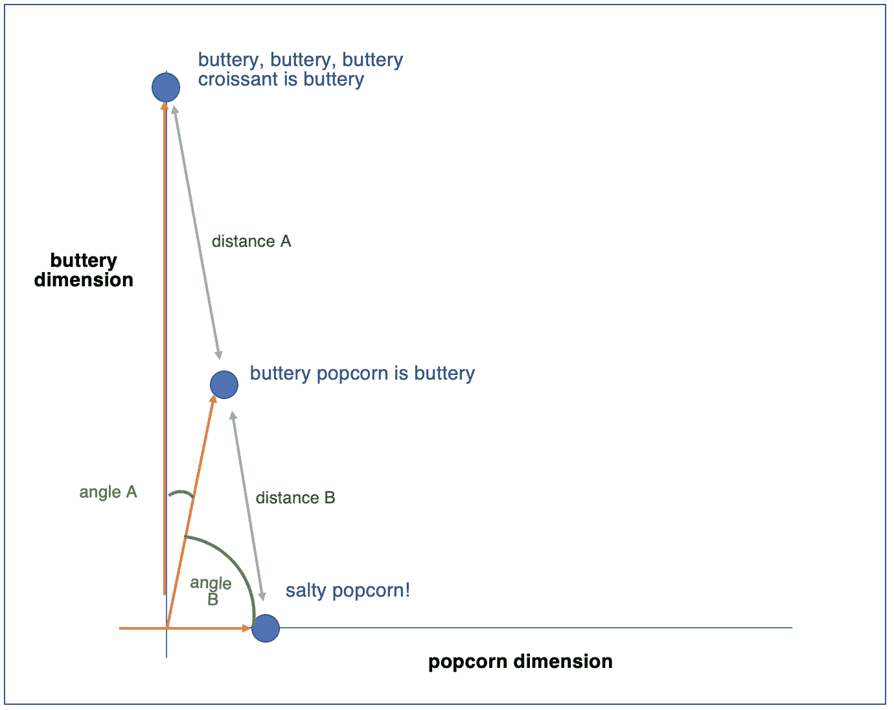

现在，我们已经为文档增加了数量，其中一些单词出现了多次。我们有一个非常黄油的文档(x4)，一个是黄油加爆米花的文档(x2，x1)，一个只是爆米花的文档(x1)。

虽然直觉告诉我们第二个文档更接近第一个文档，因为它们都在黄油上超载，但是欧几里得距离 A (2.2)实际上大于欧几里得距离 B (2.0)。使用这些距离，我们可以说共享一个“爆米花”术语的文档比共享两个“黄油”术语的文档更相似！

然而，角度 A 和 B(用余弦相似性度量)支持我们的直觉，即 buttery 文档比 popcorn 文档更相似。

事实上，当量值被归一化时(所有的点从图形的原点开始都是等长的)，欧几里德距离和余弦相似度将返回相同的结果。

余弦相似性的另一个好处是计算机计算起来更便宜，当我们谈论数百万或数十亿次比较时，这可以节省大量时间。

## **其他标准化**

自然语言处理领域既深且广，根据您的用例，还有许多其他方法可以通过预处理来提高数据质量。

比如，**词干化**会将所有单词规格化为它们最基本的形式(*运行*变成*运行*，*交付*变成*交付*)。

另一个转换采用我们创建的文档向量，称为**单词袋**向量(因为我们只是简单地计算每个文档中有多少单词)，并将其转换为**术语频率—逆文档频率**向量( **TF-IDF)** 。这是一个非常强大的转换，可以帮助您完成像文档分类这样的任务。你忽略了在你的整个语料库中频繁出现的单词( *the，he，her，it，*等)。 *)* ，*，*关注在特定文档中出现的较罕见的单词，但*而不是*在整个语料库中出现，因为后面这些单词更有可能是有意义的。

这些转换值得了解，但我们不会在这里使用它们，因为副本通常会使用相同的单词形式(不需要词干)和术语频率(不需要特别加权不同的术语/文档)。

最后，如果你处于这个领域的前沿，你会考虑使用**文档嵌入**，这是将文本意义映射到数字向量的另一种方法。这超出了本文的范围(对于我们的重复数据删除应用程序来说可能有些过头了)。

## **用余弦相似度去重广告**

做得好！您现在已经掌握了一个非常有用的工具。让我们看看如何将它应用到前面的重复广告检测示例中。

第一步是创建一个**文档术语矩阵**。您已经在前面的 popcorn 示例中看到了其中的一个——它只是一个在行上跟踪文档的结构，在列上跟踪特定的**术语**(注意:不再是“单词”,因为我们也可以放入 n-grams)。文档中每出现一个术语，矩阵中相应的单元格就加 1。

让我们看看数据中的几个例子的矩阵是什么样的。为了更好的说明，我把俄语的例子翻译成了英语，尽管这种方法适用于任何语言。


橙色单元格代表我们的文档和术语之间的交叉点。我们可以看到多个文档包含相同的术语——就像*条件*属于四个文档。这将有助于提高这些文档之间的余弦相似性得分。

既然我们已经将文本数据转换为文档向量，我们可以应用**成对**余弦计算来评估所有文档之间的相似性。成对只是意味着我们将从数据集中的每两个例子中得到一个数字——每个文档都需要与其他每个文档进行比较，以查看是否有任何相似之处。

请注意，这可能会变得计算量很大——在技术部分，我们将讨论一个在执行该计算时可以节省资源的伟大包。

让我们看看上面例子的余弦相似性计算为我们提供了什么:

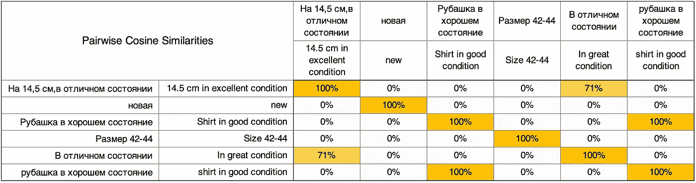

每个文档沿着行和列放置，成对余弦相似性填充在单元格中。

正如我们所料，我们在对角线上看到了 100%的相似性——所有文档都是完全相同的。例如，*“状态极佳的 14.5cm”*在第一行第一列，导致第一个单元格为橙色 100%。当然，当我们进行分析时，我们不会将这些自相似的细胞算作数据集中的“重复细胞”。

马上，我们看到一些有趣的结果:

*   “14.5 厘米处于极好状态”和“处于极好状态”共享足够多的术语，以至于它们具有 71%的余弦相似性。
*   “状态良好的衬衫”和“状态良好的衬衫”获得 100%的相似性，因为我们的过程不区分大小写。

我们可能会认为第一场比赛是*而不是*重复，而第二场*是*重复。我们可以开始看到在 71%和 100%之间形成复制截止的直觉，但更多的是在以后选择这个阈值。

请注意，我还在图形中包含了原始的俄语文本。这有助于解释为什么“ *14.5 厘米状况极佳”*和*“状况良好”*没有收到任何相似性。在俄语中，两个 c*condition*术语的拼写略有不同(一个表示“条件”，另一个在技术上表示“状态”)，导致该术语背后的含义完全不同/独立。

这些结果来自 6 个文档的小样本，为我们提供一些直觉。让我们看看在 100，000 个文档的数据集上的结果是什么样的。

为了进行比较，让我们将调查结果与本文前面采用精确/严格的重复数据消除标准得出的结果进行对比:

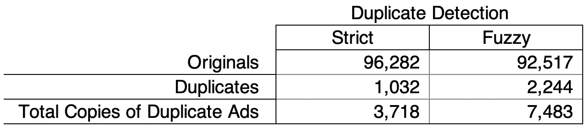

我们的模糊重复数据删除发现了 2，244 个重复文档，约占总数据集的 2%。当考虑到这些重复广告的多个副本的膨胀效应时，这些重复广告占我们数据的 7.5%！

通过允许模糊重复数据删除，我们发现的**重复文档是以前的两倍。**

我们将看看三个例子，这些模糊的发现是我们现在发现的。

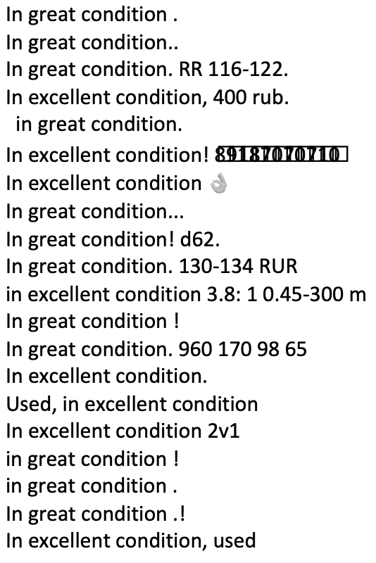

在第一个例子中，我们选取了“良好状态”的变体。虽然很有趣，但这并不是欺骗性广告的例子——这只是销售商品的人们的常用语！

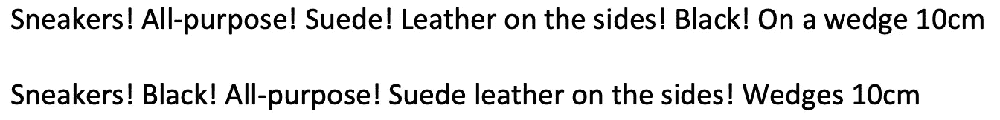

第二个例子代表了在整个数据集中看到的许多广告的模式。虽然语序不同，但内容是一样的！我们可以确信这是一个销售同一双运动鞋的欺骗性广告。

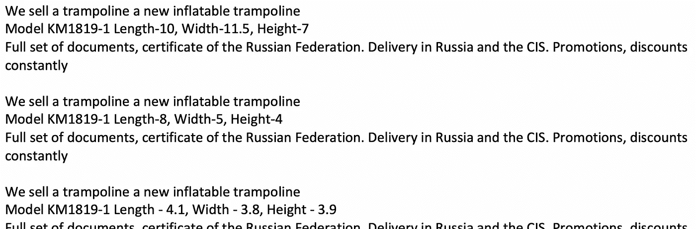

作为我们的最后一个例子，我们看到几十个蹦床广告，其中唯一的变化是蹦床本身的尺寸。一个对蹦床不感兴趣的本网站用户当然不需要看到这样的品种。作为网站所有者，你可以选择对这种冗余采取行动。

其他适合这种模式的例子是重复广告，唯一的区别是地址、电话号码或产品颜色。

现在，我们已经完全开发了余弦相似性重复数据删除方法，并看到了一些结果，我们几乎完成了本文的理论部分。有一个非常重要的悬而未决的问题需要讨论。

## **设置带有精度/召回的截止值**

需要考虑的一个重要方面是我们选择的余弦相似性阈值。记住，当我们比较两个文档向量时，我们会得到一个介于 0%和 100%之间的余弦相似度。由我们来决定结果是通过还是未通过预定义的设定点。

0%的余弦相似性截止值会将所有内容标记为与其他内容重复，而 100%的截止值需要完全重复(非模糊)才能抛出重复标记。

没有普遍“正确”的答案，因为我们设置的截止值将取决于我们特定的用例。

一种极端的情况是，假设您正在删除稀有且非常有价值的旧手稿的重复数据。你会因为删除哪怕一份原稿而陷入麻烦，因为你认为这是一份非常相似但不同的原稿的副本。如果一些重复的数据没有出现在数据集中，也没什么大不了的。在这种情况下，您可能会错误地选择一个更高的重复数据删除截止值，该值对重复数据的检测更加严格。

在另一个极端，您正在删除数百万条推文的重复数据，作为大型项目的预处理步骤。每条推文本身没多大关系，你的主要目标是缩小数据。例如，你想通过垃圾邮件删除大量冗余的推文。如果你不小心删除了原创推文，那也没什么——你只是想通过删除唾手可得的果实来缩小你的语料库。

这就是**精度**和**召回**的概念变得有用的地方——这些相反的力量将帮助您设置一个良好的重复数据删除截止值。

**Precision** 询问—在我们标记的“肯定”文档中(在我们的例子中，肯定与重复同义)，有多少是真正的肯定/重复文档？

请记住，如果我们将文档标记为“正”/副本，但它不是真正的“正”/副本，我们只是错误地将原始文档标记为副本！根据我们的用例，这可能意味着我们已经提示删除一个原始文档。


来源:维基百科

在前一个罕见的手稿例子中，我们优化了精确度**。**我们希望确保我们标记为重复的所有文档都是真正的重复文档。没有人会责怪我们为了安全而设置 99%的重复数据消除截止值。

另一方面，**回忆**询问——在所有真实的肯定/重复文档中，我们正确识别出多少是重复的？

这和精确有什么不同？在精度方面，我们关心的是**我们得到了多少真阳性与假阳性**。在回忆中，我们关心的是**我们得到了多少真阳性与假阴性**。

在推文重复数据删除的例子中，我们更关心整个推文的重复数据删除，而不是确保我们标记的每条推文都是重复的。我们愿意为了召回而牺牲精确性。由于这种权衡，我们可以接受较低的余弦相似性截止值，比如说 70%。

假设我们有一个包含 100 个文档的数据集。我们已经手动查看了数据，并且*知道*有 20 个重复的文档应该被删除。

在余弦相似性截止值为 99%时，我们删除了 15 个重复的文档。然而，我们 100%确定我们删除的 15 个都是真正的重复。我们非常精确(15/15–100%)，但是召回率很低(15/20–75%)。

在余弦相似性截止值为 70%时，我们删除了 30 个文档。我们当然删除了 20 个真正的重复项，以获得非常好的回忆分数(20/20–100%)。然而，我们也删除了 10 份并非真正重复的文件。这导致精确度分数很低(20/30–66%)。

看到精度和召回是怎么对立的了吧？在实践中，有必要提取数据集的样本，标注原件和副本，并尝试针对您的具体情况优化截止阈值。

此外，余弦相似性可能只是更大的统计模型的一个特征。在广告重复数据删除示例中，包含关于产品图像、用户名、发布时间戳等信息可能是有意义的，最终将这些信息输入到二进制分类模型中以标记重复广告。

为了便于说明，我们使用了 95%的相似性截止值。相对严格，但正如我们在上面看到的，我们仍然在模糊重复数据删除方面获得了显著的性能。

理论到此为止！如果您已经坚持了这么长时间，谢谢您——您现在已经实际熟悉了一种有价值的方法来帮助您驯服重复数据。

如果您有技术爱好，并且想知道如何编写类似上述示例的代码，我们将继续提供一些 Python 代码片段，它们可以执行我们刚刚讨论的方法。

# **使用 Gensim 在 Python 中实现**

## *为什么是 Gensim？*

Gensim 是一个 Python 库，广泛用于主题建模。但是，它对于重复数据消除也有非常有价值的实用程序。

虽然在 Python 中有几种有效的方法来计算余弦相似性，包括使用流行的 *SKLearn* 库，但当数据集变得非常大时，Gensim 的主要优势就来了。

当你的语料库增长超过你的计算机在内存中存储数据的能力时，Gensim 会自动将你的语料库分割成计算机可读的数据块，然后**将其保存到磁盘**。通过将数据放在磁盘上，您可以在遇到内存问题之前处理更大的数据集。您还可以加载并重用存储在磁盘上的碎片。

与此相关的是，一旦你生成了一个相似性索引(我们将在下面看到)，你可以把它保存到磁盘上，并逐步增加更多的文档，而不是从头开始重新计算。这允许一次性的时间密集型提升来加载您现有的语料库，每当您向您的语料库添加新数据并想要重新计算相似性时，更新都非常快。

## *导入包*

首先，我们从 Gensim 导入我们需要的模块。注意，要自己运行代码，您需要下载带有 *pip* 或 *conda* 的 Gensim。

```
#Import necessary gensim packagesfrom gensim.utils import simple_preprocess
from gensim.models.phrases import Phrases, Phraser
from gensim import corpora
from gensim.similarities import Similarity
```

让我们定义一些测试数据。

```
#Test datasetdocuments = [
    “Used SpaceX rocket as-is, buyer must transport.”,
    “Used SpaceX rocket as-is, buyer must transport.”, “For sale: bulk 100lbs pack of spaghetti noodles”,
    “Spaghetti noodles for sale — 100lbs bulk pack”, “Pale blue tuxedo, used, good condition. Call 555–555–5555”,
    “Brand new yellow tuxedo in great condition!”
]
```

## *数据预处理*

一般来说，我们在单词级别处理文档。这里有一个简单的方法将文档分解成正确的格式:

```
*#Convert documents to collection of words**texts = [[text for text in simple_preprocess(doc, deacc=True)] for doc in documents]*
```

**simple_preprocess** 是一个有用的 Gensim 函数，用于将文档解析成单个单词。您可以根据需要向它传递额外的参数。在这里，我们通过“deacc=True”来去除标点符号、重音符号和数字。

这里是*“二手 SpaceX 火箭原样，买家必须运输。”*简单预处理后:

```
[‘used’, ‘spacex’, ‘rocket’, ‘as’, ‘is’, ‘buyer’, ‘must’, ‘transport’]
```

## *构建 N-Grams*

我们将使用单词级结构来训练一个 Gensim n-gram 短语器。

普通的二元模型生成器会为每个词对(used_spacex，spacex_rocket，rocket_as)生成一个二元模型，而 Gensim 短语生成器经过预处理，可以选择搭配，或者通常会在一起出现的词。例如，只有 spacex_rocket 将被保留，因为短语者认为它是单词的可能搭配。

这种选择性是节省程序运行时间的一个很好的方法，因为它不需要为每个可能的单词排列存储一个特征。

```
#Build a bigram model to capture every pair of words in the textsbigram = Phrases(texts, min_count=1)
bigram_phraser = Phraser(bigram)
```

**min_count** 参数指定短语必须在语料库中找到多少次才能被保留。因为我们的数据集很小，所以我们把它保持在 1。

现在我们有了一个训练有素的 Gensim Phraser，我们将在句子转换成术语的过程中使用它。这看起来和以前一样，除了我们包含了 **bigram_phraser** 变量。

```
#Reconvert documents to collection of words/bigramstexts_bigrams = [[text for text in bigram_phraser[ simple_preprocess(doc, deacc=True)]] for doc in documents]
```

例如，*“出售意大利面条——100 磅散装”*现在变成了:

```
['spaghetti_noodles', 'for_sale', 'lbs', 'bulk', 'pack']
```

## *创建 Gensim 词典和语料库*

Gensim 使用特定于包的结构来提高运行效率。具体来说，我们需要创建一个 Gensim 字典和 Gensim 语料库。

```
#Create dictionarydictionary = corpora.Dictionary(texts_bigrams)
```

Gensim **字典**简单地将每个特定的术语(键)映射到一个唯一的 ID(值)。一个普通的 Python 字典表示如下:

```
In: {k: v for k, v in dictionary.items()}Out: 
    {0: 'as_is',
    1: 'buyer_must',
    2: 'spacex_rocket',
    3: 'transport',
    4: 'used',
    ...
    18: 'great',
    19: 'in',
    20: 'new',
    21: 'yellow'}
```

接下来是语料库:

```
#Create corpuscorpus = [dictionary.doc2bow(docString) for docString in texts_bigrams]
```

**Gensim** **语料库**使用我们刚刚创建的字典将我们的原始文本文档转换成数字表示。通过用数字代替文本，计算变得更快。

例如，我们数据中的第一个文档——“二手 SpaceX 火箭，买方必须运输。”—现在看起来像:

```
[(0, 1), (1, 1), (2, 1), (3, 1), (4, 1)]
```

每组括号(元组)代表一个单词。第一个数字是单词在字典中的位置，第二个数字是它在文档中出现的次数。

对于(0，1)，0 表示我们的二元模型“as_is”，它在文档中出现一次。

这些数字实际上只是代表一个单词包——我们之前使用的术语，意思是从文档中解构出来的、独立的术语集合。

这些元组中的每一个都代表我们的文档术语向量中的一个维度。

## *创建相似性指数*

我们已经准备好为我们的文档术语向量集合计算余弦相似度了！

Gensim 为我们做了所有繁重的工作，我们只需使用正确的语法:

```
#Build similarity index
index = Similarity(corpus=corpus,
                   num_features=len(dictionary),
                   output_prefix='on_disk_output')
```

这实例化了**相似性索引**，它计算并跟踪每个文档相对于所有其他文档的余弦相似性——成对计算。Gensim 经过优化，可以相对快速地执行这一计算。 **output_prefix** 参数就是将要保存到硬盘上的文件的名称——如果需要的话，可以在以后重新加载。

让我们打开索引，看看里面有什么:

```
#Parse similarities from indexdoc_id = 0
similar_docs = {}
for similarities in index:
    similar_docs[doc_id] = list(enumerate(similarities))
    doc_id += 1
```

**similar_docs** 现在是一个 Python 字典，它跟踪每个文档，以及它和语料库中所有其他文档之间的相似性得分。

例如，第一个条目看起来像:

```
{0: [(0, 0.9999), #“Used SpaceX rocket as-is, buyer must transport.”
    (1, 0.9999),  #“Used SpaceX rocket as-is, buyer must transport.”
    (2, 0.0),
    (3, 0.0),
    (4, 0.1690), #“Pale blue tuxedo, used, good condition...
    (5, 0.0)],
 ...
}
```

因此，我们集合中的第一个文档(“0”——Python 是零索引的)(“二手 SpaceX 火箭，买家必须运输。”)和自己一模一样，和第二个文档一模一样。

它与第五份文件有 17%的相似性(“淡蓝色燕尾服，用过，状况良好。致电 555–555–5555”)。我们可以看到“used”是一个共享令牌。

## *设置截止阈值*

我们将使用 90%相似的阈值。根据用例，我们可以将它上移或下移，如上所述。

```
sim_threshold = 0.9
```

## *查找相似文档*

下面的帮助器代码将向我们返回超出阈值的文档对:

```
for doc_id, sim_doc_tuples in similar_docs.items():
    for sim_doc_tuple in sim_doc_tuples:
        sim_doc_id = sim_doc_tuple[0]
        sim_score = sim_doc_tuple[1]if sim_score >= sim_threshold and doc_id != sim_doc_id:
            print(f"Found similar documents, score of {sim_score:.2f}:")
            print('\t', documents[doc_id])
            print('\t', documents[sim_doc_id], '\n')
```

打印的结果包括:

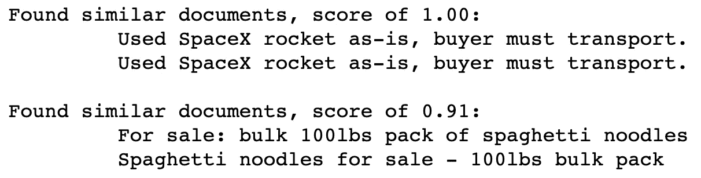

我们找到了。我们能够验证第一对文档是精确的副本，第二对是模糊的副本。请随意使用这个测试代码来处理您自己的一些数据。

本指南到此为止！现在，您已经熟悉了有价值的文本分析技术，并准备在您的下一个项目中实施一种复杂的模糊重复数据删除方法。

## 感谢阅读！