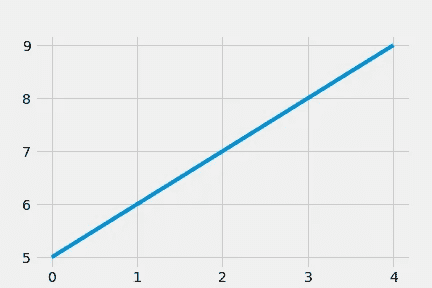
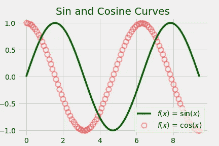
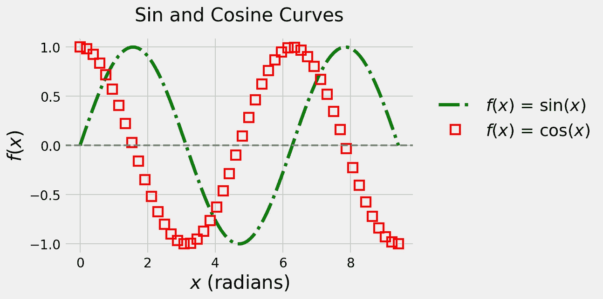
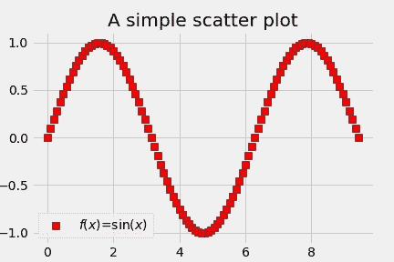
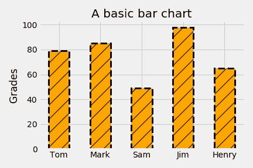
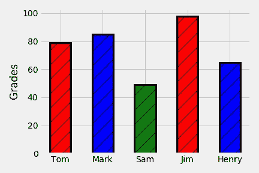
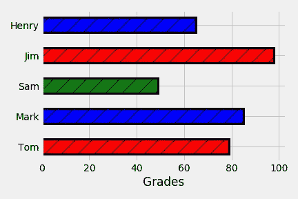
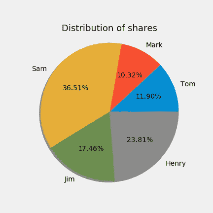
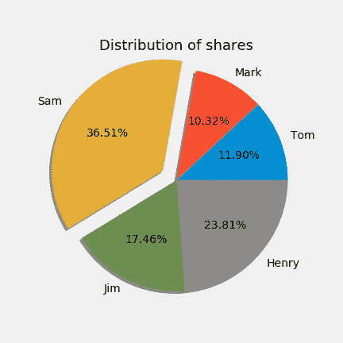

# python 和 matplotlib 绘图入门指南

> 原文：<https://towardsdatascience.com/a-laymans-guide-to-plot-with-python-and-matplotlib-8462054f2059?source=collection_archive---------29----------------------->


卢克·切瑟在 Unsplash[上的照片](https://unsplash.com?utm_source=medium&utm_medium=referral)

## 在 10 分钟的咖啡休息时间用 matplotlib 打破僵局！

无论数据是多小或多大，数据可视化在任何领域都是一项必不可少的例行任务，无论是绘制简单的正弦曲线，还是为利益相关者创建复杂的交互式仪表盘。 [Python](https://www.python.org/) 是当今最受欢迎的编程语言之一(在[堆栈溢出](https://stackoverflow.com/tags)的活跃前 3 名中)，提供了数据可视化的巨大可能性。

Matplotlib 是一个如此强大的 python 绘图库，它提供了各种各样的 1D、2D 和 3D 可视化。作为 Stack Overflow 上 [matplotlib 的金牌持有者，我想到创建一系列教程，旨在教授使用**python**&**matplotlib**绘制引人注目的图形的基本知识，提供**即用型 Jupyter 笔记本**。](https://stackoverflow.com/questions/tagged/matplotlib)

我的这第一篇帖子将教你 matplotlib 的*，以**一维图、**连同基本**条**和**饼图** **图表**为例。整个笔记本可以从我的 GitHub [库](https://github.com/piethonic/matplotlib)下载/分叉。使用以下系统设置:Python 版本:3.7.7，Matplotlib 版本:3.1.3。本教程预计也适用于旧版本。*

# *1) **让我们从 1D 的剧情开始***

*要在 Jupyter 笔记本中启用内嵌绘图，您需要在笔记本的开头使用以下内容*

```
*%matplotlib inline*
```

*如果您的屏幕支持 retina 显示屏，您可以使用以下方法提高图形的分辨率*

```
*%config InlineBackend.figure_format = ‘retina’*
```

*Matplotlib 提供了几个很酷的[样式表](https://matplotlib.org/3.1.0/gallery/style_sheets/style_sheets_reference.html)来增强人物美感。我会用`'fivethirtyeight'`*

```
*plt.style.use('fivethirtyeight')*
```

## ***1.1)最简单的情节***

*最简单的*示例是绘制一个值列表。让我们创建一个增量值列表并绘制它。**

```
*values = [5, 6, 7, 8, 9]
plt.plot(values)*
```

**

***简单的线条图***

*你可以看到`values`被绘制在 *y* 轴上。为了在 *x-y* 空间上绘图，通常需要两个列表:一个用于 x*值，另一个用于 y* 值。请注意，默认情况下，实线用于绘图。*

*现在你可能想知道这个数字是如何在没有传递 *x* 值的情况下创建的。*

*默认情况下，当我们将单个列表传递给`plt.plot()`时，*x*-轴假定从零开始的整数值，直到比 *y* 值的长度小 1。在上图中，`values`有五行。所以*x*-值变成了 0，1，2，3，4(因为在 python 中索引是从 0 开始的)。换句话说，*x*-值为`range(len(values))`，其中`len(values)`返回列表的长度，即 5。因此，下面的线也将绘制相同的图形:*

```
*plt.plot(range(len(values)), values)*
```

***注意:**如果您使用其他 python IDE，例如 spyder，您需要在`plt.plot()`命令后使用`plt.show()`来显示图形窗口。虽然你不需要在 Jupyter 笔记本上。*

## ***1.2)让我们绘制一些函数，** 𝑦 =𝑓(𝑥)*

*我们将为𝑥∈(0,3𝜋):绘制以下两个函数*

*   **y* = sin( *x* )*
*   **y* = cos( *x**

*[NumPy](https://numpy.org/) 包在执行向量化操作时非常方便:*

```
*import numpy as np*
```

*接下来，我们将定义𝑥-values 并计算相应的 *y-* 值:*

```
*x = np.linspace(0., 3*np.pi, 100) # 0 to 3*Pi in 100 stepsy_1 = np.sin(x) 
y_2 = np.cos(x)*
```

*现在让我们绘制*和*中的两个*功能相同的图*。在 1D 图中，两个关键元素是*线*和*标记*(符号)。它们的属性都可以在打印时自定义。在下面的代码片段中，我将使用一些**必须**已知的必要属性(带有选择的选项)。传递给`plt.plot()`命令的参数将在本文稍后解释。*

***用下面的正弦和余弦曲线生成图形的代码片段。***

**

***同一图形中的正弦和余弦曲线。***

## *1.3)面向对象的绘图方法*

*现在，让我们使用面向对象的方法来操作图形的属性。其中，有以下两种可能性:*

***方法一***

```
*fig = plt.figure(figsize=(8,6))
ax = fig.add_subplot(111)*
```

***方法二***

```
*fig, ax = plt.subplots(figsize=(8,6))*
```

*下面我来演示一下**方法 2** (我的最爱)的使用方法:*

***代码片段生成如下图。***

**

***使用上述面向对象方法的正弦和余弦曲线。***

# *2)定制情节*

## *2.1 选择线条样式和标记*

*在上述两种方法中，我使用了实线和圆形标记。下一节将教你如何选择不同的线条样式和标记。*

***1。线条样式:**你可以明确地使用关键字`linestyle='-'`或者缩写`ls='-'`。以下是几种可用的线条样式:*

*   *`'-'`:实线*
*   *`'--'`:虚线*
*   *`'-.'`:点划线*
*   *`'.'`:虚线*

***2。标记:**可以用关键字`marker='o'`。以下是几个可用的标记:*

*   *`'o'`:圆形*
*   *`'s'`:方形*
*   *`'p'`:五边形*
*   *`'h'`:六边形*
*   *`'^'`:上三角*
*   *`'v'`:下三角形*
*   *`'x'`:十字*

## *2.2 选择颜色*

***1。颜色:**你可以明确地使用关键字`color='g'`或者缩写`c='g'`。*

*   *标准颜色可以用单个字母:`'r'`、`'g'`、`'b'`、`'k'`、`'o'`表示红、绿、蓝、黑、橙*等*。*
*   *对于标准色以及其他非标准色如`'navy'`、`'darkorange'`、`'indigo'`也可以指定全称为`'red'`、`'green'`、`'orange'`。*
*   *允许颜色的完整列表可以在[这里](https://matplotlib.org/3.1.0/gallery/color/named_colors.html)找到。*

***妙招:**使用`'-r'`、`'--g'`、`-.k`等简写符号，既可以组合线型，也可以组合色彩。然而，您*不能*使用类似`linestyle='-.r'`或`ls='-k'`的东西，因为现在您正在指定线条样式的属性，但是同时指定了线条样式和颜色。*

***加成:组合线条和标记** 如果你想同时使用线条和标记，有两种可能。假设您想要一条带有方形标记的红色点划线。您可以使用以下两个选项之一:*

*   *`'-.rs'`*
*   *`'-.r', marker='s'`*

## *2.3 控制线条和标记的属性*

*从上一节中，您现在知道了可以使用哪些线条样式和标记。下面将教你如何定制它们的属性。*

***1。台词:***

*   *`lw`代表线宽，例如:`lw=2`。也可以用关键字`linewidth=2`。*
*   *`alpha`控制透明度(0 表示完全透明，1 表示不透明)。您可以选择 0 到 1 之间的任何浮点值。*

***2。标记:***

*   *`ms`代表标记尺寸，例如:`ms=10`。也可以使用关键字`markersize=10`。*
*   *`mfc`代表标记面颜色，例如:`mfc='green'`。也可以使用关键字`markerfacecolor='green'`。*
*   *`mec`代表标记边缘颜色，例如:`mec='red'`。也可以使用关键字`markeredgecolor='red'`。*
*   *`mew`代表标记边缘宽度，例如:`mew=5`。也可以用关键字`markeredgewidth=5`。*
*   *`alpha`控制透明度(0 表示完全透明，1 表示不透明)。您可以选择 0 到 1 之间的任何浮点值。*

# *3)散点图*

*到目前为止，我们使用了`plot`模块，其中两条不同的曲线分别用直线和标记绘制。有时候，你会想要一个散点图。这可以通过*间接*实现，就像你在上面看到的余弦曲线那样，也可以通过`scatter`图直接*实现。**

*在`plt.plot()`中，您只能传递 *y* 值，而 *x* 值会自动生成。然而，在散点图中，**你需要同时传递 *x* 和*y*-值**。*

*以下是散点图的一些基本特征参数:*

*   *`marker`:选择散点样式。在这种情况下，你**不能**使用缩写`m`。*
*   *`s`:定义标记尺寸。*
*   *`c`:定义散射颜色。也可以用关键字`color`。*
*   *`edgecolor`:定义标记的边缘颜色。也可以用关键字`ec`。*
*   *`facecolor`:定义标记的颜色。也可以用关键字`fc`。它做的事情和`c`一样。但是，如果首先指定`c='red'`，然后再指定`facecolor='blue'`，最初设置的红色标记将被蓝色取代。*

*与`plt.plot()`类似，对于标准颜色，您可以使用它们的全名(`red`、`blue`、`green`等)。)或者只是他们的第一个字母`'r'`、`'g'`、`'b'`等等。*

*您可以试验一下`ax.legend()`中的`True`和`False`值，看看它是如何影响图例框的。*

*您可以阅读散点图的[官方文档](https://matplotlib.org/api/_as_gen/matplotlib.pyplot.scatter.html)了解更多详情。*

```
*fig, ax = plt.subplots(figsize=(8,6))ax.scatter(x_1, y_1, color='red', marker='s', edgecolor='black', s=50, label='$f(x)$=sin($x$)')# 'fancybox=False' produces a legend box with sharp edges.
ax.legend(loc='best', frameon=True, fancybox=False)
ax.set_title('A simple scatter plot');*
```

**

***显示正弦曲线的散点图。***

# *4)条形图*

## *4.1)垂直条形图(又名柱形图)*

*我将使用面向对象的方法。也可以用`plt.bar()`。以下是传递给条形图的一些基本参数:*

*   *`width`:棒材的宽度。*
*   *`edgecolor`:定义条形的边缘颜色。也可以用`ec`。*
*   *`linewidth`:定义棒材边缘的宽度。也可以用`lw`。*
*   *`linestyle`:定义边缘的样式。也可以用`lw`。可以使用与前面为线图指定的样式相同的样式。*
*   *`color`:定义条的颜色。在这种情况下，你**不能**使用缩写`c`。*
*   *`hatch`:定义条形的阴影/填充样式。可以用`o`、`*`、`/`、`//`、`\\`、`-`、`+`、`|`这样的风格。影线也将具有与边缘相同的颜色。*

*您可以阅读条形图的[官方文档](https://matplotlib.org/3.1.1/api/_as_gen/matplotlib.pyplot.bar.html)了解更多详情。*

*让我们定义一些样本数据，例如一个班中 5 个学生的成绩，并绘制一个垂直条形图。*

```
*names = ['Tom', 'Mark', 'Sam', 'Jim', 'Henry']
grades = [79, 85, 49, 98, 65]fig, ax = plt.subplots(figsize=(8,5))ax.bar(names, grades, width=0.5, hatch='/', edgecolor='black', ls='--', linewidth=3, color='orange')
ax.set_ylabel('Grades')
ax.set_title('A basic bar chart');*
```

**

*显示一个班中五个学生成绩的垂直条形图。*

*如果您希望每个条形都具有特定的颜色，可以传递所需颜色的列表。如果传递的颜色列表中的元素数小于条形数，颜色循环将会重复。*

*例如，如下图所示，如果您有五个条，但您选择了`color=['r', 'b', 'g']`，前三个条将分别为红色、蓝色、绿色，其余两个条将分别为红色和蓝色。*

```
*fig, ax = plt.subplots(figsize=(8,5))ax.bar(names, grades, width=0.5, hatch=’/’, edgecolor=’black’, linewidth=3, color=[‘r’, ‘b’, ‘g’])
ax.set_ylabel('Grades');*
```

**

***带有自定义颜色的垂直条形图。***

## *4.2 水平条形图*

*绘制水平条形图时，只需用`barh`代替`bar`。*

***最** **最重要的是**，你要用关键字`height`代替条块的`width`。*

```
*fig, ax = plt.subplots(figsize=(8,5))ax.barh(names, grades, height=0.5, hatch=’/’, edgecolor=’black’, linewidth=3, color=[‘r’, ‘b’, ‘g’])
ax.set_xlabel('Grades');*
```

**

*显示一个班中五个学生成绩的水平条形图。*

# *5)饼图*

*我将使用面向对象的方法。也可以使用`plt.pie()`。*

*以下是饼图的一些基本特征参数:*

*   *`labels`:饼图每个扇区的名称标签。*
*   *`shadow`:开启阴影效果。可以是`True`也可以是`False`。*
*   *`labeldistance`:控制`labels`径向远离/靠近饼图的距离。*
*   *`autopct`:自动计算百分比分布，并以定义的格式给每个楔形标注相应的值。例如，`'%.0f%%'`将百分比显示为整数值，`'%.2f%%'`将显示最多两位小数的百分比。*

*更多详情可以阅读饼状图的[官方文档](https://matplotlib.org/3.1.1/gallery/pie_and_polar_charts/pie_features.html)。*

```
*names = ['Tom', 'Mark', 'Sam', 'Jim', 'Henry']
shares = [15, 13, 46, 22, 30]fig, ax = plt.subplots(figsize=(8,8))ax.pie(shares, labels=names, autopct=’%.2f%%’, shadow=True, labeldistance=1.1)
ax.set_title(‘Distribution of shares’, fontsize=18, y=0.95);*
```

**

***份额持有人分布饼状图。***

## *5.1)设计饼图的样式*

*如果您希望突出贡献最大的人，您可以使用选项`explode`从饼图中分割出最大的楔形。*

*您需要指定`explode`的值，它决定了分割的楔形从饼图中心的距离。由于我们有五个人，我们需要指定一个包含五个分解值的列表，例如`explode = [0, 0, 0.15, 0, 0]`。您还可以为所有元素指定有限值，例如`explode = [0.1, 0.2, 0.3, 0.4, 0.5]`。下面的例子说明了这一点。*

*这里，我手动将值 0.15 指定为`explode`列表的第三个元素，因为百分比最高的是`names`列表的第三个元素“Sam”。*

```
*fig, ax = plt.subplots(figsize=(8,8))explode = [0, 0, 0.15, 0, 0]ax.pie(shares, labels=names, explode=explode, autopct='%.2f%%', shadow=True, labeldistance=1.1)
ax.set_title('Distribution of shares', fontsize=18, y=0.95);*
```

**

***份额持有人分布饼图，突出显示最高分布。***