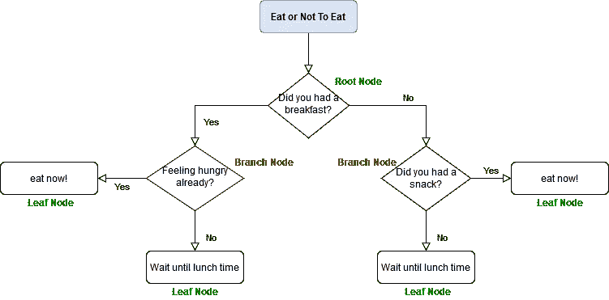
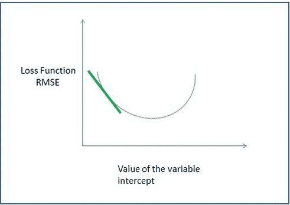

# 用于照明的光通道

> 原文：<https://towardsdatascience.com/a-light-passage-for-lightgbm-76543bb09a07?source=collection_archive---------38----------------------->

作为一个决定将数据科学作为职业的非 IT 背景的人，我意识到有太多的知识需要扩展和技能需要利用，包括写作技能——以简单易懂的方式解释概念，而不管受众背景如何。因此，我决定开始在媒介上写作。

首先，本文将解释 LightGBM。LightGBM 代表光梯度提升机，我们试着用 5W+1H 来分解概念。

> 什么是光梯度助推机？

LightGBM 是一个梯度推进框架，使用基于树的学习算法。在我看来，基于树的算法是最直观的算法，因为它模仿人类如何做决定。

现在是上午 11 点，你不知道是现在吃还是等会儿吃，所以你做了一个决策树。一个决策树由作为根本原因的根节点、作为判定节点的分支节点和作为判定结果的叶节点组成。图片由作者提供。

在回答问题之前，首先我们需要知道什么是 boosting，以及梯度 boosting 框架。

*Boosting* 是一种用于创建预测器集合的集成技术，或者是将弱学习器组合成强学习器以预测输出的方法。这里的弱学习者是决策树的每一个。它之所以弱，是因为它在预测或分类方面表现不佳。为了获得更好的预测，我们组合弱学习者，其中每个学习者将产生一个假设，并将它组合在一起将在预测输出时创建一个最终假设。Boosting 的工作方式是让树按顺序生长:每棵树都是使用以前生长的树的信息生长的。

既然我们想在我们的模型中添加许多弱学习者，我们可能会问，我们如何知道我们的模型是否被优化了？这里，我们使用*梯度推进*，我们应用梯度下降程序来寻找损失函数最小化的最佳模型。

这意味着要理解梯度推进，我们必须理解梯度下降，损失函数和优化函数。

一个简单的 gif 来说明梯度下降，其中我们想找到一个损失函数为 RMSE 的线性回归的概念。绿线下降的梯度，直到找到梯度接近 0 的最小 RMSE 量。gif 是作者做的。

优化函数是我们应用来达到我们想要的目标的函数，在这种情况下是最小化损失函数。损失函数将测量模型与实际数据的差距。如果模型或预测的结果相差甚远，损失函数将产生一个很大的数字。优化函数将逐渐减小损失函数/误差，直到它收敛到最小值。我们经常遇到的损失函数有回归问题的均方根误差(RMSE)和平均绝对误差(MAE ),分类问题的二元损失函数和交叉熵损失。梯度下降意味着梯度将随着损失函数变得最小而逐渐下降，直到梯度达到极限值 0。

回到 LightGBM，使用基于树的学习算法，弱学习器将依次增长，这意味着我们构建的第一个树将学习如何适应目标变量，然后第二个树将从第一个树学习并学习如何适应残差，下一个树将学习减少残差并适应来自前一个树的残差，这将继续，直到残差不变。误差的梯度在整个系统中传播，这被称为逐级树生长。

摘自 [LightGBM 文档](https://lightgbm.readthedocs.io/en/latest/Features.html),描述了逐叶生长的树。

LightGBM 与另一种梯度提升算法的不同之处在于，在 XGBoost 中，树的增长是逐级的，而 CatBoost 更适合分类变量。

> 谁构建了 LightGBM？

2017 年，微软将 LightGBM 作为 XGBoost 的替代产品。lightGBM 可以在 Python、R 和 C++中使用。

> 为什么我们需要使用 LightGBM？

正如文档中所述，LightGBM 是梯度推进算法在效率、速度以及支持分布式并行处理和 GPU 方面的改进。

如果你想建立一个有大量数据的模型，LightGBM 是适合使用的。如果你只有 100 个数据，最好使用其他机器学习算法，因为你的模型可能会导致过度拟合。

> 如何使用 LightGBM？

简而言之，我在使用 lightGBM 时采用了三个步骤:

1.  准备训练和测试数据(数据预处理、探索性数据分析和分类变量的数据编码)
2.  选择优化函数以获得调谐参数。你可以选择网格搜索、随机搜索、贝叶斯优化等等。几个重要的调整参数是:

*   learning_rate:在梯度下降中向损失函数的最小值移动时，每次迭代的步长
*   max_depth:树的最大深度，通过降低树的深度来处理过度拟合
*   min_data_in_lead:一个叶子可以拥有的最小记录数
*   feature_fraction:在构建树的每次迭代中随机选择的特征/参数的分数
*   bagging_fraction:指定在创建新数据集的每次迭代中使用的数据的分数
*   λ:用于调节以解决过度拟合和特征选择的参数，l1 范数用于套索回归，l2 范数用于岭回归
*   min_split_gain:在树中进行拆分的最小增益

3.训练模型、拟合模型和评估模型

如果您有兴趣了解变量和目标变量之间的关系，您可以使用 feature_importance。特征重要性将显示哪些变量在预测/分类中起主要作用。

LightGBM 是一种流行的 boosting 算法，广泛用于数据科学。它可以处理分类数据，速度快，并按叶子顺序增长树。

为了关闭这个，

> 在哪里可以找到完整的文档、学习地点和项目示例？

完整文档: [LightGBM](https://lightgbm.readthedocs.io/en/latest/)

我遇到的很棒的教程和读物:

[统计学习入门](http://faculty.marshall.usc.edu/gareth-james/ISL/)一本学习的好书，而且是免费的！

一本解释 [XGBoost、LightGBM 和 CatBoost](/catboost-vs-light-gbm-vs-xgboost-5f93620723db) 性能的好书

在 [kaggle](https://www.kaggle.com/jsaguiar/lightgbm-with-simple-features) 中应用 LightGBM 的例子

更多关于[梯度增强算法](https://machinelearningmastery.com/gentle-introduction-gradient-boosting-algorithm-machine-learning/)

对于视听学习者来说，这是一个伟大的 youtube 频道，作者是 Alexander Ihler 教授

和 LightGBM 一样，我的写作是按顺序增长的。

如果你发现这篇文章有什么可以改进的地方，请随时给我留言。干杯！