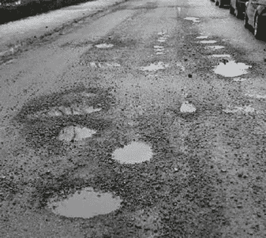
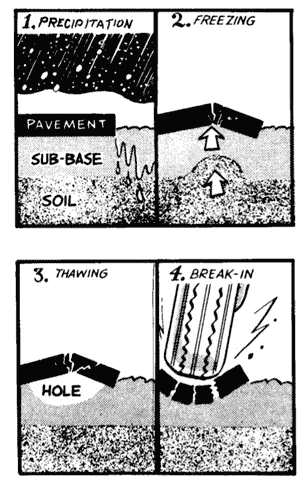
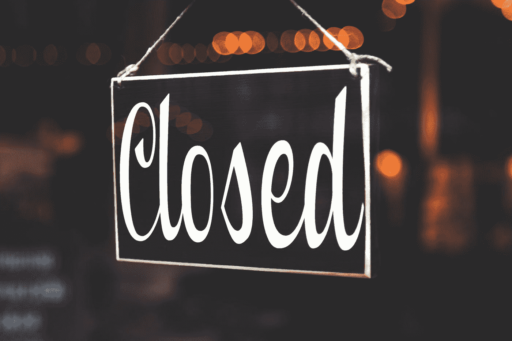
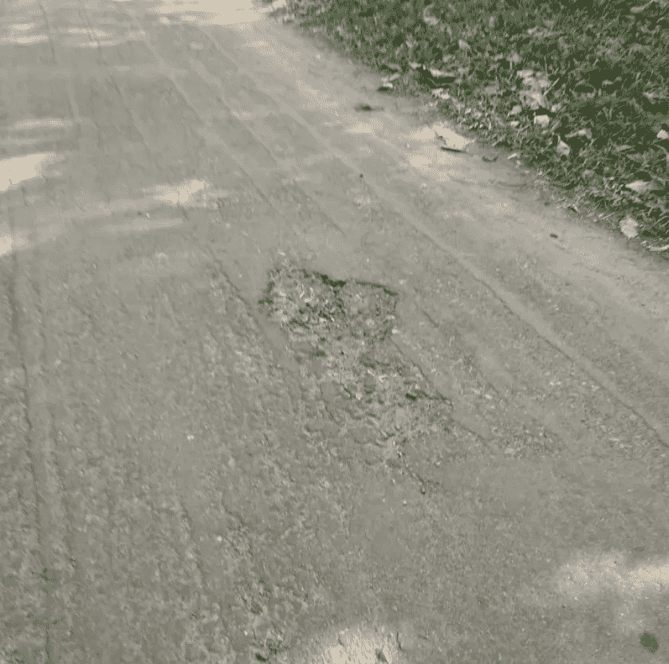
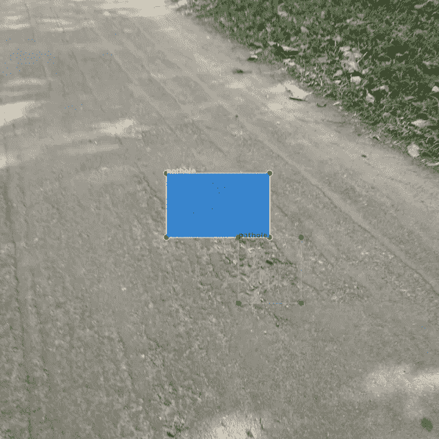
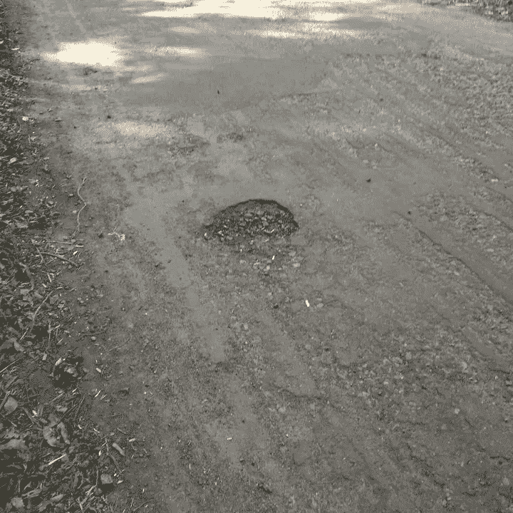
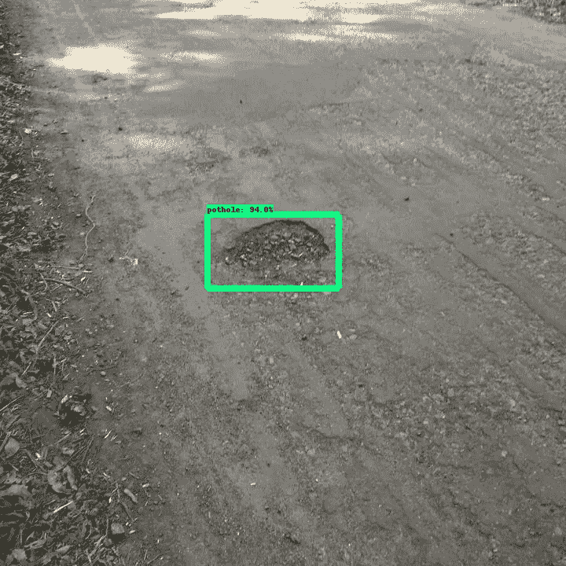
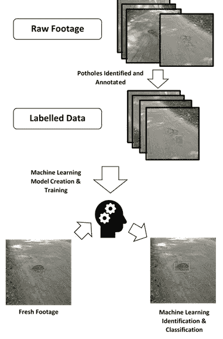

# 一点点工作可以帮助向非信徒推销数据科学项目

> 原文：<https://towardsdatascience.com/a-little-pre-work-can-help-sell-data-science-projects-1cd32c94fe19?source=collection_archive---------48----------------------->

## 如果你的公司不相信数据科学的好处，那么一点点准备工作可以极大地增加你让他们抓住第一次机会的机会。

你是否曾试图说服你的老板或同事，某个数据科学项目会给公司或企业带来好处，但却遭到拒绝或打折扣，尽管你可以看到这样做非常好？

你经常会被拒绝，最常见的原因有:

*   看不到好处
*   目前的方式更好，我们为什么要冒险改变呢？
*   被认为过于昂贵或复杂，不值得冒险

这个清单还可以继续下去，但最根本的结果是关键利益相关者没有参与进来，你永远得不到他们的认可。

卡蜜拉·金特罗·佛朗哥在 [Unsplash](https://unsplash.com?utm_source=medium&utm_medium=referral) 上拍摄的照片

# 那么，你能做什么？

[类似于我之前写的一篇文章，通过只关注将推动项目的核心技术来启动你的项目](/bootstrapping-an-ml-project-using-sound-to-categorise-fan-failures-9ce04694ee85)(而不是一个完成的项目需要的所有花里胡哨的东西)，你可以通过保持简单的提问来增加你的机会。如果你向从未见过精心规划、执行和设计的数据科学项目所能带来的好处的人要求大量资源或大量资金，他们永远不会同意。

这里的关键是坚持:

> 保持简单

一个很好的方法是，不要坚持使用[概念验证](https://en.wikipedia.org/wiki/Proof_of_concept) (POC)策略来交付完整的产品。在这里，您尝试交付足以证明整个项目是否可行的内容。

它还有一个很大的好处，就是让您对整个项目有一个更好的想法:

*   需要什么技能
*   需要付出的全部努力
*   可能的好处(即，与现有解决方案相比，解决方案的准确性和能力)
*   觉得这会让人们丢掉工作(甚至是自己的工作)

为了有所帮助，我将给出一个我们可以浏览的基本示例。

# 追踪那些坑洞

坑坑洼洼的道路示例(来源: [Kaggle](https://www.kaggle.com/sachinpatel21/pothole-image-dataset)

你在一家为地方当局管理道路的公司工作。作为公司的新员工，你注意到他们在老化道路维护方面的主要问题之一是处理每年需要修复的坑洞数量。

坑洞需要水的进入和交通才能形成。发生的情况是，水进入顶部表面的裂缝，它冻结并膨胀，推动路面上升，增加裂缝。当它融化和收缩时，地表下留下一个洞，交通的重量将这个洞打破。这些物质随后会流失，随着时间的推移，洞会变大。

这个过程的一个很好的图解如下所示:

坑洞形成机制的例子(来源:[维基百科](https://en.wikipedia.org/wiki/Pothole)

因此，随着道路老化和裂缝开始形成，坑洞会随着时间的推移而增加。如果任其发展(某些区域大约 40 毫米深被认为需要紧急维修)，它可能会变得足够大，可能会损坏车辆，并可以向议会提出索赔(他们向公司索赔)。

该公司试图修复路面坑洼，计划维修比紧急维修便宜 17%。他们的问题是跟踪路面坑洼和监控道路状况。

目前，该公司有团队在它管理的道路网络周围行驶，检查并标记需要维护的道路区域。然而，他们往往在高交通量道路上花费大量时间，而公司只有几个训练有素的人员团队可以做到这一点。

这意味着许多支路没有得到积极的监控，而是依靠公众的报告来引起注意，而这通常是在它们已经非常大并且需要立即修复的时候。

# 数据科学在哪里？

作为公司的数据科学家，我们认识到机会是存在的。如果我们可以获得道路网络的镜头，我们可以应用基于视觉的机器学习解决方案来识别漏洞。如果我们把它和一个[全球定位系统](https://en.wikipedia.org/wiki/Global_Positioning_System)结合起来，我们就可以制作一张地图，标出他们的位置。

想想吧！我们可以让某人一周或一个月驾驶一次，带着安装在仪表板上的摄像机和一些电子设备，我们可以生成道路质量的动态图像。我们甚至可以添加一些其他问题(如道路上的异物或损坏的井盖)。想想这将如何彻底改变商业运作方式！我们将从高度被动转向积极主动。

## 不幸的是，没有人买账

照片由[蒂姆·莫斯霍尔德](https://unsplash.com/@timmossholder?utm_source=medium&utm_medium=referral)在 [Unsplash](https://unsplash.com?utm_source=medium&utm_medium=referral) 上拍摄

这通常是当你发现这些项目没有进展的时候。虽然你的老板或直线经理可能认为这不是一个坏主意(否则他们当然不会雇用你)，但他们可能没有预算或不同意你的要求，也没有能力让不同的利益相关者参与进来，因为这是跨部门的。

这些是你需要说服的人，他们并不热心。这可能是因为他们从未见过一个成功的数据科学项目能做些什么，但如果你想一想你要求的是什么:

*   获得自己工作所需的公路车辆(可能需要一段时间来获得足够的示例镜头进行培训)
*   允许添加电子设备和设备
*   让人们(做他们主要工作的人)运行和使用设备
*   获得他们可以使用的定制电子设备和套件(GPS 和视频记录)
*   用于映射和处理功能的计算资源和软件设计，以生成结果仪表板(因此 IT 可能对此也不满意)
*   不仅仅是你的时间，还有其他人的足够长的时间来完成这项工作。如果你仔细想想，这可能需要几个月的时间

将所有这些加在一起，您可以看到这不是一个小的资源请求，如果它不成功，可能会损失很多，他们必须对此负责。

## 我们能做什么？

这就是概念验证思想的来源。我们只需要证明关键的可交付成果是可能的。

这是一个需要考虑的关键问题，因为如果这是他们的第一个数据科学项目，并且出现严重问题，他们可能永远不会再购买另一个项目。进行低风险的 POC 可能会让您确保不会丧失再次尝试的能力。

## 关键交付成果是什么？

基拉·奥德·海德在 [Unsplash](https://unsplash.com?utm_source=medium&utm_medium=referral) 拍摄的照片

我们能否检测到足够可靠的路面坑洼，从而值得开发成一项业务能力？

我们也想把它变薄，所以我们需要足够的资源来做这件事。如果我们考虑需要展示什么样的关键交付成果，我们需要的是:

*   我们可以使用的数据
*   适合使用的模型
*   运行和准备数据的计算资源和时间

这就是足智多谋的用处所在。你经常会发现有不同开源数据集的大型存储库，虽然可能不完美，但可以满足需求，经过一番搜寻后， [Kaggle](https://www.kaggle.com/sachinpatel21/pothole-image-dataset) 上确实有一个坑坑洼洼的数据集。

在模型方面，这是成为数据科学家的一部分，我可能会考虑使用现有的图像识别模型并转移学习，这样我们就不需要大量的新图像来重新训练它，而且我们应该比我们从开始训练时获得更好的性能。

作为一名数据科学家，这一切都应该可以在您拥有的计算资源上实现(例如，一台强大的笔记本电脑或访问公司服务器上的计算资源)。

注意:如果你没有任何计算资源，现在是告诉你的工作人员你需要它来完成工作的好时机。

## 建立模型

我使用 [TensorFlow](https://www.tensorflow.org/) 作为我选择的 ML 工具，使用 [LabelImg](https://github.com/tzutalin/labelImg) 给原始图像加上坑洞标签。

我做了大约 150 张图片，然后分成 100 张用于训练，50 张用于测试。这个较小的精选集很有用，因为我可以选择看起来与我对 dash 相机拍摄的图像的预期相似的图像(即，他们像汽车行驶一样看着道路)。

在我们的数据集中标注坑洞

然后，我设置我的模型训练，并查看输出。我在下面举了一个例子，但是结果相当不错。我给自己设定的最后期限只有一天，所以我不得不提前停止模型训练，但看起来它达到了大约 70%的准确率，这对一个草稿模型来说已经很不错了！

初始概念验证模型识别从未见过的图像中的坑洞

# 结果呢

那么，我们该怎么办？我们所做的是获取一些非常粗略的数据，进行一些粗略的清理和快速训练，并取得了非常好的结果。我们知道，随着更多的数据符合我们的预期(许多图像并不完全符合 dash cam 镜头)，我们只在一个小数据集上非常快速地训练了一个模式，获得了良好的结果。

我们可以自信地说，我们期望性能达到或超过这一水平，我们有图像和结果，我们可以编译到一个定义的路径中，并使用真实的图像来显示整个系统可能工作的可比结果。例如，我们现在可以向他们展示这样的设计:

虽然看起来不重要。能够展示实际结果并更好地处理事情会有所帮助，有了一些数字，我们就可以开始做一个商业案例。

在我们的例子中，我们发现:

*   他们往往会忽略较小道路上的坑洼，因为优先考虑的是交通量较大的道路
*   我们希望仅仅通过 dash 相机拍摄路面，就能识别出至少 70%的坑洞
*   任何驾驶这条路线的人都可以拍摄这个镜头，并且不依赖于有限的经过坑洞训练的成员
*   主动维修比被动维修便宜 17%

将这些结合在一起，我们可以说，我们预计可以节省 70%的坑洞中的 17%。

# 现在怎么办？以实数为基础

照片由[费边布兰克](https://unsplash.com/@blankerwahnsinn?utm_source=medium&utm_medium=referral)在 [Unsplash](https://unsplash.com?utm_source=medium&utm_medium=referral) 上拍摄

从这里开始，我会鼓励获取一些公司数据，以便利益相关者可以看到潜力，并了解运行完整项目的成本是否值得。

例如，如果我们发现:

*   49 美元来主动修复每个坑洞
*   60 美元被动修复坑洞
*   很少被调查的道路倾向于每月进行 100 次左右的坑洞修补
*   每个月 5 个危险的大坑洞，并且每个危险的坑洞产生 300 美元的车辆索赔修理费用(与坑洞修理费用分开)
*   我们假设所有这些坑洼都是在接到公众报告后进行的被动维修

我们现在可以说，目前的成本是:

*   系统目前每年花费 72，000 英镑来修复 1200 个坑洞
*   60 个危险的坑洞每年可索赔的修理费为 18，000 英镑

有了这个新系统，我们可以说我们至少希望:

*   41，160 次(840 次主动维修)和 21，600 次
*   5，400 英镑的可索赔修理费

每年的费用从 90，000 英镑降到 68，160 英镑。每年为公司节省 21，840 英镑。

然后，风险承担者可以评估这个估计的最小节省，以更好地平衡风险/回报，以及项目成本。你也可以通过说明它如何影响更广泛的网络来扩大节省。所有这些都是一天工作的结果！

有了这种概念验证，你可以从一个模糊的主张到一个更坚定的立场，并开始一项业务成本，以获得人们的支持。

# 摘要

照片由[丹尼尔·库切列夫](https://unsplash.com/@kuzelevdaniil?utm_source=medium&utm_medium=referral)在 [Unsplash](https://unsplash.com?utm_source=medium&utm_medium=referral) 拍摄

我们从只有主观节约和成本的宏大项目愿景，到有 POC 的小资源成本(您的经理可能会给你), POC 的结果可以开始给出资源和节约的想法。在此基础上，您可以构建一个案例，增加您销售数据科学项目的机会。

这是我在工作中经常使用的策略。不要试图销售和启动大型项目，围绕关键交付成果的小范围项目通常可以降低风险，增加成功的机会。这也意味着你会做很多不同的事情，如果你喜欢多样性，这是件好事。

注意 : **在可能的情况下，我尽可能使用现实的数字。然而，在某些情况下，我使用了看起来合理的数字。这些当然只是为了说明的目的。**