# 从零开始的逻辑回归

> 原文：<https://towardsdatascience.com/a-logistic-regression-from-scratch-3824468b1f88?source=collection_archive---------18----------------------->

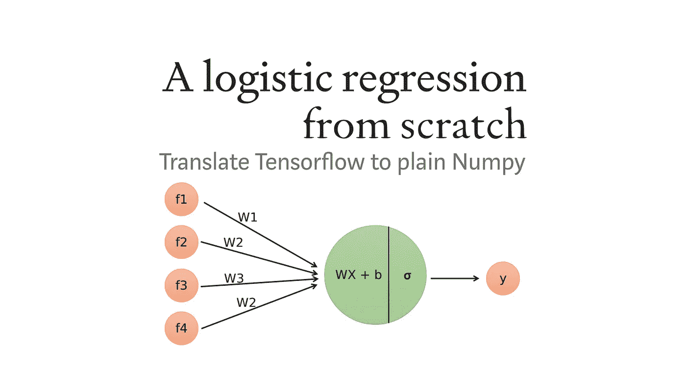

## 将张量流转换为普通数字

在我之前的博文中，我们研究了人工神经网络，开发了一个类来构建任意层数和神经元数的网络。虽然博客引用了前面的笔记本来解释先决条件，但是还没有附带的文章，也就是这篇博客文章。

这篇文章也可以在我的 Github 上作为 [Jupyter 笔记本](https://github.com/dennisbakhuis/Tutorials/tree/master/Logistic_Regression)获得，所以你可以边阅读边编码。

如果你是 Python 和 Jupyter 的新手，[这里有一个关于我如何管理我的 Python 环境和包的简短解释](https://github.com/dennisbakhuis/Tutorials/tree/master/Python_Conda_Pip_Environments)。

**我们将讨论的主题的简短概述:**

1.  神经网络和逻辑回归之间的联系
2.  退一步:线性回归
3.  从线性回归到(二元)逻辑回归
4.  围捕

# 神经网络与逻辑回归之间的联系

当我们听到或读到*深度学习*时，我们通常指的是使用*人工神经网络* (ANN)的机器学习子领域。这些计算系统在解决各种领域的复杂问题方面相当成功，例如图像识别、语言建模和语音识别。虽然 ANN 这个名字意味着它们与我们大脑的内部工作有关，但事实是它们主要共享一些术语。人工神经网络通常由多个相互连接的层组成，这些层本身是使用神经元(也称为节点)构建的。图 1 显示了一个例子。

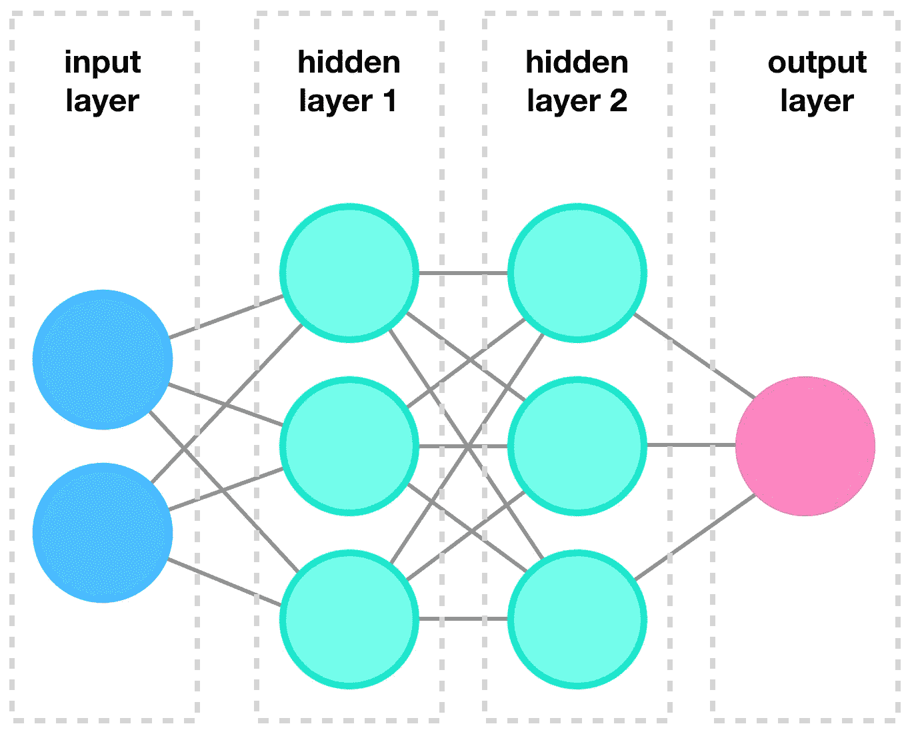

图 1:一个典型的神经网络的例子，借用于我关于神经网络的后续文章。

在这个例子中，我们有一个输入层，由四个独立的输入节点组成。该输入层“完全连接”到第一个隐藏层，即完全连接意味着每个输入连接到每个节点。第一个隐藏层再次完全连接到另一个“隐藏”层。术语“隐藏”表示我们没有直接与这些层交互，这些层对用户来说有点模糊。第二个隐藏层依次完全连接两个最终输出层，它由两个节点组成。因此，在本例中，我们向模型提供四个输入，我们将接收两个输出。

现在让我们把注意力集中在前面例子中的单个神经元上。这个神经元仍然连接到所有的输入，也称为特征。使用这些特征，神经元计算单个响应(或输出)。这种系统的示意图如图 2 所示。

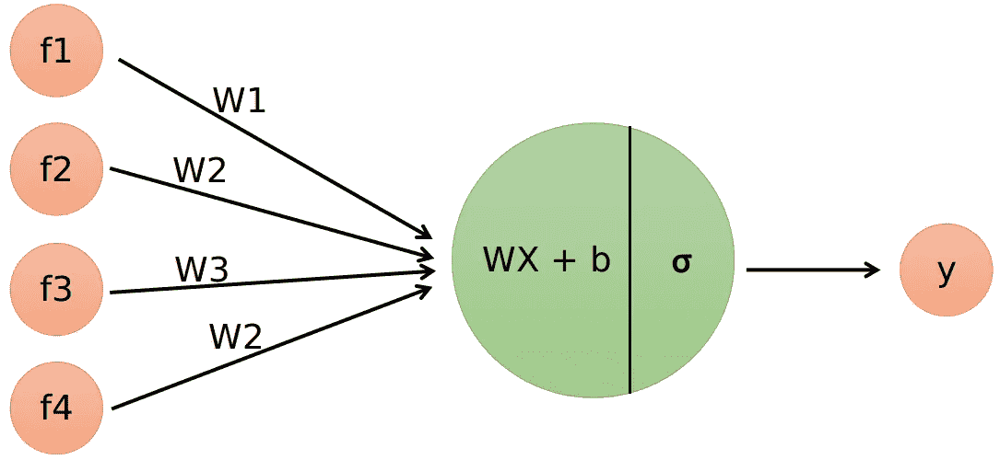

图 2:具有四个输入特征的单个神经元。神经元有两个操作:线性部分和激活函数。

输入特征被命名为 *𝑓* 、 *𝑓* 、 *𝑓* 和 *𝑓⁴* ，并且都连接到单个神经元。这个神经元执行两个操作。第一个操作是将特征与权重*向量𝑊* 相乘，并添加偏置项 *𝑏* 。第二个操作是所谓的*激活功能*，这里由 *𝜎* 表示。神经元的输出是介于零和一之间的概率。单个神经元的行为就像一个小的逻辑回归模型，因此，人工神经网络可以被视为一堆相互连接的逻辑回归模型堆叠在一起。虽然这个想法很简洁，但潜在的事实却有点微妙。人工神经网络有许多不同的体系结构，它们可以使用各种不同的构建模块，其行为与本例中的完全不同。

我们单个神经元中的线性运算只不过是线性回归。因此，要理解逻辑回归，第一步是了解线性回归是如何工作的。下一节将展示一个逐步的例子作为回顾。

# 退一步:线性回归

## 什么是线性回归来着？

最简单形式的线性回归(也称为简单线性回归)，使用单个自变量 *𝑥* 对单个因变量 *𝑦* 建模。这听起来可能令人望而生畏，但这意味着我们要解下面的方程:

```
*𝑦* = *a𝑥* + *𝑏*
```

在*机器学习*的背景下， *𝑥* 代表我们的输入数据， *𝑦* 代表我们的输出数据，通过求解我们的意思是找到最佳权重(或参数)，在线性回归方程中用 *𝑤* 和 *𝑏* 来表示。计算机可以帮助我们找到𝑤*和𝑏*和*的最佳值，使用输入变量 *𝑥* 得到𝑦* 的最接近匹配*。*

对于接下来的例子，让我们为 *x* 和 *y* 定义以下值:

```
*𝑥* = [−2,−1,0,1,2,3,4,5]
*𝑦* = [−3,−1,1,3,5,7,9,11]
```

*𝑥* 和 *𝑦* 的值具有线性关系，因此我们可以使用线性回归找到(或拟合)最佳权重并解决问题。也许，通过长时间盯着这些值，我们可以发现它们之间的关系，然而，使用计算机来找到答案要容易得多。

如果你已经盯得够久了，或者只是想知道答案，那么 *𝑥* 和 *𝑦* 的关系如下:

```
*𝑦* = 2*𝑥* + 1
```

在下一节中，我们将使用 Tensorflow 来创建我们的单神经元模型，并尝试“求解”该方程。

## Tensorflow 中的实现

在我们开始使用 Tensorflow 之前，我们应该首先组织我们的输入数据( *𝑥* )和输出数据( *𝑦* )。为此，我们将使用 Numpy:

下一步，我们将导入 Tensorflow。检查我们正在使用的版本始终是一个好的做法:

现在我们可以使用 Keras 创建一个模型，它现在是 Tensorflow 的一部分。为了做到这一点，我们将使用 Sequential 类，它可以将不同的层一个接一个地“顺序”堆叠起来。我们使用 Keras 中的密集类来创建一个“完全连接”层，它由单个神经元(单元)组成。

Dense 函数用于创建许多完全连接的神经元(逻辑单元)的层。参数 units 用于设置神经元的数量。我们只使用一个单位，因此，我们将它设置为 1。由于这是我们的模型的第一个“层”，我们需要告诉 Tensorflow 它可以预期什么形状作为输入。这只对第一层是必要的。

既然我们已经定义了模型，我们需要使用 Compile()方法来配置模型以进行训练。该方法需要至少两个参数，损失函数和优化器。损失函数是模型预测实际值的程度的度量。对于这个例子，我们将使用均方误差(𝑦 的预测值和实际值之间的平方差的平均值)。“*学习算法*将通过调整(优化)每一步的参数(权重和偏差)来尽量减少损失。优化器定义了一个方法来执行这个优化步骤，一个常用的方法是梯度下降，或者在我们的例子中是随机梯度下降(SGD)。在下一节中，我们将用简单的 Numpy 实现这个方法，这个方法将变得更加清晰。

接下来，我们使用 Fit()方法让算法学习最佳参数。虽然 Tensorflow 有许多聪明的方法来解决这个问题，但秘诀或多或少是这样的:

1.  使用当前参数( *𝑊* 和 *𝑏* )计算预测 *ŷ*
2.  计算当前值的损失
3.  计算损失函数相对于参数的梯度
4.  使用渐变调整权重(优化)。
5.  重复上述操作，以确定出现的次数，即浏览所提供的示例(数据集)的次数。

如果这不是完全清楚的，不要太担心。我们将用简单的 Numpy 编码每一步，并对下一节中使用的所有数学进行彻底的推导。

我们已经使用我们的训练数据在 Tensorflow 中训练了该模型，并且我们准备尝试一下。现在，我们可以使用我们的模型来“预测”它从未见过的值。这有时也被称为推理。我们来试试 12 的值。我们知道应该是 25。

为什么值不正好是 25？

该模型计算实际值和预测值之间的差异，并慢慢向实际值靠拢。长时间运行 fit 方法会让你更接近 25。

这并不难，但可能感觉像某种黑暗绝地的力量。因此，在下一节中，我们将用普通 Python 实现这个算法(借助 Numpy)。

## “引擎盖下”到底发生了什么

在上一节中，我们大致介绍了 Tensorflow 正在做的事情:

1.  使用当前参数( *𝑊* 和 *𝑏* )计算预测 *ŷ*
2.  计算当前值的损失
3.  计算损失函数相对于参数的梯度
4.  使用渐变调整权重(优化)。
5.  重复上述操作，以确定出现的次数，即浏览所提供的示例(数据集)的次数。

我们现在将在普通 Python 中实现这一点，并希望得到与 Tensorflow 类似的结果。

首先，我们定义模型参数。这些是权重 *𝑊* ，这只是一个单一的值，因为我们只有一个单一的输入。我们还需要定义偏差项 *𝑏* 。

这是我们模型中所有可训练的参数，单个标量用于权重，单个标量用于偏差。

接下来，我们将定义一个使用当前模型参数进行预测的函数。在深度学习术语中，这被称为向前传递。预测值的变量一般命名为 *ŷ* (或者 *A* 但你可以在我的下一篇文章中了解到这一点)。

该函数名为 forward，使用输入向量 *𝑋* 并将其与权重参数 *𝑊* 相乘，并添加偏差项 *𝑏* 。正如我们在前面提到的等式中描述的那样。

我们现在可以用当前参数测试函数。同样，我们将输入一个值 12.0，但是当然，它将返回乱码，因为权重是随机初始化的。

```
-0.2122614846691141
```

事实上，-0.212261…并不是我们真正想要的，但我们仍然需要训练我们的模型，然后它才能做出正确的预测。在此之前，我们需要计算当前的损失。作为损失，我们使用预测值 *ŷ* 和实际值 *𝑦* 的均方误差。

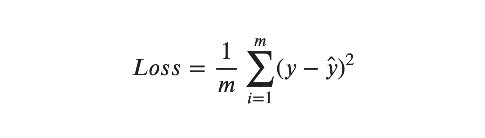

希望数学不会吓到你，但是如果你花时间，它并不难。变量 *𝑚* 这里是例子的数量(数据集中的点)。我们的 *𝑋* 有八个值，因此， *𝑚* =8。当我们有一个 1/ *𝑚* 后跟 as sum(≘)超过所有 *𝑚* 值时，它无非是这些值的平均值，即 *𝑖𝑛𝑠𝑖𝑑𝑒* 的总和。这里，我们取所有(*𝑦*—*ŷ*)*的平均值，这是真实值 *𝑦* 和预测值 *ŷ* 的平方之差。平方很重要，因为如果我们不把差平方，负差和正差就会互相抵消。既然我们完全理解了*均方误差*，我们可以用代码实现它:*

*要查看我们之前计算的值之间的损失，我们可以这样做:*

```
*149.13933056993267*
```

*正如我们所看到的，损失相当大，我们的重量相当大。因此，我们需要更新我们的可训练参数，以做出更好的预测。为此，我们需要首先计算梯度 *𝛿* 损失/ *𝛿𝑊* 和 *𝛿* 损失/ *𝛿𝑏* 。也许你的鉴别能力有点生疏了。诀窍是应用链式法则。另一个好处是平均算子(和)是线性的，因此，我们可以在微分中忽略它，以后再放回去。*

*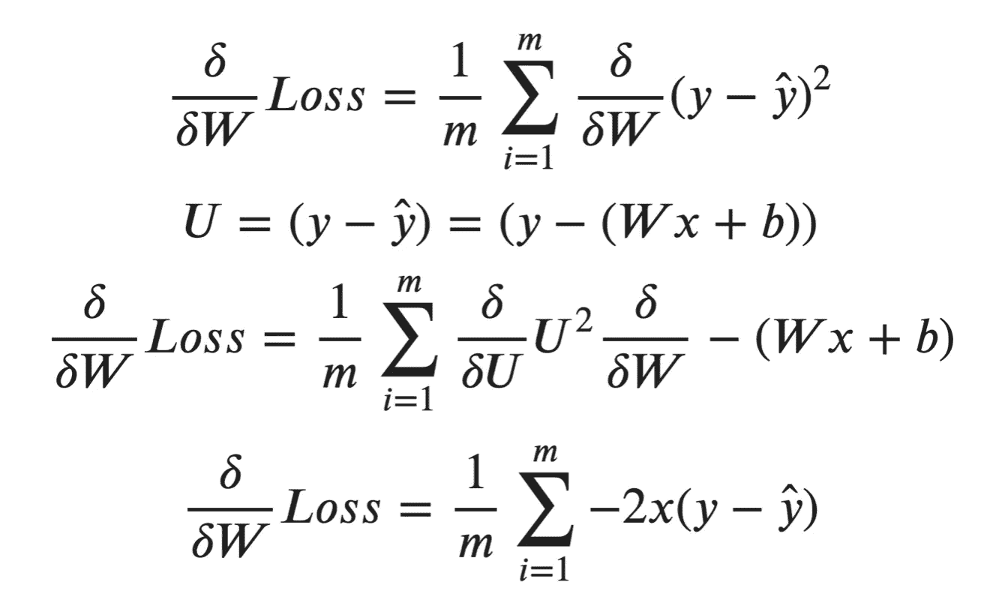*

*为了计算 *𝛿* 损失/ *𝛿𝑏* 我们只需要重复最后一步，关于 *𝑏* :*

*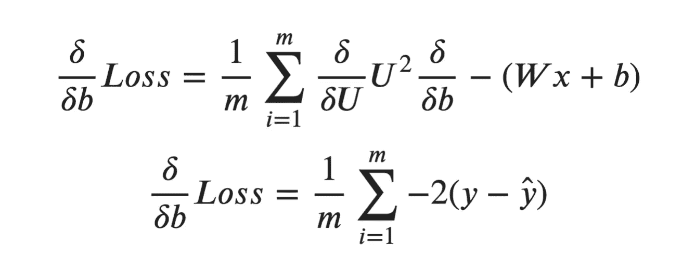*

*我们将在“反向传递”函数中实现这一点。由于变量名变得有点长，我们也有点懒，我们就称它们为 *𝑑𝑊* 和 *𝑑𝑏* 。*

*现在，我们可以得到之前测试示例的梯度:*

```
*(-605.0942756320587, -50.42452296933823)*
```

*在构建训练循环之前，我们需要的最后一个函数是更新函数。该功能将一步“优化”我们的权重。这是实际的梯度下降，其中我们从当前权重中减去(下降)梯度。梯度下降定义如下:*

**

*这里我们有一个新的参数 *𝛼* ，它被称为学习率。这个值将设置我们试图收敛到最小损失的速度。对于这个例子，我们将它设置为 0.01。学习率没有黄金值，这个值需要针对每个问题进行微调。我们的更新函数代码如下:*

*要更新我们当前的模型参数，我们只需:*

```
*(array([6.0332543]), 0.5042452296933823)*
```

*好的，我们第一次更新了我们的权重。为了提高重量，我们必须重复这个过程很多次。为此，我们将编写一个循环:*

```
*129.7037237445872
0.06819476739792682
0.00458155318441586
0.0003078050915820409
2.067944441333496e-05*
```

*我们很幸运，损失，即我们的模型预测和实际值之间的差异，正在减少。当我们输入值 12.0 时，我们现在如何预测？*

```
*array([25.00101652])*
```

*我希望 Tensorflow 中的这种黑魔法现在更加清晰了。在下一节中，我们将使用我们新学到的知识来解决一个二元逻辑回归问题。*

# *从线性回归到(二元)逻辑回归*

## *到底有什么区别？*

*线性回归和逻辑回归之间的差别不是很大。与我们之前创建的代码有两个不同之处。首先，我们的线性回归模型只有一个单一的特征，我们用 *𝑥* 输入，这意味着我们只有一个单一的权重。在逻辑回归中，通常输入多个特征，每个特征都有自己的权重。从技术上讲，你可以有一个单一的特性，但是它只不过是一个 if 语句(想想看)。增加功能的数量会将之前的*简单乘法*变为*矩阵乘法*(点积)。其次，我们将添加一个所谓的*激活函数*来映射 0 或 1 之间的值。让我们再次提醒自己我们的简单模型:*

**

*按照 Tensorflow 中的惯例(根据我的理解)，输入向量有用于特征的列和用于示例的行。如果我们有 2 个数据点，输入矩阵将如下所示:*

*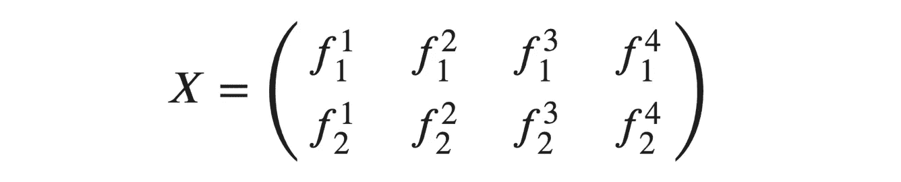*

*上标表示特征号，下标表示例子。*

*这些输入中的每一个都与它们自己的权重相关联。节点本身有两个不同的操作。第一个是权重向量和输入向量之间的点积。第二个是 Sigmoid 函数。这个例子中的权重向量 *𝑊* 具有四个权重:*

**

*在节点中，我们首先计算线性部分:*

**

*在我们的例子中，它看起来像这样:*

*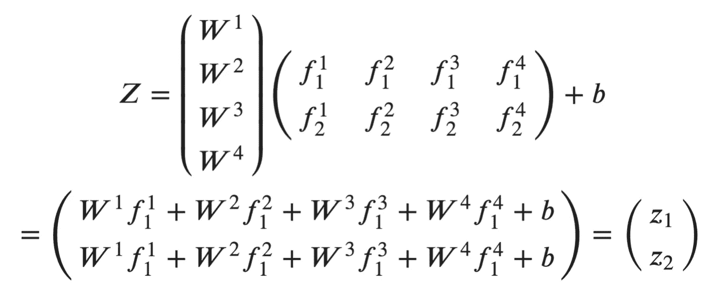*

*请注意，每个示例的结果都只有一个值。*

*对于 *𝑥* 的所有值，可以从∞到+∞(全部为实数)，Sigmoid 函数将 *𝑥* 映射到 0 和 1 之间。接近零的 *𝑥* 的值具有最大的影响，因为它们处于“线性状态”。非常大或非常小仅分别被限制为 1 和 0。Sigmoid 函数的数学定义是:*

**

*这就是后勤单位的全部情况。Sigmoid 函数赋予节点非线性特征。许多这样的单位一起可以做几乎神奇的事情。在下一节中，我们将首先在 Tensorflow 中制作一个逻辑回归模型。*

## *Tensorflow 中的实现*

*在我们开始之前，我们首先需要一些数据来做逻辑回归。我从 Kaggle 的 Azeem Bootwala 下载了 titantic 数据集，以演示这个例子。可以从这里下载:
[https://www.kaggle.com/azeembootwala/titanic](https://www.kaggle.com/azeembootwala/titanic)*

```
*(792, 17)*
```

*首先，始终检查列和数据类型:*

```
*<class 'pandas.core.frame.DataFrame'>
RangeIndex: 792 entries, 0 to 791
Data columns (total 17 columns):
 #   Column       Non-Null Count  Dtype  
---  ------       --------------  -----  
 0   Unnamed: 0   792 non-null    int64  
 1   PassengerId  792 non-null    int64  
 2   Survived     792 non-null    int64  
 3   Sex          792 non-null    int64  
 4   Age          792 non-null    float64
 5   Fare         792 non-null    float64
 6   Pclass_1     792 non-null    int64  
 7   Pclass_2     792 non-null    int64  
 8   Pclass_3     792 non-null    int64  
 9   Family_size  792 non-null    float64
 10  Title_1      792 non-null    int64  
 11  Title_2      792 non-null    int64  
 12  Title_3      792 non-null    int64  
 13  Title_4      792 non-null    int64  
 14  Emb_1        792 non-null    int64  
 15  Emb_2        792 non-null    int64  
 16  Emb_3        792 non-null    int64  
dtypes: float64(3), int64(14)
memory usage: 105.3 KB*
```

*我认为 Azeem 没有使用 index=False 选项保存集合，因此我们有一个“未命名:0”列。这个对于我们当前的索引来说是多余的，所以我们可以删除它。此外，PassengerId 对于我们的模型来说不是很有用，让我们也删除该列。之后，让我们对数据集进行采样，以获得一个概念:*

*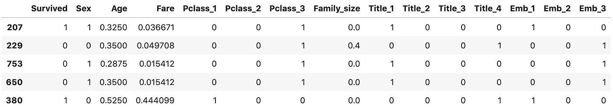*

*Azeem 已经做了一些预处理。目标变量 *𝑌* 是‘幸存’，所有其他列都是特征。功能简介: **-** 性别:0 或 1 - >男或女
-年龄:值在 0 和 1 之间重新调整
-票价:票价在 0 和 1 之间重新调整
- Pclass_1..Pclass_3:一键编码乘客类别
-家庭规模:家庭规模的 0 到 1 之间的重新调整值。
-标题 _1..title_4:先生、夫人、主人、小姐 one-hot encoded
- emb_1..emb_3:登船位置一-热编码。*

*总共我们将有 14 个功能。*

*对于这个例子来说，数据就足够了，我不会详细讨论这些数据是如何变成现在这个样子的。老实说，我不知道我自己，刚刚从 Kaggle 下载；-).*

*让我们把这些变量放入我们之前定义的格式中( *𝑋* 和 *𝑌* )。这里 *𝑌* 对应一个人是否幸存的标签。我们总共有 792 个例子。因此， *𝑌* 的形状为( *𝑚* ，1)其中 *𝑚* = 792。对于 *𝑋* 我们期望( *𝑚，14* )，其中列是特性。*

```
*((792, 14), (792,))*
```

*现在我们已经准备好了数据，我们可以在 Tensorflow 中创建一个模型:*

*Tensorflow 中的模型与我们的线性回归模型非常相似。输入从 1 个特征变为 14 个特征，并且我们增加了 Sigmoid 激活功能。接下来，我们必须再次编译我们的模型:*

*在这个例子中，我将损失改为“二元交叉熵”。这是另一个对二元逻辑回归问题更有效的损失函数。如果你对内部工作感兴趣，我推荐维基百科。
我们增加了一个额外的指标，叫做“准确度”,现在是为每个历元计算的。现在我们准备训练我们的模型:*

*这些都是在 Tensorflow 中训练二元逻辑分类器所需的步骤。我们达到了大约 80%的准确率，对于我们付出的努力来说，这已经算不错了。*

*我们可以从我们的模型中提取权重 *𝑊* 和偏差 *𝑏* 。我们稍后可以将这些值与我们自己的逻辑回归实现进行比较:*

*策划损失也很容易:*

*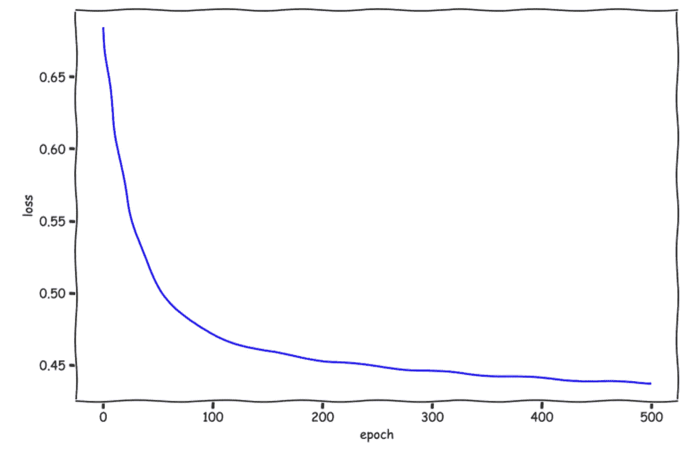*

*不介意好看的 XKCD 抖动:-)。令人印象深刻的是，只需几个步骤就能达到这样的结果。在最后一部分，我们将揭开由 Tensorflow 表演的黑暗绝地艺术。*

## *实际发生了什么？*

*嗯，总的配方没有变:*

1.  *前进传球*
2.  *计算损失*
3.  *偶数道次*
4.  *更新权重*
5.  *重复*

*这些步骤本身需要稍加修改。正向传递将是更一般的点积，我们需要添加激活函数。损失函数是二元交叉熵，当然和均方差不同。反向传递将计算新损失函数相对于 *𝑊* 和 *𝑏* 的梯度。由于我们现在也有一个激活功能，我们将有一个额外的步骤。update-weights 函数不变，最终的循环也非常相似。*

*据我所知，在 Numpy 和一般数学中，点积需要向量(和矩阵)的形状兼容:*

**

*这意味着 *𝑋* 的列数必须等于 *𝑌* 的行数。为了让我们自己简单一点，我们将转置我们的输入向量 *𝑋* 并翻转向量。这将导致行成为特征，列成为示例。*

```
*(14, 792)*
```

*为了便于测试，我们只选择两个例子，让它更具可读性:*

```
*(14, 2)*
```

*让我们定义我们的重量。因为我们有 14 个特征，我们的向量 *𝑊* 将有 14 个值。偏差对于整个节点是常数，并且只有一个值。*

```
*(14, 1)*
```

*接下来，我们需要定义 Sigmoid 函数:*

```
*array([3.72007598e-44, 5.00000000e-01, 5.24979187e-01, 1.00000000e+00])*
```

*现在让我们重新定义我们的转发函数，让它使用点积和激活函数。我们可以把这些分成两步:
*𝑍*=*𝑊𝑋*+*𝑏
a =𝜎*(*𝑍*)*

*注意 *𝑊𝑋* 是一个点积。*

```
*array([[0.48951622, 0.50149394]])*
```

*现在我们有了实际的预测，我们可以写出损失函数来衡量我们的预测有多好。这是通过二元交叉熵完成的，对此我将简单地给出等式:*

*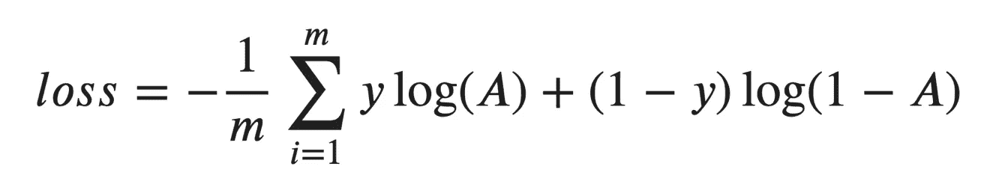*

*可能会发生这样的情况，我们试图计算一个 log(0 ),当然这是没有定义的。为了避免警告，我们将在损失中增加一个微小的值。由于它非常小，差异并不明显，但确实有助于抑制警告。一天少一个警告，保持…*

```
*1.3625601508159457*
```

*接下来是向后传球。为此，我们需要用 *𝑊* 和 *𝑏* 区分损失函数。为了不让你们觉得无聊，我已经提供了这些函数，但是我不会阻止你们自己计算微分:*

*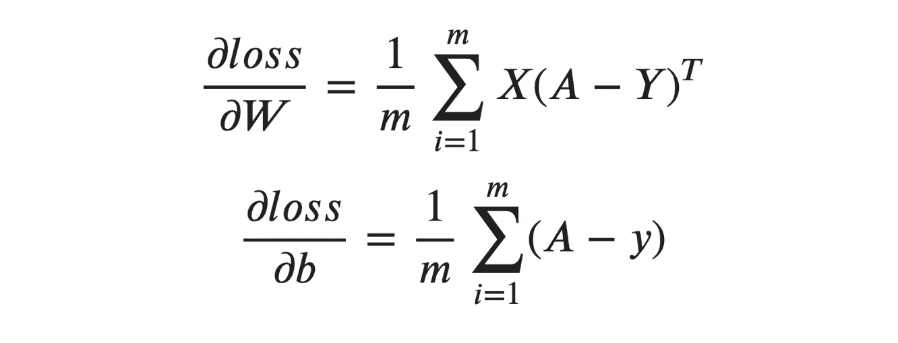*

*在 Python 中，这看起来像这样:*

```
*(array([[ 0.06118953],
        [-0.01277168],
        [-0.0078041 ],
        [-0.06231326],
        [ 0\.        ],
        [ 0.06118953],
        [-0.00011237],
        [-0.00112373],
        [ 0\.        ],
        [ 0\.        ],
        [ 0\.        ],
        [-0.06231326],
        [ 0\.        ],
        [ 0.06118953]]),
 -0.0011237299781017493)*
```

*差不多了，接下来我们需要更新权重。该函数与我们之前的示例没有变化:*

```
*(array([[-0.01830035],
        [ 0.00088324],
        [-0.01122826],
        [-0.00589117],
        [-0.00893116],
        [-0.01335291],
        [-0.00061042],
        [ 0.00065638],
        [ 0.00410113],
        [-0.00572882],
        [-0.00801334],
        [ 0.01374348],
        [ 0.01274699],
        [-0.01275547]]),
 1.1237299781017494e-05)*
```

*为了比较结果，我们可以计算准确度。然而，我们的激活函数返回一个介于 0 和 1 之间的概率。根据定义，值<= 0.5 are rounded to 0 and values > 0.5 被四舍五入为 1。这与常规的 round 函数略有不同，因此我们将为此创建自己的函数:*

```
*array([[0, 1]], dtype=uint8)*
```

*现在我们有了创建训练循环的一切。我们将存储一些指标，以便以后绘制:*

```
*loss: 17.16646271874957 	accuracy: 64.4%
loss: 12.757526841623513 	accuracy: 75.9%
loss: 11.688361064742441 	accuracy: 79.5%
loss: 11.150776615503466 	accuracy: 79.5%
loss: 10.83231532525657 	accuracy: 79.8%
loss: 10.622380143288218 	accuracy: 79.8%
loss: 10.473049466548982 	accuracy: 79.8%
loss: 10.36043263717339 	accuracy: 80.8%*
```

*我们对网络进行了训练，得到了略高于 80%的最终准确率，与使用 Tensorflow 时的结果非常相似。当然，多一点努力，也多一点乐趣。让我们绘制我们的指标:*

*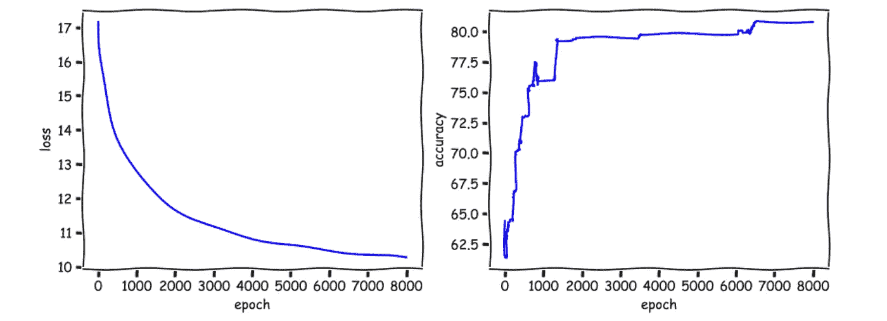*

*当然，我们已经计算了训练数据的指标。为了对模型有一个正确的认识，这应该使用测试数据来完成。这一点，我留给读者；-).*

# *围捕*

*好了，这就是关于逻辑回归的教程。希望你对逻辑回归工作原理有所了解，张量流不仅仅是魔法。我发现从头开始写这些是一个很好的练习，正如你所看到的，也不是很难。*

*如果您有任何意见或建议，请告诉我。*